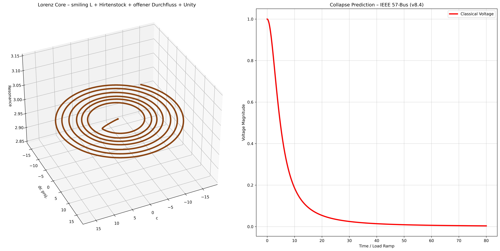

# NEXAH Visual Gallery – Core ODE Evolution

**Status:** April 2026 | iee_core_geometry/resonance_maps/

### Important Versions & Insights

**v1.9 – v2.0 (2D Phase)**  
Strong nested loops + 3 damping intervals → final nested Möbius attractor with clear band formation

**v3.0 – v3.8 (2D Final + IEEE 9-Bus)**  
IEEE 9-Bus integration, regime transitions and Phi–π–√2 Resonance

**v7.1 – v8.4 (3D Lorenz Core – April 2026)**  
Full Lorenz dynamics, 3D polar grid, slow-start ramp, late-boost and visual narrative language

### Highlight Visuals (April 2026)

**Smiling L + Hirtenstock + Open Channel (v8.4)**
  
*Unity moment – smiling face, open Durchfluss, J-Spiegel and Bezel clearly visible*

**Lorenz Navigation Landscape + Vortex Winding**

**Topological Winding Number Map**

**3D Stability Surface (earlier reference)**

**Field + Resonance Axes (reference)**

### Key Observations from 3D Lorenz Phase
- Phi-State functions as the **primary regulator** with discrete 5-mode drive  
- Q acts as **geometry amplifier**  
- Background grid shows continuous pulsation (“Waffelschicht”)  
- Self-similarity and fold structures are clearly visible  
- Narrative elements: Hirtenstock, smiling L, open channel, Bezel, Thoth’s Vogel, J-Spiegel  
- The geometry now tells a coherent story of instability and regime transition

**Building Log**  
Full chronological log of today’s tuning session:  
[BUILDING_LOG_2026-04-02_Lorenz_MicDrop_Tuning.md](./BUILDING_LOG_2026-04-02_Lorenz_MicDrop_Tuning.md)

**Next Goal**  
Finalize Phi-Split timing (target 34–38 s) and add quantitative metrics for a clean scientific report.
