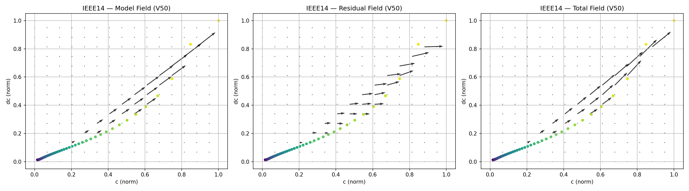
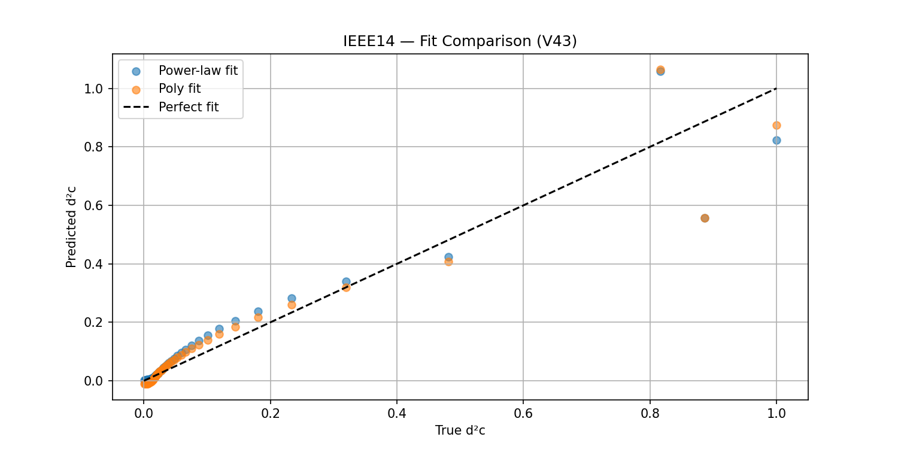
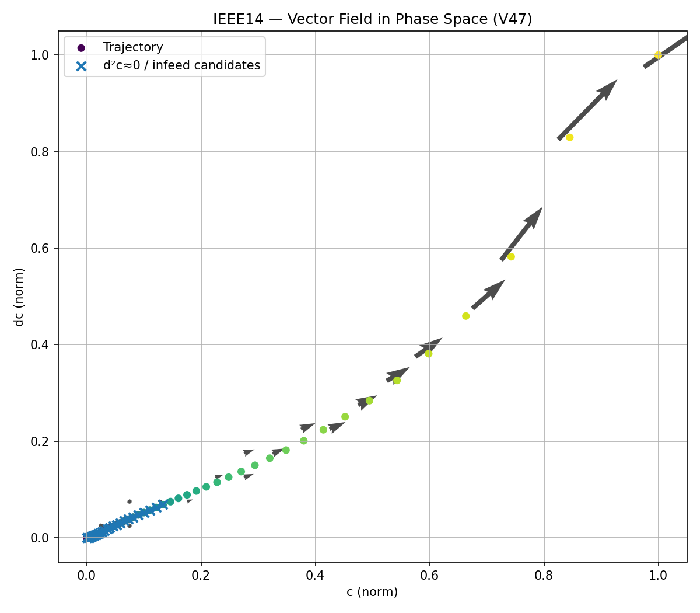
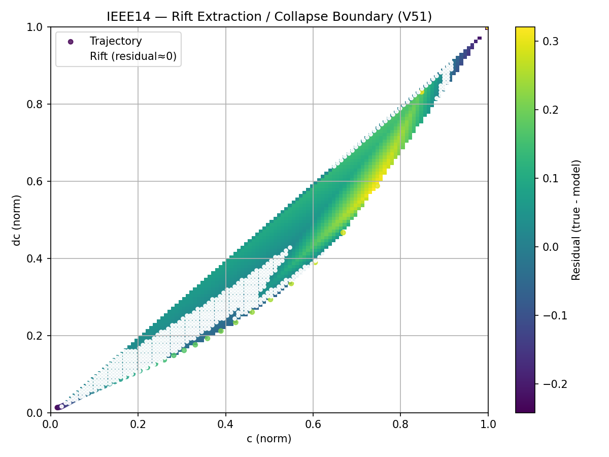
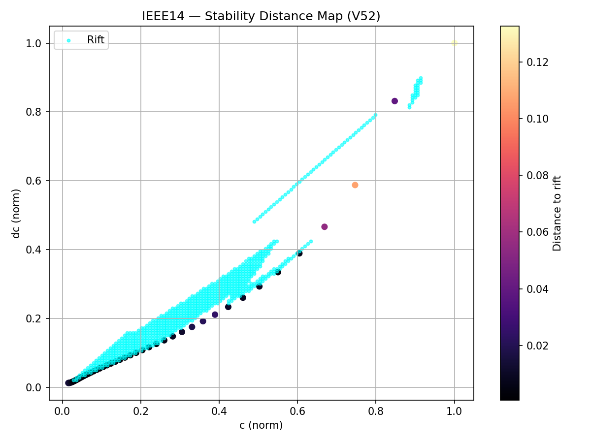

# ⚡ Stability Field Dynamics — Structure Discovery Layer of NEXAH

> A geometric + dynamical + topological framework for discovering structure,
> constructing fields, and understanding instability transitions in complex power systems.

---

## 🚀 What this is

This module represents the primary **structure-discovery environment** of the NEXAH framework.

It reframes classical power-system stability as a low-dimensional structural problem:

- **Geometry** → collapse manifold
- **Dynamics** → flow + acceleration
- **Topology** → branching + multi-state collapse
- **Fields** → navigable stability landscapes
- **Transitions** → regime-change detection

The key shift:

→ from high-dimensional simulation

→ to low-dimensional structural representation

Validated on:

- IEEE 9
- IEEE 14
- IEEE 30
- IEEE 57
- IEEE 118

and extended through scaling studies toward:

- IEEE 300
- IEEE 1354
- IEEE 9241 (PEGASE)

---

# 🌍 Evolution of the Framework

The work evolved through several major stages:

| Phase | Focus |
|---------|---------|
| V43–V52 | Structure Discovery |
| V53–V69 | Field Dynamics |
| Scaling Studies | IEEE 118 → 9241 |
| Core Geometry | Stability Field Construction |
| NEXAH Operator | Navigation & Regime Dynamics |

---

## 🚀 Quick Entry

👉 Start here: [START_HERE.md](START_HERE.md)

### Recommended Reading Path

1. `results_summary.md`
2. `theory_stability_field.md`
3. `method_pipeline.md`
4. `discussion.md`
5. `logs/`

---

# 📚 Documentation Index

This module is structured into a set of focused documents:

| File | Purpose |
|------|----------|
| `START_HERE.md` | Guided entry point |
| `results_summary.md` | Empirical findings |
| `theory_stability_field.md` | Conceptual framework |
| `method_pipeline.md` | Computational pipeline |
| `introduction.md` | Context and motivation |
| `abstract.md` | Condensed research overview |
| `discussion.md` | Interpretation and implications |
| `limitations.md` | Known limitations |
| `logs/` | Full discovery history |

---

## 🧠 Core Discovery

> Collapse is not triggered.
>
> It emerges through structural alignment,
> coherence loss,
> and geometric transition.

Systems evolve toward:

→ a low-dimensional manifold

→ align along a collapse boundary (rift)

→ eventually leave the structure

---

## ⚡ What You Can Do Here

- reproduce collapse dynamics from IEEE systems
- extract collapse manifolds
- identify collapse boundaries (rifts)
- measure stability as distance to structure
- construct flow fields
- analyze transition geometry
- investigate scaling behavior
- build navigable stability representations

---

## 🧭 Mental Model

System evolution:

→ aligns with manifold

→ moves along rift

→ deviates (distance ↑)

→ fragments

→ branches

→ collapses


---

## 🔬 Key Concepts

| Concept | Meaning |
|----------|----------|
| Manifold | Collapse attractor in phase space |
| Rift | Structural transition boundary |
| Distance | Stability metric |
| Residual | Deviation from structure |
| Field | Local flow representation |
| Topology | Branching collapse states |

---

# 🧱 Core Framework

## Geometry → Dynamics → Topology

- Geometry → manifold
- Field → flow dynamics
- Dynamics → recurrence
- Structure → resonance
- Boundary → rift
- Metric → distance
- Topology → branching

---

# 🔗 From Structure to Navigation

The structural analysis performed in this module reveals:

- collapse manifolds
- rift boundaries
- stability distance metrics
- vector flow fields
- transition corridors

These structures define the geometry of stability.

NEXAH then uses this geometry to:

→ construct navigable stability fields

→ identify safe trajectories

→ support future intervention strategies

In this sense:

→ structure becomes field

→ field becomes navigation

→ navigation becomes control

---

# Collapse Manifold

All systems converge toward:

```text
(c, dc, d²c) → (1, 1, α)
```

forming a low-dimensional attractor manifold.

### Properties

- robust under perturbations
- approximately invariant across tested systems
- topology-independent

---

## Manifold Equation

```text
d²c ≈ a · c^p · (dc)^q
```

Interpretation:

- dc → dominant driver
- c → modulation
- d²c → emergent instability

---

## Rift — Collapse Boundary

Defined by:

```text
residual ≈ 0
```

Represents:

- structural alignment
- transition corridor
- collapse boundary

---

## Stability Distance

```text
distance = min || (c, dc) − rift ||
```

- small → stable
- large → unstable

---

## Collapse Strength

```text
collapse_strength ≈ |residual| × τ
```

→ local instability intensity

---

# 📊 Results Summary

## Structural Consistency

Across all tested systems:

- similar manifold structure
- similar collapse geometry
- similar clustering behavior

---

## Scaling Law

| System | p | q |
|----------|------|------|
| IEEE 9 / 14 | ~0.44 | ~0.97 |
| IEEE 30 / 57 / 118 | ~0.31 | ~0.89 |

---

## Structural Transition Sequence

1. coherence
2. fragmentation
3. branching
4. instability amplification
5. collapse

---

## Universal Collapse Signature

- curvature peak
- divergence spike
- fragmentation growth
- manifold alignment
- distance expansion

---

# 🌍 Scaling Validation

Recent studies extended the framework toward large-scale systems.

Validated systems:

| System | Status |
|----------|----------|
| IEEE 118 | ✅ |
| IEEE 300 | ✅ |
| IEEE 1354 | ✅ |
| IEEE 9241 PEGASE | ✅ |

See:

➡️ `../iee_core_geometry/ieee_scaling/`

Key observation:

> Transition detection remains approximately consistent across tested network scales.

---

# 🌊 Field Perspective (V68–V69)

## Vector Field Representation

```text
F(c, dc) → local flow direction
```

Trajectories follow structured flow regions.

---

## Key Insight

- dc → projection of flow
- d²c → change of flow
- manifold → preferred paths

---

## Geodesic Interpretation

System trajectories approximately follow:

→ minimal-energy paths inside the stability field

---

## GH Corridor

A coherent flow channel characterized by:

- aligned directions
- stable propagation
- reduced divergence

---

## Collapse (Field View)

Collapse occurs when trajectories enter divergence-dominated regions and leave coherent field structures.

---

# 📊 Visual Evidence

## Phase Space



## Manifold Fit



## Vector Field



## Rift Boundary



## Stability Distance



---

# 🏗 Relationship to NEXAH

This module represents the discovery layer of the NEXAH architecture.

```text
Simulation
      ↓
Structure Discovery
      ↓
Field Construction
      ↓
NEXAH Operator
      ↓
Navigation
      ↓
Intervention
```

Related modules:

- `iee_core_geometry/`
- `ieee_application/`

---

# 📂 Repository Structure

```text
APPLICATIONS/power_systems/stability_field_dynamics/
└── ieee_test_cases/
    ├── core/
    ├── pipeline/
    ├── experiments/
    ├── analysis/
    ├── controller_lab/
    ├── outputs/
    ├── logs/
    ├── results_summary.md
    ├── theory_stability_field.md
    ├── method_pipeline.md
    ├── README.md
    └── START_HERE.md
```

---

# 🎯 Current Interpretation

The Stability Field Dynamics layer discovers structure.

The IEEE Core Geometry layer constructs the field.

The NEXAH Operator acts within that field.

Together they form the current foundation of the NEXAH framework:

```text
Simulation
→ Structure Discovery
→ Field Construction
→ Navigation
→ Intervention
```

---

# 🧠 Final Insight

> Systems do not fail suddenly.
>
> They lose coherence,
> fragment,
> and eventually leave
> the structure that sustains them.
