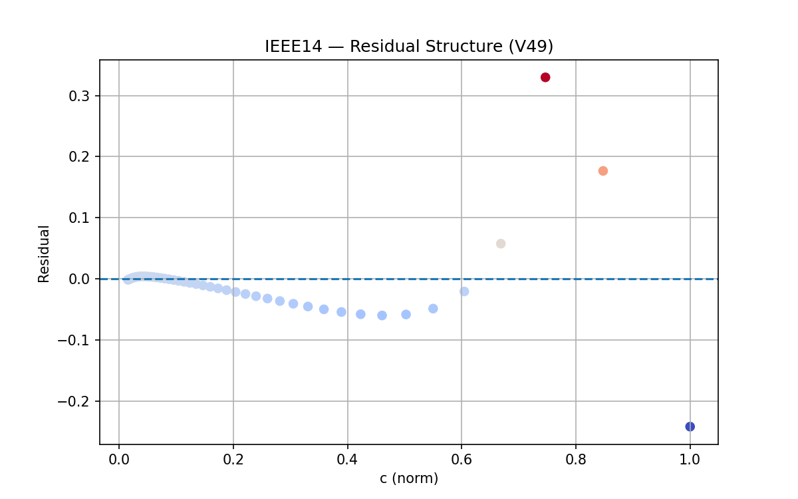
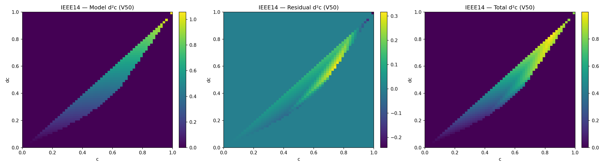
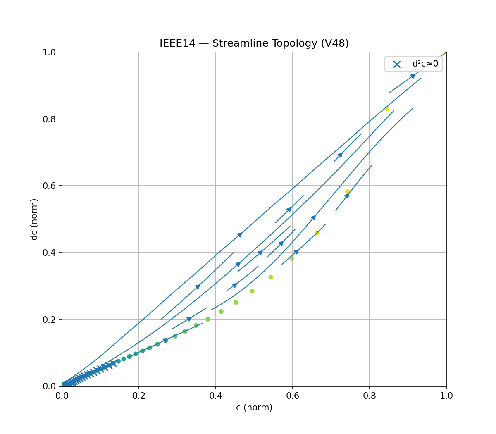
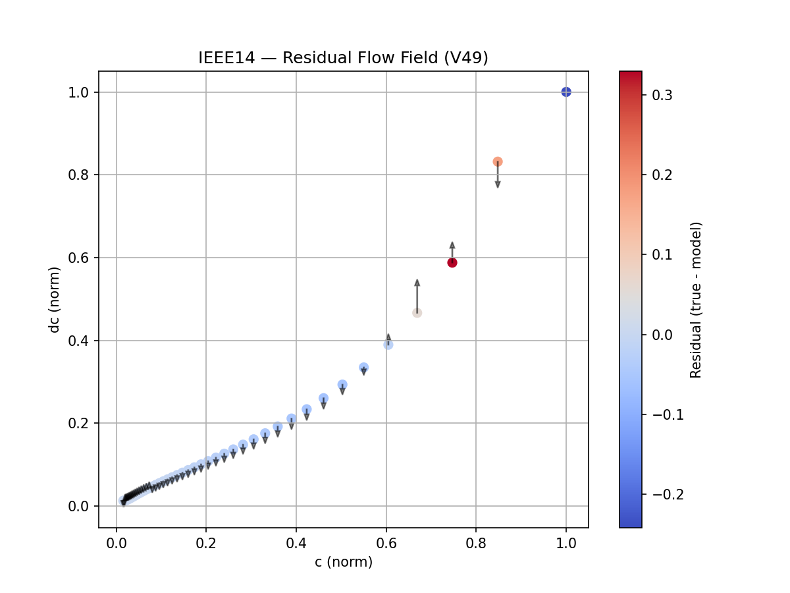
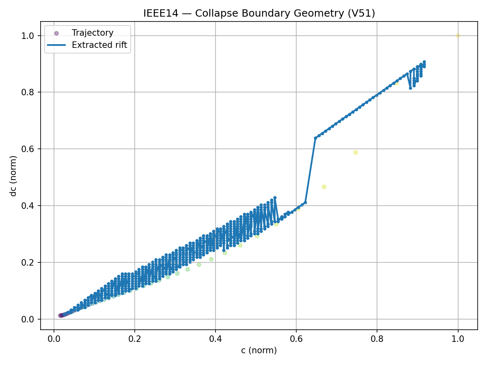
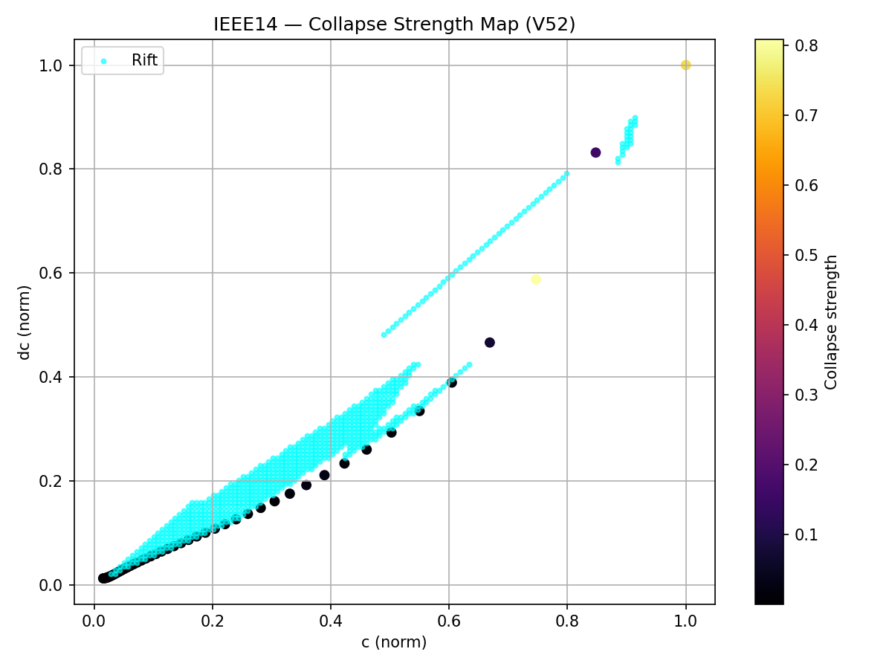

# ⚡ Stability Field Dynamics — IEEE Systems

## Overview

This module transforms classical power system stability analysis into a:

- continuous field representation  
- dynamic flow system  
- memory-based recurrence model  
- resonance-driven structure formation  
- topological state graph  
- physically coupled predictive framework  
- multi-system validated collapse predictor  
- geometric + dynamical + topological collapse model  

Standard IEEE test systems (IEEE 9, IEEE 14, IEEE 30) are used as real-world benchmarks.

---

## Core Idea

> Stability is not a binary state — it is a geometry.  

Extended into:

- Geometry → field representation  
- Field → flow dynamics  
- Dynamics → memory (recurrence)  
- Memory → resonance structure  
- Resonance → coupled system  
- Coupling → physical system embedding  
- Embedding → predictive collapse detection  
- Prediction → universality  
- Universality → manifold  
- Manifold → rift  
- Rift → distance  
- Distance → topology  

---

## Development Levels

| Level | Description |
|------|-------------|
| V1–V3 | Stability field + boundary detection |
| V4–V7 | Bipolar field, folds, eigenmodes |
| V8–V10 | Current field, time evolution, recurrence |
| V11–V13 | State detection, closure, activation |
| V14–V15 | Resonance detection, dual-band structure |
| V15b | Gap stabilization → first loops + states |
| V16 | State graph + loop topology |
| V17 | Coupling metric (P × R × L) |
| V17b | Coupling heatmap (birth zones) |
| V18 | Physical coupling (IEEE integration) |
| V19 | GH corridor tracking + phase progression |
| V20 | Curvature-based early warning (d²C/dλ²) |
| V21 | Unified collapse predictor |
| V22 | Fragmentation-aware scoring |
| V30 | Multi-system benchmark |
| V31 | Cross-system validation |
| V32 | Robustness validation |
| V33–V35 | Divergence detection |
| V36 | Unified predictor |
| V40–V42 | Collapse manifold (phase-space attractor) |
| V43 | Manifold equation (power-law coupling) |
| V47–V50 | Flow fields, residual dynamics |
| V51 | Rift extraction (collapse boundary) |
| V52 | Stability distance + collapse geometry |

---

## Collapse Manifold

All systems converge toward:

(c, dc, d²c) → (1, 1, α)

This defines a:

→ **low-dimensional attractor manifold**

Properties:

- stable under perturbations  
- invariant across systems  
- independent of topology (first-order)  

---

## Manifold Equation

Empirical law:

d²c ≈ a · c^p · (dc)^q  

Key insight:

- dc (drift) dominates  
- c (state) modulates  
- d²c (acceleration) emerges from interaction  

---

## Rift — Collapse Boundary

The rift is defined as:

→ residual ≈ 0  

It represents:

- alignment between system and manifold  
- geometric collapse corridor  

Properties:

- continuous structure in (c, dc) space  
- spans full system trajectory  
- acts as structural backbone  

---

## Stability Distance

Defined as:

distance = min || (c, dc) − rift ||

Interpretation:

- small → stable (aligned)  
- large → unstable (deviating)  

Key behavior:

- near zero in SAFE/WARNING  
- increases sharply near collapse  

---

## Collapse Strength

Defined as:

collapse_strength ≈ |residual| × τ  

Interpretation:

- measures instability intensity  
- grows rapidly near collapse  

---

## Collapse Geometry (V52)

Projection into:

(distance, residual)

reveals structured regions:

| Region | Description |
|--------|------------|
| Core | stable cluster near (0,0) |
| Triangle | early deformation |
| Polygon | multi-state branching |
| Extremes | collapse points |

---

## Branching Topology

Collapse is not continuous.

Observed:

→ discrete state clusters  

This implies:

- multi-valued system states  
- non-unique mapping from load → structure  

---

## Structural Transition Sequence

1. coherence (aligned manifold)  
2. fragmentation (spread)  
3. branching (multiple states)  
4. instability amplification  
5. collapse  

---

## Universal Collapse Signature

Across IEEE 9 / 14 / 30:

- curvature peak before collapse  
- divergence spike  
- fragmentation growth  
- manifold convergence  
- rift alignment  
- distance expansion  

---

## Phase System

| Phase | Meaning | Behavior |
|------|--------|----------|
| SAFE | coherent | stable alignment |
| WARNING | fragmentation | coherence loss |
| CRITICAL | acceleration | instability growth |
| PRE-COLLAPSE | manifold convergence | high alignment |
| COLLAPSED | divergence | system breakdown |

---

## New Layer — Structural Topology

The system is now described by:

1. Geometry → manifold  
2. Dynamics → equation  
3. Boundary → rift  
4. Metric → distance  
5. Topology → branching  

---

## Fundamental Discovery

Collapse is governed by:

- a geometric manifold  
- a dynamical equation  
- a boundary (rift)  
- a distance field  
- a topological transition  

---

## Theoretical Insight

> Stability is equivalent to alignment with structure.  
>  
> Collapse begins when the system drifts away from that structure.  
>  
>  
> Failure is not caused by magnitude —  
>  
> but by loss of alignment and uniqueness.  

---

## Final Core Insight

> Collapse is not a point.  
>  
> It is not even just a process.  
>  
> It is a geometric + dynamical + topological transition.  
>  
>  
> The system does not fail suddenly —  
>  
> it loses coherence, splits into multiple states,  
>  
> and finally leaves the structure that sustains it.  

---
---

## Visual Evidence — Collapse Geometry (V43–V52)

The following visualizations illustrate the transition from:

→ prediction  
→ to geometric understanding  
→ to topological collapse structure  

---

### 1. Collapse Manifold (Phase Space)

Trajectory in (c, dc, d²c):

Key observation:

→ all systems converge toward a common pre-collapse state  

---

### 2. Manifold Fit (V43)

Empirical relationship:

d²c ≈ a · c^p · (dc)^q

Key observation:

→ acceleration is governed by state–drift interaction  

---

### 3. Residual Structure (V44)

Deviation between model and system:

Key observation:

→ structured residual patterns (not noise)  

---

### 4. Extended Manifold (V50)

Improved model capturing nonlinear structure:

Key observation:

→ manifold is slightly curved / folded

---

### 5. Vector Field (V47)

Flow behavior in (c, dc):

Key observation:

→ trajectories follow structured flow paths  

---

### 6. Flow Topology (V48)

Streamline and curl structure:

Key observation:

→ rotational flow + directional transitions  

---

### 7. Residual Flow Field (V49)

Residual-driven dynamics:

Key observation:

→ instability propagates along structured directions  

---

### 8. Rift — Collapse Boundary (V51)

Zero-residual boundary:

Extracted collapse geometry:

Key observation:

→ collapse occurs along a continuous boundary (rift)

---

### 9. Stability Distance (V52)

Distance to rift:

Key observation:

→ stability is proportional to proximity to the rift  

---

### 10. Collapse Strength (V52)

Residual × progression:

Key observation:

→ instability concentrates locally before collapse  

---

### 11. Residual–Distance Space (Critical Insight)

Projection:

(distance, residual)

Key observation:

→ discrete clusters emerge (triangle, polygon, collapse points)  

---

## Visual Summary

The system evolves through:

1. smooth trajectory  
2. curvature increase  
3. structured residual patterns  
4. flow organization  
5. rift alignment  
6. distance expansion  
7. topological branching  
8. collapse  

---

## Visual Core Insight

> Collapse is not only measurable —  
>  
> it is **visible**.  
>  
>  
> The system reveals its failure in geometry,  
> in flow,  
> and in structure —  
>  
> long before it happens.
---

## Repository Structure

APPLICATIONS/power_systems/stability_field_dynamics/
│
├── ieee_test_cases/
│   ├── core/
│   ├── pipeline/
│   ├── experiments/
│   ├── analysis/
│   ├── outputs/
│   ├── logs/
│   └── README.md
