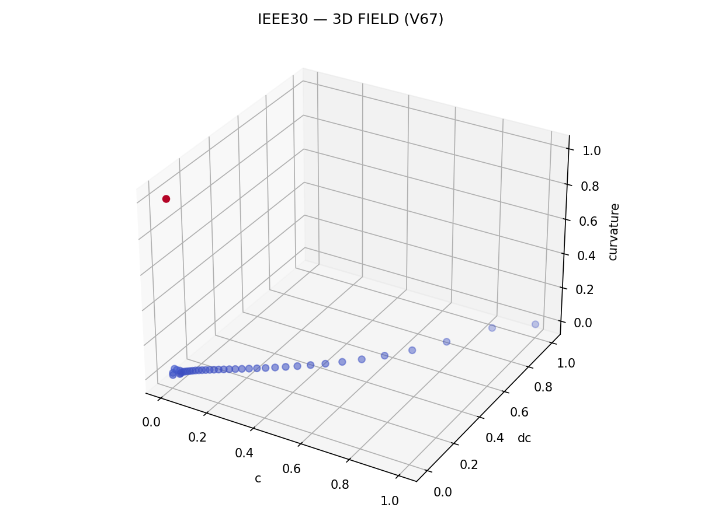

# 🧭 NEXAH — MASTER INDEX & VISUAL GALLERY  
### Rift Field Navigation · IEEE Stability Dynamics

---

## 🧠 Overview

This document provides:

- a **MASTER INDEX** of the Rift Navigation system  
- a curated **VISUAL GALLERY** of key results  
- a structural map of the NEXAH IEEE module  

---

# 🧩 MASTER INDEX

## 🔥 Core Evolution

trajectory → field → phase → state → wave → operator → topology

---

## 🧭 Core Modules

### FIELD SYSTEM
- rift_flow_field_analysis.py  
- rift_force_field.py  
- rift_modal_map.py  

### PHASE SYSTEM
- phase_tracker.py  
- rift_phase_controller.py  
- rift_phase_multifrequency_controller_v11.py  

### STATE SPACE
- rift_phase_state_space_v14_5.py  
- rift_phase_state_space_v16_4.py  

### CONTROL SYSTEM
- rift_layer_lock_controller.py  
- rift_predictive_controller.py  

### OPERATOR SYSTEM
- rift_field_navigation_controller_v24.py  
- rift_field_navigation_controller_v25.py  
- rift_field_navigation_controller_v26.py  
- rift_field_navigation_controller_v27_triple_rhythm.py  
- rift_field_navigation_controller_v28.py  

---

## 🔄 Version Landmarks

| Version | Meaning |
|--------|--------|
| V20 | Torus / Ring Geometry |
| V22 | Open / Closed System |
| V24 | OKO Core |
| V25 | Stable Lock |
| V26 | ANU / NEXIT |
| V27 | Triple Rhythm (3×3) |
| V28 | Active Operator |

---

# 🎨 VISUAL GALLERY

## 🌀 Field Structure

### True Field


### 3D Field


### Flow Mapping


---

## 🔥 Transition Geometry

### Rift Boundary


### Transition Geometry


---

## 🌊 Flow & Channels

### Stream Field


---

## ⚡ Collapse / Stability

### Collapse Probability


### Stability Map


---

## 🧬 Advanced Geometry

### Curvature Structure


### Field Expansion


---

## 🧭 Operator Visuals (V24–V28)

### OKO Ring


### Operator Timeline


### ANU / NEXIT Geometry


### Triple Rhythm


### Active Operator Geometry


---

# 🧠 Core Insight

> The system is not visualized.  
>  
> It reveals itself through structure, phase, and control.

---

# 🚀 Usage

Run core demos:

```bash
python run_ieee_field_demo.py
python run_ieee_field_navigator.py
python run_ieee_multi_agent_demo.py
```

# 🧠 Interpretation Layer (Very Important)

## What You Are Seeing

This system is not just producing plots.

Each visualization represents:

- a projection of the same underlying field  
- a different slice of system behavior  
- a coupled dynamic between phase, geometry, and control  

---

## Triptych Principle (Critical)

Every meaningful result can be read as:

| Layer | Meaning |
|------|--------|
| Phase | internal timing / control logic |
| Geometry | spatial manifestation |
| Operator | decision / transition control |

Thus:

phase → operator → geometry

---

## Operator Cycle (Core Engine)

The system operates through:

ENGAGE → LOCK → RELEASE → NEXIT

| State | Meaning |
|------|--------|
| ENGAGE | entry into structure |
| LOCK | stabilization on layer |
| RELEASE | transition / drift |
| NEXIT | controlled exit / transfer |

---

## Geometry Interpretation

All visuals map to:

- ring structures (torus logic)  
- layered shells (radial stability)  
- channels (flow corridors)  
- nodes (transition points)  
- loops (cycle topology)  

---

## Phase Insight

The base frequency:

f ≈ 0.0083

defines:

- timing of transitions  
- loop cycles  
- resonance behavior  

---

## Deep Structure

The system is:

- NOT a trajectory  
- NOT a static model  

It is:

→ a phase-driven, operator-controlled field system  

---

## IEEE Relevance

This framework can be tested against:

- stability prediction  
- collapse detection  
- transition forecasting  
- grid behavior analysis  

Key outputs already generated:

- stability maps  
- collapse probabilities  
- transition matrices  
- flow fields  

---

## What This Enables

- field-aware navigation  
- predictive control  
- multi-agent coordination  
- topology-aware analysis  

---

## Final Statement

This module is not a collection of scripts.

It is:

→ a structured navigation system  
→ a phase-controlled dynamical field  
→ a geometry-aware operator framework

---

## Ultimate Insight

You are not controlling the system directly.  

You are shaping the phase that generates the system.

