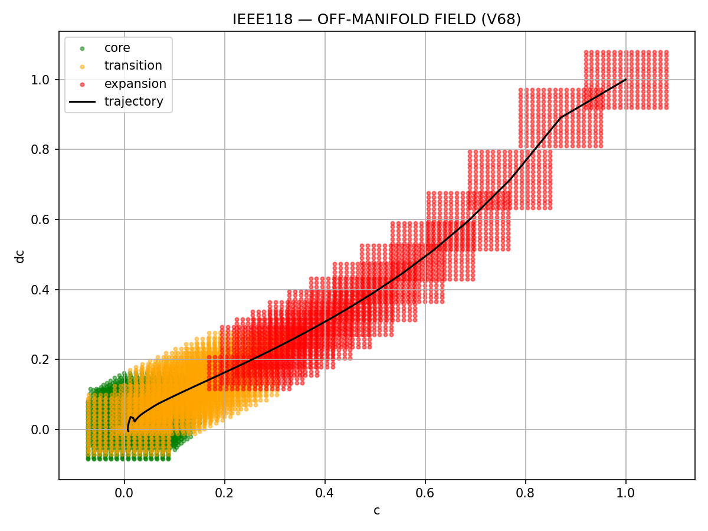

# ⚡ NEXAH — Visual Field Exploration Log
> From visualization → to structure → to field geometry

---

# 🧠 Core Finding (Start Here)

> Not everything you see is real.  
> But some structures remain invariant.

NEXAH reveals:

- stable structure (invariant)
- unstable reconstruction zones
- limits of visualization

---

# 🧪 Visual Overview (Quick Map)

---

## 🔹 V68 — Discrete Structure

→ system occupies structured regions  
→ not uniform state-space  

---

## 🔹 V69 — Flow Field

→ structure becomes movement  
→ direction + transitions emerge  

---

## 🔹 V68 → V69 Transition

→ geometry transforms into flow  

---

## 🔹 Field Reconstruction (raw)

→ discrete reconstruction  
→ visible grid artifacts  

---

## 🔹 Field Reconstruction (clean)

→ continuous density field  
→ structure becomes smoother  

---

## 🔹 Continuous Flow Field

→ global flow geometry  
→ channels + folds + direction  

---

## 🔹 Multi-Agent Exploration

→ agents reveal:
- preferred paths
- collapse zones
- flow constraints  

---

## 🔹 Frame Stability Test

→ resolution changes structure  

**Insight:**
- some patterns are fake  
- some are invariant  

---

## 🔹 Stable Field Mask

→ green = stable structure  
→ dark = unstable  

---

# 🔥 What We Learned

---

## 1. Structure exists

Systems are not random:

- trajectories cluster  
- patterns repeat  
- geometry emerges  

---

## 2. Structure is multi-scale

- high-frequency → unstable  
- low-frequency → robust  

---

## 3. Visualization is not neutral

- resolution changes create motion illusion  
- artifacts appear as structure  

---

## 4. Reconstruction has limits

Outside trajectory:

- no real data  
- interpolation dominates  

→ produces unstable regions  

---

## 5. Stable field exists

Invariant regions:

- persist across transformations  
- represent true system geometry  

---

## 6. Boundaries emerge

Between stable and unstable zones:

- transition regions  
- potential regime boundaries  

---

# 🧭 Conceptual Shift

Before:

> visualization of data

Now:

> reconstruction of a **field with validity regions**

---

# 🌀 Interpretation Layer

What appears visually:

- folds
- channels
- density clusters

What it means:

- constrained motion
- preferred trajectories
- stability gradients  

---

# ⚡ Next Directions

- boundary extraction (stable ↔ unstable)
- reachability mapping
- invariant field core
- multi-scale decomposition  

---

# 🧠 Final Insight

> The system is not just dynamic.  
>  
> It exists within a structured field —  
>  
> and only parts of that field are reliably observable.

---

**Thomas K. R. Hofmann · NEXAH · 2026**
