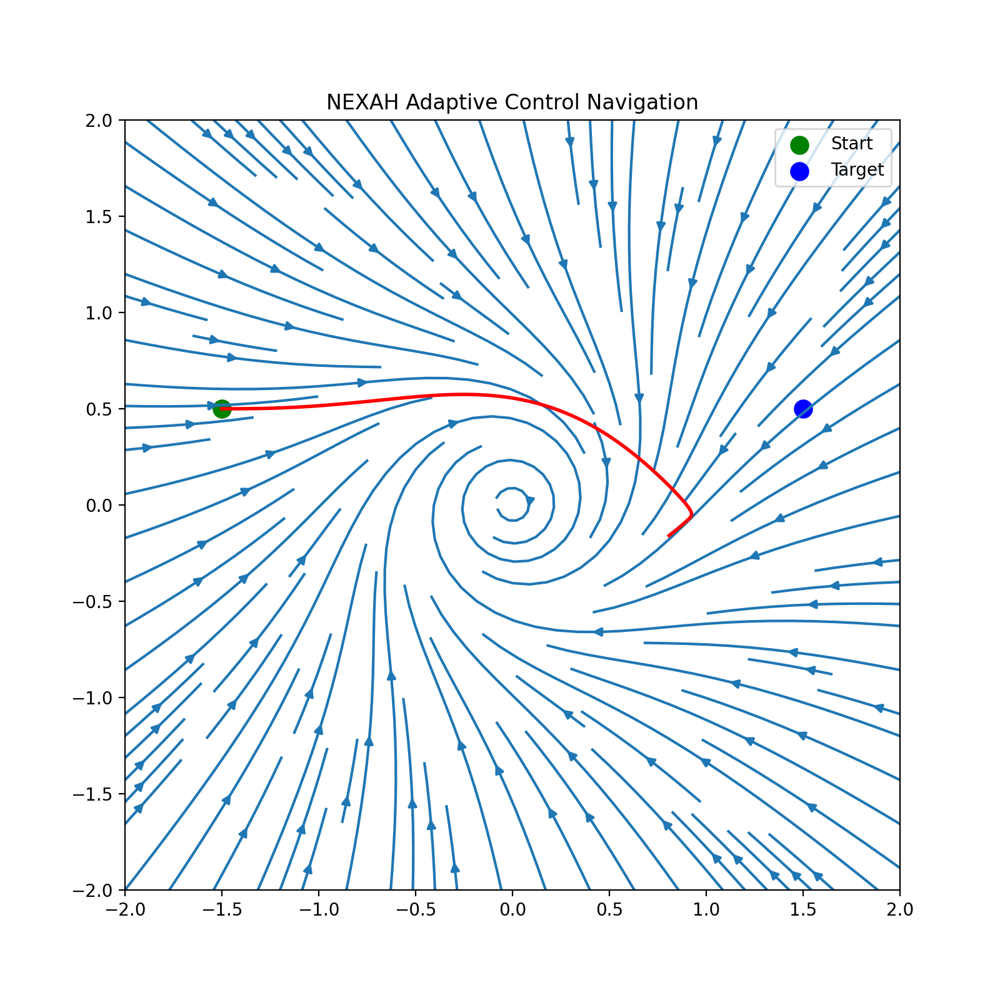
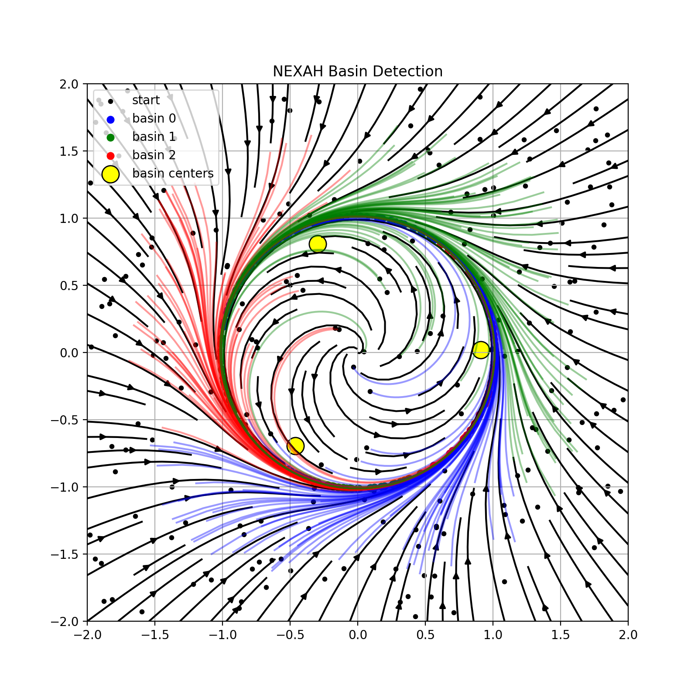
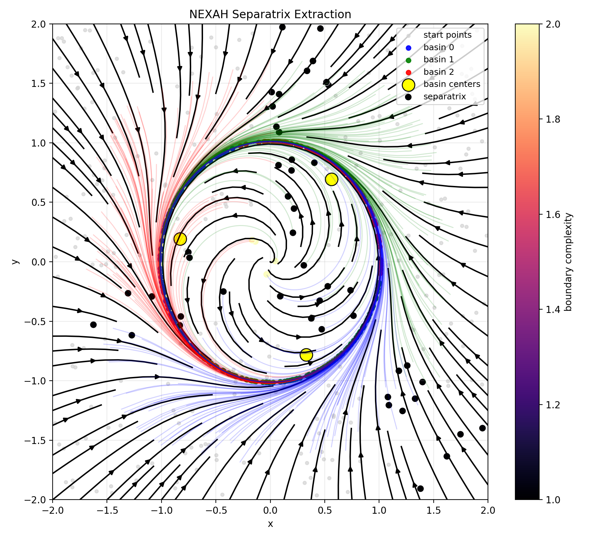
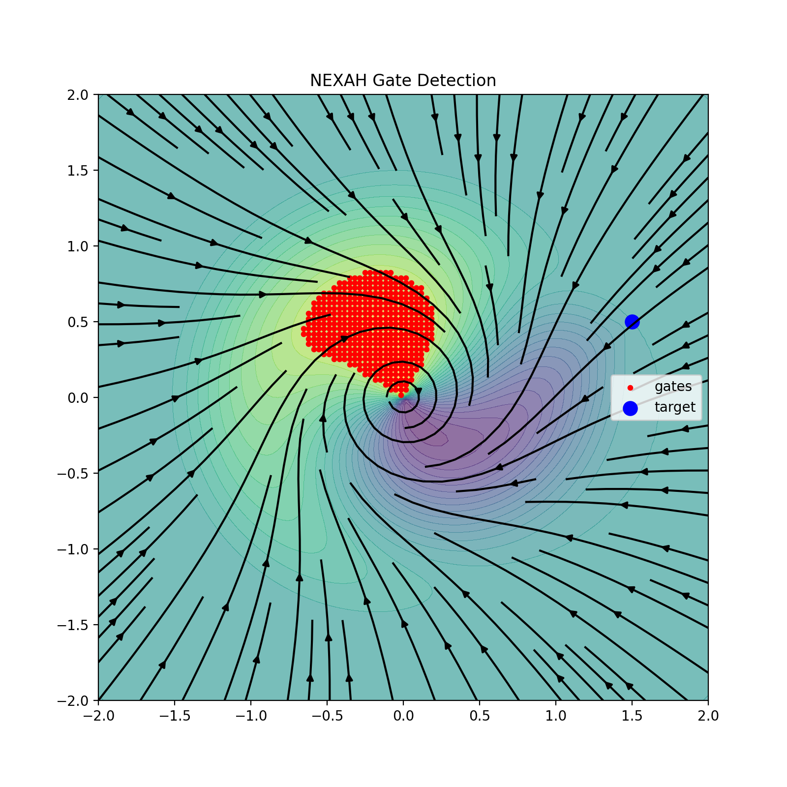
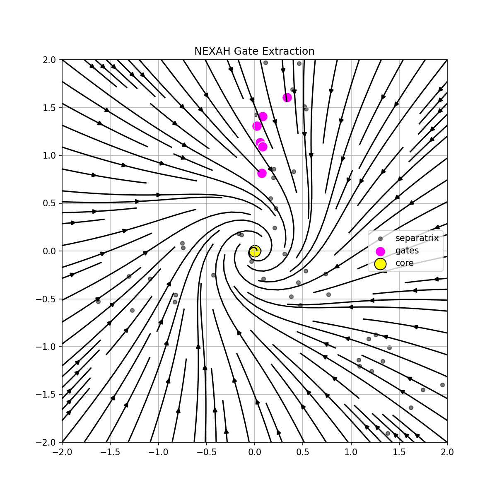
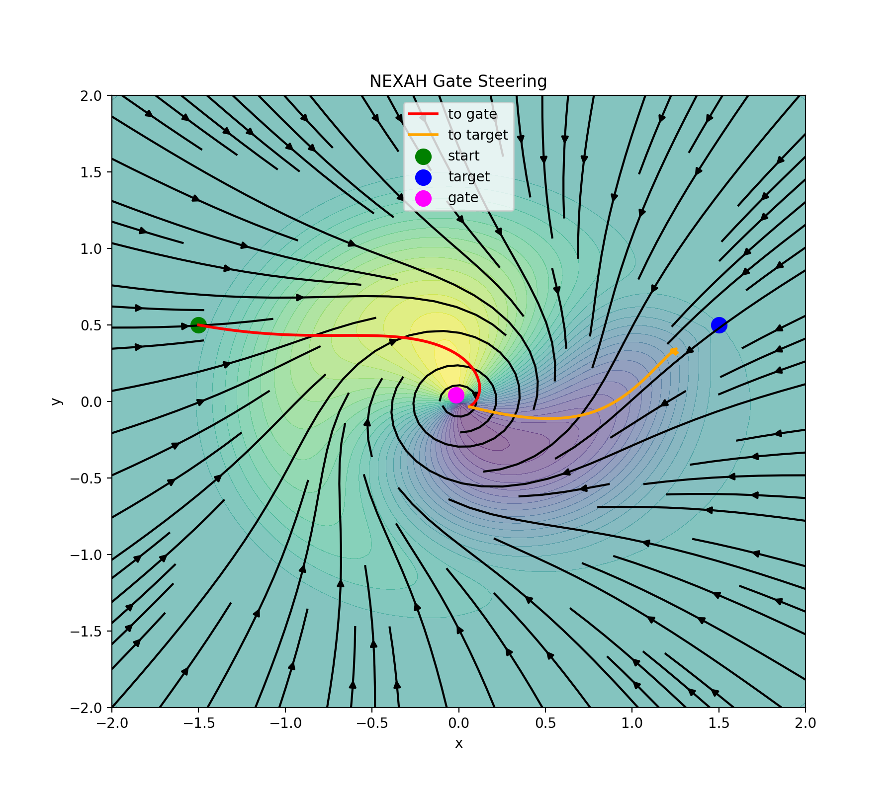
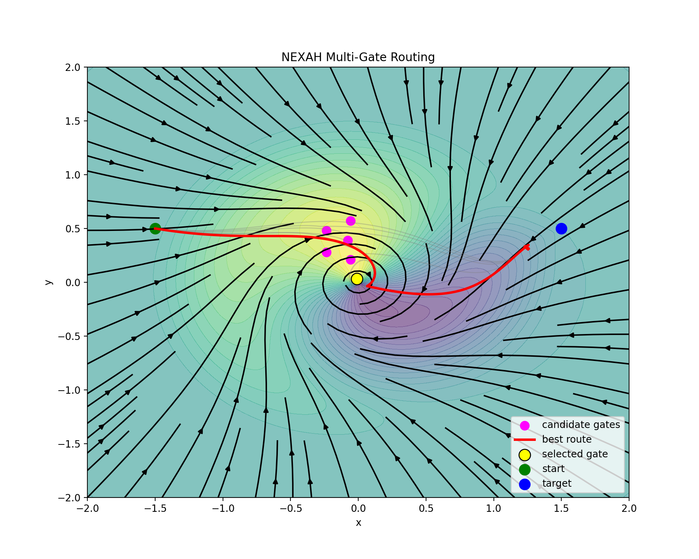
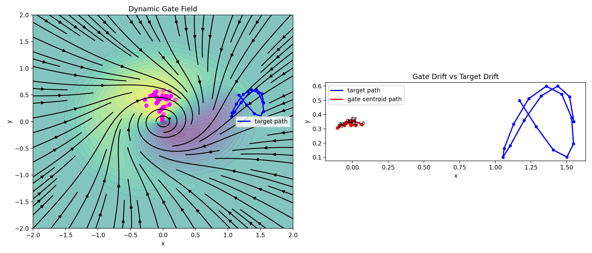
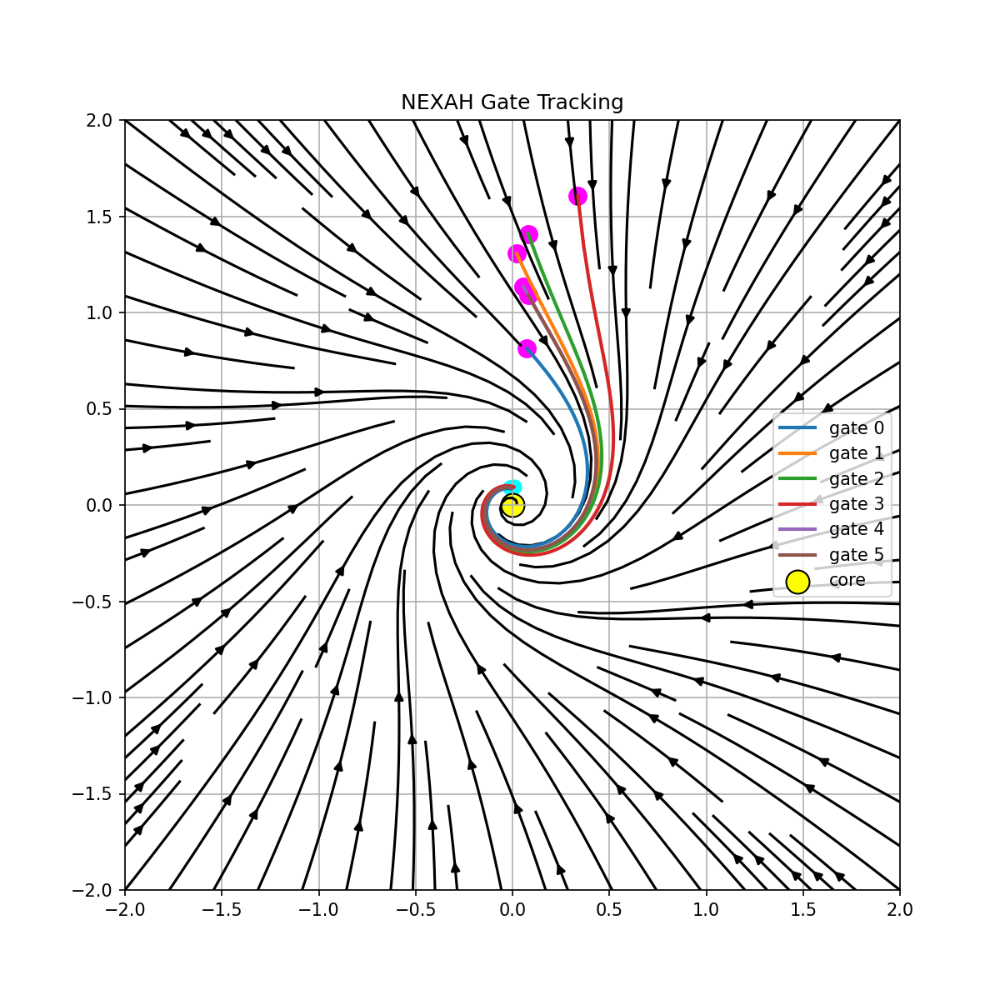
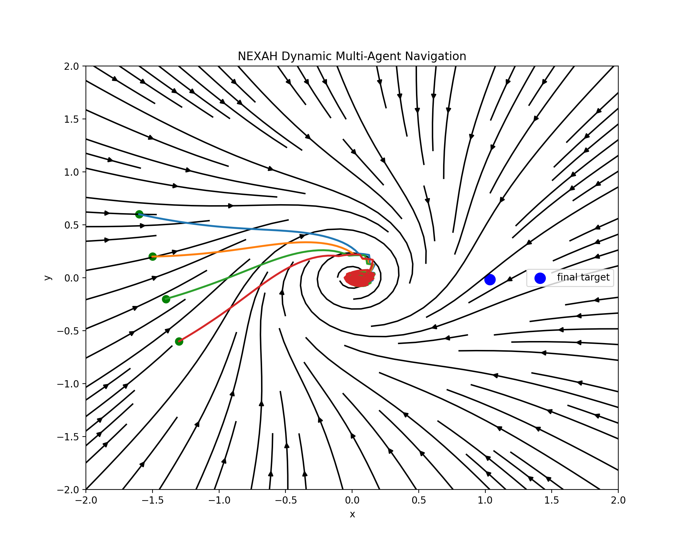

# 🧭 NEXAH Control Layer — Building Log & Structural Development

This document captures the development of the NEXAH control layer —  
from field reconstruction to transition-aware control and navigation.

It documents how control capabilities emerge **from structure**,  
not from externally imposed policies.

---

## 🧠 Overview

The Control Layer was not designed top-down.

It emerged step by step from:

```text
field reconstruction → geometric structure → transition detection → control
```

This log reflects that progression.

---

# 🔹 Stage 1 — Field Reconstruction

**Goal:** Represent system dynamics as a continuous structure

📊 Visual:



🧠 Insight:
→ system behavior can be represented as a vector field  
→ trajectories follow structured flow, not random motion  

---

# 🔹 Stage 2 — Basin Structure (Regimes)

📊 Visual:



🧠 Insight:
→ state space partitions into stable regions (basins)  
→ each basin corresponds to a long-term regime  
→ stability is spatially structured  

---

# 🔹 Stage 3 — Boundary Structure (Separatrix)

📊 Visual:



🧠 Insight:
→ separatrix defines transition boundaries between regimes  
→ small perturbations near boundary → different outcomes  
→ transition structure becomes explicit  

---

# 🔹 Stage 4 — Transition Regions (Gate Candidates)

📊 Visual:



🧠 Insight:
→ transition zones are not uniform along boundaries  
→ specific regions show higher transition likelihood  
→ these act as candidate transition corridors  

---

# 🔹 Stage 5 — Gate Extraction (Structured Transitions)

📊 Visual:



🧠 Insight:
→ gates = sparse, structured transition regions  
→ aligned with local flow direction  
→ represent minimal-cost transition pathways  

---

# 🔹 Stage 6 — Transition Steering

📊 Visual:



🧠 Insight:
→ trajectories can be guided toward selected transition regions  
→ control begins as directional steering within the field  

---

# 🔹 Stage 7 — Multi-Path Routing

📊 Visual:



🧠 Insight:
→ multiple transition paths exist simultaneously  
→ routing selects trajectories based on:
- distance  
- flow alignment  
- boundary interaction  

---

# 🔹 Stage 8 — Dynamic Transition Structure

📊 Visual:



🧠 Insight:
→ transition regions evolve over time  
→ structure is not static  
→ control must adapt to changing geometry  

---

# 🔹 Stage 9 — Gate Tracking

📊 Visual:



🧠 Insight:
→ gates move along flow structure  
→ stable transitions persist  
→ unstable ones dissolve  

---

# 🔹 Stage 10 — Multi-Agent Navigation

📊 Visual:



🧠 Insight:
→ multiple agents interact within the same field  
→ coordination emerges from shared structure  
→ global behavior arises from local navigation  

---

# 🧠 Structural Interpretation

Across all stages, a consistent pattern emerges:

```text
Field → Geometry → Transition Structure → Control → Navigation
```

---

## System Components

- **Field** → defines motion  
- **Basins** → define stable regimes  
- **Separatrix** → defines boundaries  
- **Gates** → define structured transitions  
- **Control** → shapes trajectories  
- **Navigation** → executes movement  

---

# 🔥 Core Insight

```text
Control does not create structure.

It operates on transition structures
that are already present in the system.
```

---

# ⚠️ Current Status

✔ full structural pipeline implemented  
✔ transition-aware control demonstrated  
✔ dynamic behavior captured  

---

## Limitations

❌ no unified execution kernel  
❌ no global optimal policy  
❌ limited robustness validation  
❌ no large-scale benchmarking  

---

# 🚀 Next Steps

- unify control into execution kernel  
- integrate transition graph explicitly  
- enforce probabilistic consistency  
- validate on real-world systems  

---

# 🧭 Final Interpretation

```text
Control is not imposed from outside.

It emerges as the ability
to move correctly within structured dynamics.
```

---

Thomas K. R. Hofmann · NEXAH · 2026
