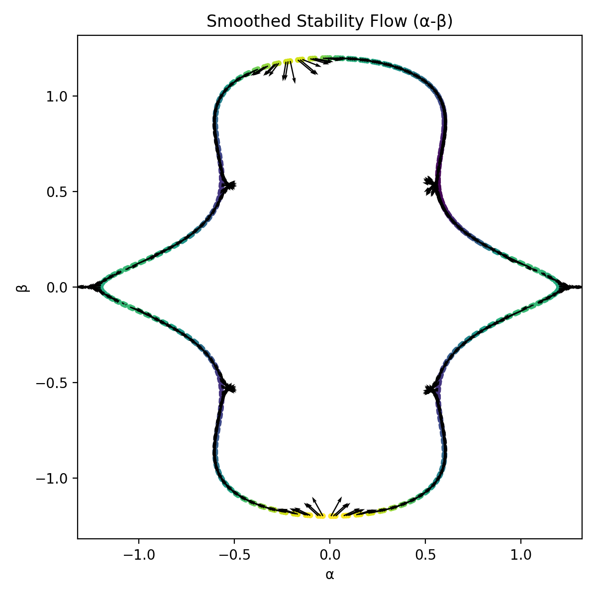

# ⚡ NEXAH — Visual Field Exploration Log
> From visualization → to structure → to field geometry → to navigation

---

# 🧠 Core Finding (Start Here)

> Not everything you see is real.  
> But some structures remain invariant.

NEXAH reveals:

- stable structure (invariant)
- unstable reconstruction zones
- limits of visualization
- navigable field geometry

---

# 🧪 Visual Overview (Quick Map)

---

## 🔹 Signal → Field Reconstruction

→ temporal signal becomes spatial structure  
→ field is reconstructed from dynamics  

### Emergent Rotation from 1D Signal

Observation:  
A simple trajectory evolves into rotational flow structures.

Interpretation:
- system leaves linear regime  
- rotational field component emerges  
- onset of nonlinear dynamics  

Implication:
Field reconstruction reveals hidden dynamics not visible in raw trajectory.

---

## 🔹 Structure → Flow Transition

  

→ geometry transforms into flow  
→ model vs data-driven transition  

---

## 🔹 Field Reconstruction (raw)

→ discrete reconstruction  
→ visible grid artifacts  

---

## 🔹 Field Reconstruction (clean)

→ continuous density field  
→ structure becomes smoother  

---

## 🔹 Continuous Flow Field

→ global flow geometry  
→ channels + folds + direction  

---

## 🔹 Frame Stability Test

→ resolution changes structure  

**Insight:**
- some patterns are fake  
- some are invariant  

---

## 🔹 Stable Field Mask

→ green = stable structure  
→ dark = unstable  

---

## 🔹 Robustness Analysis

  
  
  

→ system under perturbation  
→ structure persistence  

---

# 🧭 FIELD STRUCTURE → NAVIGATION (New Phase)

---

## 🔹 Boundary Detection

→ separation of:
- stable core (blue)
- transition regions (red)

**Insight:**
Boundaries define limits of reliable reconstruction.

---

## 🔹 Boundary Strength (Gradient Field)

→ continuous transition intensity  

**Interpretation:**
- bright → strong transition zones  
- dark → stable regions  

→ reveals where system becomes unstable  

---

## 🔹 Stability Flow Field

→ arrows show direction toward stability  

**Insight:**
System has **preferred motion directions**

---

## 🔹 Smoothed Stability Flow

→ continuous flow field  

**Interpretation:**
- flow bends along structure  
- asymmetry drives motion  
- folds generate directional bias  

---

## 🔹 Flow Channel Extraction

→ extraction of coherent motion corridors  

**Insight:**
- system does not move everywhere  
- movement is constrained to channels  

---

## 🔹 Trajectory Simulation

→ simulated motion inside the field  

**Interpretation:**
- trajectory follows field geometry  
- bends along channels  
- avoids unstable regions  

→ **first true field navigation**

---

## 🔹 Target-Guided Navigation

→ navigation under constraint:

- field stability (geometry)
- target direction (goal)

**Key Insight:**

> The target does NOT define the path.  
> The field defines the path.

---

# 🔥 What We Learned

---

## 1. Structure exists

Systems are not random:

- trajectories cluster  
- patterns repeat  
- geometry emerges  

---

## 2. Structure is multi-scale

- high-frequency → unstable  
- low-frequency → robust  

---

## 3. Visualization is not neutral

- resolution changes create motion illusion  
- artifacts appear as structure  

---

## 4. Reconstruction has limits

Outside trajectory:

- no real data  
- interpolation dominates  

→ produces unstable regions  

---

## 5. Stable field exists

Invariant regions:

- persist across transformations  
- represent true system geometry  

---

## 6. Boundaries emerge

Between stable and unstable zones:

- transition regions  
- regime limits  

---

## 7. Flow defines motion

- system follows geometry  
- not arbitrary paths  

---

## 8. Navigation becomes possible

- trajectories can be guided  
- stable paths exist  
- targets can be reached through structure  

---

# 🧭 Conceptual Shift

Before:

> visualization of data  

Now:

> reconstruction of a **field with validity regions**

Now (extended):

> navigation within a **structured dynamical field**

---

# 🌀 Interpretation Layer

Observed:

- folds  
- channels  
- loops  
- gradients  

Meaning:

- constrained motion  
- preferred trajectories  
- stability gradients  
- transition boundaries  

---

# ⚡ Next Directions

- invariant core extraction  
- reachability mapping  
- control optimization  
- real system integration (power grids, etc.)  

---

# 🧠 Final Insight

> The system is not just dynamic.  
>  
> It exists within a structured field —  
>  
> and only parts of that field are reliably observable.  
>  
> And within those regions — motion is navigable.

---

**Thomas K. R. Hofmann · NEXAH · 2026**
