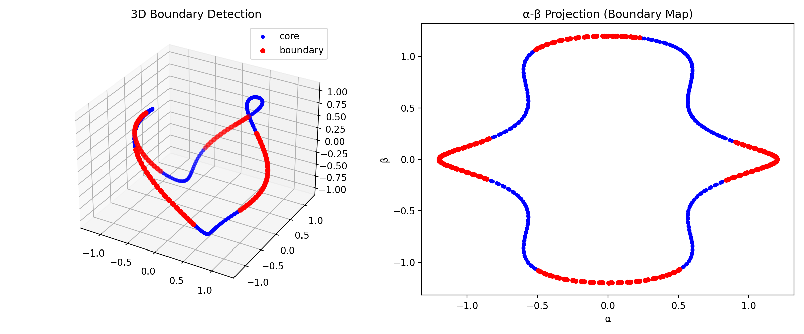
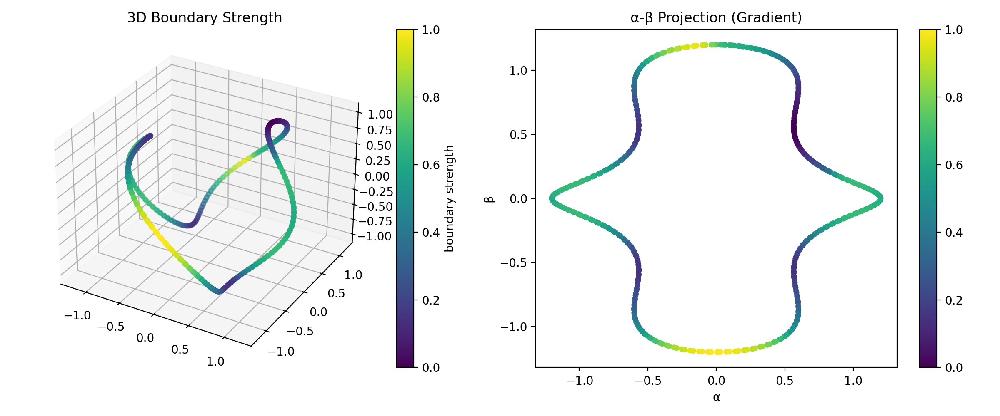
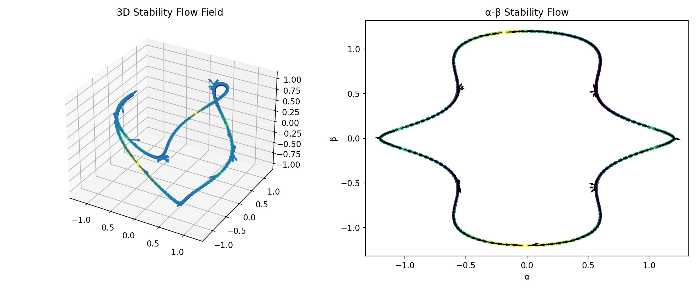
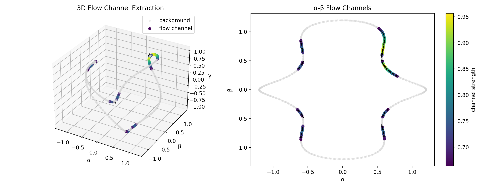
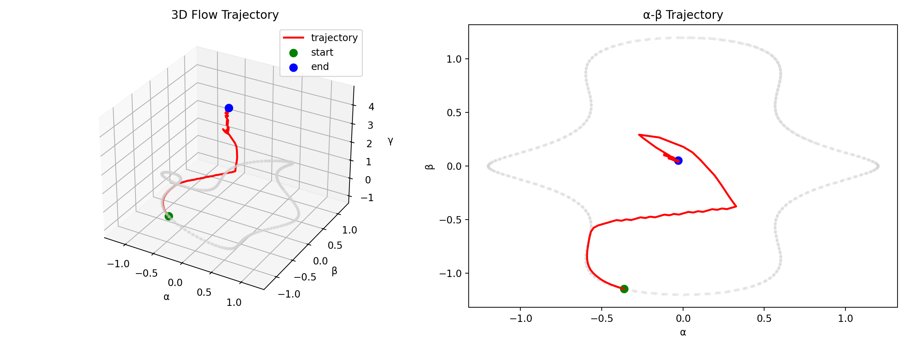
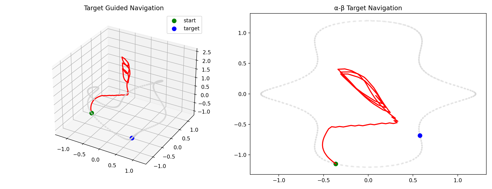

# ⚡ NEXAH — Field Reconstruction Module  
> From trajectory data → to structure → to field geometry → to navigation

---

## 🧠 Overview

This module investigates how dynamical systems can be reconstructed as **continuous fields** from discrete trajectory data.

Rather than treating system behavior as isolated trajectories, we interpret it as motion within an underlying **geometric field structure with varying validity**.

This module marks the transition from:

- trajectory analysis  
→ to field reconstruction  
→ to navigable system geometry  

---

## 🔬 Core Idea

A system is not just a trajectory.

It exists within a structured field — but this field is only **partially observable and locally reliable**.

This module reconstructs:

- spatial structure from temporal signals  
- flow fields from discrete trajectories  
- invariant regions under transformation  
- limits and artifacts of reconstruction  
- **navigable directions within the field**  

---

## 🧩 Module Structure

```
field_reconstruction/
├── reconstruction/   # raw vs cleaned field reconstruction
├── dynamics/         # flow transitions (GIFs)
├── stability/        # invariant vs frame-dependent regions
├── robustness/       # noise & perturbation analysis
├── outputs/          # generated field visualizations
├── scripts/          # reproducible experiments
```

---

## 🖼️ Key Visuals

### 🔹 Reconstruction (Raw vs Clean)

  


→ grid artifacts vs continuous density  
→ transition from discrete sampling to geometric approximation  

---

### 🔹 Flow Emergence


→ structure becomes movement  
→ flow channels and directional geometry emerge  

---

### 🔹 Dynamics (Transitions)

  


→ geometry transforms into flow  
→ discrete → continuous phase transition  

---

### 🔹 Emergent Rotation (IEEE 1D → Field)


Observation:

A simple trajectory evolves into rotational flow structures.

Interpretation:

- system leaves linear regime  
- rotational field components emerge  
- onset of nonlinear dynamics  

Implication:

Field reconstruction reveals dynamics not visible in the original trajectory.

---

### 🔹 Frame Stability


→ resolution-dependent artifacts become visible  

---

### 🔹 Stable Field Extraction


- green → invariant structure  
- dark → unstable / visualization-dependent  

---

### 🔹 Robustness

  


→ separation between structural signal and noise  

---

## 🧭 From Field → Navigation

---

### 🔹 Boundary Detection



→ separation of:
- stable core  
- transition regions  

---

### 🔹 Boundary Gradient



→ continuous transition intensity  

- bright → unstable / transition  
- dark → stable  

---

### 🔹 Stability Flow Field



→ direction toward stable regions  

---

### 🔹 Flow Channels



→ extraction of coherent motion corridors  

- system motion is constrained  
- movement occurs along preferred paths  

---

### 🔹 Trajectory Simulation



→ motion follows field geometry  

- bends along channels  
- avoids unstable regions  

---

### 🔹 Target-Guided Navigation



→ navigation under dual constraint:

- field structure (local geometry)  
- target direction (global goal)  

**Key Insight:**

> The target does not define the path.  
> The field defines the path.

---

## 🔥 Key Findings

### 1. Structure Exists

- trajectories cluster  
- geometry emerges  
- state space is not uniform  

---

### 2. Structure is Multi-Scale

- high-frequency → unstable  
- low-frequency → robust  

---

### 3. Visualization is Not Neutral

- resolution changes create motion illusion  
- interpolation introduces artifacts  
- perceived geometry depends on representation  

---

### 4. Reconstruction Has Limits

Outside trajectory support:

- no real data  
- interpolation dominates  

→ produces **non-physical or unstable regions**  

---

### 5. Stable Field Exists

Invariant regions:

- persist across transformations  
- represent **reliable system geometry**  

---

### 6. Boundaries Emerge

Between stable and unstable regions:

- transition zones  
- regime boundaries  
- separatrix-like structures  

---

### 7. Flow Defines Motion

- motion is not arbitrary  
- system follows field geometry  

---

### 8. Navigation Becomes Possible

- trajectories can be guided  
- stable paths exist  
- system can be steered through structure  

---

## 🧭 Conceptual Shift

Before:

> visualization of trajectories  

Now:

> reconstruction of a **field with validity regions**

Now (extended):

> navigation within a **structured dynamical field**

---

## 🌀 Interpretation Layer

Observed:

- folds  
- channels  
- loops  
- gradients  

Meaning:

- constrained motion  
- preferred trajectories  
- stability gradients  
- transition boundaries  

⚠️ Important:

> Not every visible structure corresponds to a real dynamical feature.  
> Interpretation must be restricted to **stable / invariant regions**.

---

## 🚀 Next Directions

- invariant core extraction  
- reachability mapping  
- control optimization  
- integration into FIELD_LAYER  
- real-world system application  

---

## 🧠 Key Result

> Not all observed structure is real.  
>  
> But invariant structure reveals the true system geometry —  
>  
> and within it, motion becomes navigable.

---

## ⚙️ Status

Experimental → emerging method  
Transitioning toward FIELD_LAYER integration (navigation + control)

---

**Thomas K. R. Hofmann · NEXAH · 2026**
