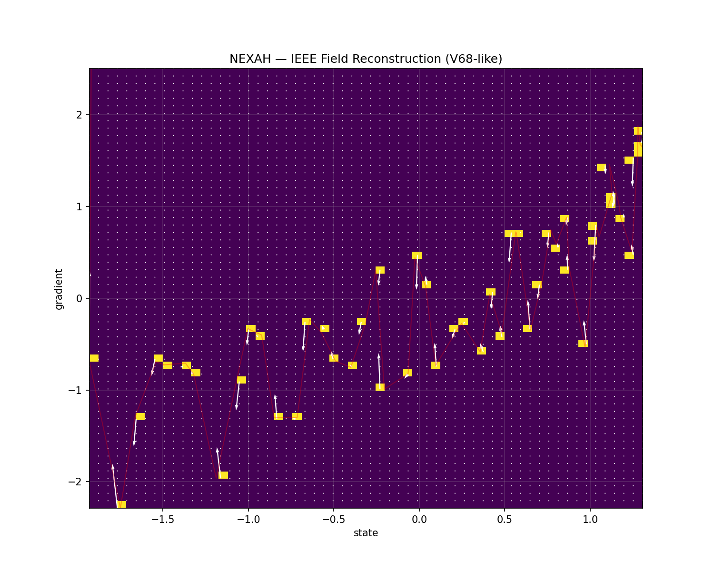
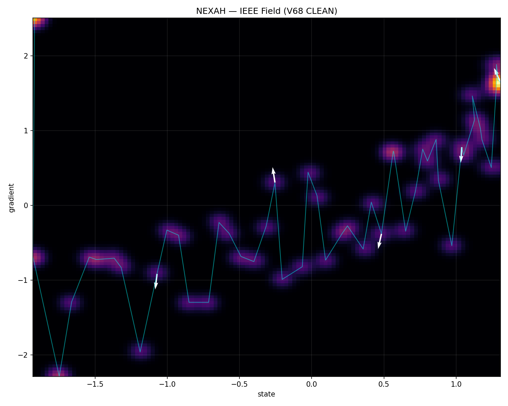
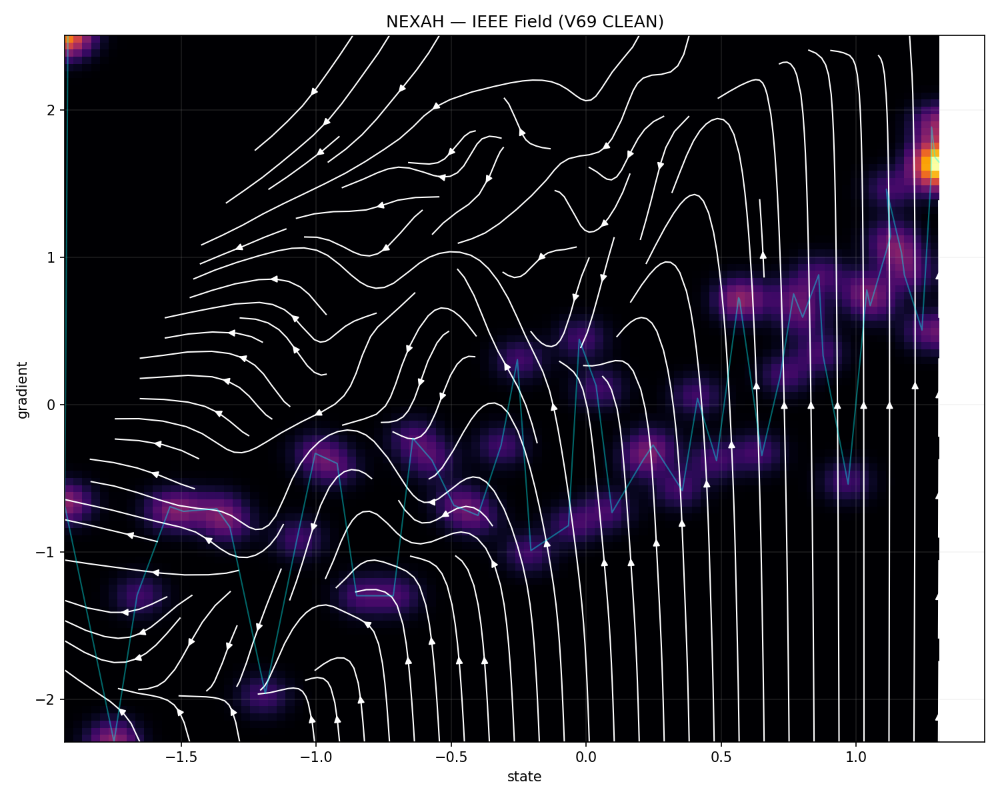
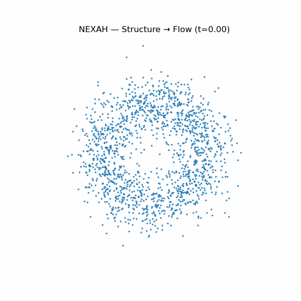
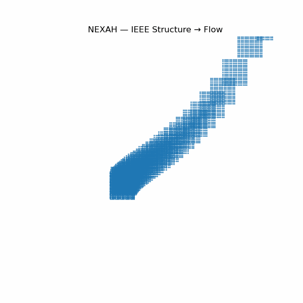
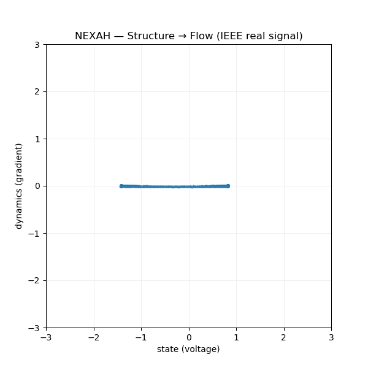
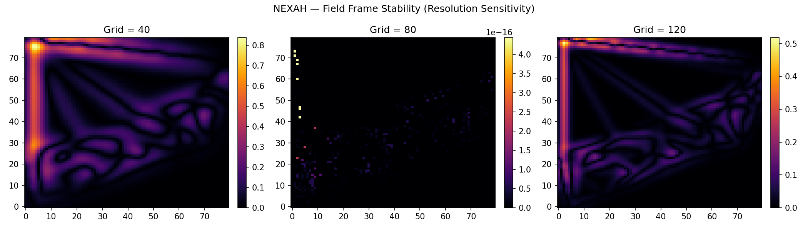
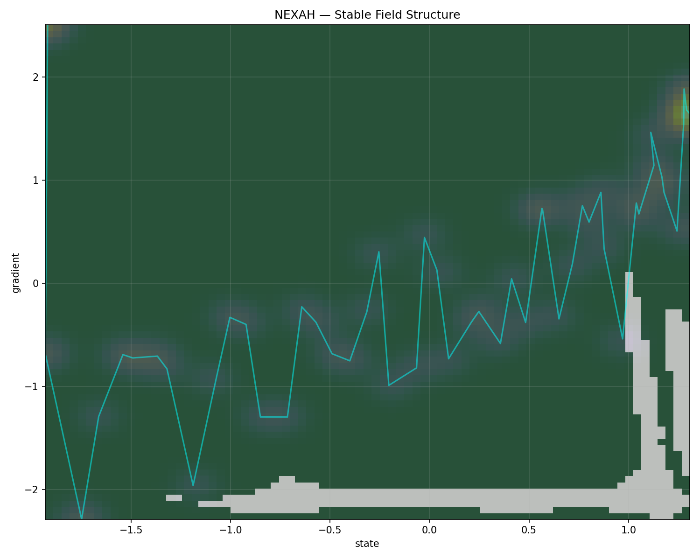
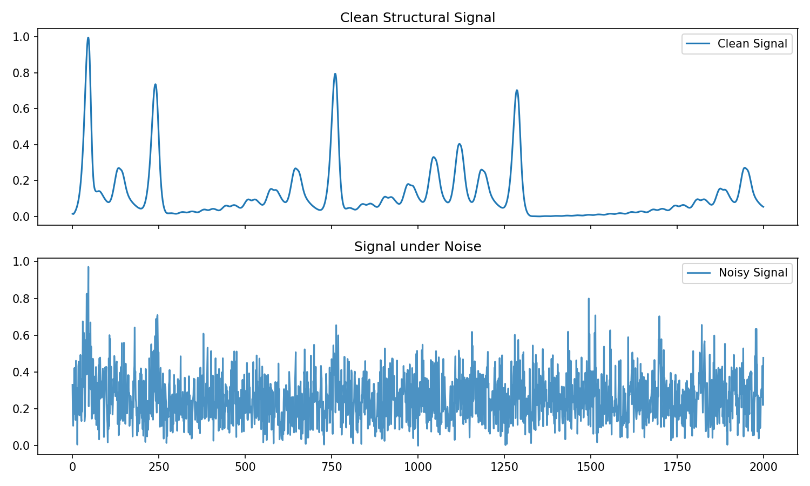
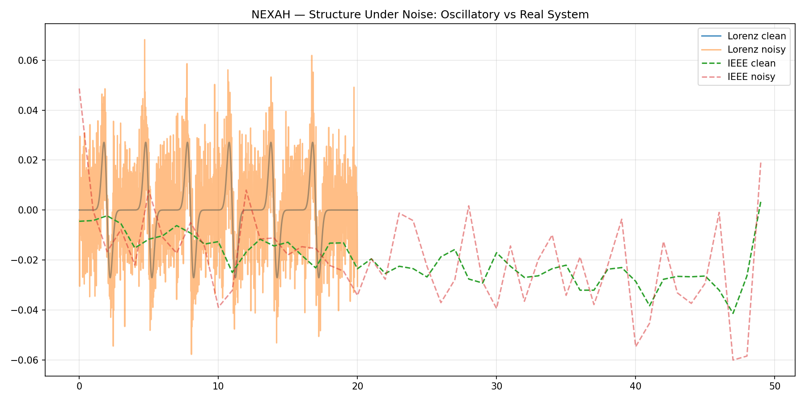

# ⚡ NEXAH — Field Reconstruction Module  
> From trajectory data → to structure → to field geometry

---

## 🧠 Overview

This module investigates how dynamical systems can be reconstructed as **continuous fields** from discrete trajectory data.

Rather than treating system behavior as isolated trajectories, we interpret it as motion within an underlying **geometric field structure with varying validity**.

---

## 🔬 Core Idea

A system is not just a trajectory.

It exists within a structured field — but this field is only **partially observable and locally reliable**.

This module reconstructs:

- spatial structure from temporal signals  
- flow fields from discrete trajectories  
- invariant regions under transformation  
- limits and artifacts of reconstruction  

---

## 🧩 Module Structure

```
field_reconstruction/
├── reconstruction/   # raw vs cleaned field reconstruction
├── dynamics/         # flow transitions (GIFs)
├── stability/        # invariant vs frame-dependent regions
├── robustness/       # noise & perturbation analysis
├── scripts/          # reproducible experiments
```

---

## 🖼️ Key Visuals

### 🔹 Reconstruction (Raw vs Clean)

  


→ grid artifacts vs continuous density  
→ transition from discrete sampling to geometric approximation  

---

### 🔹 Flow Emergence



→ structure becomes movement  
→ flow channels and directional geometry emerge  

---

### 🔹 Dynamics (Transitions)

  


→ geometry transforms into flow  
→ discrete → continuous phase transition  

---

### 🔹 Emergent Rotation (IEEE 1D → Field)



Observation:

A simple trajectory evolves into rotational flow structures.

Interpretation:

- system leaves linear regime  
- rotational field components emerge  
- indicates onset of nonlinear dynamics  

Implication:

Field reconstruction reveals dynamics that are not visible in the original trajectory representation.

---

### 🔹 Frame Stability



→ resolution-dependent artifacts become visible  

---

### 🔹 Stable Field Extraction



- green → invariant structure  
- dark → unstable / visualization-dependent  

---

### 🔹 Robustness

  


→ separation between structural signal and noise  

---

## 🔥 Key Findings

### 1. Structure Exists

- trajectories cluster  
- geometry emerges  
- state space is not uniform  

---

### 2. Structure is Multi-Scale

- high-frequency → unstable  
- low-frequency → robust  

---

### 3. Visualization is Not Neutral

- resolution changes create motion illusion  
- interpolation introduces artifacts  
- perceived geometry can depend on representation  

---

### 4. Reconstruction Has Limits

Outside trajectory support:

- no real data  
- interpolation dominates  

→ produces **non-physical or unstable regions**  

---

### 5. Stable Field Exists

Invariant regions:

- persist across transformations  
- represent **reliable underlying system geometry**  

---

### 6. Boundaries Emerge

Between stable and unstable regions:

- transition zones  
- potential regime boundaries  
- candidate separatrix structures  

---

## 🧭 Conceptual Shift

Before:

> visualization of trajectories  

Now:

> reconstruction of a **field with validity regions**

---

## 🌀 Interpretation Layer

Observed patterns:

- folds  
- channels  
- density clusters  

Interpretation:

- constrained motion  
- preferred trajectories  
- stability gradients  

⚠️ Important:

> Not every visible structure corresponds to a real dynamical feature.  
> Interpretation must be restricted to **stable / invariant regions**.

---

## 🚀 Next Directions

- boundary extraction (stable ↔ unstable)  
- reachability mapping  
- invariant field core detection  
- multi-scale decomposition  
- integration into FIELD_LAYER  

---

## 🧠 Key Result

> Not all observed structure is real.  
>  
> But invariant structure reveals the true system geometry.

---

## ⚙️ Status

Experimental → emerging method  
Transitioning toward structured field analysis within NEXAH  

---

**Thomas K. R. Hofmann · NEXAH · 2026**
