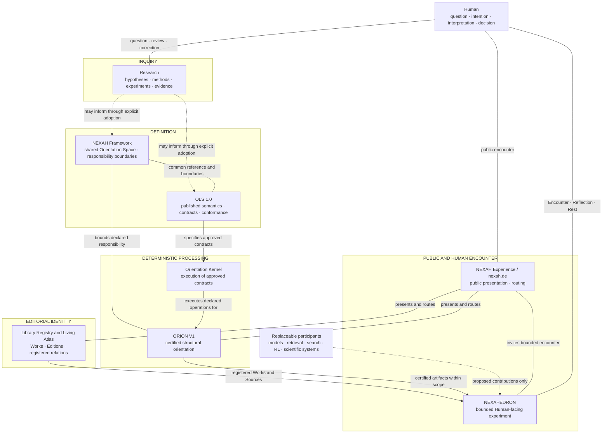

# NEXAH Research & Ecosystem Architecture

> **ADOPTED CROSS-REPOSITORY RESEARCH ARCHITECTURE**
>
> This document is canonical for the NEXAH research questions,
> cross-repository responsibilities, maturity/evidence and authority
> classification, Public Interface Mapping, and separation of verified state
> from open research horizon. It remains subordinate to the Constitution and
> does not acquire authority over another responsibility's artifacts.

**Status:** Adopted cross-repository Research & Ecosystem Architecture

**Decision state:** Adopted by explicit owner decision on 2026-07-30

**Scope:** Research, responsibility, authority, dependency, and public encounter

**Authority:** Canonical within its declared research-architecture scope;
subordinate to the NEXAH Ecosystem Constitution v1.0

**Checked repository snapshot:** See the Source and Status Ledger

**Decision:** [Adoption Decision Record](NEXAH_RESEARCH_ECOSYSTEM_ARCHITECTURE_ADOPTION_DECISION.md)

**Review lineage:** [Pre-adoption Authority-Conflict Review](reviews/NEXAH_RESEARCH_ECOSYSTEM_ARCHITECTURE_DRAFT_REVIEW.md)

**Date:** 2026-07-30

## 1. Purpose

This document assembles the research architecture of the NEXAH Orientation
Ecosystem across its maintained repositories and public surfaces.

It does not create a new constitutional House, scientific claim, semantic
authority, implementation, protocol version, certified capability, or product
promise. It makes the existing work legible as one open research program while
preserving the authority and limits of every contributing responsibility.

The document uses two independent axes. Neither axis substitutes for the
other.

### Axis A — Maturity and evidence status

| Maturity/evidence status | Meaning in this draft |
|---|---|
| **historical lineage** | preserved earlier work that explains development but does not define current authority |
| **active research** | current question, hypothesis, method, or investigation |
| **open research horizon** | justified future field of inquiry; neither implemented nor certified |
| **architecture draft** | proposed architecture without adopted authority |
| **adopted architecture** | architecture accepted by its competent authority; not evidence of implementation |
| **published specification** | released normative specification; not evidence that an implementation conforms |
| **implemented capability** | behavior present in the inspected implementation; not automatically validated or certified |
| **bounded experiment** | public or internal experiment with a declared scope; not a general product claim |
| **validated capability** | bounded behavior supported by declared verification; not automatically certified |
| **certified capability** | capability covered by an explicit immutable certification boundary |

### Axis B — Authority class

| Authority class | Owns | Does not follow from |
|---|---|---|
| **canonical governance** | adopted constitutional and governance rules | implementation maturity |
| **Human authority** | intention, interpretation, acceptance, Reflection, Rest, decision, effect approval | system output or fluency |
| **Research authority** | observations, hypotheses, methods, uncertainty, negative results | publication or implementation |
| **Framework authority** | shared Orientation Space, foundational structures, responsibility boundaries | execution |
| **semantic authority** | released OLS semantics, declarations, profiles, and conformance rules | code using the vocabulary |
| **deterministic execution authority** | execution of approved Kernel contracts | semantic, scientific, editorial, or Human authority |
| **certified orientation authority** | ORION artifacts and validation inside an explicit certified boundary | wider architecture or Runtime availability |
| **editorial identity authority** | Library Work, Edition, Registry, publication, and curated-relation identity | presentation or processing |
| **interaction authority** | NEXAHEDRON session interaction and Human-controlled interface state | ORION, Library, semantic, or Human authority |
| **presentation authority** | NEXAH Experience form, public explanation, and routing | ownership of the material presented |

An implemented capability may exercise only the authority granted by its
governing contract. Implementation never creates semantic, editorial,
certifying, evidential, or Human authority.

The architecture answers four questions:

1. What is the shared research question?
2. How did the present ecosystem emerge from the earlier research?
3. Which repository owns which part of the work?
4. How can the public encounter the research without mistaking an experiment
   for a finished product?

The adopted
[NEXAH Ecosystem Constitution v1.0](../GOVERNANCE/ECOSYSTEM_CONSTITUTION.md)
remains the highest **canonical governance** authority. The
[Repository Map](../REPOSITORY_MAP.md) remains the directory-level guide to the
central NEXAH repository. This document adds the cross-repository research
view; it replaces neither source.

## 2. Research Questions

### 2.1 Umbrella Orientation Research Question

**Maturity/evidence: active research**

**Authority: Research authority**

NEXAH investigates:

> How can Humans orient among heterogeneous, bounded representations of
> complex fields without collapsing their differences, provenance,
> uncertainty, or Human authority?

This question is broader than any single implementation or domain. It does not
assume that all domains share one mechanism, that every representation can be
translated without loss, or that orientation produces a correct decision.

This umbrella question follows the current Manifesto and Constitution. It does
not require an external intelligence system to be present. Sources, models,
maps, measurements, documents, and Human accounts can already create the
orientation problem.

The operative distinction is:

```text
information access
        ≠
orientation
        ≠
recommendation
        ≠
authorization
        ≠
execution
```

NEXAH investigates the middle responsibility: making position, perspective,
relationships, boundaries, uncertainty, and possible transitions inspectable
without silently acquiring the authority to interpret or decide for the Human.

### 2.2 Open Systems and Rails Research Question

**Maturity/evidence: open research horizon**

**Authority: Research authority**

Within that broader field, NEXAH also asks:

> How can heterogeneous knowledge and intelligence systems contribute to a
> shared Orientation Space through bounded, replaceable capabilities without
> transferring source, semantic, evidential, editorial, certified, or Human
> authority?

This subordinate question is supported by the Open Orientation Protocol and
accepted ORION architecture decisions. It is not made part of the umbrella
question because the Manifesto and Constitution define orientation more
generally, while replaceable intelligence is a specific protocol and systems
research problem.

## 3. Origin and Development Lines

**Maturity/evidence: historical lineage and active research**

**Authority: Research authority**

The current ecosystem grew through three connected research scales. Later
scales extend the field of inquiry; they do not invalidate the earlier work.

### 3.1 Structural navigation in dynamical systems

**Maturity/evidence: historical lineage and active research**

**Authority: Research authority**

The original NEXAH research asks how observed or simulated dynamics can be
reconstructed as structural fields, regime landscapes, transition corridors,
stability regions, and navigable paths.

This program includes:

- field and trajectory reconstruction;
- transition geometry and directional coherence;
- phase, mismatch, gates, apertures, and bottlenecks;
- JANUS investigations;
- state-space atlases and recovery paths;
- reinforcement-learning and multi-agent experiments over declared
  landscapes;
- Lorenz, IEEE, power-system, and other bounded application studies.

Primary repository sources:

- [`RESEARCH/RESEARCH_VISION.md`](../RESEARCH/RESEARCH_VISION.md)
- [`RESEARCH/RESEARCH_INDEX.md`](../RESEARCH/RESEARCH_INDEX.md)
- [`RESEARCH/CORE_CONCEPT_MAP.md`](../RESEARCH/CORE_CONCEPT_MAP.md)
- [`RESEARCH/README.md`](../RESEARCH/README.md)

Its current authority is local to its methods, experiments, evidence, and
declared limits. It does not establish a universal theory of orientation or a
general authorization to control real systems.

### 3.2 Orientation between representations

**Maturity/evidence: active research**

**Authority: Research authority**

The research expands from navigation within one reconstructed system to
orientation among multiple bounded representations.

A document, diagram, model, dataset, map, simulation, image, and Human account
may refer to the same field while revealing different structures and omitting
different details. NEXAH therefore studies how representations can be:

- identified and bounded;
- held in relation without conflation;
- compared with visible assumptions and loss;
- traced to their sources and versions;
- transformed only through declared operations;
- reviewed without converting interpretation into evidence.

This scale is expressed through the NEXAH Framework, Orientation Language,
Kernel, Applications, Library, Living Atlas, and Editorial Operating System.

### 3.3 Shared orientation with replaceable intelligence

**Maturity/evidence: open research horizon**

**Authority: Research authority**

The wider research horizon asks how Human inquiry, knowledge sources,
deterministic processors, retrieval systems, scientific tools, reasoning
models, and learning agents may participate in one bounded Orientation Space.

External systems are replaceable participants. They may calculate, retrieve,
compare, propose, or identify possible paths within declared capabilities.
They do not acquire source authority, semantic authority, Human meaning, or
permission to act.

This horizon is already supported architecturally by:

- the separation between the NEXAH Framework, Kernel, and ORION;
- immutable context and provenance requirements;
- capability-based backend decisions;
- Human approval and effect boundaries;
- the Open Orientation Protocol;
- the proposed adapter and contribution architecture.

It is not a claim that general model reasoning, provider-independent adapters,
LYRA execution, or autonomous learning participation are currently certified
or publicly implemented.

## 4. Research Thesis

**Maturity/evidence: active research**

**Authority: Research authority**

Across these scales, NEXAH explores one recurring proposition:

> Complexity becomes more navigable when representations, relationships,
> transitions, boundaries, and authority are made explicit.

The proposition is methodological, not ontological. Similar structures across
domains invite comparison and testing; they do not prove one universal cause
or one final map.

The research therefore favors:

- structure before unsupported interpretation;
- evidence before claims;
- explicit context before computation;
- declared capability before participation;
- provenance before fluency;
- visible uncertainty before false completion;
- Human review before authority-bearing effects;
- reproducibility before scale.

## 5. Today's Research Architecture

**Maturity/evidence: adopted architecture**

**Authority: canonical within the declared research-architecture scope**

The ecosystem is not one application and does not have one universal runtime.
It coordinates established responsibilities through explicit references and
boundaries.



This is a **nonlinear responsibility map**, not an execution pipeline, maturity
ladder, or authority hierarchy. Only the labeled relationship on each edge is
asserted. Research may inform adopted architecture or semantics but cannot
promote itself into either. The small OLS → Kernel → ORION chain is a bounded
contract dependency only. No arrow transfers authority.

### 5.1 Human

**Maturity/evidence: not applicable — constitutional role, not capability**

**Authority: Human authority, defined by canonical governance**

The Human originates or confirms the question and retains authority over
intention, interpretation, Reflection, acceptance, continuation, Rest, and
decision.

Human authority does not alter source evidence, certification, provenance, or
the recorded status of a system result.

### 5.2 Research

**Maturity/evidence: active research and historical lineage**

**Authority: Research authority**

Research owns questions, hypotheses, methods, experiments, observations,
uncertainty, negative results, and research provenance.

Research may inform Architecture, the Framework, Orientation Language,
implementations, and Applications. It becomes none of them automatically.

### 5.3 NEXAH Framework

**Maturity/evidence: adopted architecture; implementation maturity varies by
subsystem**

**Authority: Framework authority, defined by canonical governance**

The Framework defines the shared Orientation Space, foundational concepts,
responsibility boundaries, and common identity and reference principles.

It does not execute every method, validate every domain claim, interpret Human
meaning, or turn active Research into released semantics.

### 5.4 Orientation Language / OLS 1.0

**Maturity/evidence: published specification**

**Authority: semantic authority**

Orientation Language owns published semantics, declarations, contracts,
profiles, conformance, and versioning within its released scope.

An implementation using OLS terms does not thereby acquire semantic authority
or establish conformance.

### 5.5 Orientation Kernel

**Maturity/evidence: implemented capability**

**Authority: deterministic execution authority**

The Kernel executes approved deterministic contracts within its declared
version. Execution does not expand semantic or scientific authority.

### 5.6 ORION Version 1

**Maturity/evidence: certified capability inside Version 1; wider ORION work is
active research or open research horizon**

**Authority: certified orientation authority inside the explicit certificate**

ORION owns its deterministic context, registered paths, plans, artifacts,
validation, provenance, reports, and certification boundaries.

The frozen ORION Version 1 baseline currently certifies:

- Structural Representation;
- UNDERSTAND inventory, Structural Summary, and Structural Statistics;
- Relations;
- Navigation;
- Orientation Map;
- Expression and its certification chain.

Source: `NEXAH-ORION/docs/releases/ORION_V1_CERTIFIED_BASELINE.md` at the
verified ORION ref recorded in the Source and Status Ledger.

Runtime, Gateway, general reasoning, LYRA execution, semantic interpretation,
applications, and Human Reports are outside that certified baseline unless
separately implemented and verified under their own authority.

The **open research horizon** of the wider ORION architecture investigates
model-independent
orchestration above the deterministic Kernel:

```text
participant proposes
        ↓
ORION validates the declared operation and boundary
        ↓
Kernel executes only within its deterministic authority
        ↓
Human retains meaning and effect authority
```

This research horizon must remain visibly distinct from the certified
capability statement.

### 5.7 Replaceable participants

**Maturity/evidence: open research horizon**

**Authority: contribution authority only when a governing protocol grants it**

Models, retrieval systems, search systems, RL agents, databases, solvers, and
future intelligence systems may participate only through bounded,
versioned capabilities and explicit context.

They may return proposals or contributions. They may not:

- redefine the Human question silently;
- become the authority for a Source they received;
- convert confidence into evidence;
- modify canonical Kernel or ORION artifacts directly;
- act without the required Human and owning-system authority;
- hide model, method, context, or provenance where the governing contract
  requires them.

Provider names and current model families are implementation choices, not
architectural dependencies.

### 5.8 Library Registry and Living Atlas

**Maturity/evidence: implemented capability**

**Authority: editorial identity authority**

The Library owns Works, Editions, publication identity, metadata, series,
collections, and editorial provenance.

The Library Registry owns registered Work and Edition identity within its
declared editorial scope. The Living Atlas owns explicit, curated Relations
between registered Works, Concepts, Themes, and other referenced objects.

Neither becomes semantic authority, ORION navigation authority, or Human
interpretation through presentation or use.

### 5.9 NEXAHEDRON

**Maturity/evidence: implemented capability and bounded experiment**

**Authority: interaction authority**

NEXAHEDRON is the experimental Human-facing Workspace and reference
implementation. It makes bounded Orientation Sessions publicly experienceable.

It owns:

- presentation and interaction;
- transient local session state;
- Encounter and fragment handling within its accepted contracts;
- faithful display of upstream artifacts;
- the Human-controlled path to Reflection and Rest.

It does not own Research, Orientation Language semantics, Library evidence,
ORION behavior, model reasoning, or Human meaning.

NEXAHEDRON is a research demonstrator, not proof that the full NEXAH research
horizon has been implemented and not a general promise to answer arbitrary
questions.

Sources:

- `NEXAHEDRON/docs/architecture/APPLICATION_ARCHITECTURE.md`
- `NEXAHEDRON/docs/architecture/AUTHORITY_BOUNDARIES.md`
- `NEXAHEDRON/MANIFESTO.md`

### 5.10 NEXAH Experience and nexah.de

**Maturity/evidence: implemented capability**

**Authority: presentation authority**

NEXAH Experience owns the public and intellectual entrance at `nexah.de`.

It introduces the research, presents the Library and Living Atlas, explains
boundaries, and routes visitors to the responsible repository or application.
It does not acquire the authority of the material it presents.

Its public ecosystem map is a visitor-navigation view. This document is the
research-architecture view. Both refer to the same responsibilities at
different levels of detail.

Source: `NEXAH-Experience/README.md` at the verified Experience ref recorded in
the Source and Status Ledger.

## 6. The Methodological Rails

**Maturity/evidence: active research and open research horizon**

**Authority: no new authority; each rail retains its owning authority**

“Rails” is the collective name for controls that keep participation bounded
and inspectable. It is not a new constitutional House, a single service, or a
claim that reasoning becomes scientifically correct merely by passing through
ORION.

The rails are distributed across existing responsibilities:

| Rail | Owning authority |
|---|---|
| Human question and disclosed intention | Human |
| Source and Edition identity | Source owner / Library |
| Bounded, versioned context | governing context contract |
| Published semantics and permitted operations | Orientation Language |
| Deterministic execution and invariants | Kernel |
| Registered navigation, validation, reports, and STOPs | ORION |
| Participant capability and adapter boundary | governing protocol / adapter contract |
| Evidence and provenance chain | owning source, Research, Library, and executing contract |
| Acceptance and effect approval | Human and the authority that owns the affected artifact |
| Immutable record and replay | the system that owns the resulting record |

The rails can improve traceability, comparability, reproducibility, and
responsibility. They cannot by themselves guarantee truth, scientific
validity, fair judgment, or a good Human decision.

## 7. Repository Responsibilities

**Maturity/evidence: adopted architecture**

**Evidence basis: adopted architecture, published specifications, implemented
capabilities, and certified capability**

**Authority: canonical repository-role mapping; ownership remains with each
named responsibility**

| Repository or surface | Primary responsibility | Owned outputs | Explicit non-responsibility |
|---|---|---|---|
| `Scarabaeus1031/NEXAH` | central Research & Framework repository | Research, Framework architecture, Orientation Language, Kernel implementation, Applications, Governance, Library Registry | public website presentation, ORION certification, NEXAHEDRON interaction |
| `Scarabaeus1031/NEXAH-ORION` | deterministic orientation and navigation | certified artifacts, contracts, proofs, and reports within verified scope | Framework semantics, Library identity, Human interpretation, public Experience |
| `Scarabaeus1031/NEXAHEDRON` | experimental Human-facing reference Workspace | session interaction, Encounter presentation, Human-controlled Reflection and Rest, faithful upstream presentation | ORION behavior, evidence authority, general reasoning authority, Human meaning |
| `Scarabaeus1031/NEXAH-Experience` | public and intellectual entrance | `nexah.de`, Visitor Guide, public Library and Atlas presentation, ecosystem routes | Research ownership, semantic authority, certification, Human interpretation |
| Are.na NEXAH Library | live visual publication and browsing surface | public visual source arrangement | canonical NEXAH Registry, OLS semantics, ORION validation |

The central NEXAH repository is the appropriate location for this draft because
it owns the shared Framework and common Orientation Space. Placement alone
does not make the draft canonical. Centrality does not make NEXAH the owner of
every artifact.

## 8. Authority and STOP Boundaries

**Maturity/evidence: adopted architecture, published specification,
implemented capability, and certified capability**

**Authority: canonical governance and the distinct authority class named in
each row**

The following is **document and adoption precedence only**:

```text
Constitution
    ↓
Governance
    ↓
Architecture
    ↓
Framework and published semantics
    ↓
bounded implementations and processors
    ↓
applications and public presentation
    ↓
Human encounter, review, and feedback
```

It is not a Runtime pipeline, data flow, maturity ladder, or transfer of
authority between the listed layers.

Additional rules:

1. A downstream repository may reference an upstream artifact but may not
   redefine it.
2. Public presentation may simplify language but must preserve identity,
   status, provenance, uncertainty, and boundaries.
3. Research hypotheses do not become Framework or OLS authority without the
   applicable adoption process.
4. An implementation does not become conformant because it uses familiar
   terminology.
5. ORION may not reproduce missing Framework, Kernel, Library, or Human
   authority as a convenience.
6. NEXAHEDRON may not manufacture an ORION result, Evidence Reference,
   relationship, or continuation.
7. External participants remain replaceable and non-authoritative.
8. Failure, unknown capability, missing provenance, and unsupported
   transitions fail visibly.

### 8.1 Authority boundaries

| Responsibility | Authority class | May authorize | Must STOP before |
|---|---|---|---|
| Human | Human authority | intention, acceptance, interpretation, decision, continuation, Rest | altering immutable evidence or certification retrospectively |
| Research | Research authority | hypotheses, methods, experiment scope, evidence statements | released semantics, certification, public authority claims |
| Framework | Framework authority | shared concepts, responsibility boundaries, reference principles | executing every method or deciding Human meaning |
| OLS 1.0 | semantic authority | released semantics, declarations, profiles, conformance rules | Runtime behavior, domain truth, Human interpretation |
| Kernel | deterministic execution authority | deterministic execution inside an approved contract | undeclared operations, semantic expansion, external effects |
| ORION V1 | certified orientation authority | artifacts and validation inside its certified boundary | interpretation, recommendation, Human Reports, effects, wider research horizon |
| Library Registry | editorial identity authority | Work and Edition identity, registered editorial metadata and provenance | semantic truth, ORION navigation, Human interpretation |
| Living Atlas | editorial identity authority | explicit curated relations within registered scope | inferred semantic or ORION relations |
| NEXAHEDRON | interaction authority | presentation, interaction, transient session handling | inventing upstream artifacts, deciding for the Human |
| NEXAH Experience | presentation authority | public presentation and routing | acquiring Research, Library, ORION, or Human authority |
| External participant | contribution authority only when granted | a contract-valid proposed contribution | acceptance, canonical mutation, execution, hidden authority |

### 8.2 Certified STOPs

The ORION Version 1 certified STOPs remain exactly as recorded by ORION. This
draft neither renames them nor extends execution beyond them. In particular,
the certified Version 1 terminal boundary remains `at_slice_iv_certified`.

Any Runtime, Gateway, adapter, reasoning, LYRA, SIRIUS, or application work is
outside that frozen certification unless ORION records a separate,
non-retroactive certification. This statement preserves rather than modifies
the Version 1 scope.

## 9. Current Verified State

| Area | Verified state | Maturity/evidence status | Authority class | Evidence |
|---|---|---|---|---|
| NEXAH governance | Ecosystem Constitution v1.0 is adopted and remains highest authority | adopted governance | canonical governance | `GOVERNANCE/ECOSYSTEM_CONSTITUTION.md` |
| Human | final interpretation, Reflection, Rest, decision, and effect approval remain Human | not a capability claim | Human authority | `GOVERNANCE/ECOSYSTEM_CONSTITUTION.md` |
| NEXAH Framework | common Orientation Space and responsibility boundaries are adopted responsibilities | adopted architecture; implementation maturity varies | Framework authority | `GOVERNANCE/ECOSYSTEM_CONSTITUTION.md`, `ARCHITECTURE/README.md` |
| OLS 1.0 | immutable Version 1.0 publication is the current released semantic authority | published specification | semantic authority | `ORIENTATION_LANGUAGE/README.md`, `ORIENTATION_LANGUAGE/SPECIFICATION/RELEASES/OLS-RELEASE-1.0.0/RELEASE_MANIFEST.md` |
| Orientation Kernel | maintained implementation track; maturity distinct from OLS authority and ecosystem certification | implemented capability | deterministic execution authority | `nexah/README.md`, `ARCHITECTURE/SYSTEM_STATE.md` |
| ORION Version 1 | Structural Representation through certified Expression and Slice IV certification | certified capability | certified orientation authority inside `at_slice_iv_certified` | `NEXAH-ORION/docs/releases/ORION_V1_CERTIFIED_BASELINE.md` |
| Library Registry | canonical Library identity layer is implemented and Human-reviewed | implemented capability | editorial identity authority | `LIBRARY/README.md`, `LIBRARY/registry/registry.yaml` |
| NEXAHEDRON | Human-facing reference Workspace with bounded sessions | implemented capability and bounded experiment | interaction authority | `NEXAHEDRON/docs/architecture/APPLICATION_ARCHITECTURE.md` |
| NEXAH Experience | public and intellectual entry at `nexah.de` | implemented capability | presentation authority | `NEXAH-Experience/README.md` |
| Wider participant architecture | replaceable model, search, retrieval, solver, and RL participation | open research horizon | contribution authority only when granted | ORION accepted ADRs and NEXAHEDRON protocol research, as scoped in the ledger |

The verified repository refs are not a claim that all repositories form one
atomic release. Dirty working trees and branch divergence are recorded rather
than hidden in the Source and Status Ledger.

### 9.1 Maturity and evidence rules

Every public or repository-level statement should identify which status it
describes:

| Status | Meaning |
|---|---|
| Research question | what is being investigated |
| Working hypothesis | a proposed explanation or mechanism under test |
| Experimental evidence | an observation within declared inputs and conditions |
| Implemented capability | behavior present in a maintained implementation |
| Validated capability | a bounded claim supported by declared verification |
| Certified capability | an immutable responsibility and proof chain certified within an explicit boundary |
| Public experiment | an experience made available for Human evaluation |
| Research horizon | a justified direction that is not claimed as current capability |

No status silently implies another.

No maturity status grants an authority class. Authority must always be traced
to the governing document or contract that assigns it.

In particular:

```text
research vision
        ≠
implemented capability
        ≠
certified capability
        ≠
public product promise
```

## 10. Open Research Horizon

**Maturity/evidence: open research horizon**

**Authority: Research authority; possible participants receive contribution
authority only through future governing contracts**

The next field of inquiry is not “more answers from one model.” It is whether
heterogeneous participants can contribute within one inspectable Orientation
Space while preserving:

- source and representation identity;
- bounded context and declared lossiness;
- replaceable participants;
- method and capability disclosure;
- explicit evidence and uncertainty;
- deterministic validation where applicable;
- complete provenance;
- Human acceptance and effect authority.

This horizon includes research on model-, retrieval-, search-, solver-, and
RL-participation, but claims none of them as a present certified NEXAH or ORION
capability.

LYRA, SIRIUS, autonomous agents, semantic reasoning, knowledge synthesis,
learning systems, and application effects remain outside current certified
ORION Version 1 unless separately defined, implemented, validated, and
certified in the future.

## 11. Historical Continuity

**Maturity/evidence: historical lineage**

**Authority: Research authority within the original evidence scope**

The following ideas remain continuous across the repository history:

- complex fields should be made navigable rather than reduced to one answer;
- structural relationships and transitions matter;
- representations are bounded;
- paths require frames, context, and declared constraints;
- differences and uncertainty carry information;
- deterministic structure enables inspection and replay;
- intervention or action requires authority beyond a map;
- Human interpretation and responsibility must remain explicit.

The scope has matured:

- from navigation inside reconstructed dynamical landscapes;
- to navigation among heterogeneous representations;
- to a shared Orientation Space in which different systems may participate
  without silently receiving authority.

This is an expansion of the research object, not evidence that one mechanism
has already generalized across all three scales.

## 12. Public Interface Mapping

**Maturity/evidence: implemented capability and bounded experiment**

**Authority: presentation authority and interaction authority remain distinct**

The public ecosystem should invite participation in research rather than
present a finished universal product.

The public roles are:

```text
nexah.de
→ understand the question and choose an entrance

NEXAH Repository
→ inspect Research, Framework, semantics, evidence, and history

ORION Repository
→ inspect deterministic contracts, certified capabilities, and proofs

NEXAHEDRON
→ experience one bounded Human-facing experiment
```

NEXAHEDRON should disclose:

- what experiment the visitor is entering;
- what material and capabilities are actually available;
- what the Human must contribute;
- what ORION can and cannot currently return;
- which result is Human-authored, curated, generated, validated, or certified;
- where the session may end without further execution.

The invitation is not to consume an answer. It is to inspect, test, challenge,
and improve the conditions under which orientation may become possible.

## 13. Participation Paths

**Maturity/evidence: active research and open research horizon**

**Authority: each contribution enters through its existing owning authority**

Contributions should enter through the owner of the relevant responsibility:

| Contribution | Entry point |
|---|---|
| hypothesis, experiment, counterexample, or validation | NEXAH Research |
| semantic or conformance proposal | Orientation Language governance |
| deterministic navigation capability or proof | ORION governance |
| Library Work, Edition, or editorial relation | Library / Living Atlas governance |
| Human-interface experiment or usability evidence | NEXAHEDRON |
| public explanation or visitor navigation | NEXAH Experience |
| provider or model participation proposal | applicable protocol and adapter governance |

The ecosystem seeks disagreement that is traceable, experiments that can fail,
and improvements that preserve responsibility.

## 14. Non-claims

**Document constraint: these are non-claims, not capabilities**

This architecture does not establish:

- a universal scientific theory;
- a single mechanism shared by every domain;
- a general-purpose AI assistant;
- an autonomous decision or control system;
- an authority-bearing knowledge graph;
- one global NEXAH runtime;
- provider-specific model dependence;
- automatic publication or Library mutation;
- automatic scientific validity;
- a production promise for NEXAHEDRON;
- an implementation roadmap.

It also does not merge repositories or transfer any existing certified,
semantic, editorial, evidential, or Human authority.

## 15. Source and Status Ledger

This ledger records the exact repository states inspected for
cross-repository claims. A commit ref identifies a reproducible source
snapshot; it does not claim that the repositories form one synchronized
release.

### 15.1 Verified repository refs

| Repository | Branch and checked commit | Working-tree state at review | Use in this draft |
|---|---|---|---|
| `Scarabaeus1031/NEXAH` | `main` · `55908c92babc5fbe156d23618dac6a430fac36c3` | clean before the Draft; the local uncommitted lineage now contains Draft, review, Adoption Decision, fingerprint manifest, adopted architecture, and three index links | governing, research, Framework, repository-map, and system-state sources |
| `Scarabaeus1031/NEXAH-ORION` | `codex/orion-orientation-operators` · `d34fbb2f99334534f4db89465a29f8bdb16d14d3` | dirty with unrelated ongoing Runtime/architecture work; every source path cited below matched the checked commit | frozen Version 1 baseline, system plate, core architecture, accepted ADRs |
| `Scarabaeus1031/NEXAHEDRON` | `main` · `f8bb17eb2603e86f49c2cf29c8e5561210a12103` | branch eight commits ahead of `origin/main`; `vite.config.ts` modified; every cited architecture, manifesto, paper, and RFC path matched the checked commit | Workspace role, authority boundaries, protocol research |
| `Scarabaeus1031/NEXAH-Experience` | `main` · `7473736ff5e6077fda41e7302b041e79e57673e3` | dirty with unrelated public-site work; cited `README.md` matched the checked commit | public and intellectual entrance role |

No file in ORION, NEXAHEDRON, or NEXAH Experience was modified by creation of
this draft.

### 15.2 Governing and current NEXAH sources

| Source role | Repository path | Supports |
|---|---|---|
| canonical governance | `GOVERNANCE/ECOSYSTEM_CONSTITUTION.md` | Houses, authority, provenance, deterministic execution, Human authority, document precedence |
| canonical governance index | `GOVERNANCE/README.md` | adopted governance entry point and authority order |
| current repository navigation | `REPOSITORY_MAP.md` | NEXAH directory map and reader entry points; supplemented, not replaced |
| current repository architecture | `ARCHITECTURE/README.md` | six coordinated responsibilities and architecture subordination |
| current implementation state | `ARCHITECTURE/SYSTEM_STATE.md` | implemented and non-implemented NEXAH capabilities |
| published semantic specification | `ORIENTATION_LANGUAGE/README.md` | OLS 1.0 publication identity and semantic authority |
| published semantic manifest | `ORIENTATION_LANGUAGE/SPECIFICATION/RELEASES/OLS-RELEASE-1.0.0/RELEASE_MANIFEST.md` | immutable OLS 1.0 release unit |
| implemented Kernel entry point | `nexah/README.md` | maintained deterministic implementation and its declared limits |
| editorial architecture and Registry | `LIBRARY/README.md` | Library Registry identity, Human review, and editorial authority |
| current Registry artifact | `LIBRARY/registry/registry.yaml` | implemented canonical Registry index within Library scope |

### 15.3 Research and lineage sources

| Maturity/evidence | Repository path | Supports |
|---|---|---|
| active research | `RESEARCH/README.md` | current Research responsibility and evidence boundaries |
| active research / historical lineage | `RESEARCH/RESEARCH_INDEX.md` | research chronology and navigation |
| active research | `RESEARCH/RESEARCH_VISION.md` | bounded transition-geometry research program |
| historical lineage / concept continuity | `RESEARCH/CORE_CONCEPT_MAP.md` | regimes, transitions, gates, JANUS, evidence chain |
| current public identity | `MANIFESTO.md` | NEXAH purpose and Human-first limits |

The Research Vision and Research Navigation Index describe the bounded
transition-geometry program. They do not alone define the identity or
architecture of the complete ecosystem.

### 15.4 Research-question review

The two-question structure is based on scope, not wording preference:

| Source | Finding | Architectural consequence |
|---|---|---|
| `MANIFESTO.md` | defines the primary problem as Human orientation among heterogeneous bounded representations | umbrella question remains valid without an intelligence system |
| `GOVERNANCE/ECOSYSTEM_CONSTITUTION.md` | defines Human, Framework, Research, OLS/Kernel, ORION, Library, Experience, and their authority boundaries | umbrella question must preserve Human authority and responsibility separation |
| `RESEARCH/RESEARCH_VISION.md` | defines a bounded transition-geometry program inside complex dynamical systems | preserved as active research and historical lineage, not promoted to the whole ecosystem identity |
| `NEXAHEDRON/docs/rfcs/RFC-0001_OPEN_ORIENTATION_PROTOCOL.md` | defines cooperation among Humans, Sources, kernels, applications, and replaceable external participants | supports the subordinate Open Systems and Rails question |

Therefore “heterogeneous intelligence systems” is not a prerequisite of the
umbrella Orientation Research Question. It belongs explicitly to the
subordinate Open Systems and Rails Research Question.

### 15.5 ORION sources

All paths below were inspected at ORION commit
`d34fbb2f99334534f4db89465a29f8bdb16d14d3` and were unchanged in its dirty
working tree:

| Maturity/evidence | Repository path | Authority relevance |
|---|---|---|
| certified capability | `docs/releases/ORION_V1_CERTIFIED_BASELINE.md` | frozen certified Version 1 scope and STOP |
| certified architecture summary | `docs/architecture/ORION_SYSTEM_PLATE.md` | Representation-to-Expression assembly and boundary |
| current ORION architecture | `docs/architecture/ORION_ARCHITECTURE.md` | ORION responsibility and separation from Runtime/Application |
| accepted architecture decision | `docs/adr/0001-orion-above-kernel.md` | ORION above the deterministic Kernel |
| accepted architecture decision | `docs/adr/0004-immutable-context-manifest.md` | immutable context and provenance |
| accepted architecture decision / open horizon | `docs/adr/0005-capability-based-reasoning-backends.md` | replaceable capability-based reasoning participants |
| accepted architecture decision / authority | `docs/adr/0006-human-approval-and-effect-classes.md` | Human approval and bounded effects |

The accepted ADRs justify an architecture direction. They do not expand the
frozen ORION Version 1 certification.

### 15.6 NEXAHEDRON sources

All paths below were inspected at NEXAHEDRON commit
`f8bb17eb2603e86f49c2cf29c8e5561210a12103` and were unchanged in its working
tree:

| Maturity/evidence | Repository path | Authority relevance |
|---|---|---|
| implemented architecture | `docs/architecture/APPLICATION_ARCHITECTURE.md` | Workspace responsibility and application boundary |
| authority definition | `docs/architecture/AUTHORITY_BOUNDARIES.md` | Human, Library, ORION, and Workspace separation |
| bounded experiment identity | `MANIFESTO.md` | Human-facing intent and non-authority |
| architecture specification / active research | `docs/rfcs/RFC-0001_OPEN_ORIENTATION_PROTOCOL.md` | participant and contribution protocol research |
| active research | `docs/papers/THE_OPEN_ORIENTATION_PROTOCOL_POSITION_PAPER.md` | open orientation and replaceable-system motivation |

### 15.7 NEXAH Experience source

`NEXAH-Experience/README.md` was inspected at commit
`7473736ff5e6077fda41e7302b041e79e57673e3` and matched the working tree. It
supports the role of NEXAH Experience as the public presentation layer and
explicitly denies ownership of Research, ORION, NEXAHEDRON, Library authority,
and Human interpretation.

### 15.8 Axis separation

Authority and maturity do not form one ladder:

```text
AUTHORITY AXIS
canonical governance constrains every responsibility
each responsibility retains its distinct authority class
authority never follows data flow or implementation maturity

MATURITY / EVIDENCE AXIS
historical lineage · active research · open research horizon
architecture draft · adopted architecture · published specification
implemented capability · bounded experiment · validated capability
certified capability
```

The second line is a vocabulary, not a claim that every artifact follows one
linear lifecycle. In particular:

- OLS 1.0 semantic authority comes from its released specification, not from a
  Kernel implementation;
- Library Registry editorial authority comes from its Human-reviewed Library
  contract, not from public presentation;
- ORION V1 certification does not give it Framework, OLS, Library, Experience,
  or Human authority;
- an implemented NEXAHEDRON or Experience surface does not become evidence,
  semantics, certification, or interpretation.

Each source remains authoritative only within its owning repository and
declared scope.

## 16. Adoption and Change Control

This architecture was adopted by explicit owner decision on 2026-07-30 after:

1. complete Draft review;
2. repository-ref and source verification;
3. separation of maturity/evidence status from authority class;
4. ORION Version 1 scope verification;
5. Authority-Conflict Review;
6. explicit acceptance of all four adoption questions.

The [Adoption Decision Record](NEXAH_RESEARCH_ECOSYSTEM_ARCHITECTURE_ADOPTION_DECISION.md)
defines the adopted scope, explicit non-authority, lineage, and future change
control.

Later changes to Research Questions, repository responsibilities, authority
classes, Public Interface Mapping, or the Current State / Research Horizon
boundary require a new reviewed architecture decision. Adoption does not
permit silent reinterpretation.

## 17. Final Principle

NEXAH is not one model, one map, one repository, or one application.

It is an open research ecosystem investigating how complex fields can become
navigable while their evidence, differences, uncertainty, and authority remain
visible.

ORION provides certified deterministic structural rails within its frozen
Version 1 scope. Wider methodological orchestration remains an open research
horizon.

NEXAHEDRON makes bounded experiments Human-facing.

The Library preserves encounter and provenance.

NEXAH Experience makes the work publicly navigable.

The Human remains the interpreter and final authority.
