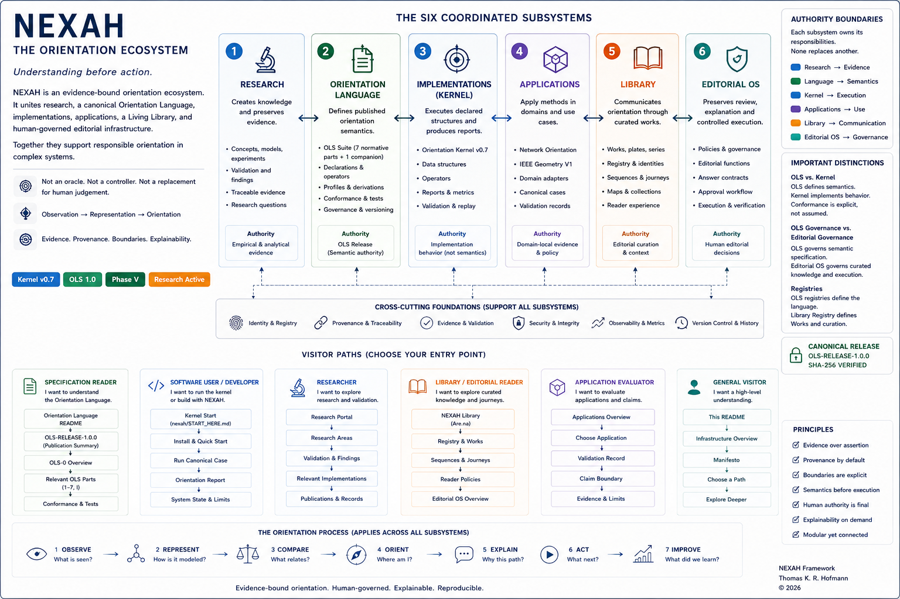
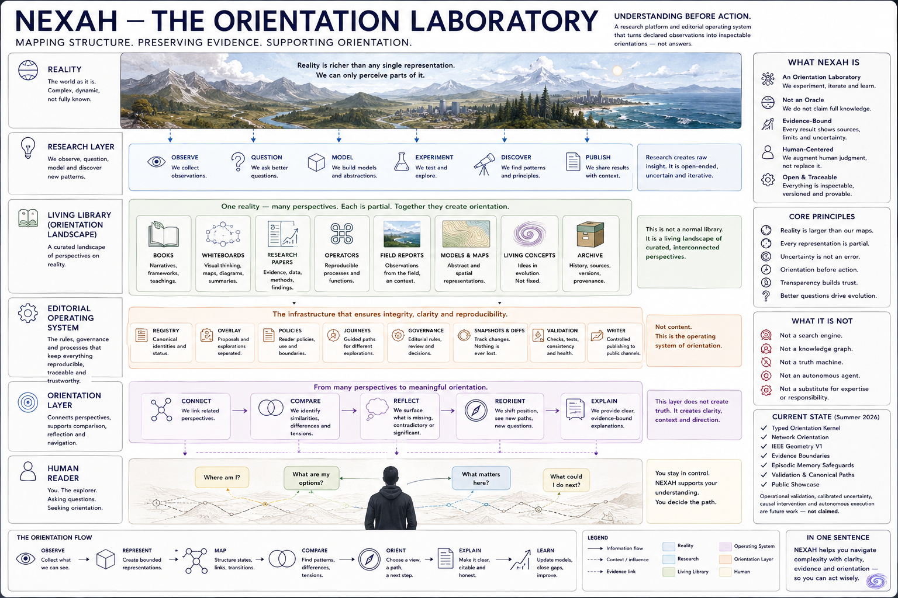
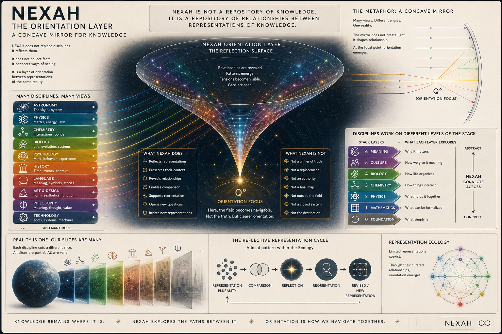

# 🏗️ NEXAH — Architecture

This directory explains how the current NEXAH repository is organized, how its
six coordinated subsystems relate, and which parts are actually implemented.

At repository level, NEXAH is an **evidence-bound orientation ecosystem**. It
does not have one unified runtime architecture. Its current architecture keeps
six responsibilities distinct:

- Research produces hypotheses, models, experiments, and bounded evidence.
- Orientation Language defines published semantics and conformance rules.
- Implementations execute declared structures and produce inspectable behavior.
- Applications apply methods within explicit domain and claim boundaries.
- The Living Library communicates curated knowledge and reader journeys.
- The Editorial Operating System preserves human review and controlled execution.



> **Primary repository architecture map.** The six subsystems coordinate
> without sharing one authority. The diagram is informative: it is not a
> capability claim, an OLS conformance statement, or evidence that every
> depicted function exists in one integrated runtime.



> **Implementation-oriented secondary view.** This visual emphasizes research,
> representation, validation, and human orientation. It remains useful, but it
> does not replace the six-subsystem responsibility map above.

---

## 🧭 Start Here

| Question | Document |
|---|---|
| Which subsystem owns which responsibility? | **[Repository Front Door](../README.md)** |
| What is the canonical semantic authority? | **[Orientation Language](../ORIENTATION_LANGUAGE/README.md)** |
| What is actually implemented? | **[SYSTEM_STATE.md](SYSTEM_STATE.md)** |
| Which visuals describe current state or research models? | **[Architecture Visuals](visuals/README.md)** |
| How do editorial knowledge, orientation, governance, and execution connect? | **[Editorial Operating System](../EDITORIAL_OPERATING_SYSTEM/README.md)** |
| How are reviewed Concept answers reproduced without inference? | **[Editorial Explanation Layer — Plateau X2](../EDITORIAL_OPERATING_SYSTEM/EDITORIAL_EXPLANATION_LAYER_STATUS.md)** |
| Is there a compact visual blueprint? | **[System Blueprint and Verified Results](../EDITORIAL_OPERATING_SYSTEM/visuals/snapshots/2026-07-16_pre_batch_1/system_blueprint_and_verified_results.png)** |
| Which computational methods are used? | **[METHODS.md](METHODS.md)** |
| Where are completed repository-architecture reviews preserved? | **[Architecture Reviews](reviews/)** |
| What is the next concrete architecture plan? | **[Orientation Layer](orientation_layer/)** |
| Where is the frozen Phase V IEEE Geometry architecture record? | **[IEEE Geometry Testkit](orientation_layer/PHASE_V_IEEE_GEOMETRY_TESTKIT.md)** |
| What has been completed before Phase III? | **[Plateau A Closure](orientation_layer/PLATEAU_A_CLOSURE.md)** |
| How do repository areas relate? | Continue with this page |
| What can I run now? | **[NEXAH Demonstrator](../PROTO_CORE/NEXAH_DEMONSTRATOR/)** |
| Where is the empirical evidence? | **[Validation Portal](../RESEARCH/VALIDATION/)** |

`SYSTEM_STATE.md` is the source of truth for implementation maturity and known
limitations. Conceptual diagrams should not be read as proof that every layer
exists as an integrated software component.

---

## 🧭 Repository-Wide Orientation Architecture

The stable architectural frame is not a single pipeline or application. It is
the coordination of six complementary responsibilities:

```text
RESEARCH LABORATORY
→ creates observations, methods, experiments, and bounded evidence

ORIENTATION LANGUAGE
→ defines published semantics, declarations, profiles, and conformance

IMPLEMENTATIONS
→ execute declared structures and create inspectable behavior

APPLICATIONS
→ apply methods within declared domain and evidence boundaries

LIVING LIBRARY
→ creates human encounter, editorial sequence, and navigable Works

EDITORIAL OPERATING SYSTEM
→ preserves identity, provenance, review, governance, and controlled execution
```

Their shared orientation movement is:

```text
observe
→ represent
→ compare
→ reflect
→ orient
→ explain
→ human review
```

This architecture does not combine all representations into one account. It
keeps their evidence, context, and boundaries visible while making their
relationships and possible transitions easier to navigate.

This sequence expresses repository-level orientation vocabulary rather than a
canonical workflow requirement. The
**[Orientation Translation](../APPLICATIONS/orientation_translation/)** corpus
investigates a related published process as non-canonical application and
methodological evidence. **[Meta Review 01](../APPLICATIONS/orientation_translation/reviews/meta_review_01/META_REVIEW_REPORT.md)**
and **[Method Archaeology 01](../APPLICATIONS/orientation_translation/studies/method_archaeology_01/STUDY_REPORT.md)**
preserve template effects, local asymmetries, and untested reader benefit; they
do not redefine Architecture, Orientation Language semantics, or a mandatory
method sequence.

---

## 🧭 Project-Wide Editorial Architecture

The **[NEXAH Editorial Operating System](../EDITORIAL_OPERATING_SYSTEM/README.md)**
describes the project-wide coordination layer connecting editorial knowledge,
reader context, the Orientation Kernel, human authority, controlled public
execution, and verification.

Its dated
**[System Blueprint and Verified Results](../EDITORIAL_OPERATING_SYSTEM/visuals/snapshots/2026-07-16_pre_batch_1/system_blueprint_and_verified_results.png)**
provides the compact visual summary:

```text
Are.na + GitHub
→ Registry + Proposal
→ Reader Policies + Journeys
→ Orient + Explain
→ Human Approval
→ Safe Write
→ Snapshot + Diff
```

The image is a whiteboard summary and evidence snapshot, not a substitute for
`SYSTEM_STATE.md`, the frozen Library Architecture, or validation artifacts.
The binary lives once under `EDITORIAL_OPERATING_SYSTEM/`; this Architecture
portal links to it rather than maintaining a duplicate copy.

Phase X2 adds a bounded explanation architecture:

```text
Works
→ Living Concepts
→ accepted Editorial Knowledge Contracts
→ read-only Concept Answer Adapter
→ Reader or Explain response
```

See the maintained
**[Editorial Explanation Layer status](../EDITORIAL_OPERATING_SYSTEM/EDITORIAL_EXPLANATION_LAYER_STATUS.md)**
and its
**[current architecture visual](../EDITORIAL_OPERATING_SYSTEM/visuals/architecture/editorial_explanation_layer.png)**.
This remains separate from the default Orientation Kernel runtime and does not
implement a production Concept Graph.

---

## 🧠 Conceptual Architecture



> **Research model.** The concave-mirror visual presents a hypothesis about
> orientation emerging through comparison and reflection across bounded
> representations. It is not a canonical ontology, a hierarchy of truth, or a
> claim that every discipline can be reduced to one stack.

The working NEXAH research pipeline is:

```text
dynamics
→ structure extraction
→ field reconstruction
→ geometric interpretation
→ stability and transition analysis
→ experimental control
→ exploratory navigation
```

An extended research model also investigates constraint behavior:

```text
geometry
→ observed admissible motion
→ candidate constraints
→ structure-aware intervention
```

This constraint layer is a hypothesis derived from experiments in which local
perturbations were absorbed and trajectories returned toward recurring
structure. It is not yet a formal manifold model or an implemented standalone
layer.

.png>)

This historical diagram is retained as a conceptual map of an earlier
development stage. Some labels do not correspond directly to current root
directories.

---

## 🛠️ Implemented Repository Architecture

```text
NEXAH/
├── RESEARCH/                       hypotheses, experiments, evidence, findings
├── ORIENTATION_LANGUAGE/           canonical OLS specification and releases
├── nexah/                          maintained implementation and CLI
├── APPLICATIONS/                   domain and use-case realizations
├── LIBRARY/                        Works, Editions, sequences, reader journeys
├── EDITORIAL_OPERATING_SYSTEM/     review, explanation, governance, execution
├── PROTO_CORE/
│   ├── NEXAH_DEMONSTRATOR/         verified reference pipeline
│   ├── FIELD_LAYER/                experimental methods laboratory
│   └── NEXAH_CORE/                 legacy development lineage
├── ARCHITECTURE/CORE/
│   ├── field_reconstruction/       experimental reconstruction studies
│   └── control_layer/              experimental control prototypes
├── testkit/                        reusable evidence and outcome gates
└── EXPERIMENTAL/                   labs and historical prototypes
```

Completed reviews that assess repository narrative or placement without
changing architecture are preserved under [`reviews/`](reviews/).

There are no current root modules named `ARCHY`, `DISCOVERY_ENGINE`,
`FIELD_LAYER`, or `NAVIGATOR`. Those names describe earlier or conceptual
components and should be interpreted through the current paths above.

---

## 📊 Component Status

| Component | Current implementation | Status |
|---|---|---|
| Trajectory analysis | Demonstrator, package, research scripts | Implemented in multiple forms |
| Transition representation | Demonstrator and experimental pipelines | Empirical / demonstrator-level |
| Field reconstruction | Proto Core and Architecture prototypes | Experimental |
| Gate Operator | Demonstrator and historical experiments | Implemented as local-instability measure |
| Geometry extraction | Field and application scripts | Experimental, representation-dependent |
| Control | Prototype scripts and application experiments | Experimental |
| Navigation | Demonstrator and several prototype lines | Exploratory |
| Constraint layer | Observed absorption/re-alignment behavior | Theoretical interpretation of experiments |
| Unified runtime kernel | Not available | Open work |
| Stable cross-module API | Not available | Open work |

---

## 🧪 Verified Reference Path

The most reliable end-to-end implementation is the
**[NEXAH Demonstrator](../PROTO_CORE/NEXAH_DEMONSTRATOR/)**:

```text
trajectory simulation
→ transition structure
→ continuous instability field
→ navigation behavior
→ generated outputs
```

The Demonstrator establishes a shared reference for discussing implementation
behavior. It does not validate every broader architectural claim.

---

## 🌊 Experimental Architecture Modules

### Field Reconstruction

**[ARCHITECTURE/CORE/field_reconstruction/](CORE/field_reconstruction/)**
contains visual and computational studies of:

- trajectory-to-field reconstruction
- boundaries and stability masks
- flow channels
- frame and noise sensitivity
- target-guided navigation prototypes

Its strongest architectural contribution is the explicit distinction between
well-supported regions and interpolation-dominated regions.

### Control Layer

**[ARCHITECTURE/CORE/control_layer/](CORE/control_layer/)** contains prototypes
for:

- basin and separatrix extraction
- gate-field analysis
- trajectory steering
- gate tracking and routing
- adaptive and multi-agent navigation

These scripts demonstrate possible interactions with reconstructed geometry.
They do not establish general controllability or a production control layer.

---

## 🪞 Current Gate Interpretation

Later Demonstrator experiments refined the Gate Operator interpretation:

```text
Gate Operator G(x)
→ continuous local-instability field

Structural transition
→ discrete change in a trajectory-derived representation
```

High instability can interact with transition behavior, but the Gate Operator
does not directly detect transition events. Architecture and method documents
should use this corrected distinction.

---

## 🔁 Relationship Between Repository Layers

```text
RESEARCH
→ asks questions, validates observations, and records findings

ORIENTATION_LANGUAGE
→ defines released semantics without executing implementations

nexah/ + PROTO_CORE
→ implement declared behavior and expose reference paths

APPLICATIONS
→ apply methods to concrete systems and preserve domain boundaries

LIBRARY
→ connects stable Work identity and editorial sequence to the visual corpus

EDITORIAL_OPERATING_SYSTEM
→ coordinates review, explanation, governance, and controlled execution

PROTO_CORE
→ also preserves prototype lineages and method development

ARCHITECTURE
→ explains these relationships, implementation status, and system boundaries
```

The architecture is therefore repository-wide. `ARCHITECTURE/CORE` is only one
experimental implementation area, not the complete NEXAH runtime.

---

## 📏 Methods and Evidence

The **[Methods document](METHODS.md)** describes implemented techniques,
experimental heuristics, and theoretical interpretations. Individual methods
must be read together with their status and evidence path.

Primary evidence and application layers:

- **[Validation](../RESEARCH/VALIDATION/)**
- **[Findings](../RESEARCH/FINDINGS/)**
- **[Applications](../APPLICATIONS/)**
- **[Power Systems](../APPLICATIONS/power_systems/)**

IEEE work currently uses benchmark models and repository-generated simulation
archives. It is not yet operational grid validation.

---

## ⚠️ Current Architectural Boundaries

NEXAH does not yet provide:

- one integrated implementation of the complete conceptual pipeline
- a formal constraint or manifold layer
- generalized transition detection across domains
- validated system-independent control
- stable APIs between research, methods, and applications
- comprehensive independent reproduction
- production deployment guarantees

These gaps are explicit architecture work, not hidden implementation claims.

---

## 🛣️ Development Priorities

The active consolidation plan is the
**[Orientation Layer Bauplan](orientation_layer/)**. It defines typed contracts,
a characterized v0.7 backend adapter, evidence-aware orientation reports, and a
bounded validation path. Its specifications supersede broad capability diagrams
as implementation guidance.

Useful architecture work includes:

- consolidating a minimal runtime interface
- separating reusable methods from versioned experiments
- defining data contracts between field, transition, and application layers
- attaching quantitative evidence to architectural claims
- formalizing what “constraint” means operationally
- comparing navigation prototypes under shared metrics
- promoting stable methods into the installable package

---

## 🔗 Related Entry Points

- **[System State](SYSTEM_STATE.md)**
- **[Orientation Language](../ORIENTATION_LANGUAGE/README.md)**
- **[Architecture Visuals](visuals/README.md)**
- **[Methods](METHODS.md)**
- **[Orientation Layer Bauplan](orientation_layer/)**
- **[Proto Core Index](../PROTO_CORE/README.md)**
- **[Applications Index](../APPLICATIONS/README.md)**
- **[Research Portal](../RESEARCH/README.md)**
- **[Living Library](../LIBRARY/README.md)**
- **[Editorial Operating System](../EDITORIAL_OPERATING_SYSTEM/README.md)**
- **[Repository Map](../REPOSITORY_MAP.md)**

---

**NEXAH Architecture**

Conceptual Pipeline · Implemented Modules · Experimental Boundaries
