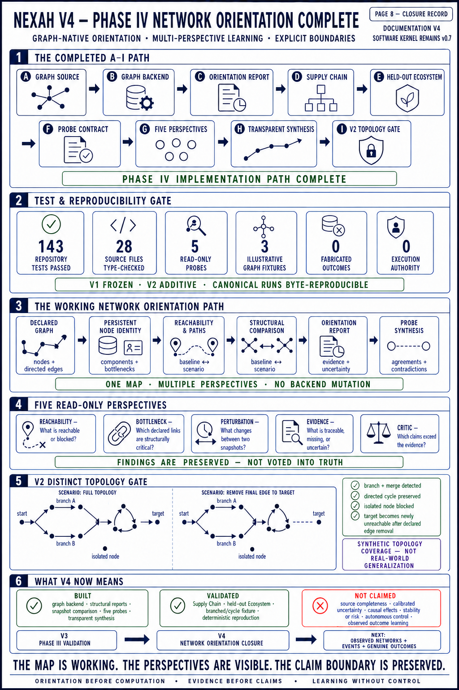
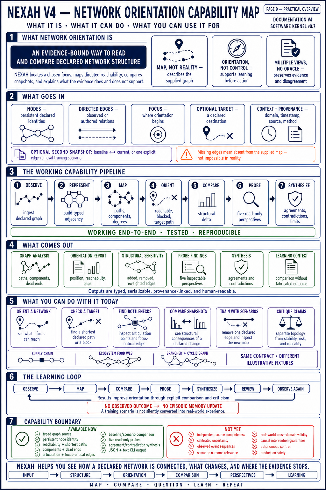

# NEXAH Orientation Layer

This directory is the active planning area for the next NEXAH architecture. It
turns the repository's broader orientation concept into a small, typed, testable
software layer built around evidence and uncertainty.

The text specifications are normative. The diagrams summarize them; code and
tests must verify them.

## Read in this order

1. **[ORIENTATION_LAYER_SPEC.md](ORIENTATION_LAYER_SPEC.md)** — scope,
   responsibilities, contracts, and boundaries.
2. **[BUILDING_PLAN.md](BUILDING_PLAN.md)** — work packages and acceptance
   criteria.
3. **[CONCEPT_TRACEABILITY.md](CONCEPT_TRACEABILITY.md)** — relationship
   between established concepts and actual implementation.
4. **[STATE_TRANSITION_ORIENTATION_REVIEW.md](STATE_TRANSITION_ORIENTATION_REVIEW.md)** —
   V5 architecture review of states, transition relations, ordered paths,
   boundaries, and contextual orientation.
5. **[DECISIONS/0001-janus-identities.md](DECISIONS/0001-janus-identities.md)** —
   separation of JANUS, Janus Bridge, and the scientific operator.
6. **[ADAPTER_LANDSCAPE.md](ADAPTER_LANDSCAPE.md)** — existing adapter lines,
   preservation decisions, and their relationship to WP2.
7. **[SOURCE_ADAPTER_CONTRACT.md](SOURCE_ADAPTER_CONTRACT.md)** — Phase III
   source boundary, invariants, leakage rules, and acceptance evidence.
8. **[ADAPTER_ECOSYSTEM_V3.md](ADAPTER_ECOSYSTEM_V3.md)** — current typed
   sources, preserved legacy work, and the promotion path for new domains.
9. **[IEEE_COUPLED_ADAPTER.md](IEEE_COUPLED_ADAPTER.md)** — coupled entity and
   load-campaign views, physical variables, failure policy, and D–F roadmap.
10. **[PLATEAU_A_CLOSURE.md](PLATEAU_A_CLOSURE.md)** — implemented status,
   Memory V2 evidence, scientific boundaries, and the Phase III gate.
11. **[PHASE_III_STATUS_V2_9.md](PHASE_III_STATUS_V2_9.md)** — current A–G
   baseline, scientific boundary, and the H–L continuation path.
12. **[PHASE_III_CLOSURE.md](PHASE_III_CLOSURE.md)** — completed H–K path,
    held-out result, and the boundary of validity.
13. **[PHASE_IV_NETWORK_ORIENTATION.md](PHASE_IV_NETWORK_ORIENTATION.md)** —
    graph-native application, structural comparison, and held-out fixture gate.
14. **[PHASE_V_IEEE_GEOMETRY_TESTKIT.md](PHASE_V_IEEE_GEOMETRY_TESTKIT.md)** —
    IEEE geometry case, evidence firewall, public showcase, and external-data
    bridge.
15. **[ORIENTATION_BRIEF_CONTRACT.md](ORIENTATION_BRIEF_CONTRACT.md)** — typed
    human-facing synthesis, evidence classes, outcome firewall, and runnable
    reference path.
16. **[archive/README.md](archive/README.md)** — rules for historical designs.


## Architecture at a glance

```text
Input + Context
→ Representation Backend
→ Q° Orientation Core
→ Orientation Report
→ Decision Support
→ Outcome + Learning
             ↘ feedback to context and orientation state
```

The current `nexah` package is one representation backend. It is not renamed
or reinterpreted as the complete Orientation Core.

## Visual overview

### Page 1 — System blueprint


### Page 2 — Implementation plan


## Current status — Plateau A closure

The following two pages record the implemented state after Memory
Generalization V2. They are status summaries, not substitutes for the linked
specifications, tests, and canonical result files.

### Status page 1 — Orientation Core and episodic path


### Status page 2 — Memory V2 validation and Phase III gate


The corresponding textual record is
**[PLATEAU_A_CLOSURE.md](PLATEAU_A_CLOSURE.md)**. Phase III begins with the
adapter contract and domain validation; it does not expand the frozen V1 or V2
claims retrospectively.

## Phase III evidence history

Phase III work packages A–G are implemented. The following pages record the
adapter-to-orientation path, the current scientific boundary, and the planned
H–L continuation. Version 2.9 names this documentation baseline; it is not a
software release or a claim that Phase III is complete.

### Status page 3 — Adapter ecosystem and IEEE validation


### Status page 4 — Continuation and completion path


### Status page 5 — What NEXAH can do today


The corresponding textual record is
**[PHASE_III_STATUS_V2_9.md](PHASE_III_STATUS_V2_9.md)**. The next executable
work package at that recorded point was H, baseline-anchored load continuation.

## Current status — Phase III closed

H–K are now implemented and canonically evaluated. All eight cases converge at
their native baseline, all upward convergence boundaries are bracketed and
refined, and no development case supports the stronger edge-independent
precursor claim. The unchanged PEGASE-9241 gate returns an explicit boundary of
validity because its branch is too short for the frozen seven-point method.

Read **[PHASE_III_CLOSURE.md](PHASE_III_CLOSURE.md)** and
**[IEEE Scaling Pattern V2](../../validation/ieee_scaling_pattern_v2/)** for the
governing result. Broader adapters are later ecosystem expansion; decision and
execution remain separate future layers.

### Status page 6 — V3 validation closure


Here, V3 denotes the documentation and validation state after H–K. The frozen
software kernel remains v0.7.

### Status page 7 — V3 capability map


This page is the practical user view: accepted inputs, working capabilities,
outputs, current use cases, access modes, and the explicit boundary between
available research tooling and later decision or execution layers.

## Current status — Phase IV Network Orientation V2

The graph source now feeds a graph-native representation backend rather than
the temporal v0.7 engine. Supply Chain and held-out Ecosystem fixtures exercise
the same typed path, and an explicit edge-removal scenario records structural
sensitivity without claiming causal control.

V2 adds five read-only analytical perspectives and a transparent synthesis.
Agreements and contradictions remain visible; there is no majority-vote truth,
backend mutation, fabricated outcome, or execution authority. A distinct
branched/cyclic fixture broadens synthetic topology coverage.

Read **[PHASE_IV_NETWORK_ORIENTATION.md](PHASE_IV_NETWORK_ORIENTATION.md)** and
the frozen **[V1 validation](../../validation/network_orientation_v1/)** plus
the additive **[V2 validation](../../validation/network_orientation_v2/)**.

### Status page 8 — V4 Phase IV closure



This is the scientific closure record for work packages A–I: graph-native
representation, structural reports, comparison, five read-only perspectives,
transparent synthesis, and the distinct-topology V2 gate. V4 denotes the
documentation and research milestone; the software kernel remains v0.7.

### Status page 9 — V4 capability map



This is the practical user view of accepted graph inputs, working structural
capabilities, outputs, training uses, the learning loop, and its boundaries.
In particular, a declared scenario is not an observed outcome and therefore
does not update episodic memory.

## Completed plateau — Phase V

Phase V is closed as the
**[IEEE Geometry Case and Research Testkit](PHASE_V_IEEE_GEOMETRY_TESTKIT.md)**.
It turns the strongest benchmark line into a reproducible 90-second overview,
ten-minute runnable case, and full research path. The generic
**[Observed-Evidence Testkit](../../testkit/observed_evidence/README.md)** keeps
benchmark computation, declared scenarios, measurements, and observed outcomes
technically distinct.

The backend-independent
**[Orientation Brief contract](ORIENTATION_BRIEF_CONTRACT.md)** turns a report
and multiple read-only perspectives into a reproducible human-facing document.
The Network Orientation path remains its reference implementation; the IEEE
case populates the same contract rather than inventing another report type.
Work Package A is frozen in the
**[IEEE Geometry V1 case protocol](../../APPLICATIONS/power_systems/ieee_geometry_v1/README.md)**:
IEEE-9 is used for development and IEEE-14 is locked for the unchanged Phase V
evaluation path.

Work Packages B–D now carry the case from manifest-bound physical frames
through frozen geometry operators and five non-voting probes into one
evidence-bound Orientation Brief. Work Package E adds the executable
**[Observed-Evidence outcome firewall](../../testkit/observed_evidence/README.md)**:
scenario and computation records remain useful artifacts but cannot authorize
episodic-memory learning. Only a fully passed observed-outcome record can do so.

Work Package F now closes the frozen evaluation gate. The
**[IEEE Geometry V1 validation](../../validation/ieee_geometry_v1/README.md)**
rebuilds IEEE-14, applies the unchanged IEEE-9 model, reproduces the complete
artifact chain byte-for-byte, and audits the manifest claims. Its positive
technical result does not widen the evidence class: it remains benchmark
computation with unknown calibrated uncertainty and no observed outcome.

Work Package G publishes the
**[90-second, ten-minute, and research entry paths](../../APPLICATIONS/power_systems/ieee_geometry_v1/showcase/README.md)**
plus four reproducible figures derived from canonical JSON. Work Package H
publishes the **[Observed-Evidence Bridge](../../testkit/observed_evidence/OBSERVED_EVIDENCE_BRIDGE.md)**,
admission checklist, and a deliberately closed manifest template. No external
measurement dataset was admitted merely to close the phase.

Visuals are explanatory artifacts. If a diagram and a normative text disagree,
the normative text governs until the discrepancy is reviewed.
