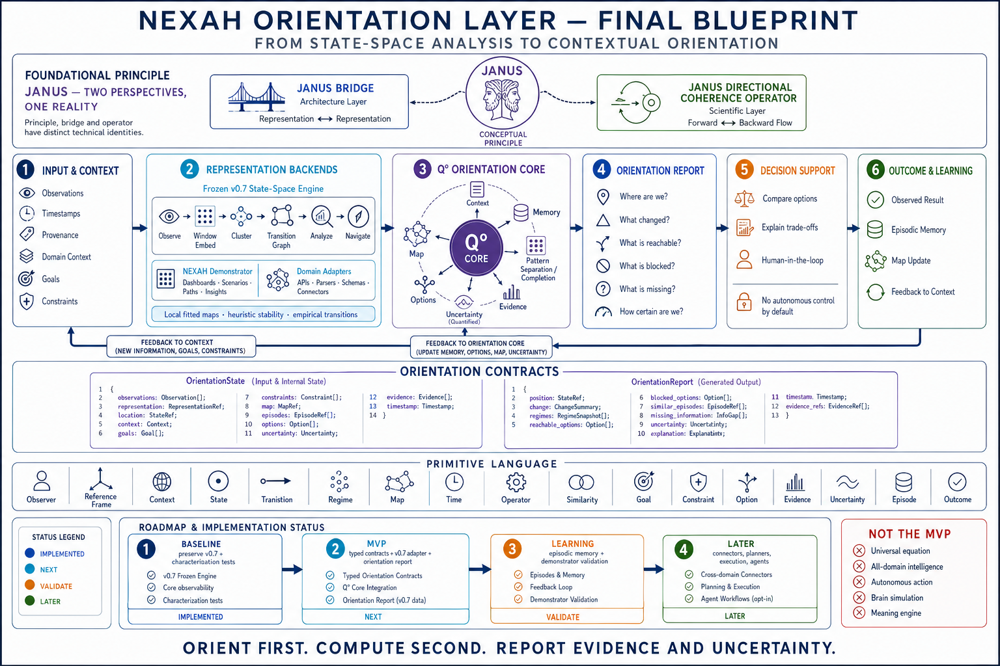
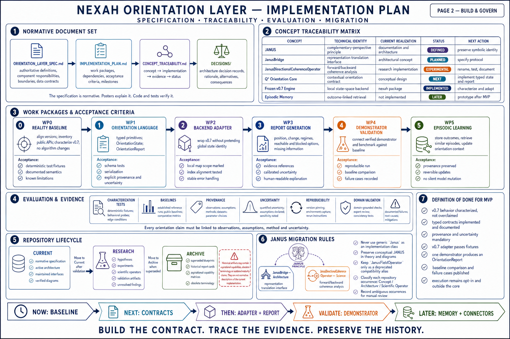
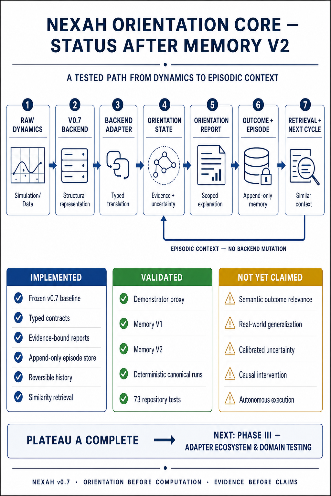
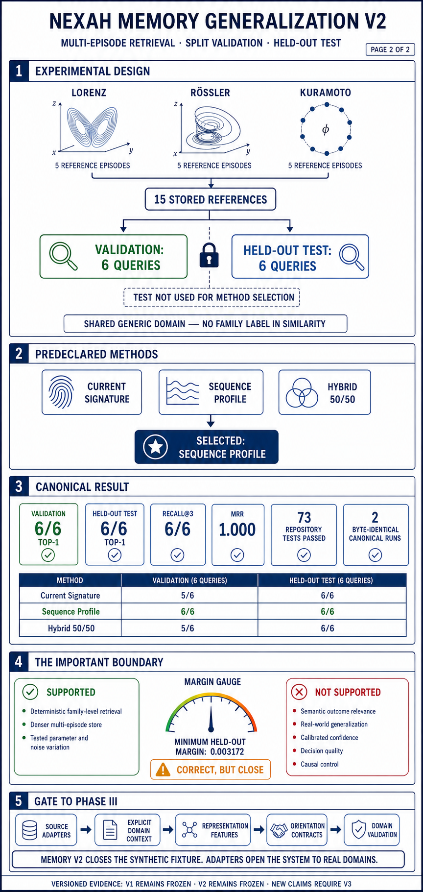
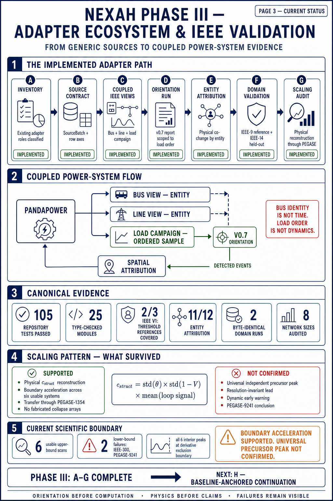
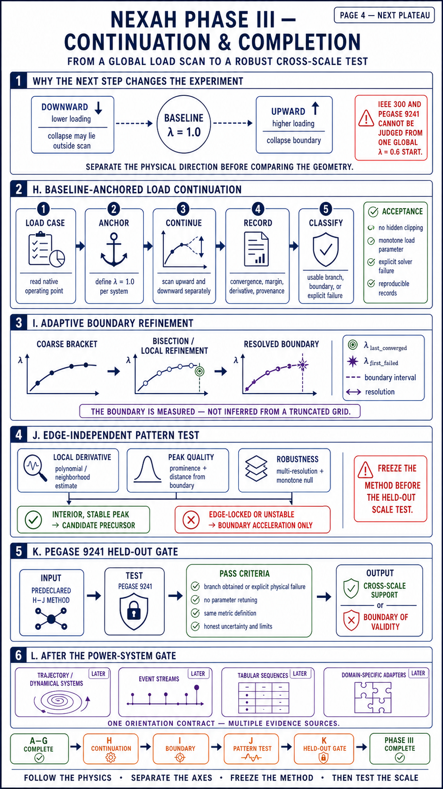
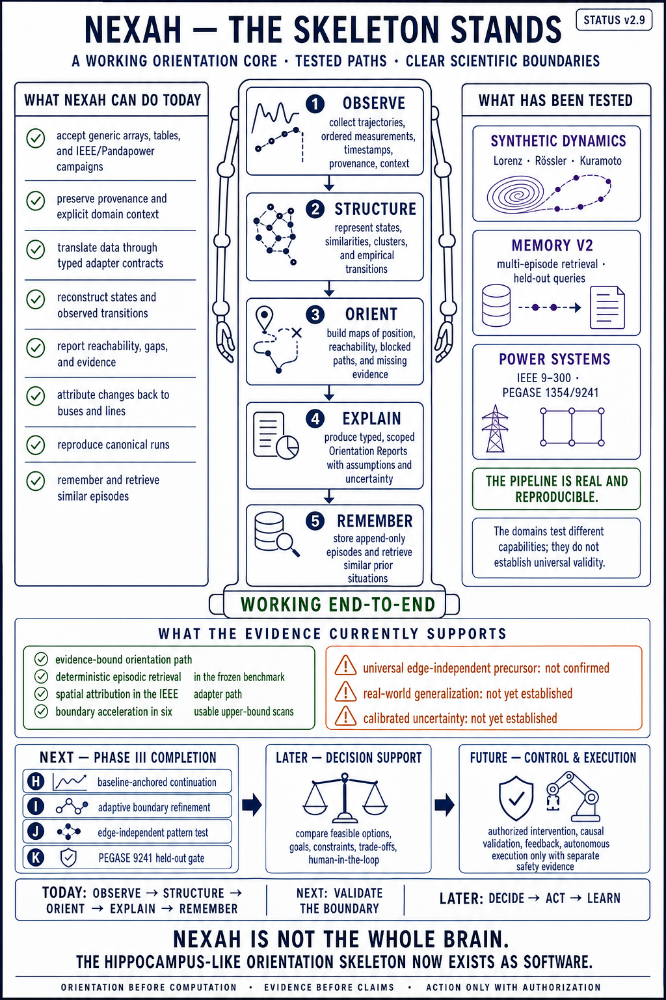
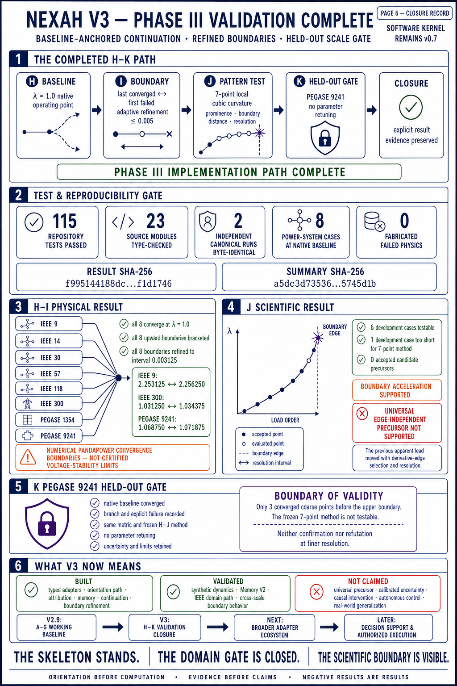
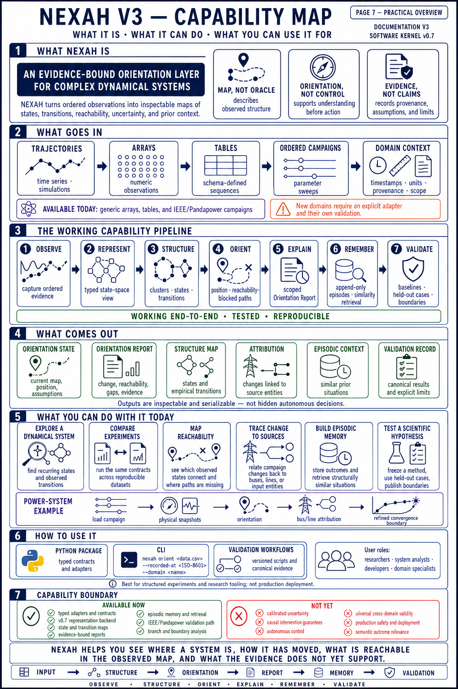

# NEXAH Orientation Layer

This directory is the active planning area for the next NEXAH architecture. It
turns the repository's broader orientation concept into a small, typed, testable
software layer built around evidence and uncertainty.

The text specifications are normative. The diagrams summarize them; code and
tests must verify them.

## Read in this order

1. **[ORIENTATION_LAYER_SPEC.md](ORIENTATION_LAYER_SPEC.md)** — scope,
   responsibilities, contracts, and boundaries.
2. **[BUILDING_PLAN.md](BUILDING_PLAN.md)** — work packages and acceptance
   criteria.
3. **[CONCEPT_TRACEABILITY.md](CONCEPT_TRACEABILITY.md)** — relationship
   between established concepts and actual implementation.
4. **[DECISIONS/0001-janus-identities.md](DECISIONS/0001-janus-identities.md)** —
   separation of JANUS, Janus Bridge, and the scientific operator.
5. **[ADAPTER_LANDSCAPE.md](ADAPTER_LANDSCAPE.md)** — existing adapter lines,
   preservation decisions, and their relationship to WP2.
6. **[SOURCE_ADAPTER_CONTRACT.md](SOURCE_ADAPTER_CONTRACT.md)** — Phase III
   source boundary, invariants, leakage rules, and acceptance evidence.
7. **[ADAPTER_ECOSYSTEM_V3.md](ADAPTER_ECOSYSTEM_V3.md)** — current typed
   sources, preserved legacy work, and the promotion path for new domains.
8. **[IEEE_COUPLED_ADAPTER.md](IEEE_COUPLED_ADAPTER.md)** — coupled entity and
   load-campaign views, physical variables, failure policy, and D–F roadmap.
9. **[PLATEAU_A_CLOSURE.md](PLATEAU_A_CLOSURE.md)** — implemented status,
   Memory V2 evidence, scientific boundaries, and the Phase III gate.
10. **[PHASE_III_STATUS_V2_9.md](PHASE_III_STATUS_V2_9.md)** — current A–G
   baseline, scientific boundary, and the H–L continuation path.
11. **[PHASE_III_CLOSURE.md](PHASE_III_CLOSURE.md)** — completed H–K path,
    held-out result, and the boundary of validity.
12. **[archive/README.md](archive/README.md)** — rules for historical designs.


## Architecture at a glance

```text
Input + Context
→ Representation Backend
→ Q° Orientation Core
→ Orientation Report
→ Decision Support
→ Outcome + Learning
             ↘ feedback to context and orientation state
```

The current `nexah` package is one representation backend. It is not renamed
or reinterpreted as the complete Orientation Core.

## Visual overview

### Page 1 — System blueprint



### Page 2 — Implementation plan



## Current status — Plateau A closure

The following two pages record the implemented state after Memory
Generalization V2. They are status summaries, not substitutes for the linked
specifications, tests, and canonical result files.

### Status page 1 — Orientation Core and episodic path



### Status page 2 — Memory V2 validation and Phase III gate



The corresponding textual record is
**[PLATEAU_A_CLOSURE.md](PLATEAU_A_CLOSURE.md)**. Phase III begins with the
adapter contract and domain validation; it does not expand the frozen V1 or V2
claims retrospectively.

## Phase III evidence history

Phase III work packages A–G are implemented. The following pages record the
adapter-to-orientation path, the current scientific boundary, and the planned
H–L continuation. Version 2.9 names this documentation baseline; it is not a
software release or a claim that Phase III is complete.

### Status page 3 — Adapter ecosystem and IEEE validation



### Status page 4 — Continuation and completion path



### Status page 5 — What NEXAH can do today



The corresponding textual record is
**[PHASE_III_STATUS_V2_9.md](PHASE_III_STATUS_V2_9.md)**. The next executable
work package at that recorded point was H, baseline-anchored load continuation.

## Current status — Phase III closed

H–K are now implemented and canonically evaluated. All eight cases converge at
their native baseline, all upward convergence boundaries are bracketed and
refined, and no development case supports the stronger edge-independent
precursor claim. The unchanged PEGASE-9241 gate returns an explicit boundary of
validity because its branch is too short for the frozen seven-point method.

Read **[PHASE_III_CLOSURE.md](PHASE_III_CLOSURE.md)** and
**[IEEE Scaling Pattern V2](../../validation/ieee_scaling_pattern_v2/)** for the
governing result. Broader adapters are later ecosystem expansion; decision and
execution remain separate future layers.

### Status page 6 — V3 validation closure



Here, V3 denotes the documentation and validation state after H–K. The frozen
software kernel remains v0.7.

### Status page 7 — V3 capability map



This page is the practical user view: accepted inputs, working capabilities,
outputs, current use cases, access modes, and the explicit boundary between
available research tooling and later decision or execution layers.

Visuals are explanatory artifacts. If a diagram and a normative text disagree,
the normative text governs until the discrepancy is reviewed.
