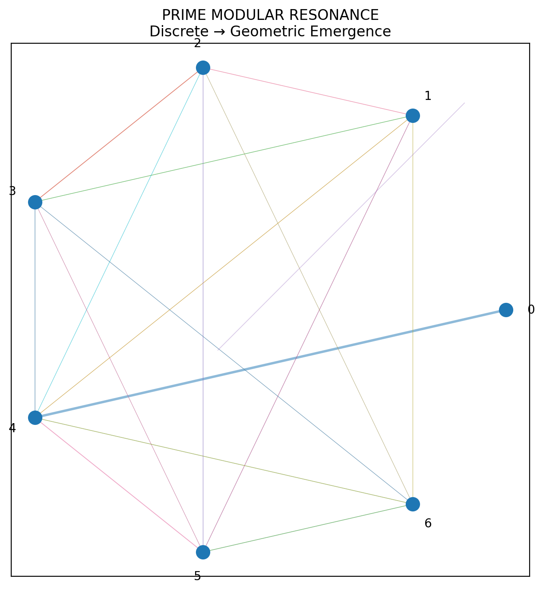
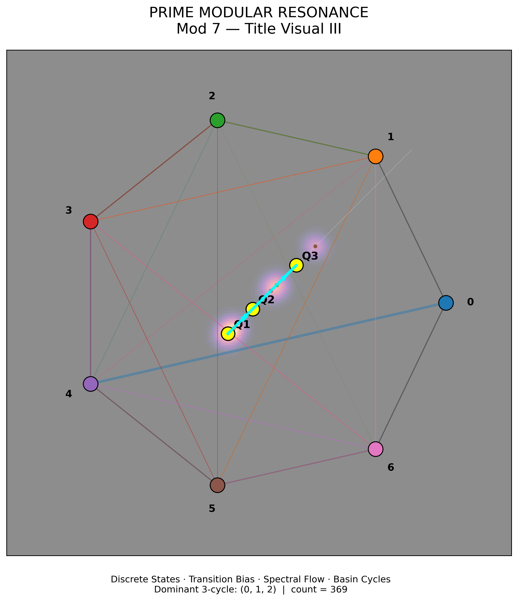

# NEXAH Prime Modular Resonance Experiment

**Path:** `ENGINE/research/experiments/prime_modular_resonance/`  
**Status:** Active exploratory research  
**Domain:** Prime dynamics · modular arithmetic · spectral analysis · topology  
**Context:** NEXAH / ENGINE research experiments

---

## Overview

This experiment investigates whether **prime number sequences**, when projected into **modular spaces** such as mod 7, mod 17, mod 24, and mod 60, produce **non-random structural signatures** in:

- spatial trajectories  
- density maps  
- FFT spectra  
- autocorrelation structure  
- mirror / reversal chains  
- graph topology  
- transition maps between modular systems  
- particle-based flow simulations  

The goal is **not** to claim new physics, but to test whether prime-driven modular projections generate **measurably different dynamical patterns** from matched random controls.

---

## Key Result

Across multiple experiments, prime modular residue systems exhibit  
non-uniform transition structure that produces coherent geometric  
and dynamical patterns under embedding, not reproduced by matched random controls.

---

## Core Research Question

> Do prime number sequences generate statistically distinguishable structure in modular projection systems compared with random integer controls?

---

## Experiment 01 — Mod-7 Prime Flow

### Objective

Study local residue dynamics of primes in `mod 7`.

---

### 🖼 Visual I — Discrete Transition Structure



**Interpretation**

- nodes → modular states  
- edges → transition probabilities  
- first emergence of structure  

---

### 🖼 Visual II — Flow Emergence


**Interpretation**

- discrete residues → continuous trajectory  
- flow patterns emerge from transition bias  
- rotational structure becomes visible  

---

### 🖼 Visual III — Basin & Cycle Structure



**Interpretation**

- basin centers → clustering  
- density → concentration  
- triangle → dominant cycle  
- arrows → directed loop dynamics  

---

## Experiment 01b — Particle Flow & Transport Layer

### 🖼 Particle Flow (Raw Field)


### 🖼 Particle Flow with Trails


### 🖼 Transition Flow (Full System)


---

### Interpretation

- particles follow transition probabilities, not random motion  
- visible:

  - directional drift  
  - clustered flow regions  
  - pulse-like behavior  

→ indicates an emergent **transport structure**

---

### Key Observation

The system transitions from:

- discrete transitions  
→ to  
- continuous-like motion  

without introducing any continuous field.

---

## Experiment 02 — 7→17 Modular Bridge

### Construction

```math
c_n = (7 a_n + \delta) \bmod 17
```
`
	•	mod 7 → local structure
	•	mod 17 → stabilizing layer
⸻

### Experiment 03 — Mod-60 Anchor System
```bash
[43, 37, 23, 17]
```
`
	•	defines structured residue corridors
	•	acts as angular partition system

⸻

### Experiment 04 — Spectral Analysis
`
	•	FFT
	•	autocorrelation
	•	spiral projections

Used to detect periodic structure in residue dynamics.

⸻

### Experiment 05 — Mirror Chains

Examples:
```bash
73 ↔ 37  
137 ↔ 731
```
	•	potential structural shortcuts in graph space

⸻

### Experiment 06 — Transition Graph Topology

**🖼 Clean Transition Graph**

Interpretation
	•	weighted edges reveal preferred transitions
	•	asymmetric connectivity
	•	non-uniform state interaction

⸻

### Null Models

All results are compared against:
	•	random integers
	•	random odd integers
	•	shuffled primes
	•	valid residue-class controls

⸻

### Caution

This experiment is exploratory.

No physical interpretation is assumed.
All results are computational and comparative.

⸻

### Key Insight

Prime modular residue systems exhibit structured transition behavior
that becomes visible as:
	•	coherent geometry
	•	cyclic motifs
	•	flow-like dynamics
	•	emergent transport behavior

under geometric embedding.

⸻

### Next Steps
`
	•	statistical validation
	•	multi-mod coupling (7 × 11 × 13)
	•	spectral refinement (FFT)
	•	topology metrics (graph theory)
	•	drift / transport quantification
	•	extension to mod 11, mod 13

⸻

### Status

✔ reproducible
✔ visualized
✔ structurally consistent
✔ dynamically extended
✔ ready for publication / discussion

⸻

Scarabæus1033 · NEXAH Research Layer
