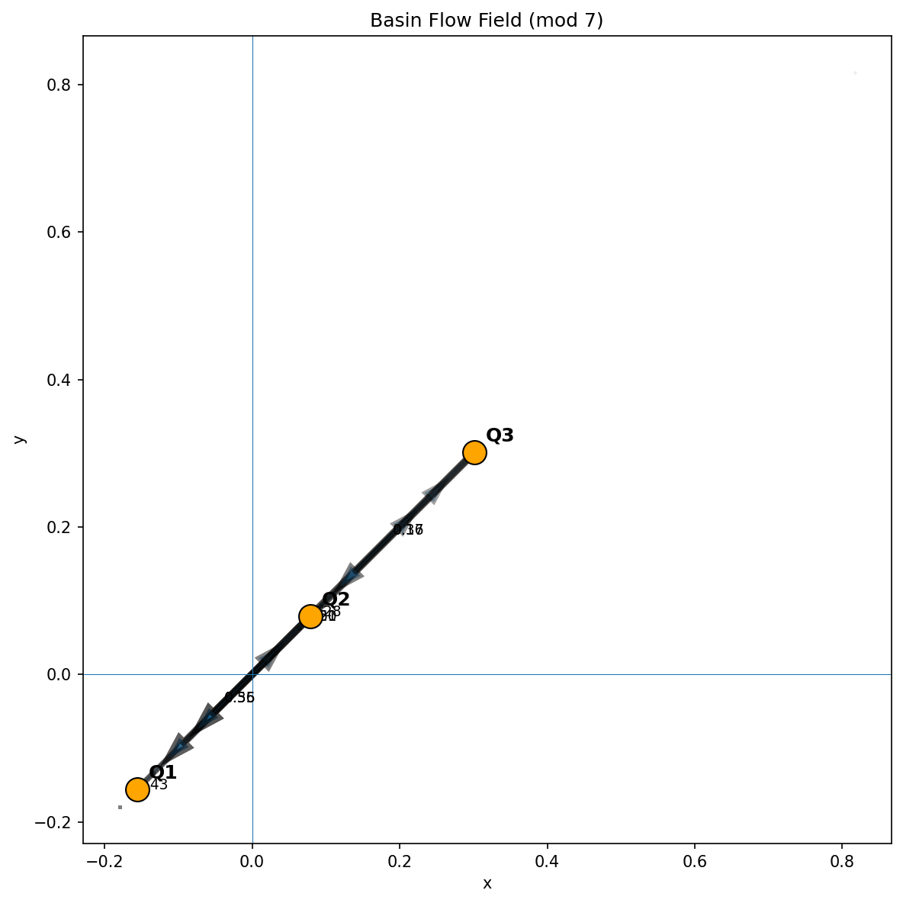
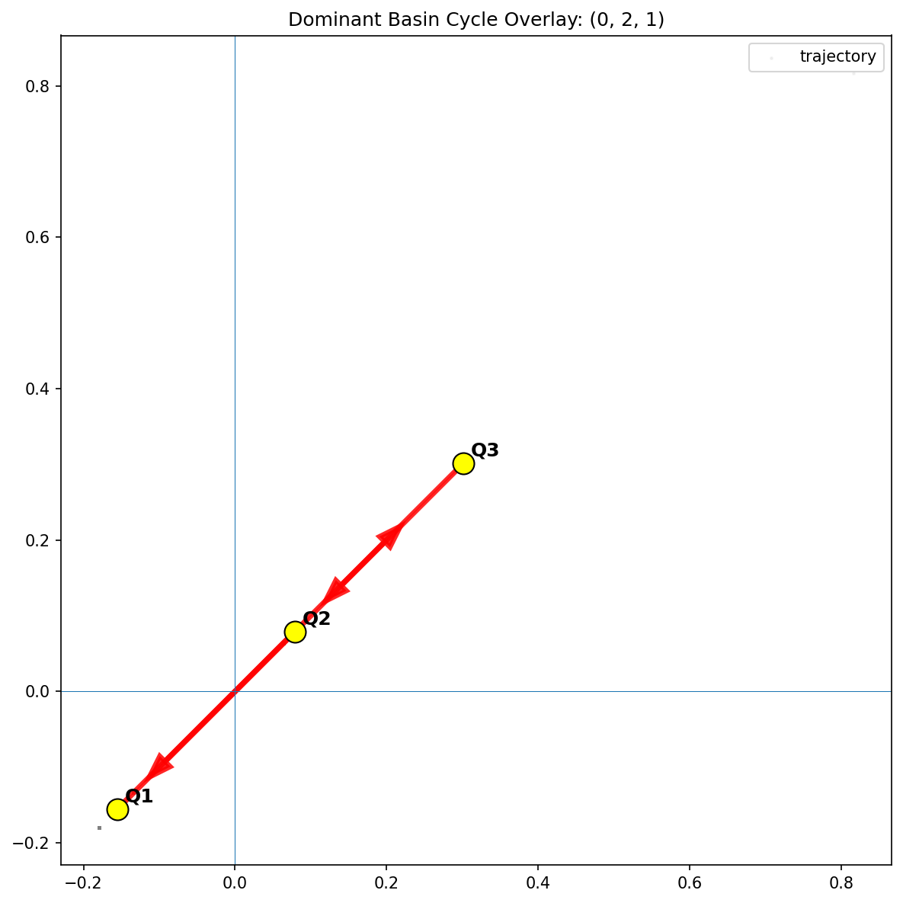

# 🧠 NEXAH — Prime Modular Resonance  
## Unified Theory & Empirical Structure

---

## 🔷 0. Scope

This document unifies:

- empirical observations  
- dynamical interpretation  
- geometric structure  
- minimal formalization  

It is based strictly on:

- reproducible computation  
- statistical comparison  
- visual analysis  

No physical interpretation is assumed.

---

## 🔷 1. System Definition

Let:

```math
r_n = p_n \bmod m
```

Define transitions:

```math
(r_n \to r_{n+1})
```

and transition matrix:

```math
T_{i,j} = \mathbb{P}(r_{n+1} = j \mid r_n = i)
```

Optional embedding:

```math
\theta_n = \frac{2\pi}{m} r_n
```

---

## 🔷 2. Core Empirical Observation

The system does **not** behave like:

- a random walk  
- a uniform Markov chain  

Instead:

> it forms a **structured transition system with flow, recurrence, and drift**

---

# 🔷 3. Flow Emergence

### Visual Evidence

  


---

### Observation

- trajectories follow preferred paths  
- clustering emerges  
- motion is structured  

---

### Interpretation

> Transition asymmetry induces a **probabilistic flow field**

---

# 🔷 4. Transition Structure

### Observation

- $begin:math:text$ T\_\{i\,j\} \\neq \\frac\{1\}\{m\} $end:math:text$  
- specific transitions dominate  

---

### Interpretation

> The transition operator is **non-uniform and structured**

---

# 🔷 5. Cycle Structure (Recurrence)

### Observation

- stable cycles exist  
- lengths vary with modulus  
- weights are consistent (~0.20)

---

### Interpretation

> The system contains a **recurrent cycle backbone**

---

# 🔷 6. Cycle-Core Manifold

### Observation

- almost all states participate in cycles  
- state 0 often excluded  

---

### Interpretation

> A **cycle-core subset** exists:

```math
C \subseteq \{0,\dots,m-1\}
```

→ strongly connected, recurrent  

---

# 🔷 7. Drift (Transport Layer)

Define:

```math
d(i) = \sum_j (j - i \bmod m)\, T_{i,j}
```

---

### Observation

- $begin:math:text$ d\(i\) \\neq 0 $end:math:text$  
- drift direction is consistent  

---

### Interpretation

> The system has a **directional transport component**

---

# 🔷 8. Structural Decomposition

Empirically:

```text
Flow ≈ Cycle Structure + Drift
```

---

### Components

**Cycle:**
- recurrence  
- loops  
- stability  

**Drift:**
- direction  
- transport  
- asymmetry  

---

# 🔷 9. Flow Field Geometry

### Visual Evidence

  


---

### Observation

- streamlines emerge  
- vortex-like regions  
- bounded flow  

---

### Interpretation

> The system behaves like a **low-dimensional flow field**

---

# 🔷 10. Spectral Structure


---

### Observation

- non-trivial spectral modes  
- rotational patterns  

---

### Interpretation

> The transition operator has **low-dimensional structure**

---

# 🔷 11. Global Connectivity


---

### Observation

- all cycles overlap  
- single connected component  

---

### Interpretation

> The system forms a **single coherent dynamical object**

---

# 🔷 12. Geometric Emergence


---

### Observation

- ring structures  
- toroidal patterns  
- rotational symmetry  

---

### Interpretation

> Discrete transitions induce **continuous-like geometry**

---

# 🔷 13. Scaling Behavior

### Observation

- drift decreases with $begin:math:text$ m $end:math:text$  
- cycle structure persists  

---

### Interpretation

Two regimes:

- small $begin:math:text$ m $end:math:text$ → transport-dominated  
- large $begin:math:text$ m $end:math:text$ → structure-dominated  

---

# 🔷 14. Deviation from Randomness

### Observation

Compared to null models:

- asymmetry ↑  
- entropy ↓  
- cycles ↑  

---

### Interpretation

> Structure is **statistically significant**

---

# 🔷 15. Formalization Sketch

The system can be modeled as:

- finite state space  
- transition operator $begin:math:text$ T $end:math:text$  
- induced dynamics  

---

## Candidate Statements

---

### A — Non-Uniformity

> $begin:math:text$ T $end:math:text$ deviates significantly from random transition matrices.

---

### B — Recurrent Structure

> The induced graph contains a strongly connected cycle-core.

---

### C — Drift

> Expected transition displacement is non-zero.

---

### D — Decomposition

> Transition dynamics ≈ cycle + drift components.

---

### E — Scaling

> Drift weakens with increasing modulus while recurrence persists.

---

# 🔷 16. Mechanism

The structure emerges purely from:

1. prime sequence  
2. modular projection  
3. transition counts  
4. probability normalization  

---

> No continuous dynamics are introduced.

---

# 🔷 17. Interpretation (Strict)

> Prime modular systems define a structured transition system with:
>
> - recurrence  
> - transport  
> - emergent geometry  

---

# 🔷 18. Limitations

- no closed-form description  
- no analytical derivation  
- finite-sample approximation  

---

# 🔷 19. Key Insight

```
Discrete asymmetry → flow → structure → geometry
```

---

# 🔷 20. Status

✔ reproducible  
✔ multi-mod confirmed  
✔ statistically robust  
✔ structurally consistent  

→ ready for formal analysis  

---

**Scarabæus1033 · NEXAH Research Layer**
