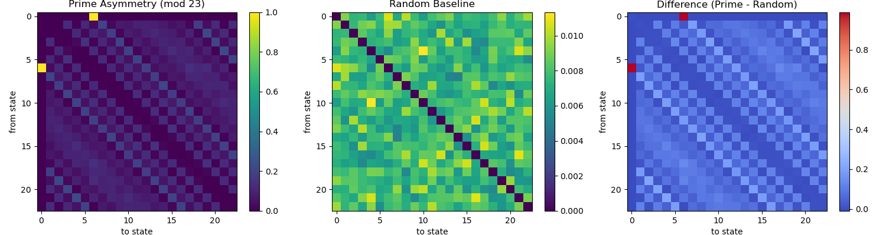
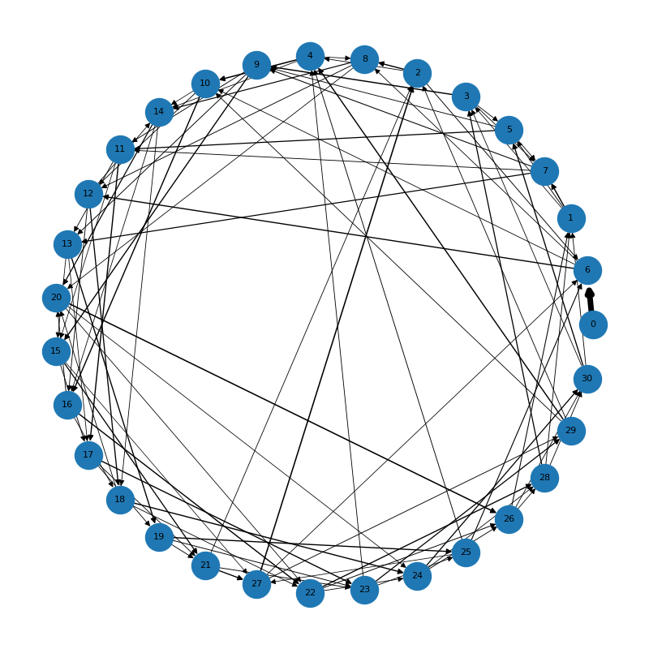
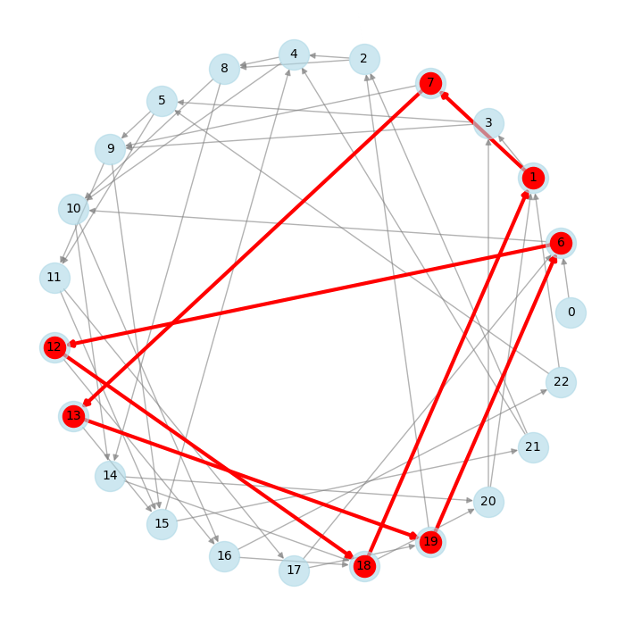
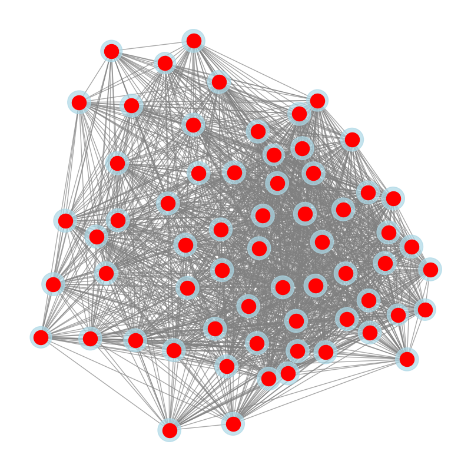
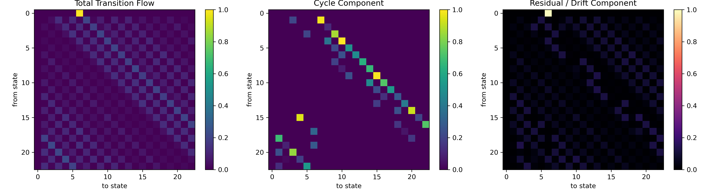
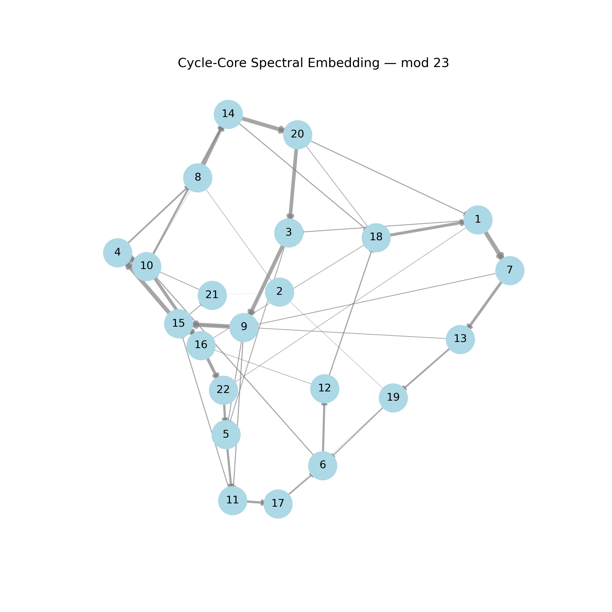
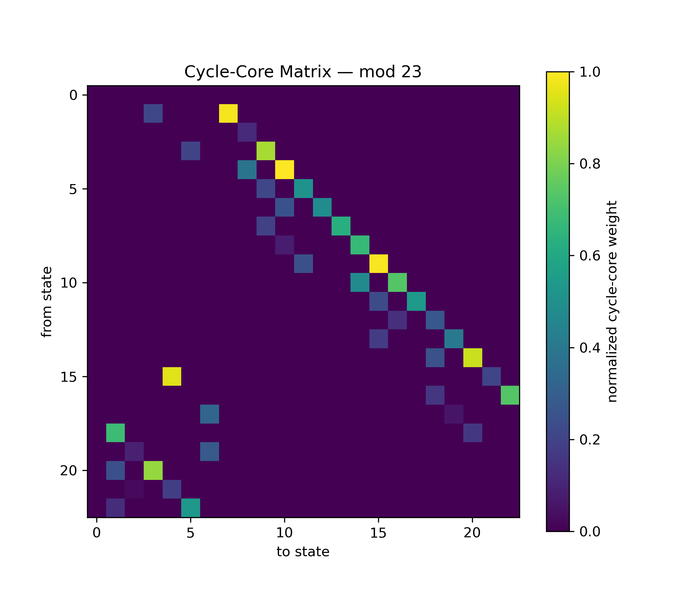
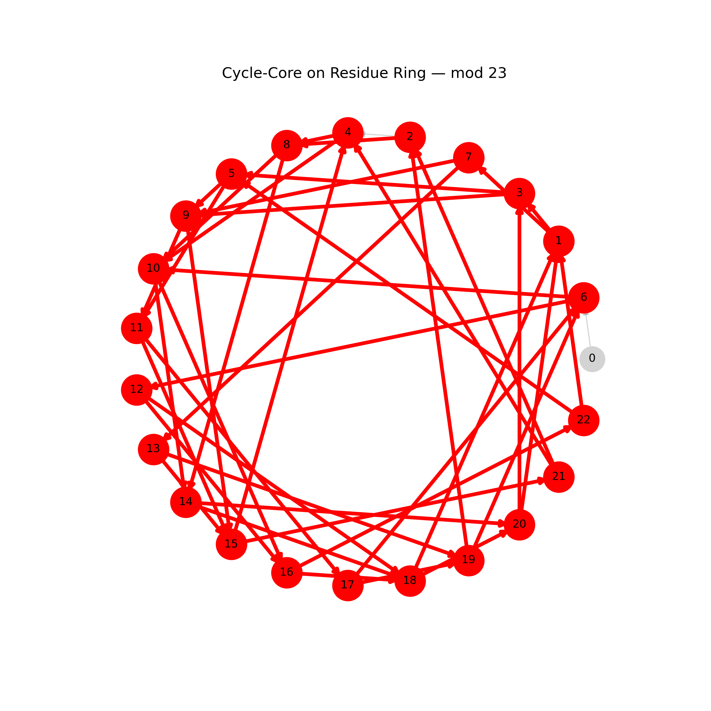

# 🔬 PROBABILISTIC FLOW FIELD — DISCOVERY

---

## Context

This observation emerges from a sequence of experiments on:

- prime residue sequences (mod n)
- transition graphs
- particle-based simulations
- geometric embeddings (circular phase space)

The system evolved from:

> static transition structure → dynamic transport behavior → structured recurrence + drift decomposition

---

## Phase Evolution

### Phase 1
Transition matrices (mod 7)

→ non-random structure

### Phase 2
Particle simulations

→ emergent flow behavior

### Phase 3
Cycle detection + drift analysis

→ decomposition into:

- recurrent cycles
- directional transport

---

## Core Observation

The system does **not** behave like:

- a random walk  
- a uniform Markov process  

Instead:

→ it forms a **structured transition field**

with:

- preferred paths  
- recurrent loops  
- directional drift  

---

## Visual Evidence — Flow Emergence (mod 7)

### Triangle Generator Layer


### Particle Flow (Raw Field)


### Particle Flow with Trails


### Transition Flow (Full System)


---

## Visual Evidence — Asymmetry & Structure

### State Asymmetry Maps


Observation:

- strong deviation from random baseline  
- persistent directional bias  

---

## Visual Evidence — Transition Channels

### Dominant Transition Channels


Observation:

- sparse but dominant edges  
- preferred transport directions  
- non-uniform connectivity  

---

## Visual Evidence — Cycle Structure

### Dominant Cycles


Observation:

- stable loop structures  
- increasing cycle length with modulus  
- consistent cycle weights (~0.20)

---

## Visual Evidence — Cycle Alignment with Drift

### Drift-Aligned Cycles


Observation:

- cycles align with global drift direction  
- preferred step sizes emerge (e.g. +6, +7)  

---

## Visual Evidence — Cycle Connectivity

### Cycle Overlap Graph


Observation:

- all cycles connected  
- single global component  
- no isolated recurrence structures  

---

## Visual Evidence — Flow Decomposition

### Matrix Decomposition


### Graph Decomposition


Observation:

- clear separation:
  - cycle flow (structure)
  - residual flow (drift)

---

## Visual Evidence — Cycle Core

### Spectral Embedding


### Cycle Core Matrix


### Cycle Core Ring


Observation:

- almost all states in core (except 0)
- ring-like structure emerges
- deformation caused by drift

---

## Structural Decomposition

The system decomposes into:

### 1. Cycle Component (Recurrent Structure)

- closed loops
- high-probability transitions
- strongly connected core

→ defines the **stable manifold**

---

### 2. Residual / Drift Component (Transport)

- directional bias
- non-reversible transitions

→ defines **transport across the manifold**

---

## Key Insight

```
Flow = Cycle Structure + Drift
```

---

## Cycle-Core Discovery

- state 0 is typically excluded  
- remaining states form a **connected cycle-core**  

→ emergent ring-like phase structure  

---

## Geometric Interpretation

The system behaves like:

→ transport on a **deformed circular manifold**

Structure:

- ring (cycle-core)
- drift (direction)
- local distortions

---

## Mechanism

The behavior emerges purely from:

1. Prime sequence  
2. Modular projection  
3. Transition counts  
4. Probability normalization  

→ no continuous dynamics defined  

→ structure emerges from **discrete asymmetry**

---

## Interpretation

Prime modular systems define:

> a **probabilistic transport system with intrinsic geometry**

---

## Concept Definition

### Probabilistic Flow Layer

- transitions → motion rules  
- probabilities → flow behavior  

---

### Cycle-Core Manifold

- recurrent backbone  
- structural stability  

---

### Drift Layer

- directional transport  
- asymmetry-driven  

---

## Important Clarification

This is a **mathematical/computational observation**.

It does NOT imply:

- physical fields  
- real particles  

---

## Updated Hypothesis

Prime residue transitions define:

> a structured transport system with an emergent phase manifold

---

## Next Steps

- extract phase coordinate θ  
- measure winding numbers  
- project drift onto phase direction  
- compare across moduli  
- test universality  

---

## Status

✔ reproducible  
✔ multi-mod confirmed  
✔ cycle-core identified  
✔ drift separation achieved  
✔ geometric structure observed  

→ ready for formalization
