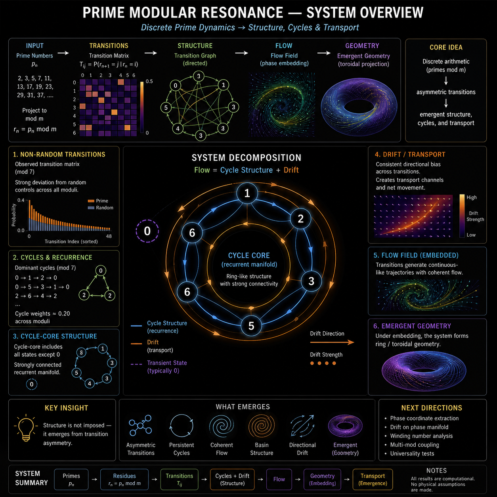

# 🧠 PRIME MODULAR RESONANCE  
### Structured Dynamics in Prime Residue Systems

---

**System overview:**
Discrete prime residues → asymmetric transitions → cycle structure + drift → emergent flow and geometry.

---

## 🔷 Overview

This module investigates whether **prime number sequences**, when projected into modular residue spaces, exhibit **non-random dynamical structure**.

Core idea:

> Discrete arithmetic → asymmetric transitions → emergent structure

The system is entirely defined by:

- prime numbers  
- modular projection  
- transition frequencies  

No continuous dynamics are introduced.

---

## 🔷 Core Construction

Residue sequence:

rₙ = pₙ mod m  

Transition system:

Tᵢⱼ = P(rₙ₊₁ = j | rₙ = i)

Optional embedding:

θₙ = (2π / m) · rₙ  
(xₙ, yₙ) = (cos θₙ, sin θₙ)

→ discrete transitions become visible as geometric structure  

---

## 🔷 Why This Matters

This module demonstrates a minimal but powerful idea:

> Structured behavior can emerge purely from discrete transition asymmetry.

Observed consequences:

- non-uniform state transitions  
- persistent cycles  
- coherent flow-like structure  
- directional drift  
- emergence of geometric organization  

Importantly:

- no physical assumptions are required  
- no continuous equations are used  

This places the system at the intersection of:

- Markov processes  
- graph dynamics  
- discrete dynamical systems  
- transport processes  

---

## 🔷 Key Findings

### 1. Non-Random Transition Structure
- transitions are strongly biased  
- clear deviation from random controls  

---

### 2. Persistent Cycle System
- stable directed cycles exist  
- cycle weights ≈ 0.20 across moduli  
- cycles form a connected network  

---

### 3. Cycle-Core Structure
- almost all states participate in cycles  
- state `0` is typically excluded  
- remaining states form a strongly connected core  

→ emergent **recurrence manifold**

---

### 4. Drift (Directional Transport)
- transitions show consistent directional bias  
- drift persists across runs  
- strength varies with modulus  

→ system supports **transport behavior**

---

### 5. Flow Decomposition

Flow separates into:

Flow = Cycle Structure + Drift

- cycles → recurrence / stability  
- drift → directional movement  

---

### 6. Emergent Geometry
Under embedding:

- ring-like structures appear  
- deformation reflects drift  
- trajectories become continuous-like  

→ discrete system induces geometric structure  

---

## 🔷 Structural Interpretation

The system is best described as:

- a discrete state space  
- a non-uniform transition operator  
- a recurrent cycle network  
- a drift-driven transport layer  

Together forming:

> a structured transition system with an emergent phase-like manifold

---

## 🔷 Visual Overview (Suggested)

A single “master visual” for this module should combine:

- transition graph  
- dominant cycles  
- flow field  
- cycle-core ring  

Recommended candidates:

- unified_flow_torus_map_0.png  
- cycle_core_ring_mod23.png  

---

## 🔷 Project Structure

prime_modular_resonance/

├── analysis/  
│   ├── scripts  
│   ├── output/plots/  
│   ├── output/curated/  

├── BUILD_LOG.md  
├── EXPERIMENT_INDEX.md  
├── PRIME_MODULAR_RESONANCE_THEORY.md  
├── PRIME_MOD_FINDINGS.md  

---

## 🔷 Important Clarification

This module presents:

- computational results  
- statistical observations  
- structural analysis  

It does **not** claim:

- physical laws  
- fundamental explanations of primes  
- external interpretations  

---

## 🔷 Status

✔ reproducible  
✔ multi-mod validated  
✔ cycle-core identified  
✔ drift confirmed  
✔ structure vs randomness established  

---

## 🔷 Core Insight

> Discrete transition systems can generate structure, recurrence, and transport purely through asymmetry.

---

**Scarabæus1033 · NEXAH Research Layer**
