# Structured Oscillator Networks Experiment

This experiment series investigates **structured network topology** and its effects on synchronization dynamics, vortex formation, and phase transitions in coupled oscillator systems. The experiment utilizes **Kuramoto-type models** on customized graph topologies to explore complex phenomena like **hub-cycle structures**, **ring shells**, and **layered symmetry graphs**.

These networks are designed to test how **topology-driven synchronization regimes and vortex structures** emerge within oscillator networks. The research is focused on navigating **resonance networks, phase transitions**, and **chaotic dynamics**, providing valuable insights into high-dimensional dynamical systems.

## Research Motivation

Coupled oscillator systems, particularly Kuramoto-type models, have widespread applications across various fields, including:

- Power grids
- Neural networks
- Biological rhythms
- Chemical oscillators
- Synchronization in complex networks

While most research deals with **random or regular networks**, this study focuses on **intentional, structured topologies** to understand the effects of network structure on synchronization dynamics.

> **Core Research Question:** How does network topology shape synchronization dynamics and vortex structures in oscillator systems?

## Neuheit & Origineller Beitrag

- **Absichtlich gestaltete Topologien** (Hub-Ring-Shells, symmetrische Layered Cycles C5+C6+C6, Prime-Number-Lattices) statt reiner Zufalls- oder Gitter-Netze
- Erste systematische Analyse von **Frustration bei spezifischen Shell-Größen** (z. B. N=29, 34 → stark verzögerte Sync, metastabile Cluster)
- **Prime-Number-Lattices** als neuartige Resonanz-Strukturen: Vermeidung periodischer Artefakte, Förderung natürlicher Resonanzkanäle durch Irregularität
- Direkte Relevanz für NEXAH: Topologie als **relationale Ordnung** (META-Layer) → prägt Regime-Landschaft, Frustration als Risiko-Indikator, Resonance als Navigationskanäle

## Kernel Bridge Beispiele

Die Bridge exportiert Metriken aus den Experimenten – nutzbar für NEXAH.

```python

from ENGINE.nexah_kernel.research.experiments.structured_oscillator_networks.kernel_bridge import get_vortex_metrics, get_chimera_status, get_frustration_score
```

# Beispiel: Vortex aus echter History
history = np.load('output/phase_history.npy')
phase_ring = history[-1]
print("Vortex Metrics:", get_vortex_metrics(phase_ring=phase_ring, history=history))

# Chimera aus Snapshot
print("Chimera Status:", get_chimera_status(phase_ring=phase_ring))

# Frustration für Shell-Größe N=50
print("Frustration Score:", get_frustration_score(N=50))

## Experiment Pipeline

1. **Topology- & Shell-Scans** → Sync-Zeit, Frustration & Metastabilität messen  
2. **Vortex / Chimera / Defect Detektion** → Phase-Space-Partitioning & Topological Defects  
3. **Resonance & Prime-Grid Exploration** → Resonanz-Webs, Locking-Bänder, Phase-Locking-Korridore  
4. **Visualisierung & Metrik-Extraktion** → Plots, PCA, Gradient-Maps, Reports  
5. **Kernel-Integration** → Export von Metriken & Funktionen in nexah_kernel (via kernel_bridge.py)

## Experiment Framework

The **Structured Oscillator Networks** experiments are divided into key research themes:

### 1. Synchronization Dynamics
   - **Objective:** Study the synchronization behavior of different network topologies.
   - **Quantities Measured:**
     - Global order parameter \( R \)
     - Synchronization time
     - Cluster persistence

### 2. Vortex Formation in Phase Space
   - **Objective:** Investigate vortex structures within oscillator phase fields.
   - **Metrics:**
     - Vortex persistence
     - Cycle-phase analysis
     - Topological defects detection

### 3. Topology-Driven Frustration
   - **Objective:** Examine network sizes and topologies that create **frustration** leading to delayed synchronization or metastable clusters.
   - **Indicators of Frustration:**
     - Synchronization delay
     - Incomplete phase locking
     - Metastable clusters

### 4. Resonance Structures
   - **Objective:** Explore resonance patterns within structured graphs, such as:
     - Phase locking channels
     - Resonance webs
     - Synchronization bands

## Key Experiments

### Experiment 01: Hub-Ring Shell Scan
- **Objective:** Investigate synchronization time as a function of shell size in hub-ring networks.
- **Results:** Measure synchronization time and observe metastability for certain ring sizes.

### Experiment 02: Vortex Density Mapping
- **Objective:** Track the formation of phase vortices across different oscillator topologies.
- **Results:** Identify regions where vortex formation coincides with synchronization transitions.

### Experiment 03: Frustration Shell Detection
- **Objective:** Detect frustrated networks that fail to synchronize in a timely manner.
- **Results:** Identify network sizes (e.g., N = 29, 34) where synchronization is delayed due to frustration effects.

### Experiment 04: Layered Cycle Networks
- **Objective:** Study synchronization dynamics in layered symmetry graphs like C5 + C6 + C6.
- **Results:** Layered topologies enhance synchronization stability under certain conditions.

### Experiment 05: Resonance Web Detection
- **Objective:** Detect resonance channels and phase-locking corridors within oscillator networks.
- **Results:** Visualize resonance structures across phase space and detect hidden synchronization patterns.

## Prime Number Grids Experiments

In addition to the above experiments, the **Prime Number Grid** experiments investigate how **Prime Number Lattices** impact the dynamics of oscillator networks. These experiments focus on resonance patterns within **prime-based grids**, and their potential to influence synchronization and chaotic transitions.

### Prime Number Grid Experiment Overview
   - **Objective:** Study the effects of **Prime Number Lattices** on synchronization in oscillator networks.
   - **Key Variables:**
     - Prime lattice structure
     - Resonance patterns
     - Phase transition dynamics

### Prime Number Grid Visuals

- **Prime Number Lattice with Symmetry**  
  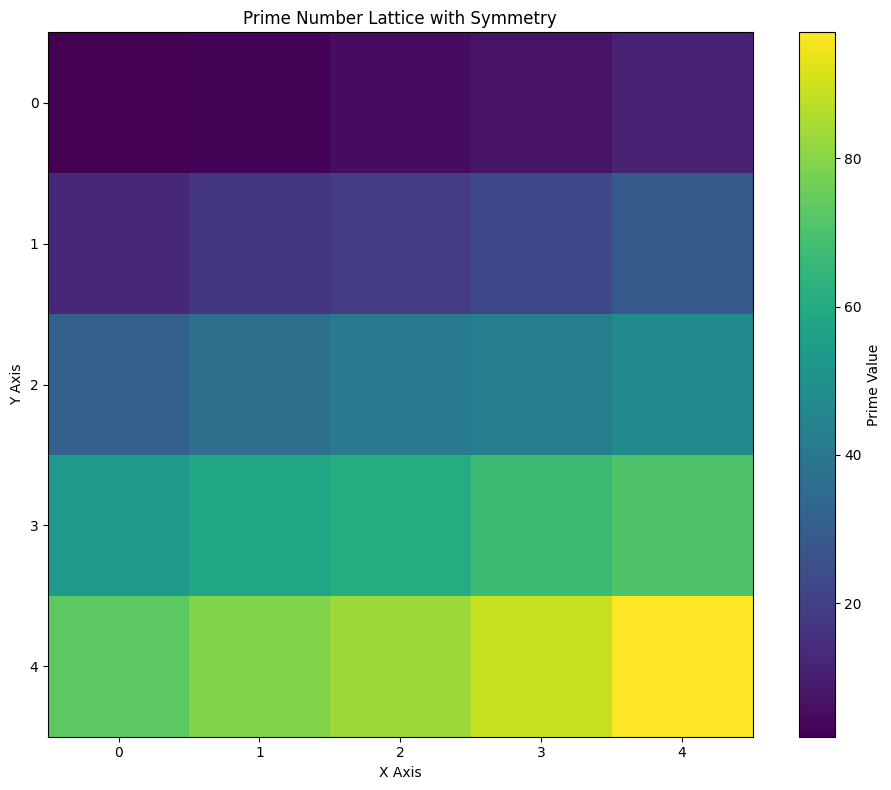  
  *3D resonance lattice based on prime number structures – zeigt natürliche Resonanzkanäle durch Irregularität.*

- **Resonance Lattice 3D**  
    
  *Visual representation of resonance structures within the prime number grid.*

- **Prime Number Grid Visualization (fixed Y-axis)**  
  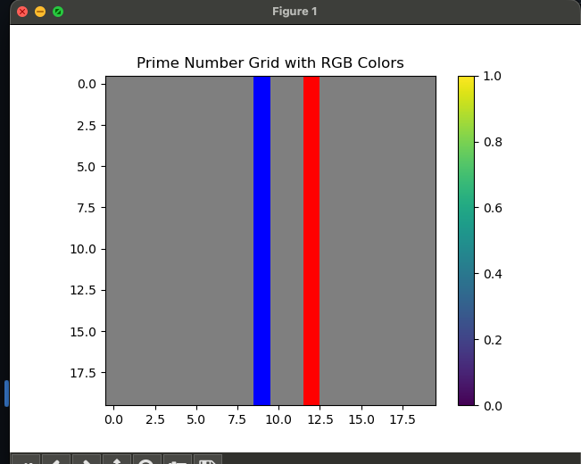  
  *Prime-based grid with fixed Y-axis – illustriert Symmetrie und Phase-Verteilung.*

## Visual Outputs

The experiment generates several types of visual outputs that are essential for understanding the system's dynamics:

- Synchronization Time vs Shell Size Plots
- Vortex Density Maps
- Phase Field Visualizations
- Network State Diagrams
- Resonance Field Maps

### Example Visuals

- **4D Phase Shift Projection**  
  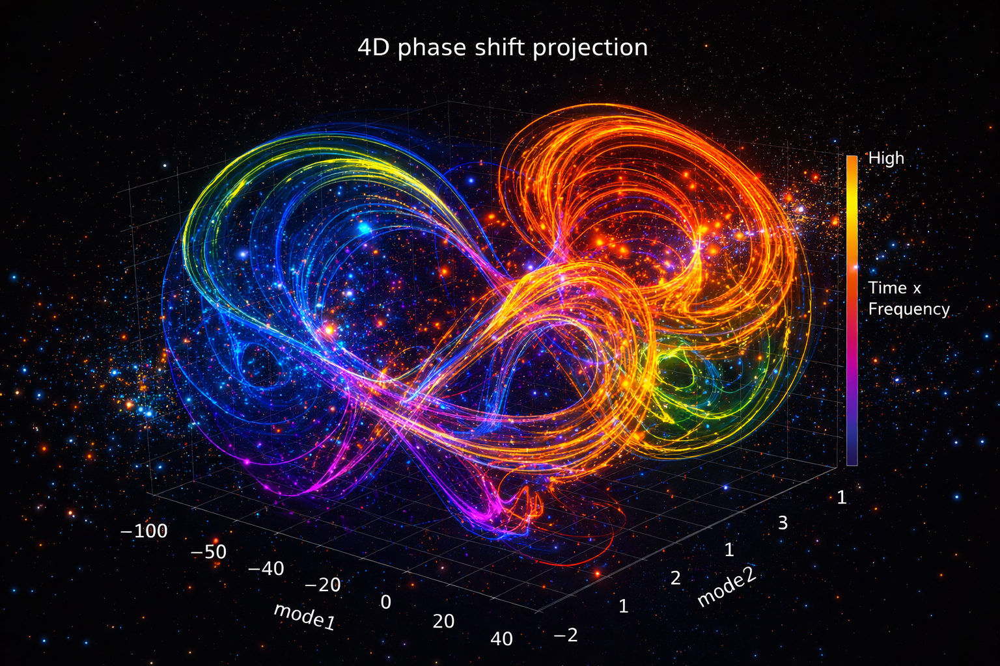  
  *4D phase shift projections showing resonance dynamics.*

- **Chimera State Overlap**  
    
  *Fraction of coherent vs incoherent states across time.*

- **Vortex Field Flow (3D Vortex Fields)**  
  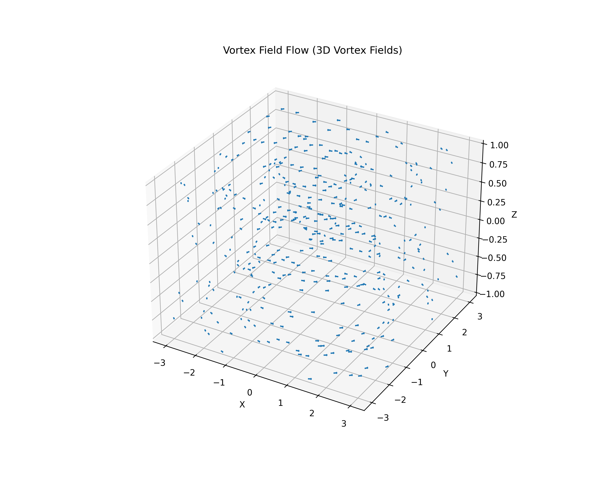  
  *Vortex dynamics in a 3D oscillator field.*

- **Vortex Density vs Shell**  
  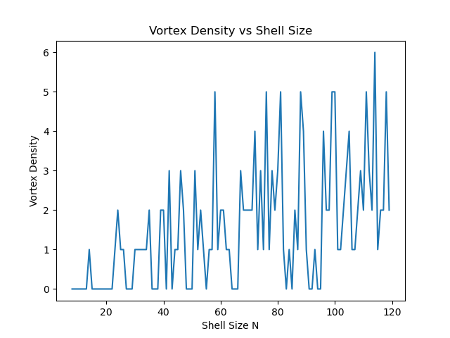  
  *Vortex density as a function of shell size – zeigt Topologie-Einfluss auf Defekte.*

- **Vortex Density vs Shell (v2)**  
  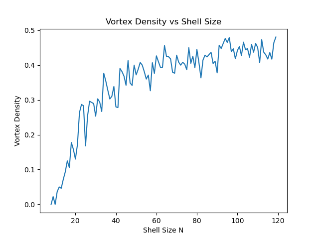  
  *Verbesserte Vortex-Dichte vs. Shell-Größe – Vergleich zu v1.*

- **Phase Surface 3D**  
  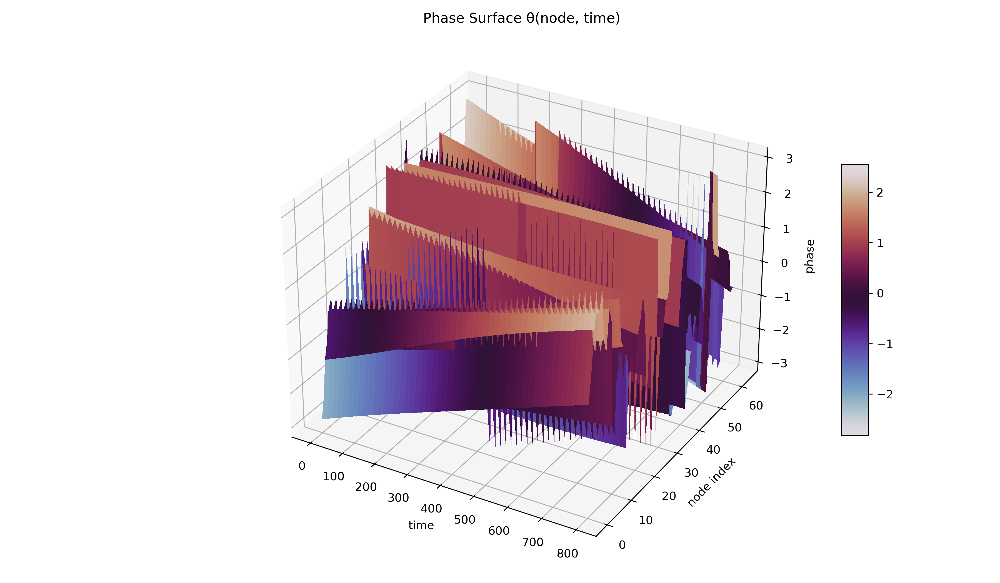  
  *3D-Phasenoberfläche aus den Oszillator-Dynamiken.*

## Weitere Highlights

- **Triad Defect Distance Histogram**  
  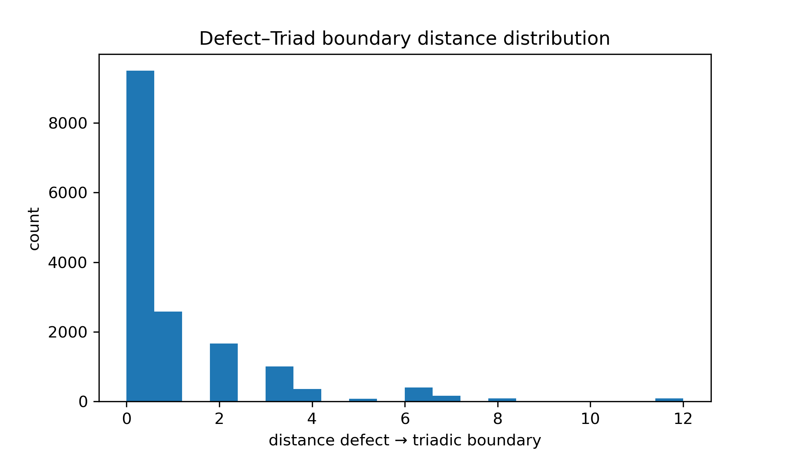  
  *Abstandsverteilung triadischer Defekte.*

- **Vortex Count vs Time**  
  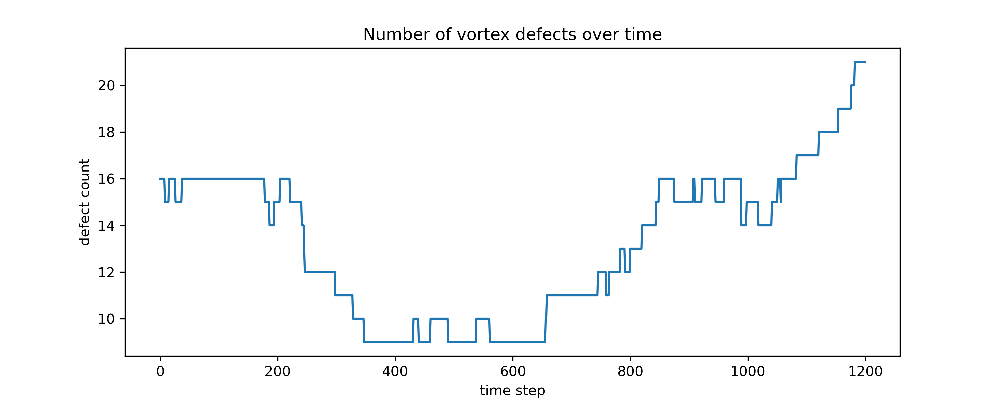  
  *Anzahl aktiver Vortex-Strukturen über die Zeit.*

- **Wave Coherence**  
  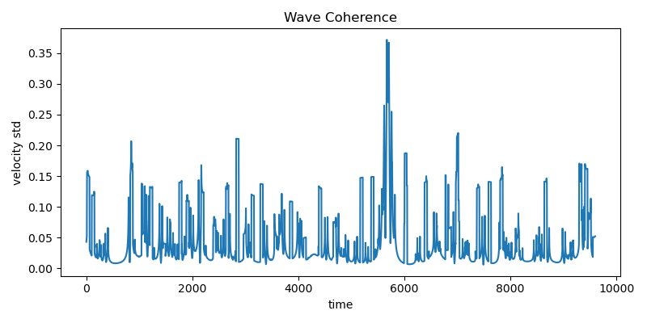  
  *Kohärenz der Wellenpropagation.*

- **Winding vs Shell**  
  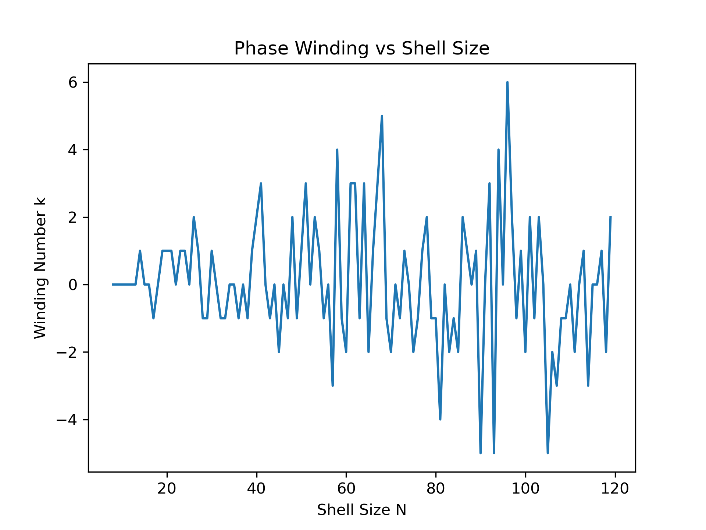  
  *Winding-Zahlen vs. Shell-Größe.*


**Vollständige Galerie:** Alle Dateien in `output/`, `topology/`, Root usw. – siehe `find . -name "*.png" | sort` für genaue Anzahl (~100+).

## Research Findings

Early results suggest a strong relationship between network topology and synchronization behavior. Observed phenomena include:

- **Rapid synchronization** in balanced symmetry graphs like C5 + C6 + C6.
- **Vortex formation** along cycle boundaries, visible during intermediate synchronization states.
- **Frustration** observed in networks where shell sizes (e.g., N = 29, 34) produce delayed synchronization.
- **Resonance patterns** identified in phase space, linking certain network topologies to stable synchronization zones.

### Example Result: Chimera State Detection

In several experiments, chimera states were detected using local coherence boundaries, revealing the presence of both coherent and incoherent regions within the same system. This aligns with the experimental goal of exploring how different topologies affect synchronization.

## Relation to NEXAH Kernel

These experiments serve as a **core testbed** for the NEXAH Kernel (ENGINE/nexah_kernel). They validate and extend key concepts:

- **Resonance Detection & Operators** (Ω-Projektion): Prime-Grids & Resonance-Webs liefern Metriken für Resonanzkanäle & Locking-Bänder
- **Regime Partitioning & Tipping Points**: Vortex- & Chimera-Detektion (core/) als Basis für Basin-Boundaries & Instabilitäts-Indikatoren
- **Frustration & Risk Geometry**: Shell-Frustration-Scans (topology/) als Proxy für Cascade-Risiken & Delayed Transitions
- **Topology as Relational Order** (META → ARCHY): Strukturierte Topologien testen, wie relationale Ordnung Regime-Landschaften formt
- **Export & Integration**: Alle relevanten Metriken (Vortex-Dichte, Sync-Time, Resonance-Score, Frustration-Level) werden über `kernel_bridge.py` exportiert und in Navigation-Layer (NEXAH) integriert

→ Die Experimente sind **kein isoliertes Toy-Modell**, sondern direkte Vorarbeit für finite, navigierbare Regime-Analyse in komplexen Systemen.

## Current Ordner-Struktur (Stand März 2026)

- **core/**              Detektoren (vortex_detector, chimera_state_detector, braid_entropy_estimator, phase_vortex_detector usw.)
- **resonance/**         Prime-Grids, Resonance-Lattices, Mode-Spektren, Band-Tracker
- **topology/**          Shell-Scans, Frustration, Layered Networks, Root-Family
- **vortex_chimera/**    Vortex, Chimera, Defects, Triads, Worldlines
- **analysis/**          Parameter-Scans, Drift/Lyapunov/Frequency-Analysen
- **visualization/**     Plot-Skripte (phase_attractor_*, phase_surface_*, vortex_topology_map.py usw.)
- **output/**            Generierte Ergebnisse (Plots, .npy, Reports – sehr groß!)
- **dynamics/**          Simulations-Code (aktuell leer)

## Running the Experiments

Die Skripte sind modular organisiert. Beispiele:

```bash
# Shell-Frustration-Scan starten
python -m topology.shell_frustration_scan

# Vortex-Dichte visualisieren
python -m visualization.vortex_topology_map

# Resonance-Lattice berechnen & plotten
python -m resonance.resonance_lattice_3D

# Via Kernel-Bridge (zukünftig)
from .kernel_bridge import extract_regime_metrics
```

## Status

Active exploratory research. Further results will be integrated into the NEXAH Kernel as new findings emerge.


