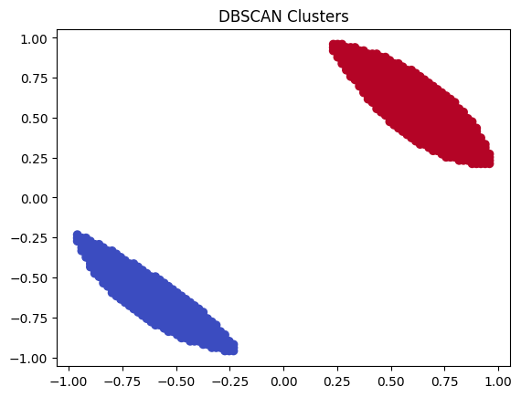
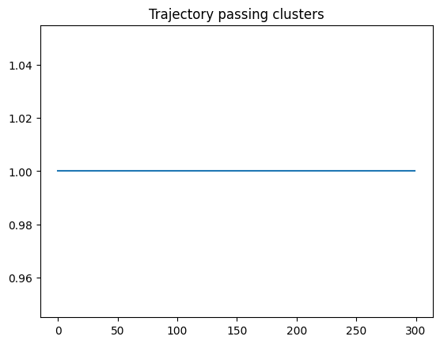
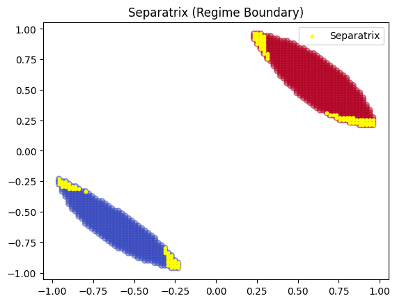
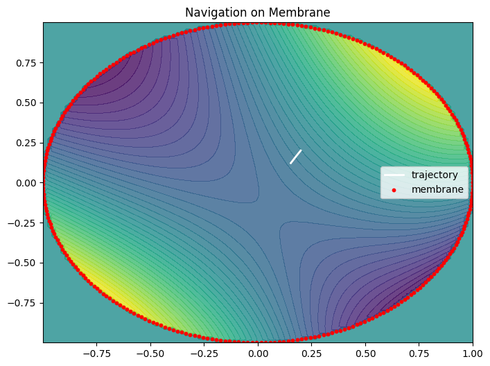
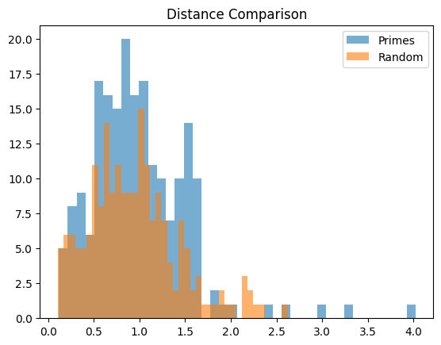
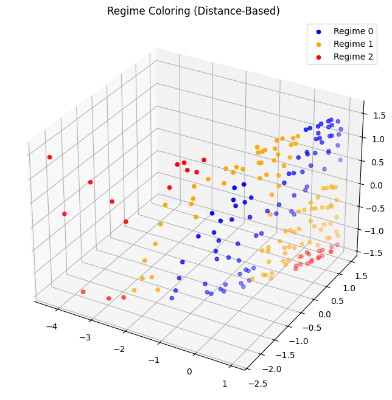

# Nonlinear Navigation – Visual Discovery Gallery

This document reconstructs the discovery process of nonlinear navigation
geometry using visual analysis, experiments, and structural interpretation.

It serves as a **bridge between theory, simulation, and intuition**.

---

# 1. Initial Observation

We began with trajectory data and clustering.

## DBSCAN Clustering

Observation:

- two dominant clusters appear
- stable regions exist in state space

→ first indication of **regime structure**

---

# 2. Trajectory Behavior

Observation:

- trajectories remain in clusters
- but occasionally transition between them

→ suggests existence of **transition paths**

---

# 3. Regime Boundary (Separatrix)

Observation:

- a boundary separates regimes
- transitions occur only across this structure

→ identification of **separatrix**

---

# 4. Membrane Interpretation

Observation:

- system behaves like motion on a surface
- transitions occur along narrow regions

→ reinterpretation as **navigation on a manifold**

---

# 5. Distance-Based Structure

Observation:

- points can be classified via distance to anchors
- symmetry between distances reveals transition zones

→ leads to **channel detection via distance symmetry**

---

# 6. Regime Coloring

Observation:

- clear segmentation into two regimes
- transition region lies between them

→ confirms **two-lobe structure**

---

# 7. Critical Point Discovery

Key observation:

- there exists a point where system balance is maximal

Approximate location:

[-0.414, -0.677]

Interpretation:

→ **critical switching point**

---

# 8. Global Geometry (T-Structure)

Conceptual reconstruction:

Regime A      |      Regime B
|
|   ← channel
|
critical point

Observation:

- system is not symmetric chaos
- but structured geometry

---

# 9. Internal Flow (Spool)

Observation:

- trajectories form spiral patterns
- internal motion is structured

→ chaos = **organized circulation**

---

# 10. Energy / Mode Space

Observation:

- system can be embedded in higher-dimensional structure
- modes reveal hidden organization

→ supports **non-random attractor hypothesis**

---

# 11. Membrane Reconstruction

Observation:

- system behaves like motion on a curved surface
- transition channel acts as a ridge / corridor

---

# 12. Key Insight

From all observations:

→ system contains:

- two stable regimes
- one transition channel
- one critical point

---

# 13. Final Interpretation

Nonlinear systems are:

- structured
- navigable
- geometrically organized

Navigation occurs via:

- transition channels
- control alignment
- internal flow exploitation

---

# 14. Relation to NEXAH

This gallery documents the emergence of:

→ **Nonlinear Navigation Geometry**

It connects:

- visual observation
- mathematical structure
- computational navigation

---

# 15. Status

This is a **living document**.

New experiments and visualizations will extend this gallery.

