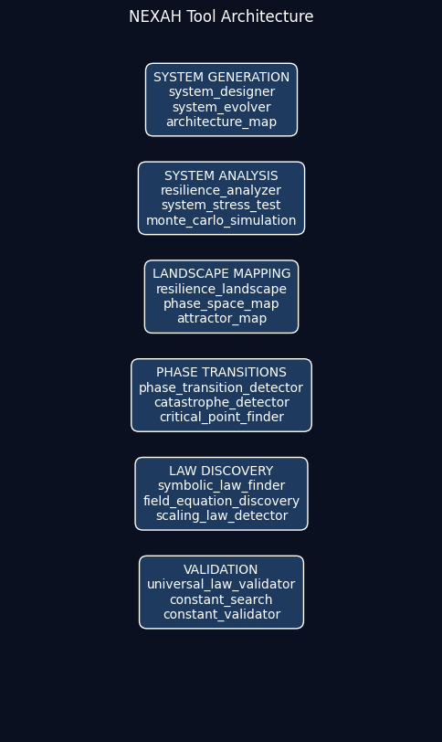

# NEXAH — Discovery & Dynamics Engine

NEXAH is a research framework for exploring the stability, evolution, and organization of complex systems.

It provides computational tools for:

• architecture generation  
• resilience analysis  
• phase transition detection  
• structural law discovery  
• theory validation  
• dynamic system simulation  
• topology extraction  
• field-based structure discovery  

The framework enables large-scale exploration of architecture spaces and the discovery of structural principles governing:

> **how systems evolve, transition, and organize into structured, connected fields**

---

# 🆕 Dynamic & Field-Based Systems

NEXAH has evolved beyond static architecture analysis.

It now supports:

• dynamic system simulation  
• flow-based structure formation  
• emergence of loops, channels, and networks  
• extraction of structure from trajectories  
• construction of probability and energy fields  
• divergence / curl field analysis  
• time-delayed coupling between field components  

---

# NEXAH Tools

## Overview

The `tools/` directory contains the computational infrastructure of the **NEXAH Simulation Environment**.

These tools form the experimental engine of the NEXAH project and support:

- architecture exploration  
- resilience analysis  
- topology mapping  
- evolutionary architecture search  
- symbolic law discovery  
- system visualization  

Together they implement a:

> **simulation laboratory for complex and dynamic systems**

---

# 🧭 Central Research Question

> How do systems evolve, transition, and organize into structured, navigable fields?

---

# 🔁 Discovery Pipeline (Extended)

NEXAH follows a structured discovery pipeline:
```text
Architecture Generation
↓
System Evolution
↓
Resilience Analysis
↓
Landscape Mapping
↓
Phase Transition Detection
↓
Structural Law Discovery
↓
Theory Validation
↓
Dynamics Simulation
↓
Probability Field
↓
Energy Landscape
↓
Field Operators (div / curl)
↓
Field Coupling
↓
Flow Structuring
↓
Topology Formation
↓
Topology Extraction
```

---

# 🔬 Key Capabilities

The system enables:

• exploration of large architecture spaces  
• detection of stability regions and transitions  
• discovery of structural laws  
• simulation of dynamic multi-agent systems  
• emergence of persistent flow structures  
• formation of loops, channels, and networks  
• extraction of topology from dynamic data  
• modeling of systems as transition fields  
• measurement of field coupling and delay  

---

# 🧠 Key Observations

Across simulations, the system demonstrates:

• geometry emerging from dynamics  
• flow organizing into persistent trajectories  
• separation of density and structural topology  
• formation of loop–channel networks  
• existence of transition nodes between regimes  
• emergence of probability and energy landscapes  
• dominance of rotational (curl-like) dynamics  
• coupling between expansion (divergence) and rotation (curl)  
• time-delayed feedback between field components  

---

# 🔧 Tool Capabilities

A full capability overview is documented here:

→ **[Tool Capabilities](TOOL_CAPABILITIES.md)**

This includes:

• architecture exploration engines  
• resilience analysis tools  
• landscape mapping systems  
• phase transition detectors  
• structural law discovery engines  
• theory validation frameworks  
• navigation layers  
• visualization systems  
• dynamic simulation engines  
• topology extraction tools  

---

# 🧰 Main Tool Categories

## 1. System Analysis

Tools for evaluating stability and system behavior.

Examples:

- `resilience_analyzer.py`  
- `system_stress_test.py`  
- `catastrophe_detector.py`  
- `risk_landscape.py`  

---

## 2. Architecture Exploration

Tools for generating and evolving system structures.

Examples:

- `system_designer.py`  
- `system_evolver.py`  
- `resilience_architecture_evolver.py`  
- `resilience_architecture_optimizer.py`  

---

## 3. Landscape Mapping

Tools for reconstructing stability landscapes.

Examples:

- `resilience_landscape.py`  
- `resilience_3d_landscape.py`  
- `phase_space_map.py`  

---

## 4. Phase Transition Detection

Tools for identifying regime changes.

Examples:

- `resilience_phase_transition_detector.py`  
- `resilience_critical_point_finder.py`  

---

## 5. Law Discovery Engine

Tools for discovering structural relationships.

Examples:

- `resilience_symbolic_equation_search.py`  
- `resilience_law_discovery.py`  

---

## 6. Validation & Theory Construction

Tools for validating discovered laws.

Examples:

- `resilience_universal_law_validator.py`  
- `resilience_theory_builder.py`  

---

## 7. Visualization Tools

Tools for visualizing system behavior.

Examples:

- `visualize_system.py`  
- `resilience_dashboard.py`  

---

## 8. Dynamics & Field Engine (NEW)

Tools for simulating and extracting dynamic structure.

Examples:

- `navigation_levelXX_*.py`  
- `loop_detector.py`  
- `channel_extractor.py`  
- `transition_node_finder.py`  
- `run_discovery_core_vXX.py`  

Capabilities:

• dynamic system simulation  
• flow structuring  
• loop detection  
• channel extraction  
• transition node detection  
• probability field modeling  
• energy landscape reconstruction  
• divergence / curl computation  
• time-lag coupling analysis  

---

# 🧩 Interpretation

NEXAH is no longer only a system analysis framework.

It is:

> a system that **generates, evolves, and extracts structure from dynamics**

and increasingly:

> a system that models dynamics as **coupled fields with measurable structure**

---

# 🖼️ System Architecture



The NEXAH tool ecosystem is organized into functional layers:

- META — relational structure  
- ARCHY — local dynamics  
- MESO — stability landscapes  
- MEVA — intervention strategies  

Extended layers:

- DYNAMICS — flow evolution  
- FIELD — divergence / curl / coupling  
- TOPOLOGY — loop/channel networks  

---

# 📊 Project Status

Simulation Phase: COMPLETE  
Dynamics Phase: COMPLETE  
Field Phase: ESTABLISHED  
Topology Phase: ACTIVE  
Research Phase: PLANNED  

---

# 🚀 Next Stage

• spectral / frequency analysis  
• mode decomposition  
• stability basin mapping  
• topology validation across runs  
• transition node identification  
• real-world system testing (e.g. networks, power grids)  

---

# 🧠 Summary

The NEXAH system enables:

• architecture exploration  
• stability analysis  
• law discovery  
• dynamic simulation  
• field construction  
• topology formation and extraction  

It forms a bridge between:

→ simulation  
→ structure discovery  
→ field modeling  
→ scientific interpretation  

---

# License

Apache 2.0
