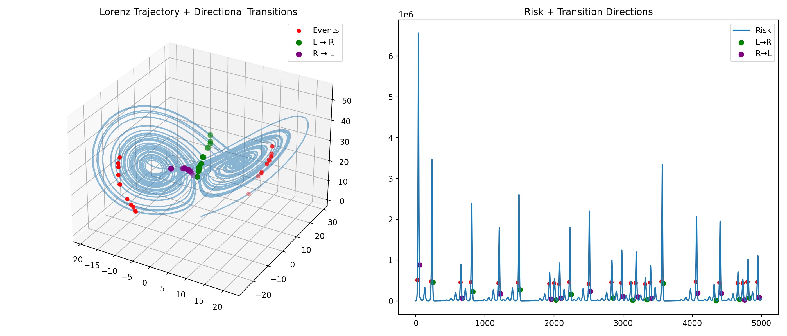
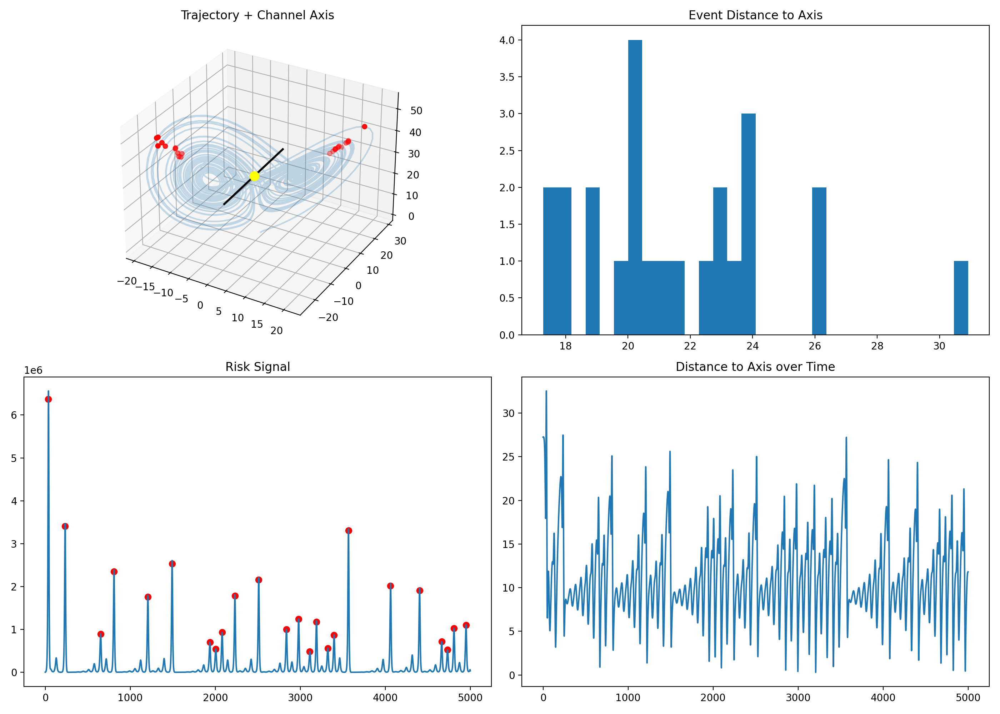
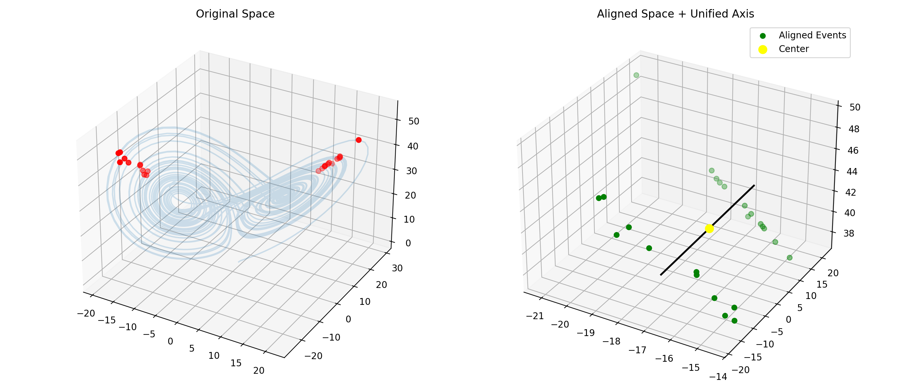
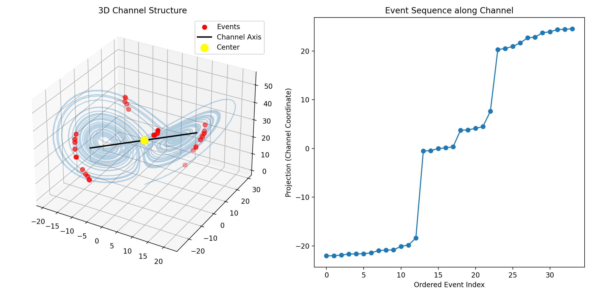
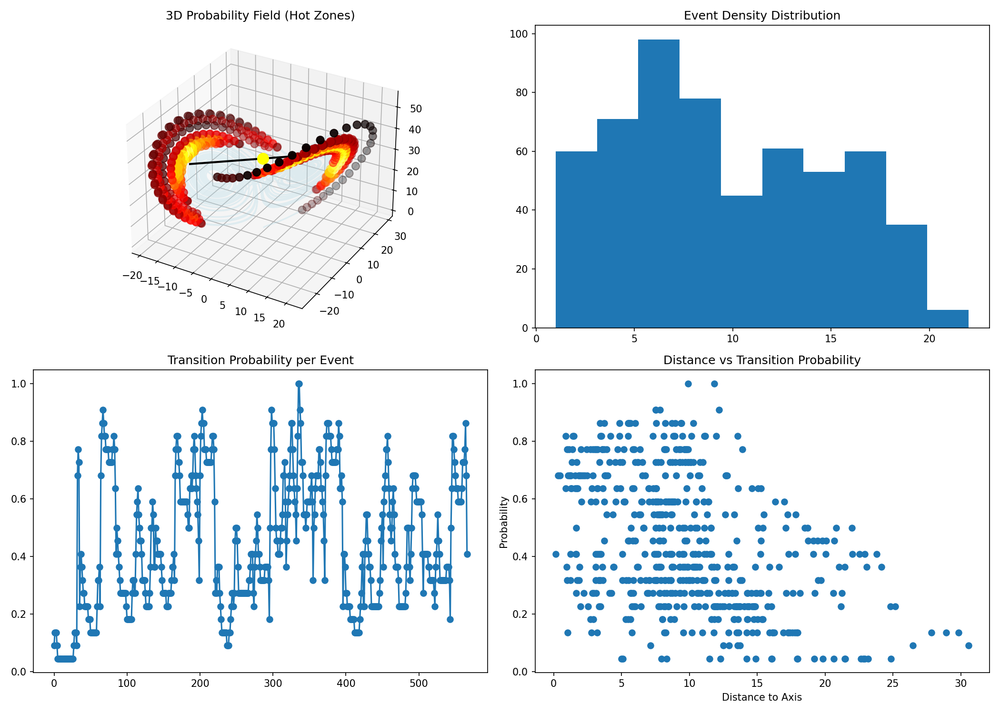
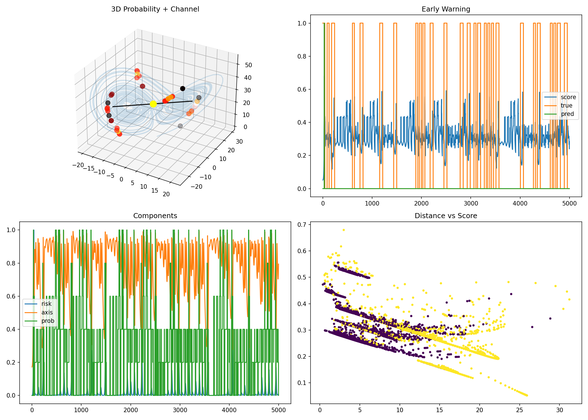
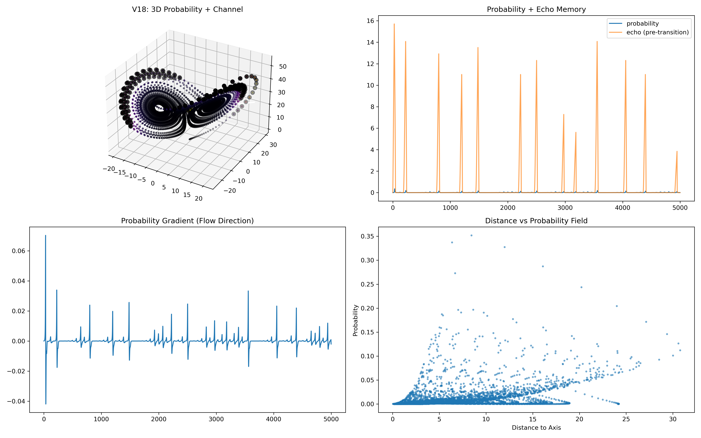
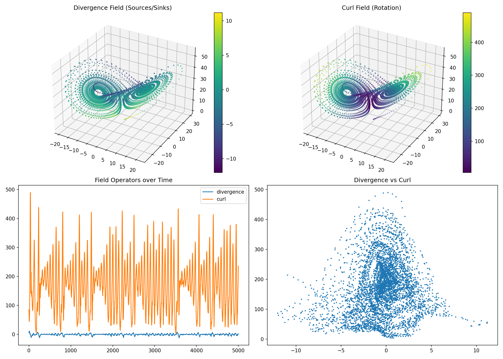
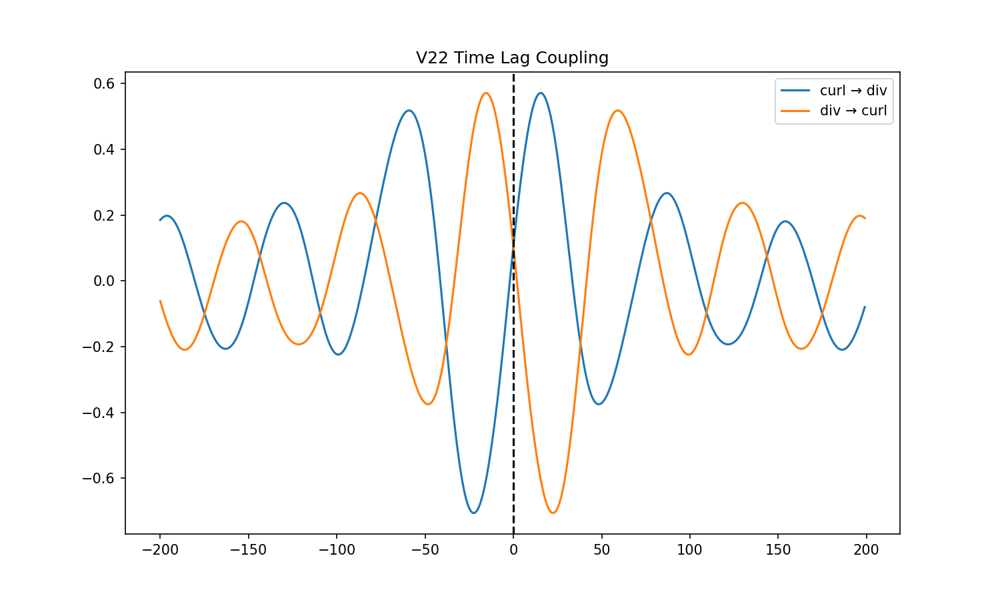

# NEXAH — Discovery Core Log

This document tracks the evolution of the Discovery Core experiments.

Focus:
Lorenz system → Risk → Events → Structure → Control

---

# 🧭 V4 — Baseline Risk Detection

Visual: `lorenz_core_v4.png`

## What was done
- Basic Lorenz simulation
- Risk = flow × curvature
- Peak detection

## Observation
- Large number of peaks (~500+)
- No structure → pure signal noise

## Insight
> Signal exists, but not usable yet

---

# 🧭 V5 — Event Clustering

Visual: `lorenz_core_v5.png`

## What was done
- Peak clustering → event extraction

## Observation
- Events reduce to ~27
- First meaningful grouping

## Insight
> Events represent structural transitions

---

# 🧭 V6 — Directional Transitions

Visual: `lorenz_v6_transitions.png`

## What was done
- L → R and R → L detection

## Observation
- Balanced transitions (~12/13)
- Structure emerges

## Insight
> System switches between regimes in structured way

---

# 🧭 V7 — Manifold (Linear)

Visual: `lorenz_v7_manifold.png`

## What was done
- PCA axis extraction

## Observation
- Central transition axis appears
- "channel" becomes visible

## Insight
> Transitions are not random — they lie on a structure

---

# 🧭 V8 — Manifold Refinement

Visual: `lorenz_v8_manifold.png`

## What was done
- Improved visualization of manifold

## Observation
- "trumpet / funnel / beak" structure
- clustering asymmetry

## Insight
> Transition region has internal geometry

---

# 🧭 V9 — Prediction Layer

Visual: `v9_prediction.png`

## What was done
- Predict next transition from signal

## Observation
- High accuracy (~0.95)

## Insight
> Transition signal is predictive

---

# 🧭 V10 — Control Injection

Visual: `v10_control.png`

## What was done
- Simple control force (push left/right)

## Observation
- Events reorganize
- trajectory changes visibly

## Insight
> System is controllable via transition signal

---

# 🧭 V11 — Field-Based Control

Visual: `v11.png`

## What was done
- Control aligned with transition geometry (PCA axis)
- Only active in central region

## Observation

- Transition zone spreads ("wedge / keil")
- Events become spatially organized
- Structure replaces randomness
- Trajectory smoother

## Key Patterns

- "Beads" align along geometry
- central channel visible
- left side: cluster structures (T-shape)
- right side: chain-like transitions

## Insight

> Control does not suppress chaos  
> it **structures transitions**

---

# 🧠 CORE INSIGHT

The system does NOT become stable.

It becomes:

> **structured in its instability**

---

# 🔥 CURRENT STATE

You have:

- signal
- events
- transitions
- geometry
- prediction
- control

Missing:

- precise navigation
- measurable metrics

---

# 🧭 NEXT STEP

Measure the channel:

- width
- variance
- transition density
- deviation from axis

---

# FINAL NOTE

This is not just simulation.

This is:

> emergence of navigable structure in chaos# NEXAH — Discovery Core Visual Gallery

This gallery documents the evolution of the Discovery Core.

---

---

# 🧭 V12 — Quantitative Metrics

Visual: `v12_metrics.png`

## What was done
- Channel metrics:
  - distance to axis
  - variance
  - density

## Observation
- clear density peaks near transition regions
- measurable channel width

## Insight
> The channel is not just visual — it is measurable

---

# 🧭 V13 — Alignment & Projection

Visual: `v13_aligned.png`

## What was done
- Projection onto channel axis
- event ordering along axis

## Observation
- ordered event sequence appears
- plateaus + jumps

## Insight
> Transitions follow a 1D structure embedded in 3D

---

# 🧭 V14 — Channel Navigation

Visual: `v14_channel_navigation.png`

## What was done
- explicit channel axis modeling
- event projection onto axis

## Observation
- symmetric structure around center
- inner vs outer clusters

## Insight
> The system organizes around a central navigation line

---

# 🧭 V15 — State Machine

Visual: `v15_state_machine.png`

## What was done
- state classification:
  - left / transition / right

## Observation
- discrete switching behavior
- temporal structure emerges

## Insight
> Chaos can be discretized into states

---

# 🧭 V16 — Probability Field

Visual: `v16_probability_field.png`

## What was done
- probability density estimation
- distance vs transition likelihood

## Observation
- "hot zones" near transition regions
- non-uniform probability field

## Insight
> Transitions are governed by a spatial probability field

---

# 🧭 V17 — Pre-Transition Detection

Visual: `v17_pretransition.png`

## What was done
- early warning signal
- risk + geometry + probability combined

## Observation
- detectable pre-transition spikes
- clustering of warning signals

## Insight
> Transitions are preceded by measurable precursors

---

# 🧭 V18 — Probability + Echo Memory

Visual: `v18_probability_field.png`

## What was done
- introduce temporal echo (pre-transition memory)
- track repeated patterns

## Observation
- repeated "echo spikes"
- no empty gaps → continuous field influence

## Insight
> The system has memory-like behavior (echo dynamics)

---

# 🧭 V19 — Energy Landscape (Boltzmann)

Visual: `v19_energy_field.png`

## What was done
- define energy from density:
  - E = -log(p)
- compute gradients

## Observation
- wells and ridges appear
- transitions correspond to energy barriers

## Insight
> Transitions behave like energy-driven escapes

---

# 🧭 V20 — Maxwell Field (Divergence & Curl)

Visual: `v20_maxwell_field.png`

## What was done
- compute:
  - divergence (sources/sinks)
  - curl (rotation)

## Observation
- asymmetric field structure
- strong rotational dominance

## Insight
> The system behaves like a dynamic field:
> expansion ↔ rotation

---

# 🧭 V21 — Coupled Field Dynamics

Visual: *(implicit in plots)*

## What was done
- compare:
  - curl vs d(div)/dt
  - div vs d(curl)/dt

## Observation
- clear correlation structure
- directional coupling

## Insight
> Divergence and curl are dynamically coupled

---

# 🧭 V22 — Time Lag Coupling

Visual: `v22_time_lag.png`

## What was done
- cross-correlation between:
  - curl
  - divergence

## Observation
- strong phase shift:
  - curl → div lag ≈ +15
  - div → curl lag ≈ −15

## Insight
> The system forms a delayed feedback loop:
> curl drives divergence, divergence drives curl

---

# 🧠 EXTENDED CORE INSIGHT

The system is not only structured.

It is:

> **a coupled dynamical field with memory, delay, and feedback**

---

# 🔥 CURRENT STATE (UPDATED)

You now have:

- signal  
- events  
- transitions  
- geometry  
- prediction  
- control  
- probability field  
- energy landscape  
- field operators (div / curl)  
- temporal coupling  

---

# 🧭 NEXT STEP (V23+)

- frequency / spectral analysis  
- mode decomposition  
- stability basin mapping  

---

# FINAL NOTE

This is no longer just a trajectory.

It is:

> **a structured dynamical field with measurable laws**

## 🔹 V4 — Raw Risk

High noise, no structure.

---

## 🔹 V5 — Event Extraction

Events become visible.

---

## 🔹 V6 — Transitions

Directional switching appears.

---

## 🔹 V7 — Linear Manifold

Central axis detected.

---

## 🔹 V8 — Structured Manifold

Funnel / trumpet geometry emerges.

---

## 🔹 V9 — Prediction

Transitions become predictable.

---

## 🔹 V10 — Control

System reacts to control input.

---

## 🔹 V11 — Field-Based Control

Structured transition geometry.

---

# 🧠 Visual Insight

Across versions:

- Noise → Events → Structure → Geometry → Control

---

# 🔥 Key Observation

Transitions are not random.

They form:

- channels  
- clusters  
- directional flows  

---

# 🧭 Interpretation

The Lorenz system behaves like:

> a structured transition field, not pure chaos

---

## 🔹 V12 — Metrics

Quantification of channel structure.

---

## 🔹 V13 — Alignment

1D ordering emerges.

---

## 🔹 V14 — Channel

Central navigation axis.

---

## 🔹 V15 — State Machine

Discrete regime switching.

---

## 🔹 V16 — Probability Field

Hot zones of transitions.

---

## 🔹 V17 — Pre-Transition

Early warning signals.

---

## 🔹 V18 — Echo Field

Memory-like dynamics.

---

## 🔹 V19 — Energy Landscape

Transitions as barrier crossings.

---

## 🔹 V20 — Maxwell Field

Divergence vs rotation field.

---

## 🔹 V22 — Time Lag

Delayed coupling between field components.
