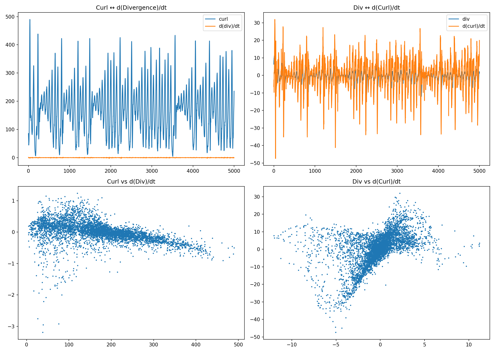

# 🧪 NEXAH — Discovery Visual Log

This gallery documents the **evolution of structure discovery**  
during early NEXAH experiments.

It is not a polished result view.

It is a **chronological research trace**.

---

## 🌀 V4 — Raw Signal

Initial signal extraction from Lorenz dynamics.

→ many peaks  
→ no clear structure  

---

## 🔁 V6 — Transition Detection

Transitions begin to emerge.

→ still noisy  
→ weak clustering  

---

## 🧭 V7–V8 — Manifold Emergence

Low-dimensional structure becomes visible.

→ trajectories align  
→ geometry appears  

---

## 🧠 V9 — Prediction Attempt

First attempt at predicting transitions.

→ unstable  
→ partial success  

---

## 🔧 V10–V12 — Control & Metrics

Introduction of:

- control  
- metrics  
- signal refinement  

---

## 🧭 V13–V15 — Alignment & Structure

Clear structural organization:

→ channels  
→ states  
→ transitions  

---

## 🌊 V16–V19 — Field Emergence

System begins to resemble:

→ probability field  
→ energy landscape  

---

## 🔬 V20–V22 — Field Structure & Coupling

Advanced observations:

→ divergence / curl structure  
→ delayed coupling  

---

## 🧠 Final Insight

Across all stages:

> structure was not imposed  
> it emerged from dynamics

---

## ⚠️ Note

These visuals represent:

- exploratory stages  
- intermediate interpretations  
- evolving understanding  

They are not final claims.

---

## 🧭 Context

This exploration led to:

→ `FIELD_LAYER/` (current core system)

---

**Status:** Research trace  
**Purpose:** transparency of discovery process
