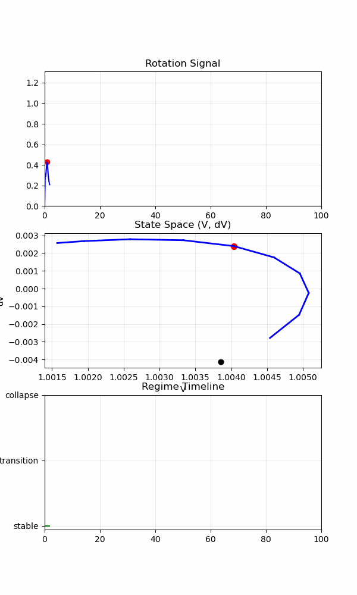
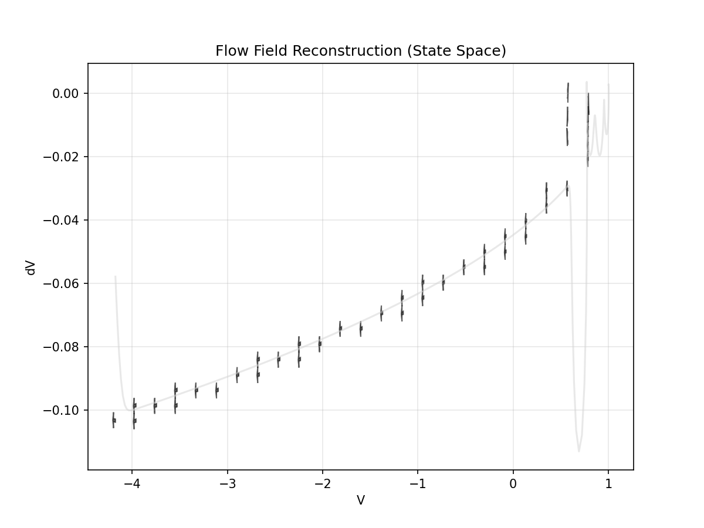
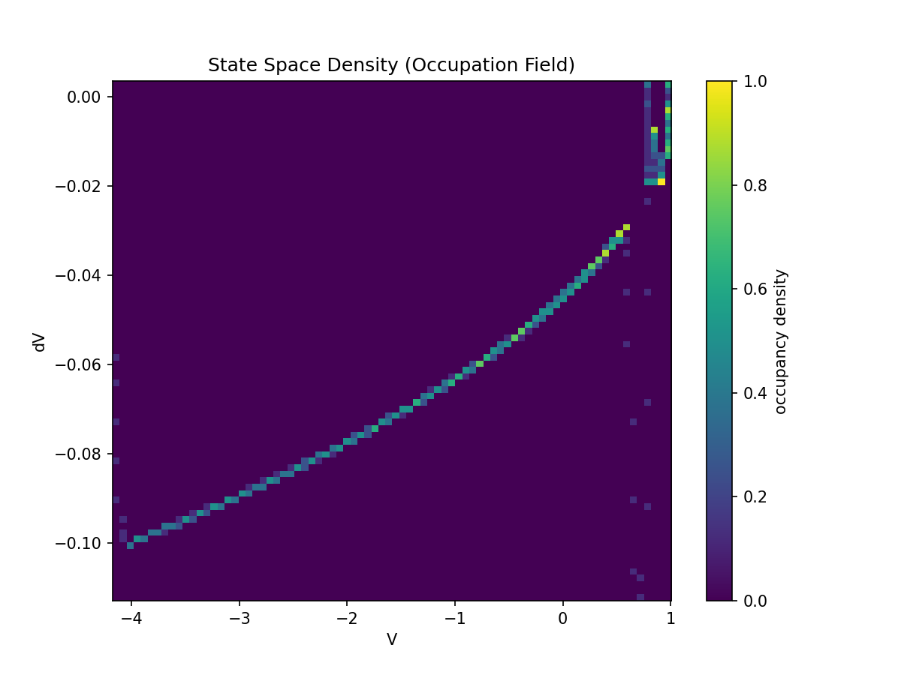
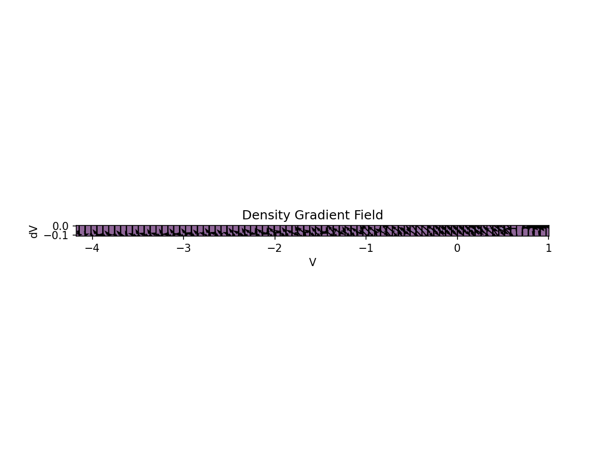
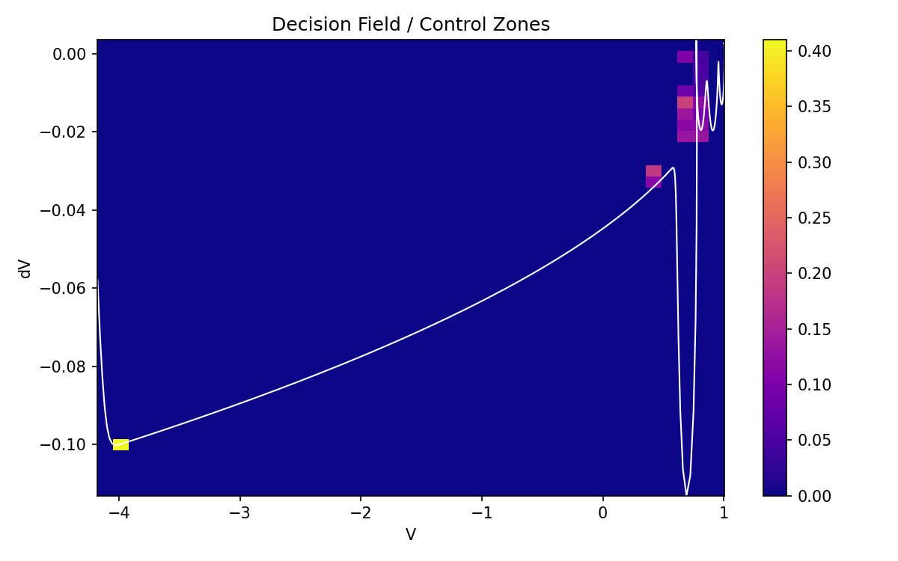
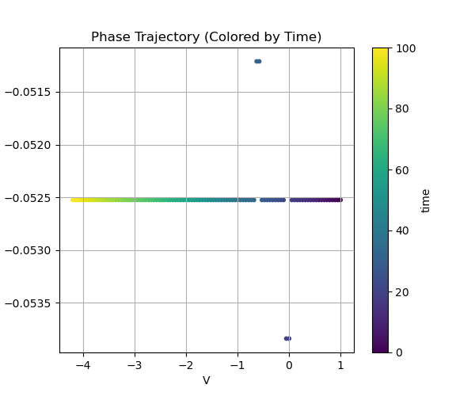

# ============================================================
# 📁 PROPOSED STRUCTURE — EXPERIMENTAL MODULE
# ============================================================

experimental/
│
├── README.md
│
├── 00_overview/
│   ├── NEXAH_MECHANISM.md
│   ├── navigation_vs_coupling.md
│   ├── three_regime_channel_model.md
│
├── 01_control/
│   ├── NEXAH_CONTROL.md
│   ├── control_sensitivity_field.md
│   ├── multi_field_control_implications.md
│
├── 02_models/
│   ├── multi_field_dynamics_model.md
│
├── 03_mapping/
│   ├── ieee_mapping_module.md
│
├── spiral_coupling/
├── scripts/
├── outputs/


# ============================================================
# 🧪 README.md — UPDATED (NAVIGATION + INDEX)
# ============================================================

# 🧪 NEXAH — Experimental Mechanism Lab
### (Structure → Flow → Constraint → Control)

---

# 🧭 Purpose

This directory is the **mechanism discovery layer** of NEXAH.

It is used to:

- reconstruct system dynamics as fields  
- identify flow, structure, and transitions  
- test control hypotheses  
- extract constraints of motion  

---

# ⚠️ Scope

```text
Validation Layer → proves results
Experimental Layer → discovers mechanisms
```

Nothing here is:

- validated  
- final  
- production-ready  

---

# 🧠 Core Insight

```text
Systems do NOT evolve as signals.

They evolve as motion inside structured fields.
```

---

# 🔬 Visual Evidence

## 🌀 Multilayer Dynamics


---

## 🧭 Flow Field


---

## 🧱 Channels


---

## 🌊 Gradient Field


---

## ⚡ Decision Zones


---

## 🔒 Constraint (Phase Space)


---

# 🧠 Structure of This Module

---

## 🔹 00 — System Overview

- [Mechanism Model](00_overview/NEXAH_MECHANISM.md)
- [Navigation vs Coupling](00_overview/navigation_vs_coupling.md)
- [Three-Regime Model](00_overview/three_regime_channel_model.md)

---

## 🔹 01 — Control Layer

- [Control Model](01_control/NEXAH_CONTROL.md)
- [Sensitivity Field](01_control/control_sensitivity_field.md)
- [Multi-Field Control](01_control/multi_field_control_implications.md)

---

## 🔹 02 — System Models

- [Multi-Field Dynamics](02_models/multi_field_dynamics_model.md)

---

## 🔹 03 — Real-World Mapping

- [IEEE Mapping](03_mapping/ieee_mapping_module.md)

---

## 🔹 Core Components

- `spiral_coupling/` → direction generation  
- `scripts/` → experimental execution  
- `outputs/` → visual evidence  

---

# 🔥 Core Discovery

```text
Control → absorbed
Flow → constrained
System → self-preserving
```

---

# 🔒 Constraint Law

```text
The system evolves on a constrained manifold.
```

---

# 🧠 Final Insight

```text
You are not controlling the system.

You are navigating the geometry
that the system allows.
```

---

Thomas K. R. Hofmann · NEXAH · 2026
