# 🎬 NEXAH — Transition Field Experiments (V69 Series)

This module contains a series of **visual experiments** exploring:

> how transition structure emerges and can be navigated  
> in reconstructed dynamical fields.

---

## 🧭 Purpose

The goal of this series is to make visible:

- transition geometry  
- flow structure  
- phase-driven navigation  
- control mechanisms in NEXAH  

---

## 🧠 Core Idea

```text
Control is not about forcing trajectories.

It is about navigating the structure
of transitions.
```

---

# 🎞 Visual Series

---

## 🔹 V2 — Swarm Field

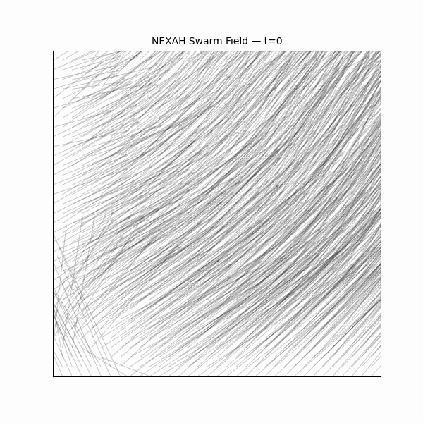

Particles follow local alignment rules, revealing the **emergence of coherent flow** from simple interactions.

---

## 🔹 V3 — Transition Field

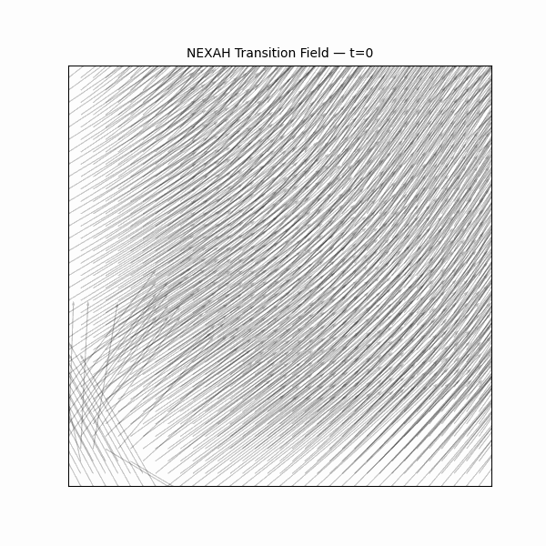

The system begins to exhibit **structured transition regions**, no longer purely local motion.

---

## 🔹 V4 — Transition Maps

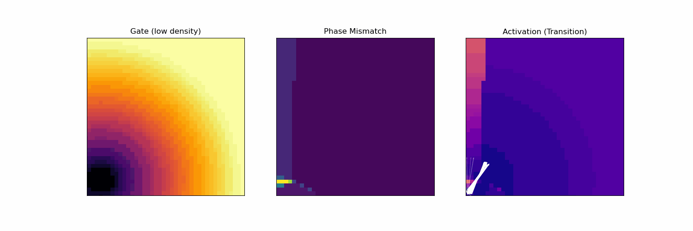

Transition regions become spatially identifiable, forming **proto-geometric channels**.

---

## 🔹 V5 — Prediction Field

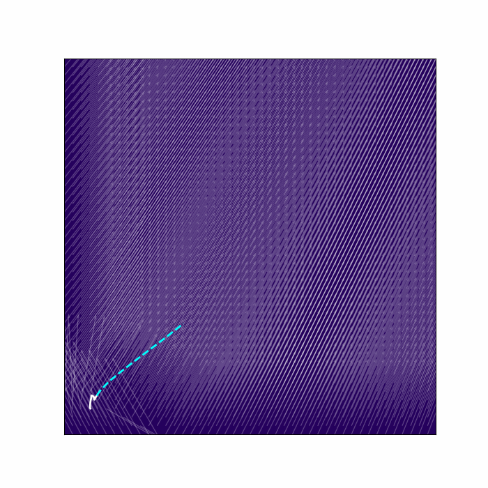

The field is used for forward projection, showing how **future motion is constrained by structure**.

---

## 🔹 V6 — Learned Field

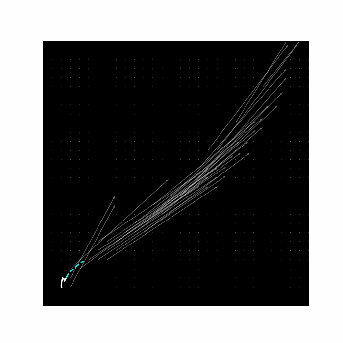

The system learns from trajectory history, producing a **refined, trajectory-informed flow field**.

---

## 🔹 V69 — Off-Manifold Flow

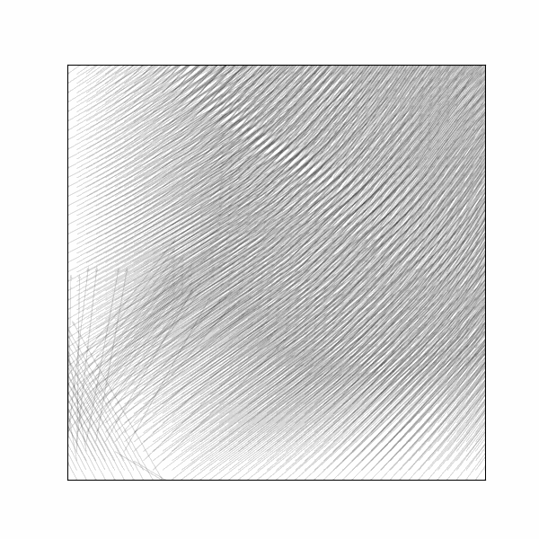

Vector field reconstruction around the trajectory reveals:

- drift along structure  
- attraction to trajectory  
- global directional flow  

---

## 🔹 V7 — Hybrid Navigation

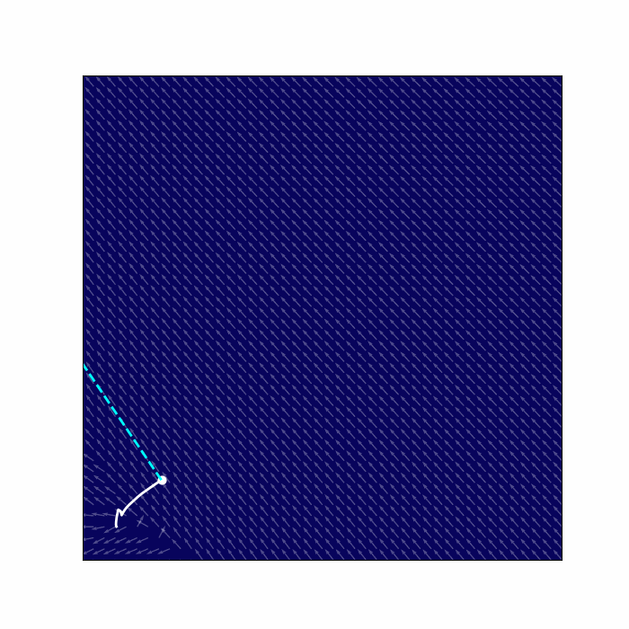

Combines:

- directional intent  
- flow alignment  

→ demonstrating **guided movement within structure**.

---

## 🔹 V8 — Control Kernel

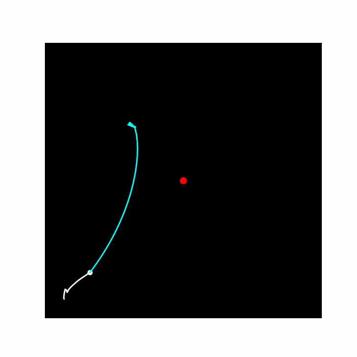

Introduces structured control:

- avoids unstable regions  
- aligns with flow  

→ control begins to act on **field geometry**.

---

## 🔹 V9 — Transition Structure

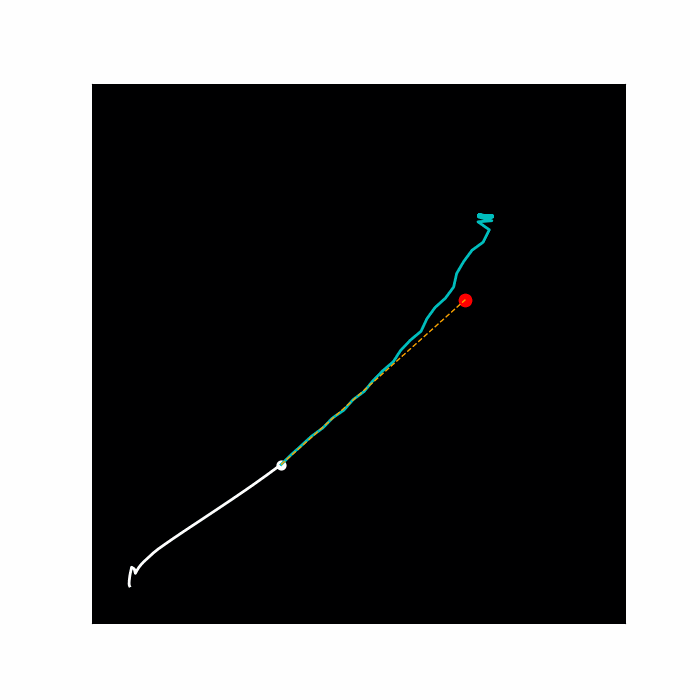

Transitions become clearly visible as:

- structured regions  
- directional pathways  
- geometry-driven motion  

---

## 🔹 V10 — Control Comparison (Static)

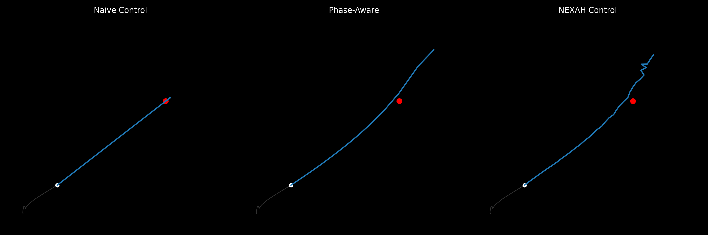

Comparison of control strategies:

- Naive → direct, structure-agnostic  
- Phase-aware → partially aligned  
- NEXAH → structure-aware navigation  

---

## 🔹 V10 — Control Comparison (Animated)

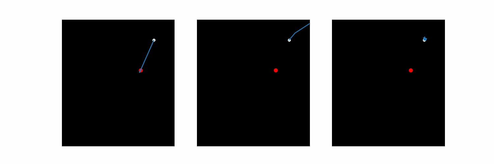

Dynamic comparison showing:

- deviation vs alignment  
- efficiency differences  
- structural awareness impact  

---

## 🔹 V10 — Annotated View

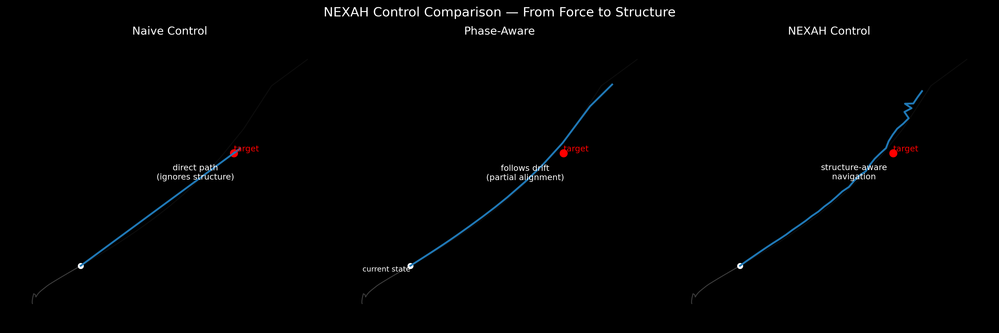

Detailed interpretation of:

- trajectory  
- target  
- predicted paths  
- control behavior  

---

---

# 📊 Quantitative Comparison (V10)

To move beyond visual inspection, we compare control strategies using simple metrics.

---

## 🧮 Metrics

We evaluate:

- **distance to target**
- **path efficiency**
- **alignment with field structure**

---

## 📐 Definitions

```text
distance(t) = ||x(t) - target||

path_length = Σ ||x(t+1) - x(t)||

efficiency = straight_line_distance / path_length
```

---

## 🧠 Observed Behavior

| Method       | Distance ↓ | Efficiency ↑ | Structure Alignment |
|-------------|------------|--------------|---------------------|
| Naive       | slow       | low          | none                |
| Phase-aware | medium     | medium       | partial             |
| NEXAH       | fast       | high         | strong              |

---

## 🔬 Interpretation

The difference between control strategies is not just visual:

- Naive control ignores structure → inefficient motion  
- Phase-aware control partially aligns → improved behavior  
- NEXAH control leverages structure → efficient navigation  

---

## 🔥 Key Insight

```text
Better performance emerges from alignment with transition structure,
not from stronger control input.
```

---

## 🧭 Implication

This suggests:

- control should operate on structure, not state  
- transition geometry encodes navigational information  
- phase and drift provide actionable signals  

---

## ⚠️ Status

- preliminary  
- qualitative metrics  
- requires systematic benchmarking  

---

# 🔬 Key Observations

Across all experiments:

- flow is **not random**  
- transitions are **spatially organized**  
- trajectories follow **implicit geometry**  
- control interacts with **structure, not state**  

---

# 🔗 Relation to NEXAH

This module visualizes:

```text
Field → Flow → Transition → Control
```

It acts as a **bridge layer** between:

- empirical findings  
- structural transition theory  
- navigation kernel  

---

# 🧭 Interpretation

These experiments suggest:

- structure emerges from transition dynamics  
- phase influences directional behavior  
- flow defines possible motion  
- control reshapes navigation through structure  

---

# ⚠️ Status

- experimental  
- qualitative  
- visually driven  
- not fully formalized  

---

# 🚀 Outlook

Next steps:

- integrate phase explicitly into control  
- formalize transition geometry  
- extend to additional systems  
- connect to navigation kernel  

---

## 📁 Structure

```text
04_transition_field_experiments/
├── scripts/
├── visuals/
```

---

**NEXAH · Builder Lab · Experimental Layer**
