# 🧪 NEXAH — Experimental Building Log

---

# 🧭 Purpose

Track all experimental scripts + results with:

- visuals  
- interpretation  
- structural insight  

---

# ⚠️ Important

```
This is NOT a validation log.
This is a mechanism discovery log.
```

---
```
# ============================================================
# RUN 022 — HYBRID NAVIGATION
# ============================================================
```
## 📊 Visuals

# RUN 022 — Hybrid Navigation

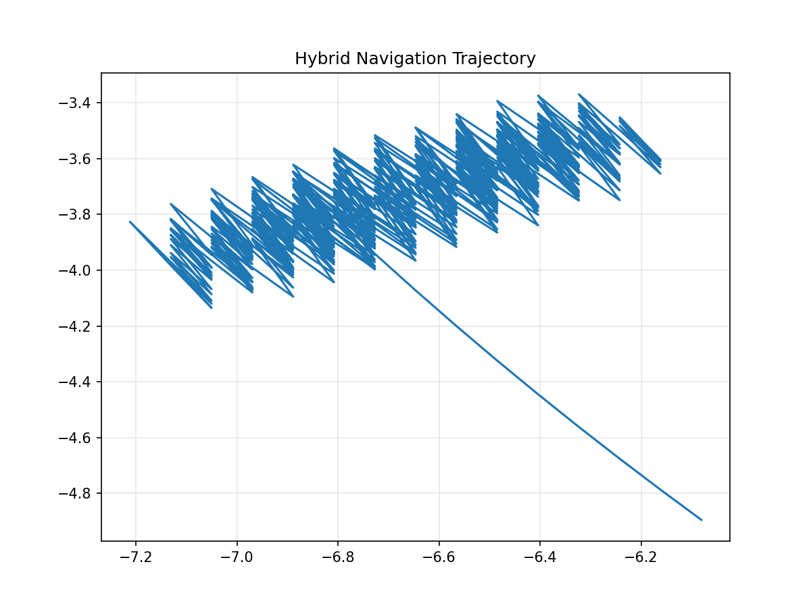

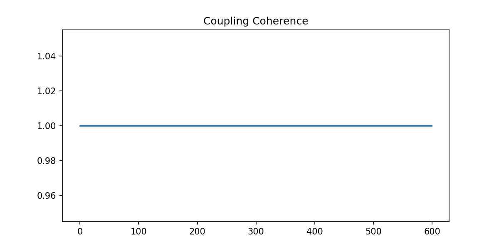

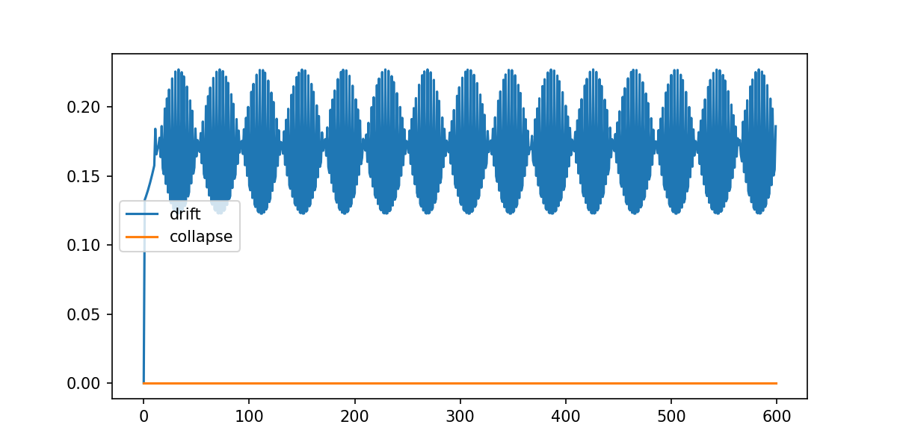

**Key insight:**

```text

Hybrid navigation produces coherent oscillatory motion,

but coherence remains locked at 1.0.

This suggests the coupling layer is still too symmetric / over-stabilized.

```

---

## Goal

```
Spiral Coupling → direction
Navigator       → execution
```

---

## Result

- structured oscillatory trajectory  
- diamond / rectangular loop patterns  
- coherence ≈ 1.0  

---

## Interpretation

```
System forms a stable oscillatory attractor.
```

- no collapse  
- no transition  
- purely coherent regime  

---

## Insight

```
Coupling stabilizes motion too strongly.
```

→ system gets trapped in **Regime 1-like behavior**

---
```
# ============================================================
# RUN 023 — ROTATION EVENT DETECTOR
# ============================================================
```
## 📊 Visual

# RUN 023 — Rotation Event Detector

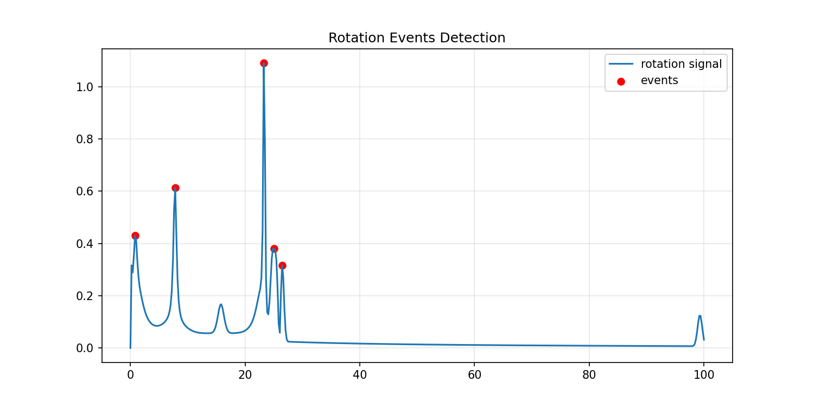

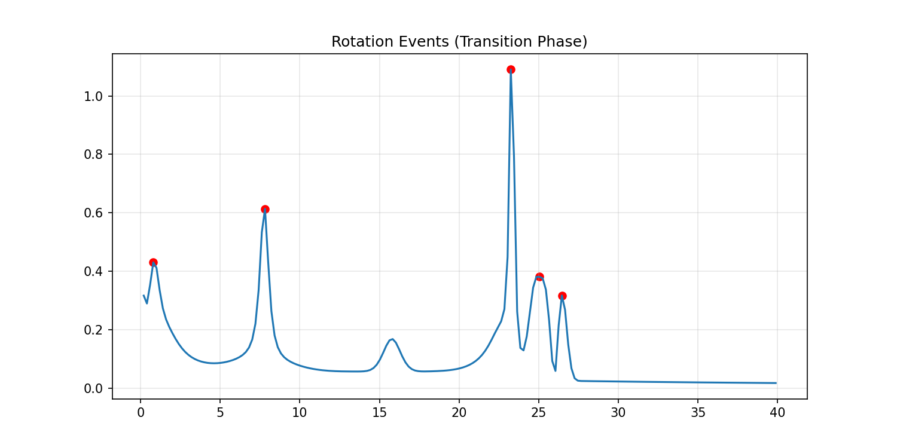

**Key insight:**

```text

Rotation appears as discrete spikes in the signal.

These are NOT continuous oscillations,

but localized structural reconfiguration events.

```

---

## Result

```
5 rotation events detected
```

---

## Insight

```
Rotation is discrete, not continuous.
```

→ peaks = local structural reconfigurations  

---
```
# ============================================================
# RUN 024 — ROTATION VS REGION MAP
# ============================================================
```
## 📊 Visuals

# RUN 024 — Rotation Events vs Region Map

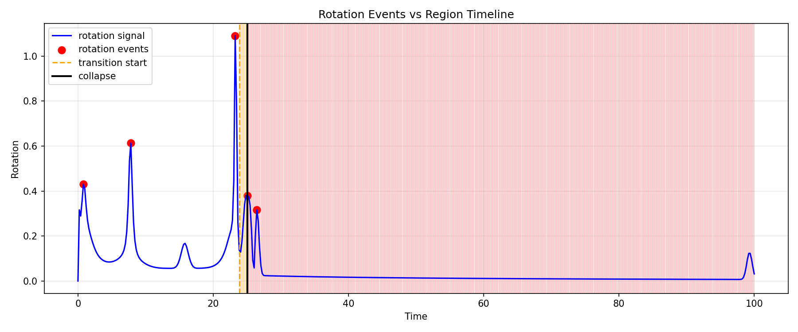

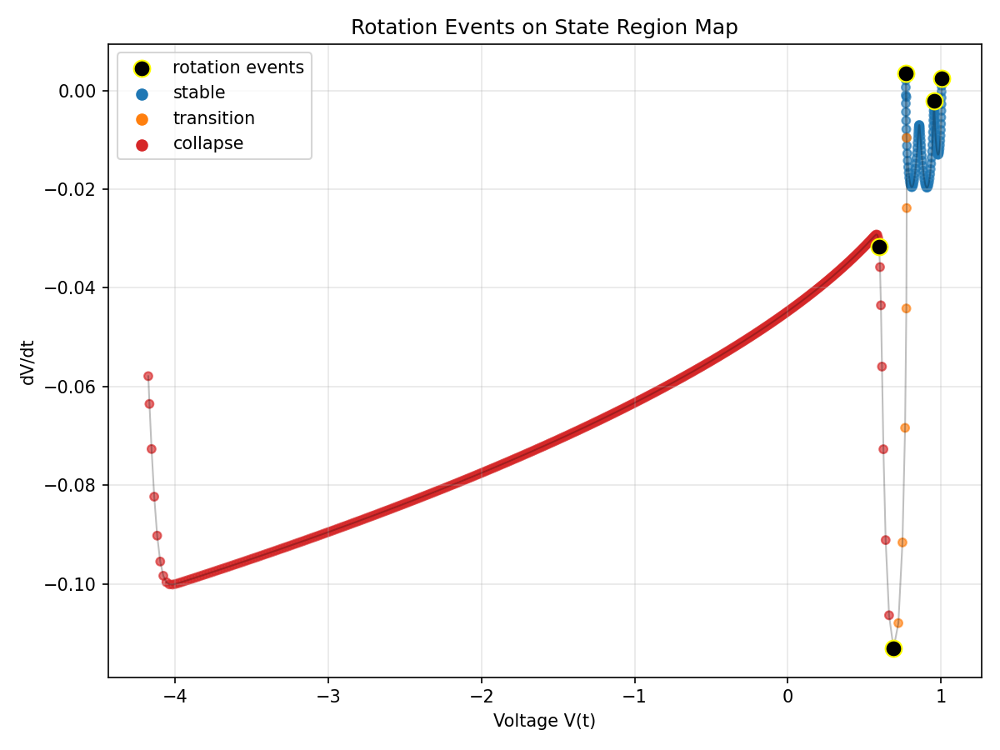

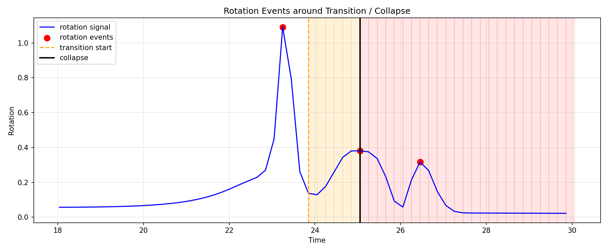

**Key insight:**

```text

Rotation events occur in stable and collapse regions,

but not inside the transition region.
```

---

## Result

```
Events:
stable, stable, stable, collapse, collapse
```

---

## Key Observation

```
NO events in transition region
```

---

## Insight (CRITICAL)

```
Transition = flow
Rotation   = event
```

---
```
# ============================================================
# RUN 025 — EVENT SEQUENCE MODEL
# ============================================================
```
## 📊 Visual

# RUN 025 — Event Sequence Model

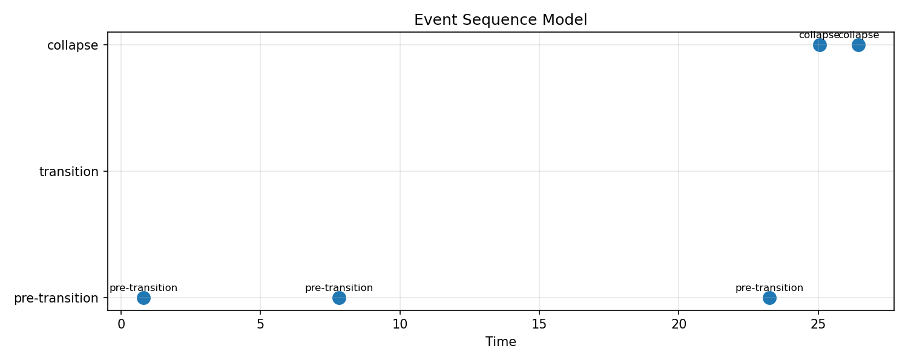

**Key insight:**

```text

Rotation events form a sequence:

pre-transition → pre-transition → pre-transition → collapse → collapse

Transition itself appears flow-driven, not event-driven.

```

---

# 🧠 Current Mechanism Insight

```text

rotation events = local reconfiguration points

transition      = smooth directed flow

collapse        = breakdown / re-emergence of rotation

```

---

# ⚡ Experimental Model

```text

event → flow → event

```

---

## Result

```
pre → pre → pre → collapse → collapse
```

---

## Interpretation

System dynamics split into:

```
1. event phase (rotation)
2. flow phase (transition)
3. breakdown phase (collapse)
```

---

## Insight

```
Instability is a SEQUENCE, not a signal.
```

---
```
# ============================================================
# 🧠 GLOBAL STRUCTURE (EMERGING)
# ============================================================
```

## Observed Mechanism

```
rotation → drift → rotation
```

---

## Phase Model

```
[stable]
    ↓ (rotation events)
[pre-transition]
    ↓ (drift / flow)
[transition]
    ↓
[collapse]
    ↓ (rotation returns)
[post-collapse]
```

---

# 🔥 IMPORTANT BREAKTHROUGH

```
Rotation disappears exactly when flow dominates.
```

Meaning:

- system is not switching  
- system is being transported  

---

# 🧭 Meta Insight

You now have **two orthogonal grids**:

---

## Grid 1 — State Space

```
(V, dV, d²V)
```

→ geometric structure  

---

## Grid 2 — Event Layer

```
rotation peaks
```

→ discrete structural events  

---

## Combined View

```
events happen ON TOP of flow geometry
```

---

# 🚀 Next Direction

- inject perturbation into hybrid system  
- force transition regime  
- test:

```
does rotation disappear there too?
```

---

# ⚡ NEXAH (Experimental Form)

```
event → flow → event
```

```
structure = superposition of:
    geometry + event layer
```

```
system = moving + reconfiguring object
```

```
# ============================================================
# RUN 026 — MULTILAYER FLOW ANIMATION
# ============================================================
```

## 📊 Visual

# RUN 026 — Multilayer Flow Animation


---

**Key insight:**

```text
The system must be observed across multiple layers simultaneously:

- signal (rotation)
- state space (geometry)
- regime timeline (structure)

Only the combination reveals the true dynamics.
```

---

## Result

```
A synchronized 3-layer system:

1. rotation signal (events)
2. state space trajectory (geometry)
3. regime evolution (structure)
```

---

## Core Observation

```text
The blue signal (V(t)) is NOT a signal.

It is a projection of motion in state space.
```

---

## Structural Behavior

### 1. State Space

- visible loop structures ("micro-loops")
- contraction → expansion behavior
- local spiraling before collapse  

---

### 2. Rotation Layer

- discrete spikes (events)
- disappear during transition  
- reappear during collapse  

---

### 3. Regime Layer

- stable → transition → collapse  
- sharp boundary between regimes  
- transition appears as smooth transport  

---

## Critical Insight

```text
Transition is not an event.

It is a FLOW.
```

---

## Combined Interpretation

```text
Event Layer     → rotation spikes
Geometry Layer  → loops + trajectories
Regime Layer    → system phase

System behavior = coupling of all three
```

---

## Breakthrough

```text
We can now SEE:

- when the system rotates
- when it flows
- when it collapses
```

---

## Deep Insight

```text
The system does not evolve as a signal.

It evolves as motion inside a structured field.
```

---

## Extended Model

```text
event → flow → collapse → event
```

---

## Important Detail

```text
Rotation disappears exactly when:

flow dominates the system dynamics
```

→ confirms:

```
flow ≠ oscillation
flow ≠ event
flow = transport mechanism
```

---

## New Structural View

```
STATE SPACE
→ defines geometry

EVENT LAYER
→ defines reconfiguration points

FLOW FIELD
→ defines motion between them
```

---

## Visual Insight (CRITICAL)

```text
Only the multilayer view reveals:

- shrinking before collapse
- expansion after transition
- loop formation inside stable regions
```

Single plots cannot show this.

---

## Meta Insight

```text
This is the first time the system becomes:

visually navigable
```

---

## Interpretation Upgrade

Before:

```
signal → threshold → collapse
```

Now:

```
geometry → flow → event → collapse
```

---

## Insight

```text
Instability is not a value.

It is a geometric process.
```

---

## Next Direction

```
1. reconstruct flow field explicitly
2. detect flow channels
3. test intervention (control layer)
```

---

# 🚀 NEW SYSTEM VIEW (UPDATED)

```
geometry + events + flow = system dynamics
```

---

# ⚡ NEXAH (Refined)

```
structure → flow → event → transformation
```

```
system = moving field with discrete reconfiguration points
```
```
# ============================================================
# RUN 027 — FLOW FIELD RECONSTRUCTION
# ============================================================
```
## 📊 Visual


---

**Key insight:**

```text
The system exhibits a continuous flow field structure,
not random motion.
```

---

## Insight

```
Flow can be reconstructed from trajectory.
```

→ system = field, not signal  

---
```
# ============================================================
# RUN 028 — FLOW CHANNEL DETECTION
# ============================================================
```
## 📊 Visual


---

**Key insight:**

```text
Flow is not uniform.
It is organized into channels.
```

---

## Insight

```
Motion is constrained to preferred paths.
```

→ emergence of "lanes" in state space  

---
```
# ============================================================
# RUN 029 — FLOW STABILITY MAP
# ============================================================
```
## 📊 Visual


---

**Key insight:**

```text
Some regions resist perturbation strongly,
others amplify it.
```

---

## Insight

```
Stability is spatially distributed.
```

→ first indication of control zones  

---
```
# ============================================================
# RUN 030 — NOISE ROBUSTNESS TEST
# ============================================================
```
## 📊 Result

```text
entropy increases with noise,
structure remains intact
```

---

**Key insight:**

```text
System structure survives noise injection.
```

---

## Insight

```
Dynamics are robust, not fragile.
```

→ structure ≠ noise artifact  

---
```
# ============================================================
# RUN 031 — LOCAL FLOW ENTROPY
# ============================================================
```
## 📊 Visuals


---

**Key insight:**

```text
Entropy is highly localized in specific regions.
```

---

## Observation

```
Strong entropy cluster around t ≈ 20–26
```

---

## Insight

```
These regions act as transition gates.
```

→ first appearance of your "antenna block"  

---
```
# ============================================================
# 🧠 GLOBAL TRANSITION (RUN 027–031)
# ============================================================
```
## Structural Shift

Before:

```
signal-based view
```

After:

```
field-based view
```

---

## Emerging Model

```
flow field → channels → stability → entropy → gates
```

---

## BREAKTHROUGH

```text
The system is structured BEFORE control is applied.
```

---

## Critical Insight

```
Control must align with existing structure.
```

---

## Connection to Later Runs

```
Run 031 → identifies gates
Run 032 → defines decision zones
Run 033+ → attempts control
```

---

## Meta Insight

```text
You cannot control what you have not mapped.
```

---

```
# ============================================================
# RUN 032 — DECISION FIELD / CONTROL ZONES
# ============================================================
```
## 📊 Visuals

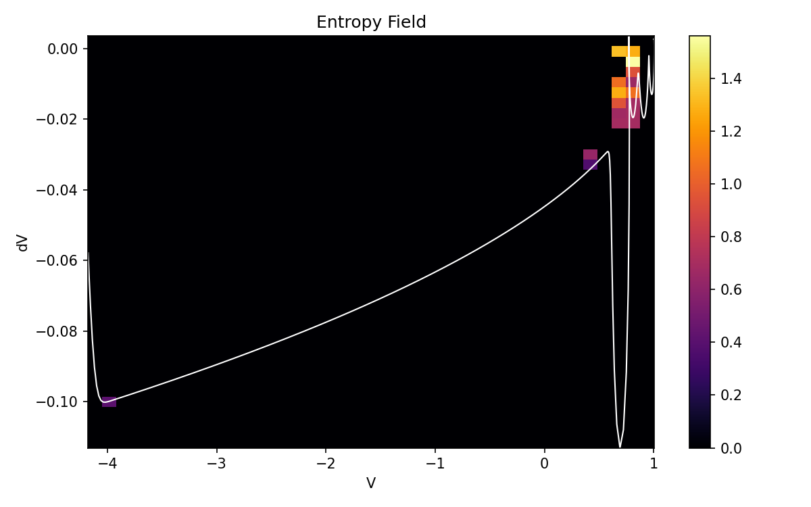

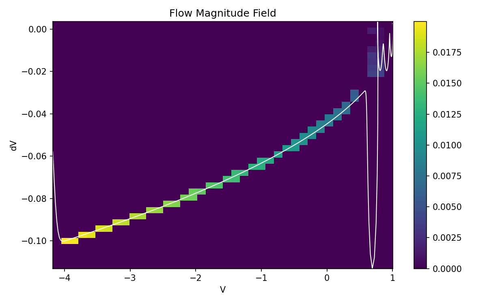


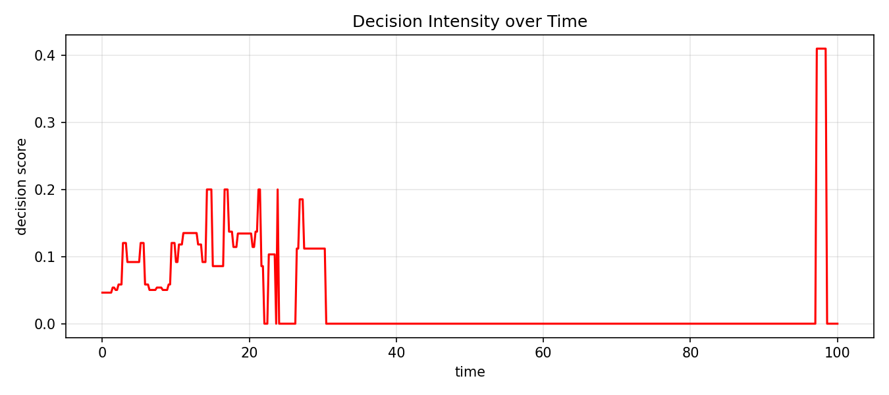

---

**Key insight:**

```text
Control is only possible where entropy AND flow overlap.
```

---

## Result

```
active_control_cells = 6
threshold ≈ top 10% entropy
```

---

## Insight

```
Decision zones are sparse and localized.
```

→ system is mostly uncontrollable  
→ only small "gates" exist  

---
```
# ============================================================
# RUN 033 — CONTROL INJECTION TEST
# ============================================================
```
## 📊 Visuals


---

**Key insight:**

```text
Control only creates small local deviations.
```

---

## Result

```
max deviation ≈ 0.02
```

---

## Insight

```
System resists external perturbation.
```

---
```
# ============================================================
# RUN 034 — FLOW-ALIGNED CONTROL
# ============================================================
```
## 📊 Visuals


---

**Key insight:**

```text
Control aligned with flow minimizes disruption.
```

---

## Insight

```
Flow-aligned control is absorbed by the system.
```

→ no escape  
→ no instability  

---
```
# ============================================================
# RUN 035 — ITERATIVE CONTROL
# ============================================================
```
## 📊 Visuals


---

**Key insight:**

```text
Small control accumulates, but remains localized.
```

---

## Result

```
iterations = 5
max deviation ≈ 0.05
```

---

## Insight

```
Control integrates but does not propagate.
```

---
```
# ============================================================
# RUN 036 — PHASE-SHIFT CONTROL
# ============================================================
```
## 📊 Visuals


---

**Key insight:**

```text
Phase-aligned control creates structured drift.
```

---

## Result

```
max deviation ≈ 0.10
```

---

## Insight

```
System reacts strongly to phase perturbation,
but still returns to manifold.
```

---
```
# ============================================================
# RUN 037 — REGIME FLIP ATTEMPT
# ============================================================
```
## 📊 Visuals

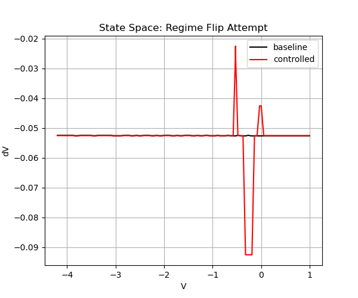

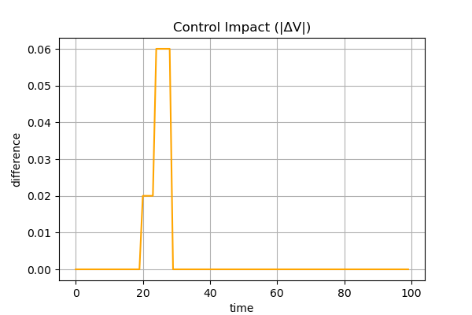

---

**Key insight:**

```text
Asymmetric forcing attempts regime transition but fails.
```

---

## Insight

```
System resists regime flip.
```

→ no separatrix crossing  

---
```
# ============================================================
# RUN 038 — REGIME ESCAPE DRIFT
# ============================================================
```
## 📊 Visuals

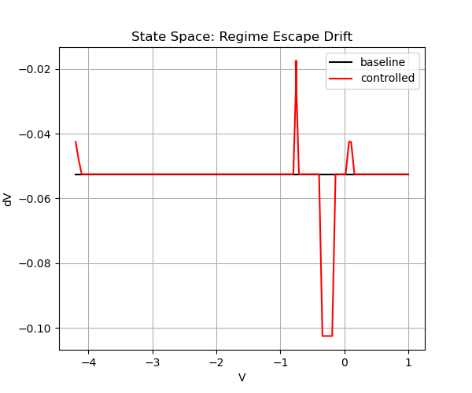

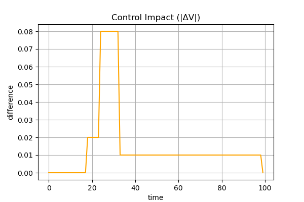

---

**Key insight:**

```text
Post-gate drift attempts escape but stabilizes.
```

---

## Result

```
drift_active = true
```

---

## Insight

```
System allows drift, but prevents escape.
```

---
```
# ============================================================
# RUN 039 — ESCAPE VECTOR CONTROL
# ============================================================
```
## 📊 Visuals


---

**Key insight:**

```text
Curvature-based control produces oscillatory escape attempts.
```

---

## Insight

```
System reacts with oscillation, not transition.
```

→ spike / counter-spike pattern  

---
```
# ============================================================
# RUN 040 — PHASE SPACE CONTROL
# ============================================================
```
## 📊 Visuals

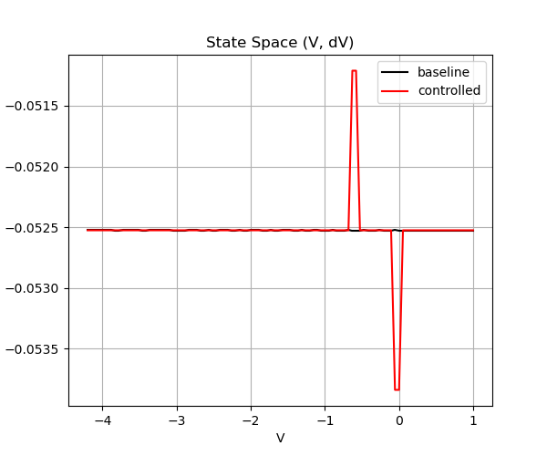

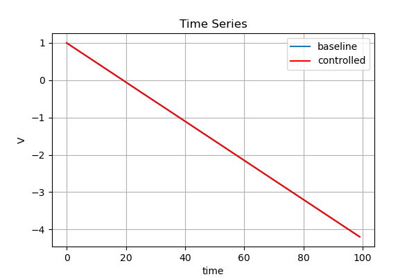


---

**Key insight:**

```text
Even 2D control (V, dV) is fully absorbed by the system.
```

---

## Result

```
max deviation ≈ 0.0026
```

---

## CRITICAL INSIGHT

```text
(V, dV) is NOT a sufficient control space.
```

---

## Interpretation

```
System behaves like a constrained manifold.
```

---

## Deep Insight

```text
Control inside the system → absorbed
Control outside the system → required
```

---
```
# ============================================================
# 🧠 GLOBAL UPDATE (RUN 032–040)
# ============================================================
```
## Observed Pattern

```
control → reaction → absorption
```

---

## Structural Law

```text
System preserves its manifold.
```

---

## New Understanding

```
Instability cannot be forced internally.
```

---

## BREAKTHROUGH

```text
The system is CONTROL-RESISTANT internally.
```

---

## Next Step

```
Introduce external dimension:

(V, dV, u)
```

---

## Updated NEXAH Model

```
geometry + flow + event + constraint
```

---

## FINAL INSIGHT

```text
The system is not just dynamic.

It is self-preserving.
```

```text
Escape requires leaving the system itself.
```
