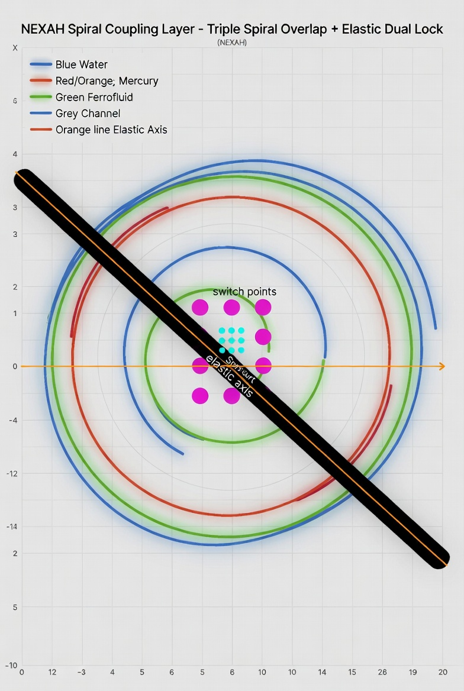

# Spiral Coupling Layer – Triple Component Dynamics

**Experimental Layer in NEXAH (April 2026)**

This layer models the **coupled dynamics of three interacting components**.



---

## 🔍 Observed Behavior

- after an initial transient phase, the system stabilizes into a coupled regime  
- pairwise coupling distances decrease and remain low  
- components form a **shared spiral trajectory**  
- the system exhibits **high coherence and reduced divergence**  

---

## ⚙️ Interpretation (Experimental)

The system appears to form:

- a **dual-strand structure**  
- a central coupling axis  
- rapid transitions between local states  

⚠️ Note:  
This interpretation is **qualitative** and requires further validation.

---

## 🌀 Conceptual Mapping (Experimental)

The components can be interpreted as:

- **Water-like component** → slow, stable dynamics  
- **Mercury-like component** → fast, reactive dynamics  
- **Ferrofluid-like component** → coupling / alignment mechanism  

👉 This mapping is **interpretative**, not a strict physical model.

---

## 🧠 Why this matters

- extends the NEXAH field model to **multi-component systems**  
- introduces **coupling-driven stabilization behavior**  
- suggests a structure for **coherence-guided navigation**  

---

## ▶️ Usage

```python
from nexah.spiral_coupling import SpiralCouplingKernel

kernel = SpiralCouplingKernel()
result = kernel.step(current_state)

print("Coherence:", result["coherence"])
print("Stability:", result["stability"])
print("Avg Coupling Distance:", result["layer_state"]["avg_coupling_dist"])
