# NEXAH FIELD_LAYER — Building Log  
## Field Projection Experiments: Lorenz → Rössler → Halvorsen → Kuramoto

Status: **Experimental phase completed / core finding stabilized**

---

## 1. Goal

This experiment series tests whether a common FIELD_LAYER representation can extract comparable transition structure from different dynamical systems.

Systems explored:

- Lorenz
- Rössler
- Halvorsen
- Kuramoto oscillator network

Core pipeline:

```text
dynamics
→ PCA field projection
→ phase coordinate θ
→ phase drift Δθ
→ regime classification
→ Iota event detection
→ sweep / boundary extraction
```

No symbolic interpretation was used in the final analysis.  
Focus: **data, structure, measurability**.

---

## 2. Core Method

For each system, state trajectories are projected into a PCA-aligned field coordinate system:

```text
x → (alpha, beta, gamma)
```

Phase is defined in the transverse plane:

```text
θ = arctan2(gamma, beta)
```

The main observable is:

```text
Δθ = phase drift
```

Regimes:

```text
Theta : low drift / baseline
Tao   : positive organized drift
Dao   : negative organized drift
Iota  : high drift event
```

---

## 3. Early V3 Results

### Rössler V3

Key result:

```text
Iota ≈ 8.00 %
transition_rate ≈ 0.00309
iota_event_count = 139
```

Important outputs:

```text
outputs/roessler_v3/roessler_v3_pca_projection.png
outputs/roessler_v3/roessler_v3_phase_drift_iota.png
outputs/roessler_v3/roessler_v3_regime_distribution.png
```


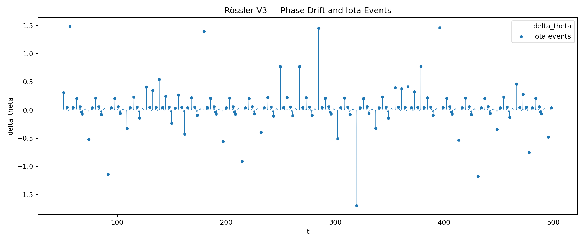

---

### Halvorsen V3

Key result:

```text
Iota ≈ 8.00 %
transition_rate ≈ 0.01056
iota_event_count = 475
```

Compared to Rössler, Halvorsen showed stronger event density and more distributed phase drift.

Important outputs:

```text
outputs/halvorsen_v3/halvorsen_v3_pca_projection.png
outputs/halvorsen_v3/halvorsen_v3_phase_drift_iota.png
outputs/halvorsen_v3/halvorsen_v3_regime_distribution.png
```

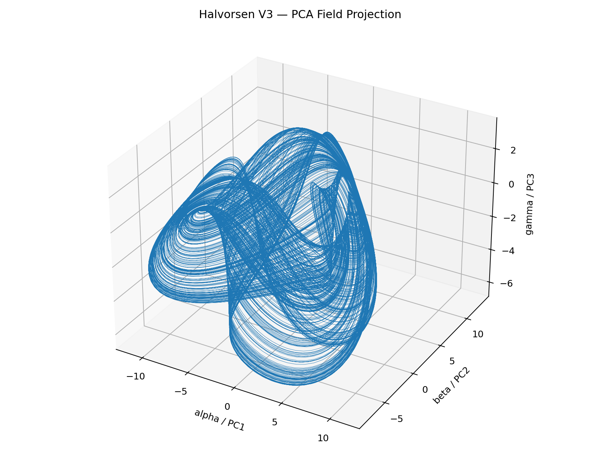


---

## 4. Kuramoto V3

Kuramoto was added as a collective synchronization system.

Observable state:

```text
state(t) = [r(t), dr/dt, dψ/dt]
```

where:

```text
r(t) = Kuramoto order parameter
ψ(t) = mean phase
```

Initial V3 result at K = 1.8:

```text
r_mean ≈ 0.8115
Iota ≈ 8.00 %
iota_event_count = 205
transition_rate ≈ 0.00456
```

Important outputs:

```text
outputs/kuramoto_v3/K_1_800/kuramoto_v3_order_parameter.png
outputs/kuramoto_v3/K_1_800/kuramoto_v3_slice_r_dr_dt.png
outputs/kuramoto_v3/K_1_800/kuramoto_v3_phase_drift_iota.png
outputs/kuramoto_v3/K_1_800/kuramoto_v3_pca_projection.png
```

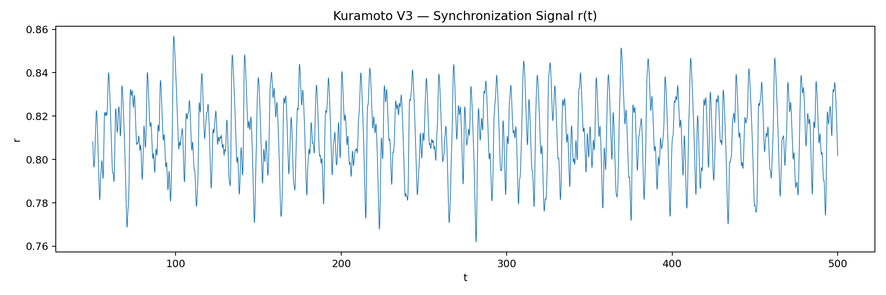

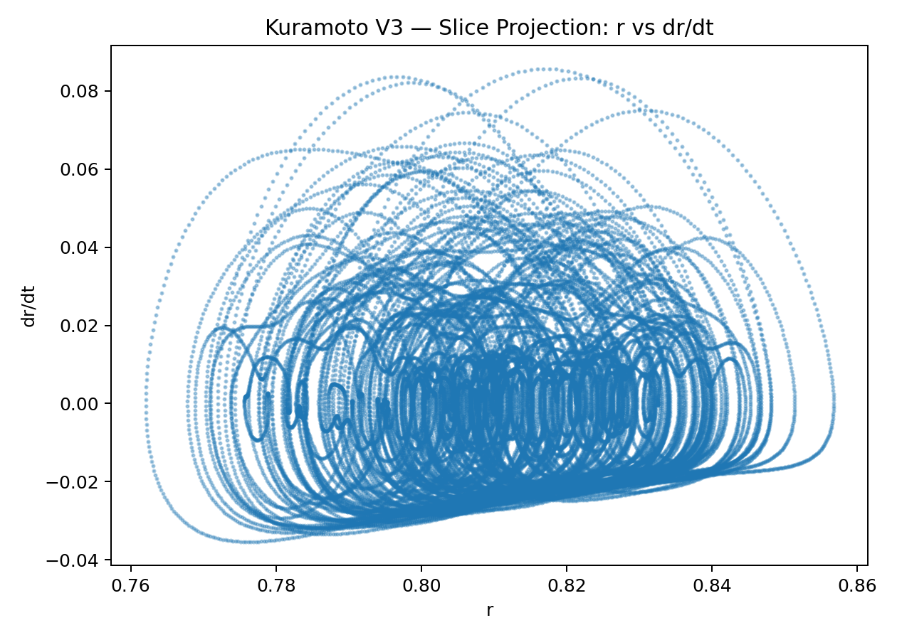

---

## 5. V3 Limitation

The original V3 Iota definition used a fixed quantile:

```text
iota_quantile = 0.92
```

This forced Iota to remain near:

```text
~8 %
```

across parameter sweeps.

Conclusion:

```text
V3 Iota was useful for local detection,
but not valid as an absolute transition metric.
```

---

## 6. V4 / V5 Correction

Iota was redefined using absolute drift statistics:

```text
mean_abs = mean(|Δθ|)
std_abs  = std(|Δθ|)

Theta threshold = mean_abs + 0.5 * std_abs
Iota threshold  = mean_abs + 2.5 * std_abs
```

This produced non-fixed Iota rates and revealed real variation across coupling K.

V5 also introduced a Lyapunov estimate module.

Important outputs:

```text
outputs/kuramoto_v5/runs/K_1_800_1777941892/phase_cloud.png
outputs/kuramoto_v5/runs/K_1_800_1777941892/phase_drift.png
outputs/kuramoto_v5/runs/K_1_800_1777941892/lyapunov.png
outputs/kuramoto_v5/runs/K_1_800_1777941892/pca_projection.png
```

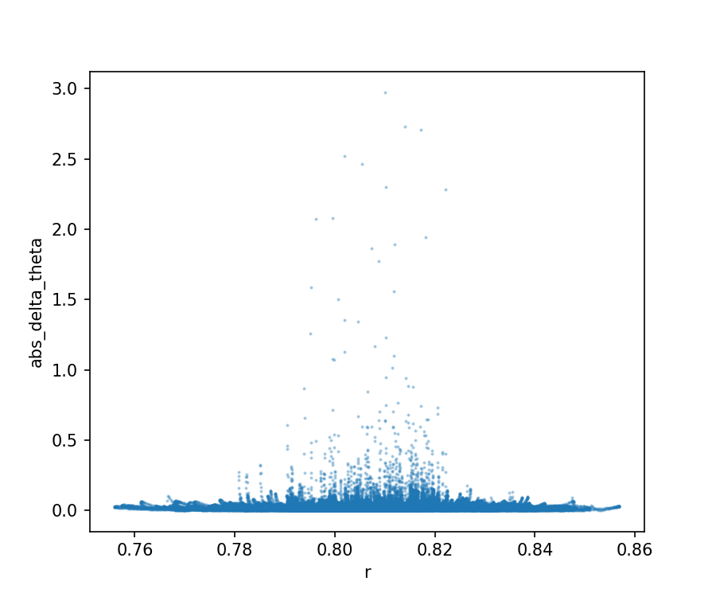

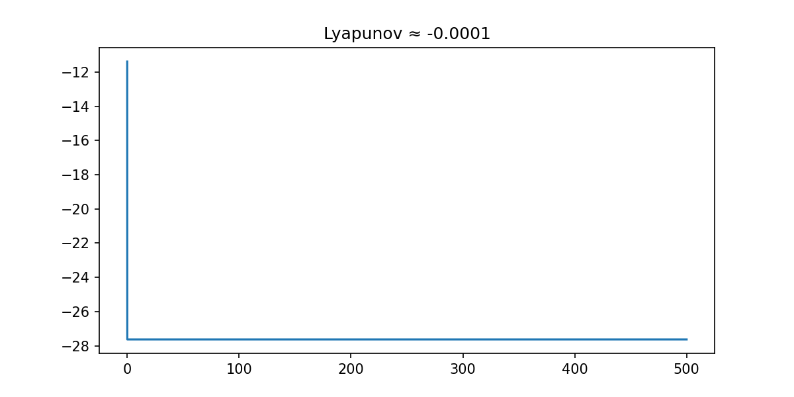

---

## 7. V6 Master Sweep

V6 combined:

- Kuramoto simulation
- PCA projection
- phase drift
- adaptive Iota detection
- finite-time Lyapunov estimate
- K sweep
- phase boundary extraction
- GIF generation

Sweep range:

```text
K ∈ [0.5, 3.0]
12 samples
```

Final V6 sweep output:

```text
outputs/kuramoto_v6/master_runs/run_1777943097/sweep/sweep_results.csv
```

Important plots:

```text
outputs/kuramoto_v6/master_runs/run_1777943097/sweep/r_mean_vs_K.png
outputs/kuramoto_v6/master_runs/run_1777943097/sweep/drift_std_vs_K.png
outputs/kuramoto_v6/master_runs/run_1777943097/sweep/transition_rate_vs_K.png
outputs/kuramoto_v6/master_runs/run_1777943097/sweep/lyapunov_vs_K.png
outputs/kuramoto_v6/master_runs/run_1777943097/sweep/phase_boundary_sweep.gif
```

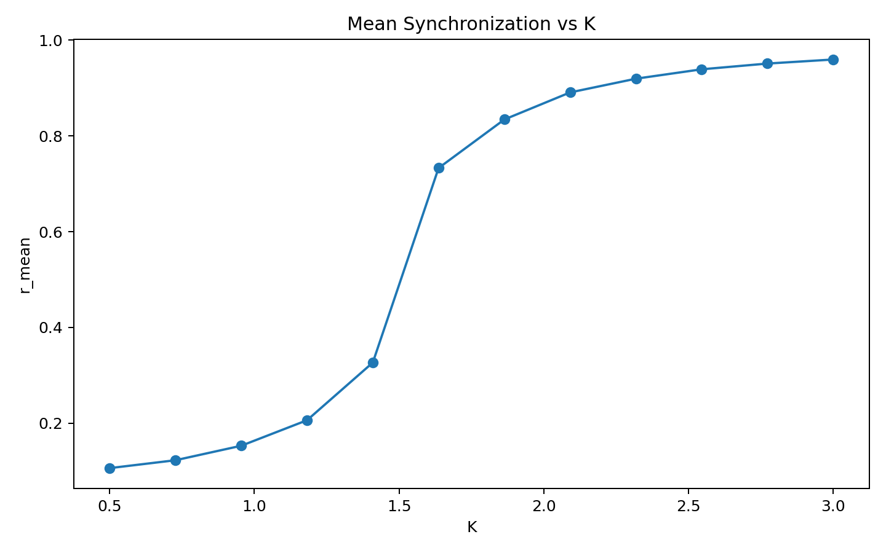

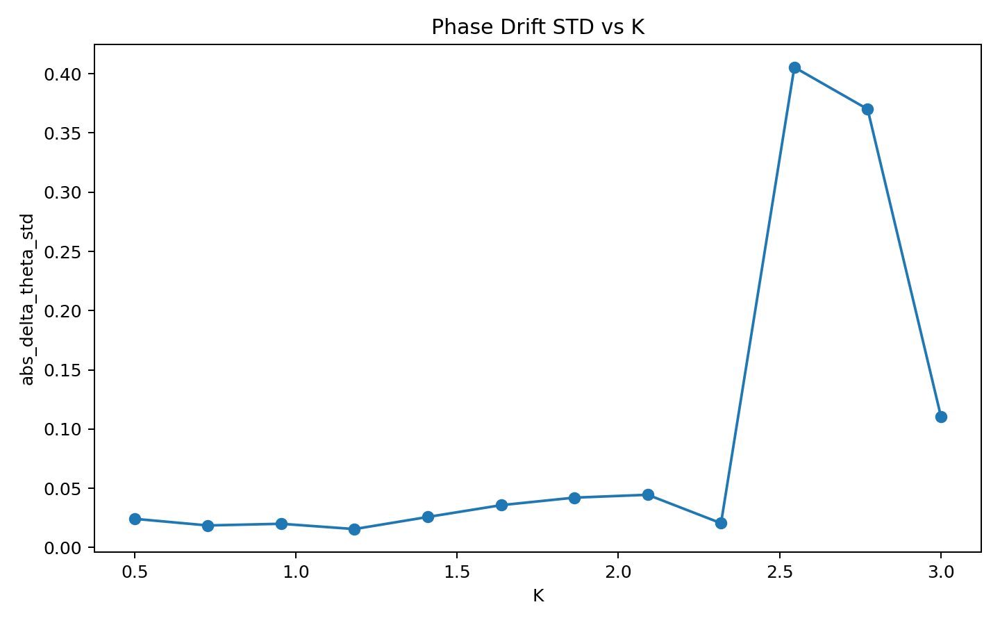

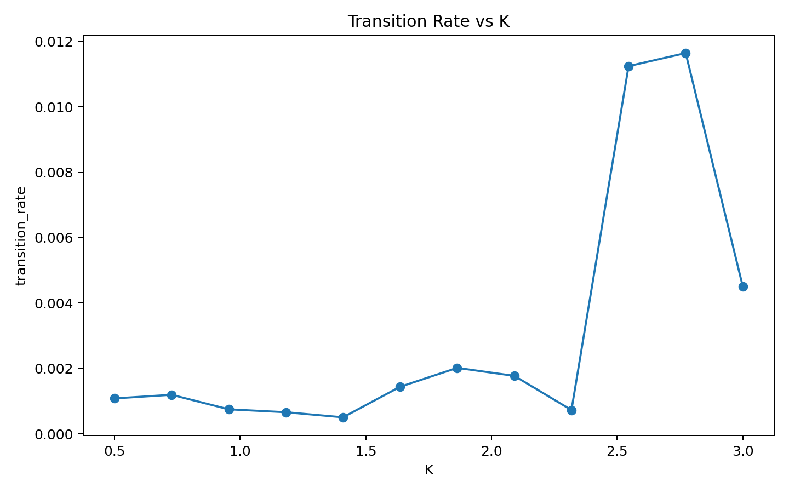

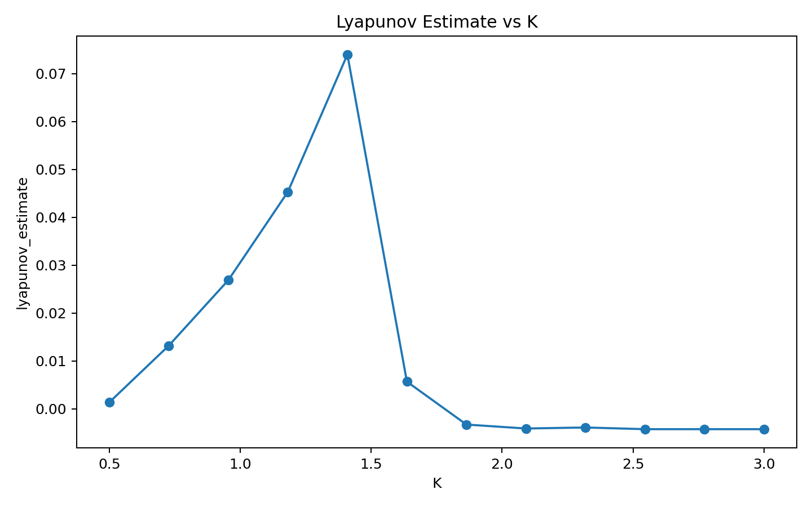

---

## 8. V6 Findings

The sweep revealed three separated observables:

```text
r_mean                  = global synchronization
abs_delta_theta_std     = internal phase drift
transition_rate         = event activity
lyapunov_estimate       = global stability indicator
```

Main finding:

```text
Synchronization and internal stability separate.
```

The system can reach high synchronization while still developing strong internal phase-drift bursts.

---

## 9. Phase Boundary Extraction: V7 / V8

V7 extracted the upper envelope of the phase diagram:

```text
x = r_mean
y = abs_delta_theta_std
```

V8 smoothed the boundary and extracted key regime points.

Important outputs:

```text
outputs/kuramoto_v8/final_1777944907/phase_diagram_final.png
outputs/kuramoto_v8/final_1777944907/system_overview.png
outputs/kuramoto_v8/final_1777944907/regime_points.json
outputs/kuramoto_v8/final_1777944907/boundary_smooth.json
```


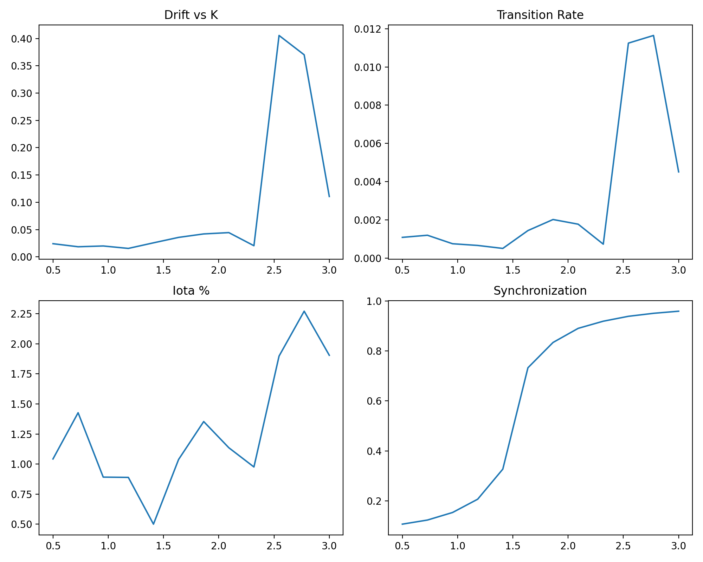

---

## 10. Final Regime Points

Final extracted regime points:

```json
{
  "onset": {
    "K": 2.3181818181818183,
    "drift": 0.0204849985907506,
    "slope": 0.7941985560249221
  },
  "max_drift": {
    "K": 2.5454545454545454,
    "drift": 0.4054911416475603
  },
  "max_events": {
    "K": 2.7727272727272725,
    "rate": 0.0116441856847625
  }
}
```

Interpretation:

```text
K ≈ 2.32 : onset of drift amplification
K ≈ 2.55 : maximal internal drift
K ≈ 2.77 : maximal transition/event activity
```

---

## 11. Final Interpretation

The Kuramoto FIELD_LAYER does not only detect classical synchronization.

Instead, it separates:

```text
global coherence
from
internal transition activity
```

Classic Kuramoto view:

```text
incoherent → synchronized
```

FIELD_LAYER view:

```text
incoherent
→ synchronized
→ synchronized but drift-active
→ high-transition regime
```

Core finding:

```text
Synchronization does not imply structural stillness.
```

A highly synchronized state can still contain measurable internal drift bursts and transition events.

---

## 12. Final Statement

The experiment series supports the FIELD_LAYER hypothesis:

```text
A common phase-drift representation can extract comparable transition structure
from chaotic continuous systems and collective synchronization systems.
```

The final Kuramoto result shows:

```text
r_mean increases monotonically with K,
but phase drift and event activity peak later,
inside the synchronized regime.
```

This identifies a delayed instability structure:

```text
onset → max drift → max events
```

---

## 13. Scripts

Main scripts:

```text
field_projection_lorenz_v2.py
field_projection_roessler_v3.py
field_projection_halvorsen_v3.py
field_projection_kuramoto_v3.py
field_projection_kuramoto_v4.py
field_projection_kuramoto_v5.py
kuramoto_master_v6.py
kuramoto_phase_boundary_v7.py
kuramoto_phase_boundary_v8.py
```

Recommended final reference scripts:

```text
kuramoto_master_v6.py
kuramoto_phase_boundary_v8.py
```

---

## 14. Final Status

Status:

```text
FIELD_LAYER experimental build completed.
Kuramoto phase boundary extracted.
Core finding stabilized.
```

Next possible steps:

```text
1. Compare with classical Kuramoto critical coupling
2. Apply FIELD_LAYER to power-grid simulations
3. Extend boundary detection to Lorenz / Rössler / Halvorsen
4. Build unified cross-system phase atlas
```
