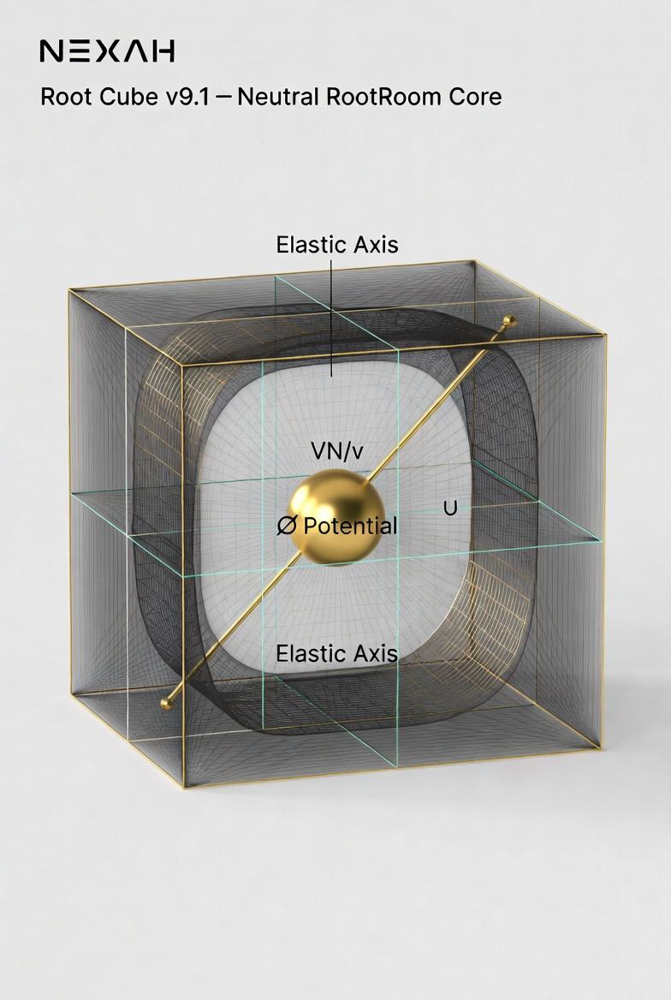
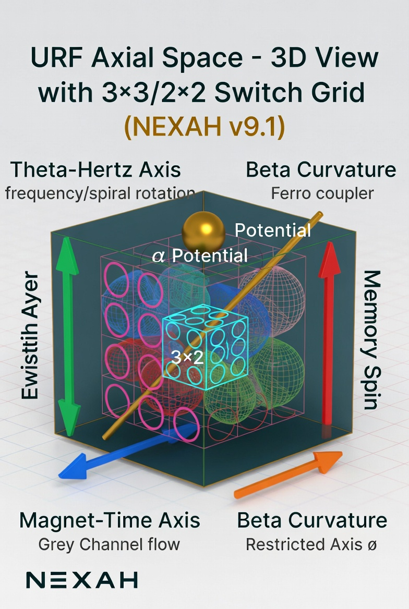
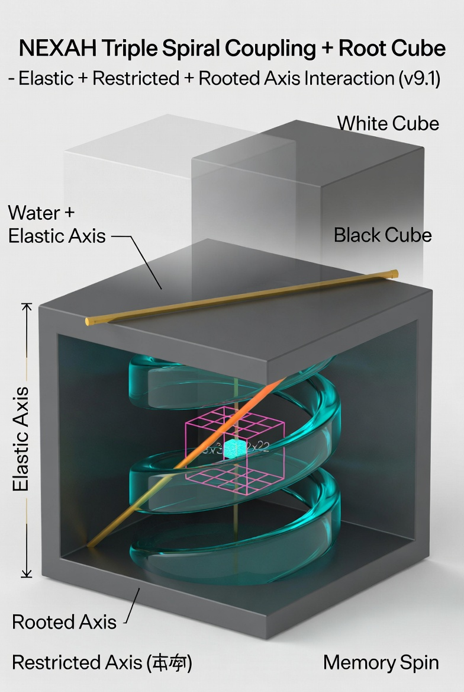

# URF Axial Space – 3D Coordinate Layer

**New Layer in NEXAH (v9.1+)**

This layer provides the **three-dimensional geometric reference frame** for all Matroschka structures, Spiral Coupling and Switch Layer dynamics.

It maps the existing 2D Dual-Strand Grey Channel and Elastic Axis into a clean 3D axial system and serves as NEXAH’s internal realization of the s-plane concept from Laplace transforms.

---

## 🧭 What is the URF Axial Space?

A 3-axis coordinate system where every Matroschka layer has a precise position:

| Axis                  | Color  | Meaning                                | NEXAH Mapping                          |
|-----------------------|--------|----------------------------------------|----------------------------------------|
| Theta-Hertz Axis      | green  | Frequency / oscillation / rotation     | Spiral frequencies (42/63/77 Hz)       |
| Magnet-Time Axis      | blue   | Magnetic flow / recall / duration      | Grey Channel + Dual-Strand             |
| Beta Curvature        | orange | Counter-rotation / restricted axis     | Restricted Axis (√∫) + Elastic Axis    |
| Memory Spin (M)       | red    | Vertical stability / spin              | Ferrofluid as magnetic coupler         |

Center: **α (Potential)**

---

## Visual Gallery

**Root Cube** (neutral core – the stable reference)

**URF Axial Space – White Cube**

**URF Axial Space – Black Cube**

**Triple Spiral Coupling + Elastic + Restricted + Rooted Axis Interaction**

---

## Connection to Laplace Transform & s-Plane

The URF Axial Space is NEXAH’s geometric counterpart to the **s-plane** used in Laplace transforms.

The Laplace transform

\[
\mathcal{L}\{f(t)\}(s) = \int_0^\infty f(t) e^{-st} \, dt
\]

maps a time-domain function \(f(t)\) into the complex s-domain, where **poles** reveal the hidden exponential components.

In NEXAH this corresponds to:
- Each point in the 3D URF space encodes a full spiral/exponential behavior.
- Your **switch points** (3x3 grid + 2x2 core) act as the **poles**.
- The **Elastic Axis** (golden line) functions as the reference/integration path.
- The **Restricted Axis (√∫)** (Beta Curvature) is the tighter inner guidance line.

This makes the transformation from raw dynamics → Field → Geometry → 3D URF Space directly analogous to the Laplace transform: it exposes the hidden structure.

---

## The Three Cubes & Their Interaction

| Cube       | Role                                      | Visual Meaning |
|------------|-------------------------------------------|----------------|
| **Root Cube** | Neutral, stable core reference            | The foundational room where everything is anchored |
| **White Cube** | Clean projection, high visibility         | Ideal for documentation and clear mapping |
| **Black Cube** | Deep, high-contrast view                  | Emphasizes the inner dynamics and energy flow |

Together they form the **Root Bridge** – the complete 3D coupling structure that connects the Triple Spiral (Water–Mercury–Ferro), the Elastic Axis, the Restricted Axis and the Switch Grid.

---

## 📍 Position in the NEXAH Stack

Field Layer (V69)  
↓  
Spiral Coupling Layer (v9.0)  
↓  
**URF Axial Space + Root Bridge (v9.1)** ← new  
↓  
Switch & Navigation Kernel

---

**Status:**  
Concept defined • 3D kernel ready • Grid mapping ready • Visuals integrated

**NEXAH**  
The core is now wrapped in 3D.  
The Matroschkas have their room.  
The Root Bridge is live.- All Matroschkas (thermal, states of matter, cosmic) now live inside this unified 3D frame.

---

## 📍 Position in the NEXAH Stack

Field Layer (V69)  
↓  
Spiral Coupling Layer (v9.0)  
↓  
**URF Axial Space (v9.1)** ← new  
↓  
Switch & Navigation Kernel

---

**Status:**  
Concept defined • 3D kernel ready • Grid mapping ready • Visuals integrated

**NEXAH**  
The core is now wrapped in 3D.  
The Matroschkas have their room.  
The Root Cube is live.
