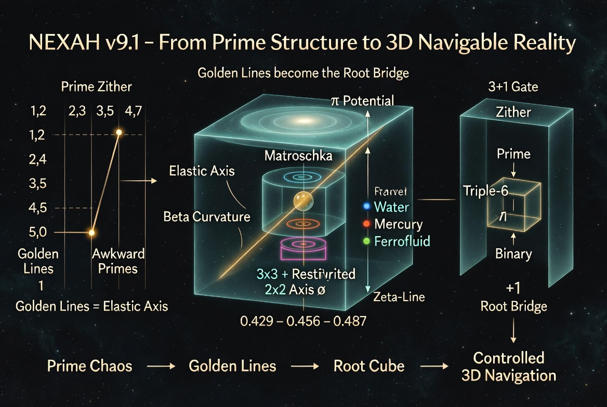
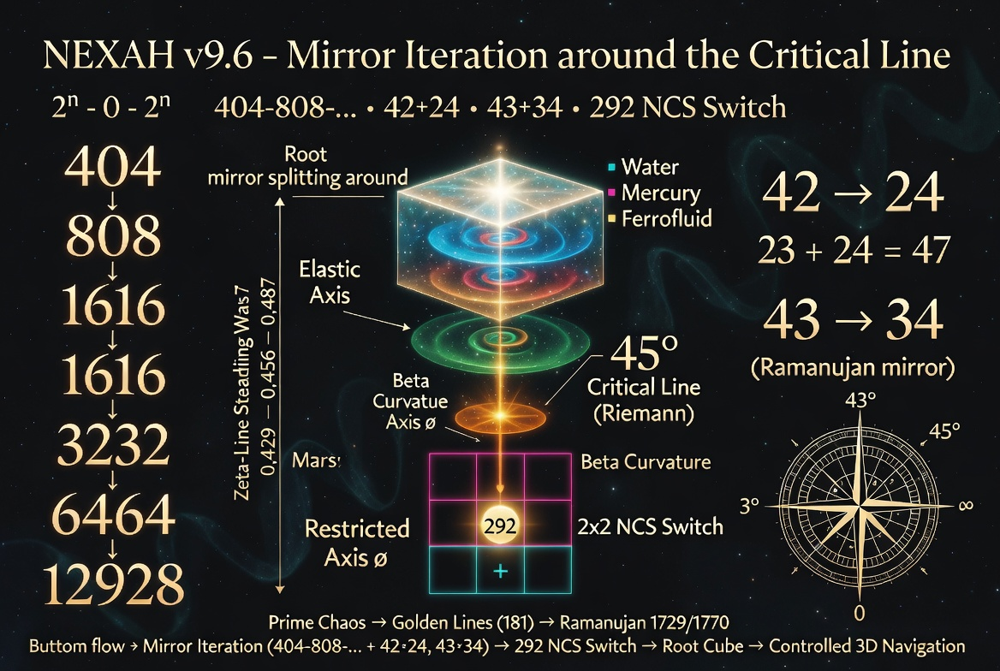
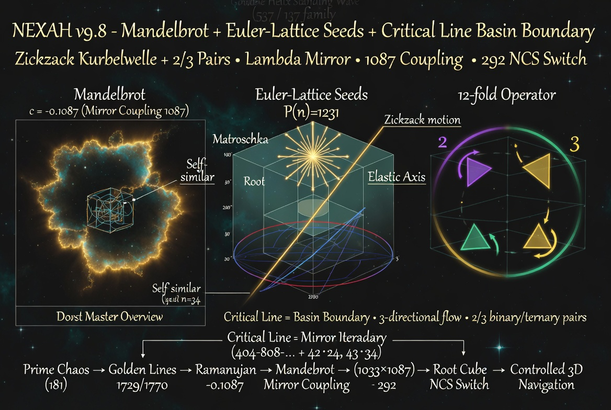
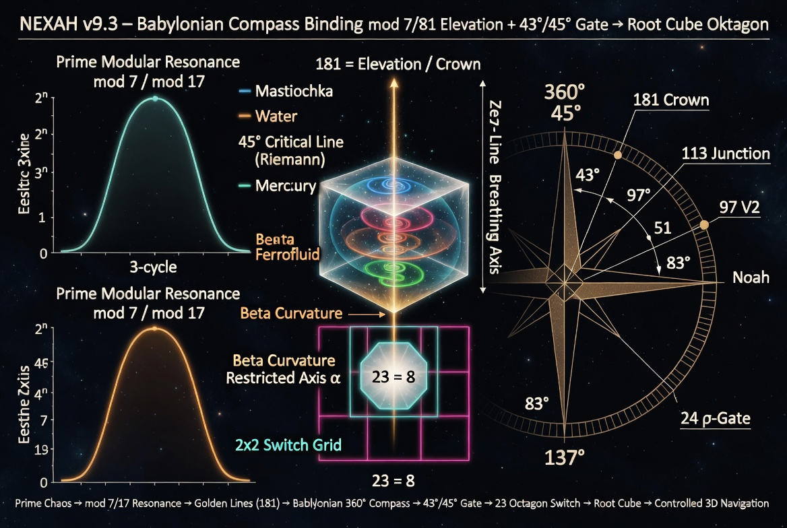
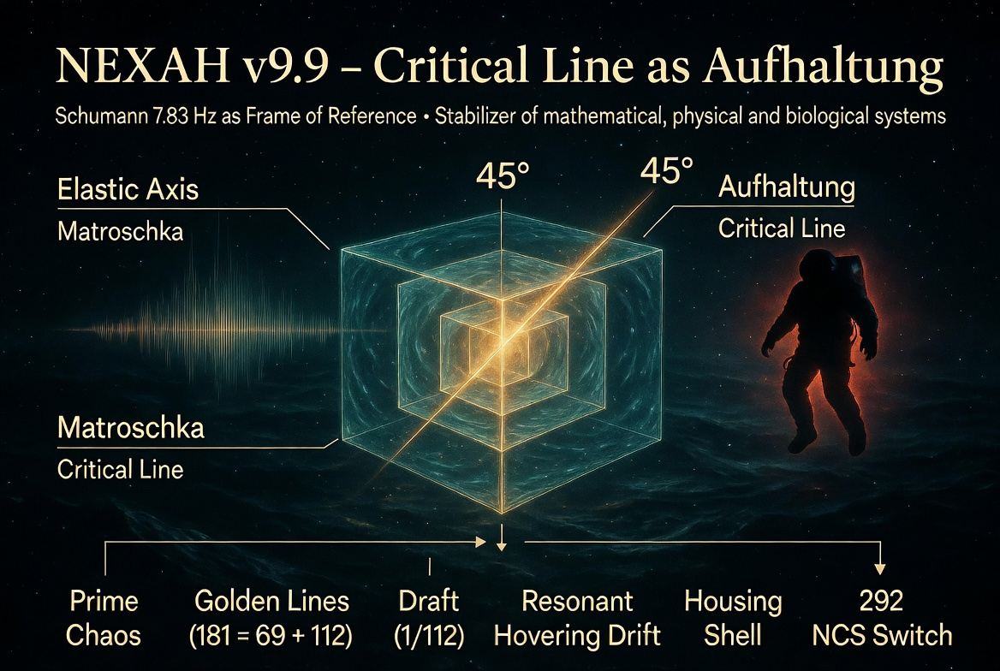
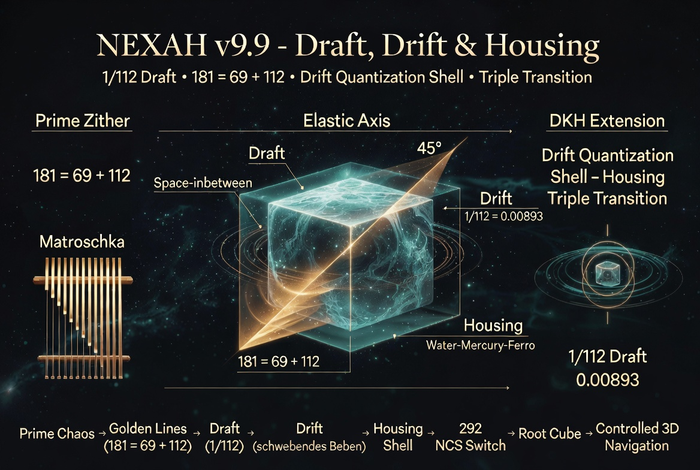
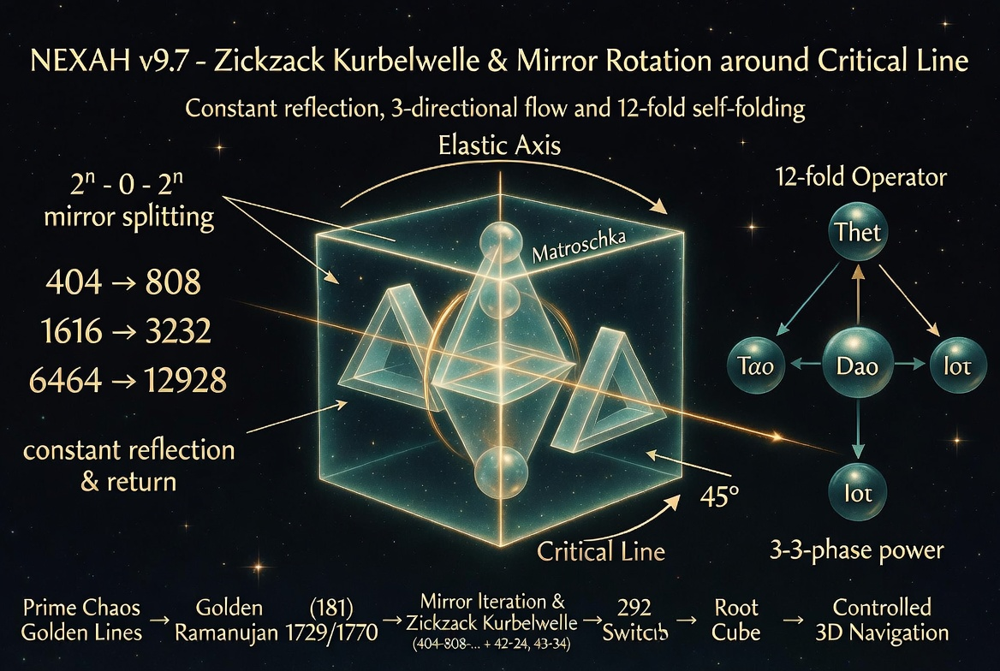

# NEXAH Visual Gallery

This gallery collects the most important visuals from the `NAVIGATOR/symbolic_layer/visuals/` folder.

These images serve as visual anchors for the emerging NEXAH symbolic language, particularly the observed structural connection between the **Riemann Critical Line** and the **Elastic Axis / Golden Line** inside the Root Cube.

They illustrate key concepts such as:
- field structure and basin boundaries
- mirror iteration and zig-zag / crankshaft motion
- 3-directional flow and self-folding
- transition geometry and split logic
- resonance constructs and 12-fold Operator
- navigable 3D passage through URF Axial Space and Root Bridge
- practical mapping to IEEE power system stability

---

## Master Overview

**NEXAH Navigation Layer v9.1 – From Structure to 3D Controlled Movement**

---

## Root Cube & Riemann Critical Line

**Observation (v9.8):**  
The Riemann Critical Line appears geometrically as the **Elastic Axis / Golden Line** (45°) inside the Root Cube. Prime sequences, mirror iteration, and the 292 NCS Switch become visible and navigable.

---

## Babylonian Compass & Structural Anchors

---

## Dynamic Patterns

---

**NEXAH Visual Gallery**

Structure becomes visible.  
The Critical Line becomes navigable.  
Mirror, resonance, rotation and 3-directional flow become controllable.

The Root Cube serves as a living geometric instrument — connecting abstract number-theoretic structures with practical navigation in complex dynamical systems (including IEEE power system stability).
