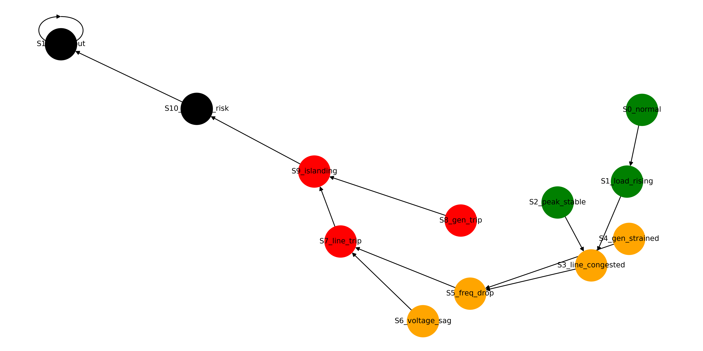
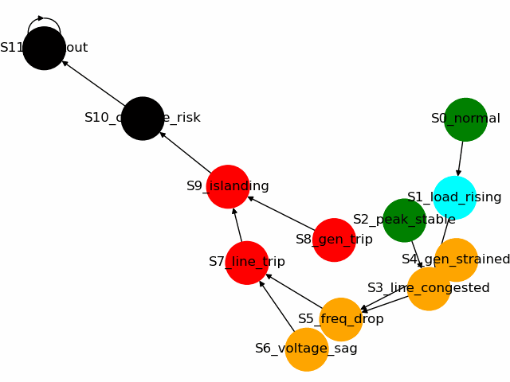
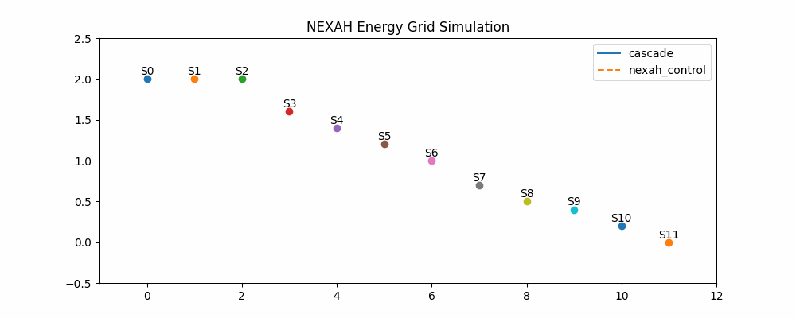
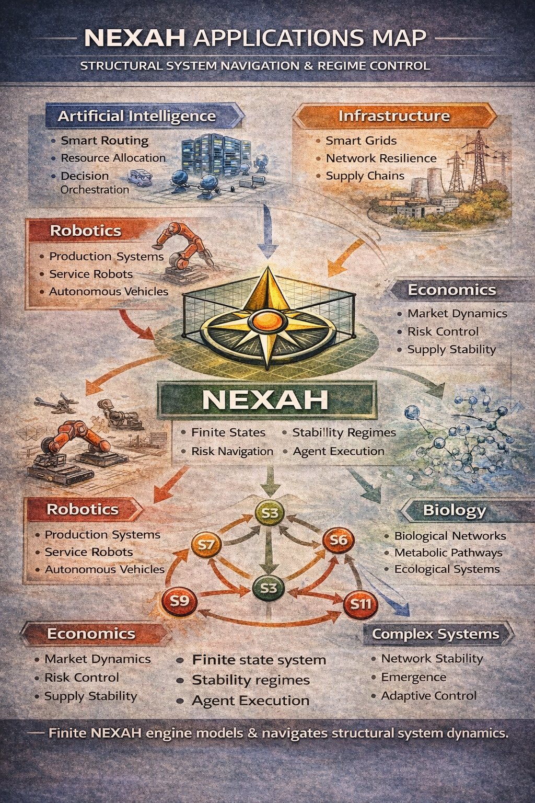

# NEXAH Builder Lab

Experimental playground for exploring the **NEXAH system navigation framework**.

The Builder Lab contains **interactive simulations, visualizations, and system exploration tools** that demonstrate how NEXAH models dynamic systems using:

States → Regimes → Transitions → Navigation

The goal is to explore **how complex systems evolve and how agents can navigate them**.

---

# Core System Concept

NEXAH models systems as **state graphs**.

A system consists of:

State space  
↓  
Regime classification  
↓  
Transition dynamics  
↓  
Navigation policies  

Example regimes used in the demo:

STABLE  
STRESS  
FAILURE  
COLLAPSE  

---

# System State Graph

The NEXAH system can be visualized as a directed graph.



Nodes represent **system states**.  
Edges represent **natural transitions (drift)** between states.

Color coding:

Green → Stable system states  
Orange → Stress conditions  
Red → Failure conditions  
Black → System collapse  

---

# Animated System Navigation

The simulation shows how an **agent moves through the system**.


This demonstrates the basic idea:

System state  
→ Transition  
→ New regime  
→ Navigation decision  

---

# Explorer Tool

The **Explorer** allows running simulations from different starting points.

Example animation:



Run it via CLI:

```
python BUILDER_LAB/demos/nexah_explorer.py
```

or

```
python BUILDER_LAB/demos/nexah_explorer.py --start S5_freq_drop --steps 20
```

The tool automatically generates a navigation animation.

---

# Energy Grid Example

NEXAH can be applied to real-world systems such as power networks.



Example states include:

Normal operation  
Load increase  
Frequency drop  
Generator trip  
Grid islanding  
Cascade risk  

This demonstrates how **system stability can degrade and how navigation strategies respond**.

---

# Applications Overview

The framework can model many system types.



Potential domains include:

Energy grids  
Supply chains  
AI agent networks  
Autonomous infrastructure  
Economic systems  

---

# Running the Builder Lab

From the repository root:

Run terminal simulation

```
python BUILDER_LAB/demos/nexah_demo.py
```

Run graph animation

```
python BUILDER_LAB/demos/nexah_graph_simulation.py
```

Run the explorer tool

```
python BUILDER_LAB/demos/nexah_explorer.py
```

---

# Folder Structure

```
BUILDER_LAB
│
├ demos
│   nexah_demo.py
│   nexah_graph_simulation.py
│   nexah_explorer.py
│
└ visuals
    nexah_state_graph.png
    nexah_system_walk.gif
    nexah_explorer_walk.gif
    nexah_energy_grid_simulation.gif
```

---

# Purpose

The Builder Lab serves as a **sandbox for developing and demonstrating the NEXAH framework**.

It shows how a system can be modeled as a **dynamic state space with navigable transitions**.

Future work includes:

Interactive system explorer  
Additional system models  
Real-time control simulations  
Integration with autonomous agents
