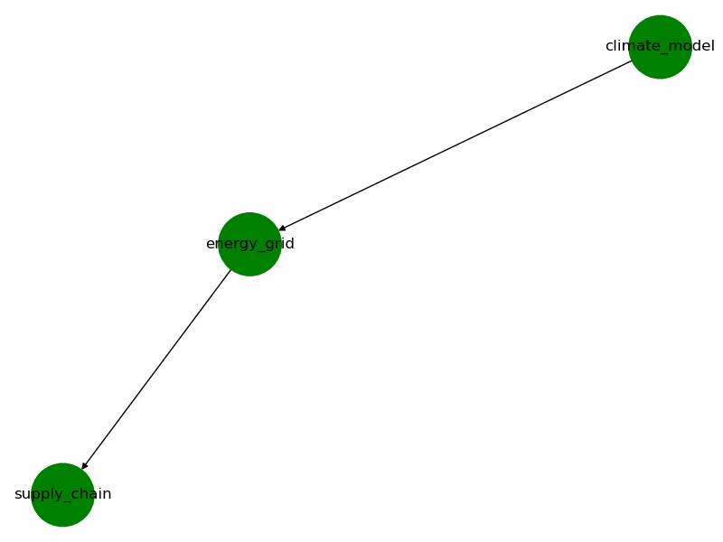

# NEXAH Builder Lab


Experimental playground for exploring the **NEXAH system navigation framework**.

The Builder Lab contains **interactive simulations, visualizations, and system exploration tools** that demonstrate how NEXAH models dynamic systems using:

States → Regimes → Transitions → Navigation

The goal is to explore **how complex systems evolve and how agents can navigate them**.

The lab also includes experimental simulations of **global infrastructure networks, cascading failures, and coupled planetary systems**.

---

# Core System Concept

NEXAH models systems as **state graphs**.

A system consists of:

State space  
↓  
Regime classification  
↓  
Transition dynamics  
↓  
Navigation policies  

Example regimes used in the demo:

STABLE  
STRESS  
FAILURE  
COLLAPSE  

This framework allows the modeling of complex evolving systems such as:

- infrastructure networks  
- climate dynamics  
- supply chains  
- energy grids  
- economic systems  

---

# System State Graph

The NEXAH system can be visualized as a directed graph.


Nodes represent **system states**.  
Edges represent **natural transitions (drift)** between states.

Color coding:

Green → Stable system states  
Orange → Stress conditions  
Red → Failure conditions  
Black → System collapse  

---

# Animated System Navigation

The simulation shows how an **agent moves through the system**.


This demonstrates the basic idea:

System state  
→ Transition  
→ New regime  
→ Navigation decision  

---

# System Explorer

The **Explorer** allows running simulations from different starting points.

Example animation:


Run it via CLI:

python BUILDER_LAB/demos/nexah_explorer.py

or

python BUILDER_LAB/demos/nexah_explorer.py --start S5_freq_drop --steps 20

The tool automatically generates a navigation animation.

---

# Cascade Simulation

The Builder Lab also includes tools for modeling **cascading system failures**.

Example animation:



These simulations explore how disruptions propagate through interconnected systems such as:

- power grids  
- logistics networks  
- digital infrastructure  
- financial systems  

---

# Global Infrastructure Experiments

Recent Builder Lab experiments include **planetary-scale infrastructure models**.

These simulations combine multiple system layers:

- space systems (satellites)
- digital infrastructure
- energy grids
- logistics networks
- food supply chains
- water systems
- financial systems

The simulations visualize how **failures propagate across layers**.

Example dashboards include:

nexah_control_room.py  
nexah_global_cascade_dashboard.py  
nexah_planetary_dashboard.py  

Run the planetary control room:

streamlit run BUILDER_LAB/nexah_control_room.py

---

# Applications Overview

The NEXAH framework can model many system types.


Potential domains include:

Energy grids  
Supply chains  
AI agent networks  
Autonomous infrastructure  
Economic systems  
Planetary infrastructure networks  

---

# Running the Builder Lab

From the repository root.

Run terminal simulation

python BUILDER_LAB/demos/nexah_demo.py

Run graph animation

python BUILDER_LAB/demos/nexah_graph_simulation.py

Run the explorer tool

python BUILDER_LAB/demos/nexah_explorer.py

Run planetary infrastructure dashboard

streamlit run BUILDER_LAB/nexah_control_room.py

Run cascade simulation

python BUILDER_LAB/nexah_capacity_cascade_engine.py

---

# Example System Models

The Builder Lab contains multiple system definitions.

systems/  
global_systems/  
data/  

Examples include:

energy_grid.json  
supply_chain.json  
planetary_network.json  
real_infrastructure.json  
shock_events.json  

These files define **system topology, dependencies, and shock events**.

---

# Visualizations

The visuals directory contains generated animations and graphs.

Examples include:

visuals/nexah_state_graph.png  
visuals/nexah_system_walk.gif  
visuals/nexah_explorer_walk.gif  
visuals/nexah_cascade.gif  
visuals/nexah_simulation.gif  
visuals/NEXAH_DEMO_SIMULATION.png  
visuals/NEXAH_APPLICATIONS_MAP.png  

---

# Folder Structure

BUILDER_LAB

demos  
- nexah_demo.py  
- nexah_graph_simulation.py  
- nexah_explorer.py  

systems  
- climate_model.json  
- energy_grid.json  
- supply_chain.json  

global_systems  
- global_system_map.json  
- real_infrastructure.json  
- infrastructure_geo.json  
- shock_events.json  

data  
- planetary_network.json  
- last_run_timeline.json  

visuals  
- nexah_state_graph.png  
- nexah_system_walk.gif  
- nexah_explorer_walk.gif  
- nexah_cascade.gif  
- nexah_simulation.gif  

simulation engines  
- nexah_capacity_cascade_engine.py  
- nexah_planetary_engine.py  
- nexah_multisystem_engine.py  

---

# Purpose

The Builder Lab serves as a **sandbox for developing and demonstrating the NEXAH framework**.

It shows how systems can be modeled as **dynamic state spaces with interacting regimes and cascading transitions**.

The lab is used to experiment with:

- system navigation  
- cascade dynamics  
- multi-layer infrastructure models  
- planetary-scale simulations  

Future work includes:

- interactive system explorers  
- expanded infrastructure datasets  
- real-world system integration  
- autonomous system navigation agents  
---

# Explorer Tool

The **Explorer** allows running simulations from different starting points.

Example animation:


Run it via CLI:

```
python BUILDER_LAB/demos/nexah_explorer.py
```

or

```
python BUILDER_LAB/demos/nexah_explorer.py --start S5_freq_drop --steps 20
```

The tool automatically generates a navigation animation.

---

# Applications Overview

The framework can model many system types.


Potential domains include:

Energy grids  
Supply chains  
AI agent networks  
Autonomous infrastructure  
Economic systems  

---

# Running the Builder Lab

From the repository root:

Run terminal simulation

```
python BUILDER_LAB/demos/nexah_demo.py
```

Run graph animation

```
python BUILDER_LAB/demos/nexah_graph_simulation.py
```

Run the explorer tool

```
python BUILDER_LAB/demos/nexah_explorer.py
```

---

# Folder Structure

```
BUILDER_LAB
│
├ demos
│   nexah_demo.py
│   nexah_graph_simulation.py
│   nexah_explorer.py
│
└ visuals
    nexah_state_graph.png
    nexah_system_walk.gif
    nexah_explorer_walk.gif
    NEXAH_APPLICATIONS_MAP.png
```

---

# Purpose

The Builder Lab serves as a **sandbox for developing and demonstrating the NEXAH framework**.

It shows how a system can be modeled as a **dynamic state space with navigable transitions**.

Future work includes:

Interactive system explorer  
Additional system models  
Real-world infrastructure simulations  
Integration with autonomous agents
