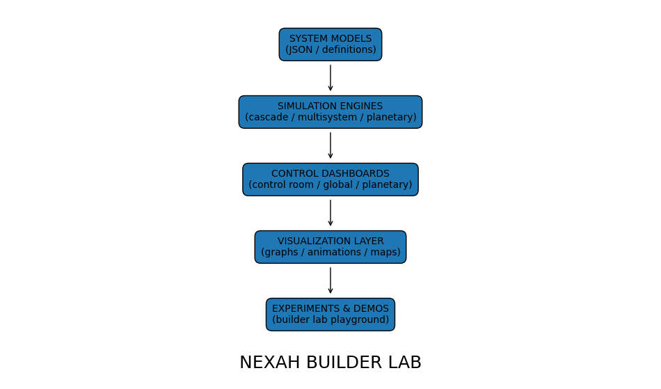
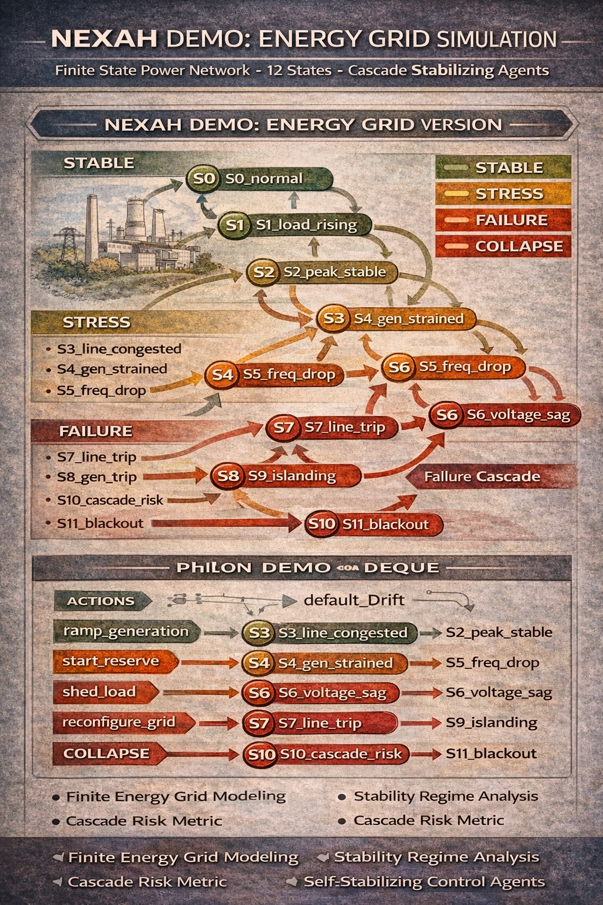

# NEXAH Builder Lab


Experimental playground for exploring the **NEXAH system navigation framework**.

The **Builder Lab** contains interactive simulations, visualizations, and system exploration tools demonstrating how NEXAH models dynamic systems using:

States → Regimes → Transitions → Navigation

The goal is to explore **how complex systems evolve and how agents can navigate them**.

The lab also includes experimental simulations of:

- cascading infrastructure failures  
- energy grid stability  
- planetary infrastructure systems  
- multi-layer global networks  

---

# NEXAH Builder Lab Architecture



The Builder Lab connects several layers of the NEXAH framework:

System Models  
↓  
Simulation Engines  
↓  
Control Dashboards  
↓  
Visualization Layer  
↓  
Experiments & Demos  

This architecture allows the exploration of **complex interacting systems** and their dynamic evolution.

---

# Core System Concept

NEXAH models systems as **state graphs**.

A system consists of:

State space  
↓  
Regime classification  
↓  
Transition dynamics  
↓  
Navigation policies  

Example regimes:

STABLE  
STRESS  
FAILURE  
COLLAPSE  

These regimes allow modeling complex evolving systems such as:

- infrastructure networks  
- climate dynamics  
- supply chains  
- energy grids  
- economic systems  

---

# System State Graph


Nodes represent **system states**.

Edges represent **natural transitions (system drift)**.

Color coding:

Green → Stable system states  
Orange → Stress conditions  
Red → Failure conditions  
Black → System collapse  

---

# Animated System Navigation


The simulation shows how an **agent navigates the system state space**.

Process:

System state  
→ Transition  
→ New regime  
→ Navigation decision  

---

# Energy Grid Simulation Demo



Example application of the framework to **power grid stability**.

The simulation models:

- grid load changes  
- frequency drops  
- cascading failures  
- stabilizing control actions  

Example agent actions:

- ramp_generation  
- start_reserve  
- shed_load  
- reconfigure_grid  

---

# System Explorer

The **Explorer tool** allows running simulations from different starting points.


Run via CLI:

```
python BUILDER_LAB/demos/nexah_explorer.py
```

or

```
python BUILDER_LAB/demos/nexah_explorer.py --start S5_freq_drop --steps 20
```

The tool generates animated navigation runs through the system.

---

# Cascade Simulation

The Builder Lab also models **cascading failures**.


These simulations explore disruptions across interconnected systems such as:

- power grids  
- logistics networks  
- digital infrastructure  
- financial systems  

---

# Applications Overview


The NEXAH framework can model many domains:

Energy grids  
Supply chains  
AI agent networks  
Autonomous infrastructure  
Economic systems  
Planetary infrastructure networks  

---

# Running the Builder Lab

From the repository root.

Run terminal demo

```
python BUILDER_LAB/demos/nexah_demo.py
```

Run graph animation

```
python BUILDER_LAB/demos/nexah_graph_simulation.py
```

Run system explorer

```
python BUILDER_LAB/demos/nexah_explorer.py
```

Run cascade simulation

```
python BUILDER_LAB/nexah_capacity_cascade_engine.py
```

Run planetary dashboard

```
streamlit run BUILDER_LAB/nexah_control_room.py
```

---

# Example System Models

The Builder Lab includes multiple system definitions.

```
systems/
global_systems/
data/
```

Examples:

```
energy_grid.json
supply_chain.json
planetary_network.json
real_infrastructure.json
shock_events.json
```

These files define:

- system topology  
- dependencies  
- shock events  
- cascading interactions  

---

# Visualizations

The `visuals` directory contains generated graphs and animations.

Examples:

```
visuals/nexah_state_graph.png
visuals/nexah_system_walk.gif
visuals/nexah_explorer_walk.gif
visuals/nexah_cascade.gif
visuals/nexah_simulation.gif

visuals/NEXAH_DEMO_SIMULATION.png
visuals/NEXAH_DEMO_ENERGY_GRID_SIMULATION.png
visuals/NEXAH_APPLICATIONS_MAP.png
visuals/NEXAH_BUILDER_LAB_MAP.png
```

---

# Folder Structure

```
BUILDER_LAB
│
├ demos
│   nexah_demo.py
│   nexah_graph_simulation.py
│   nexah_explorer.py
│
├ systems
│   climate_model.json
│   energy_grid.json
│   supply_chain.json
│
├ global_systems
│   global_system_map.json
│   real_infrastructure.json
│   infrastructure_geo.json
│   shock_events.json
│
├ data
│   planetary_network.json
│   last_run_timeline.json
│
├ visuals
│   nexah_state_graph.png
│   nexah_system_walk.gif
│   nexah_explorer_walk.gif
│   nexah_cascade.gif
│   nexah_simulation.gif
│   NEXAH_DEMO_SIMULATION.png
│   NEXAH_DEMO_ENERGY_GRID_SIMULATION.png
│   NEXAH_APPLICATIONS_MAP.png
│   NEXAH_BUILDER_LAB_MAP.png
│
└ simulation engines
    nexah_capacity_cascade_engine.py
    nexah_planetary_engine.py
    nexah_multisystem_engine.py
```

---

# Purpose

The Builder Lab serves as a **sandbox for developing and demonstrating the NEXAH framework**.

It allows experimentation with:

- system navigation
- cascade dynamics
- multi-layer infrastructure models
- planetary-scale simulations

Future work includes:

- interactive system explorers  
- expanded infrastructure datasets  
- real-world system integration  
- autonomous system navigation agents  

---

**Finite NEXAH engines model and navigate structural system dynamics.**
