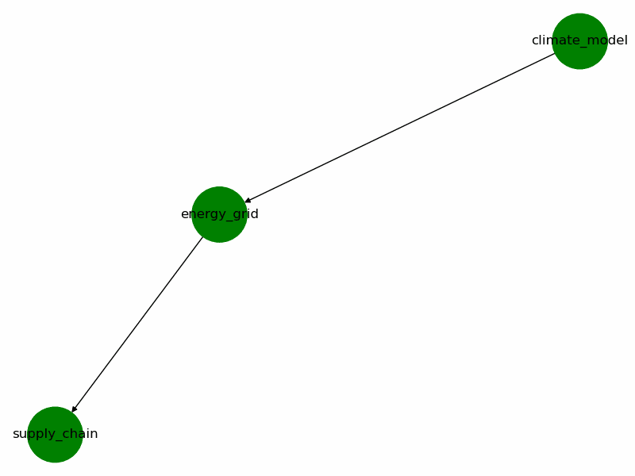
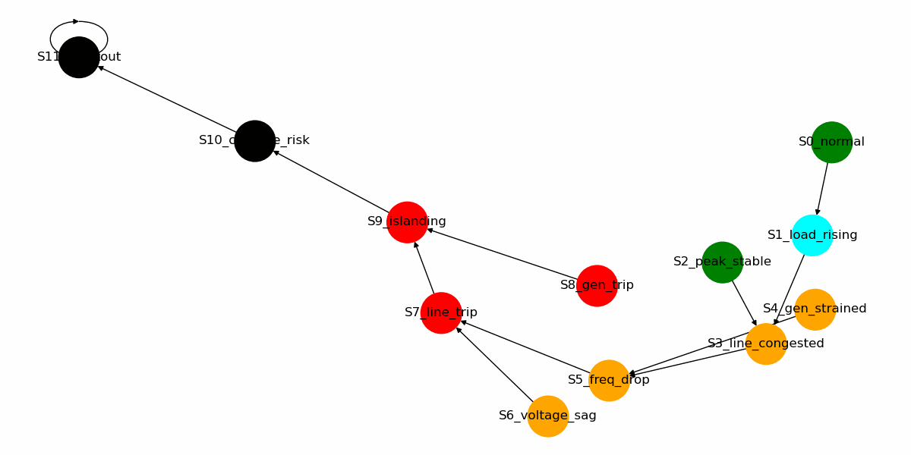
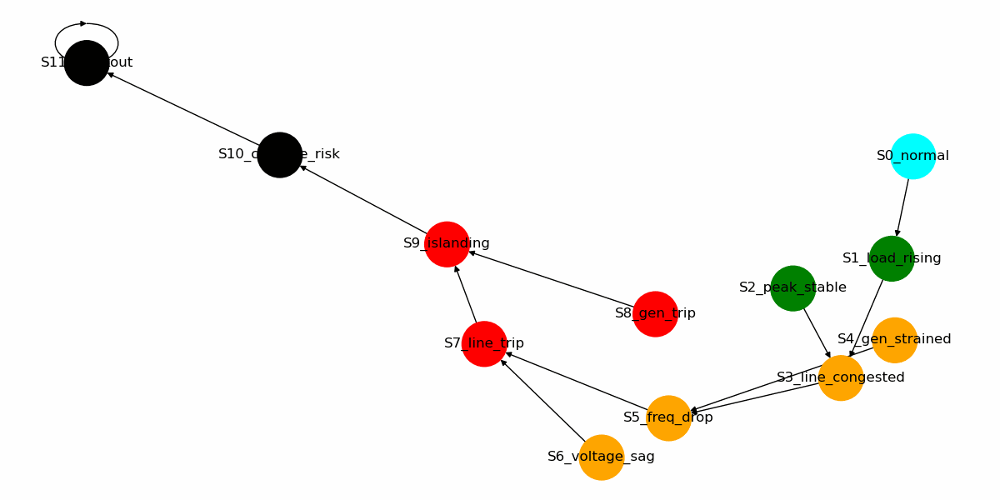

# ⚡ NEXAH Builder Lab

Internal builder environment for the NEXAH framework.

This is the **active workspace** for:
- simulations
- experiments
- navigation systems
- system prototypes

---

## 🚀 Quick Start

Run full lab:

```bash
python BUILDER_LAB/run_builder_lab.py
```

Run individual demos:

```bash
python BUILDER_LAB/demos/nexah_demo.py
python BUILDER_LAB/demos/nexah_explorer.py
python BUILDER_LAB/demos/nexah_graph_simulation.py
```

---

## 🧭 Core Concept

NEXAH treats systems as:

> **navigable structures instead of static states**

---

## 🧪 Main Capabilities

- simulate dynamic systems  
- detect regimes (stable → collapse)  
- extract structure (topology, basins, transitions)  
- navigate through system states  
- model cascading failures  

---

## 🧱 Builder Lab Layers

```
CORE                → mathematical structure (lattices, operators)
DYNAMICS_ENGINE     → structure discovery (basins, transitions, topology)
RUNTIME             → simulation + execution
NAVIGATION          → movement through state space
ENGINES             → real-world systems (energy, infrastructure, planetary)
VISUALIZATION       → system rendering & analysis
DEMOS               → entry points
```

---

## 🧭 Navigation

Run CLI:

```bash
python BUILDER_LAB/nexah_cli.py demo
python BUILDER_LAB/nexah_cli.py explorer
python BUILDER_LAB/nexah_cli.py systems-list
```

---

## 📚 Inventory & Structure

Full system index:

👉 `BUILDER_LAB_INVENTORY_INDEX.md`

---

## ⚠️ Status

- experimental  
- evolving  
- not production-ready  

---

## 🧠 Role in NEXAH

```
RESEARCH → FRAMEWORK → FIELD_LAYER → ARCHITECTURE → BUILDER_LAB
```

---

## 🔥 Note

This is not a clean framework.

It is:

> ⚙️ a **live system where structure is discovered and tested**```

Or run the full demo suite:

```bash
python BUILDER_LAB/run_builder_lab.py
```

---

## 🧪 Available Demos

| Demo | Description | File |
|------|------------|------|
| **Basic Demo** | Simple regime landscape navigation | `demos/nexah_demo.py` |
| **Explorer** | Interactive regime landscape explorer | `demos/nexah_explorer.py` |
| **Graph Simulation** | Dynamic state graph + multi-agent navigation | `demos/nexah_graph_simulation.py` |

---

## 🖥️ Additional Tools

| Tool | Description | Location |
|------|------------|----------|
| **Control Room** | Dashboard-style system overview | `dashboards/` |
| **Cascade Visualizer** | Real-time cascade simulation | `visualizers/` |
| **Global System Map** | Planetary-scale visualization | `visualizers/` |

---

## 🎨 Visual Gallery

| Preview | Description |
|---------|-------------|
|  | **Cascade Simulation** – cascading failures |
|  | **Explorer** – regime navigation |
|  | **System Navigation** – agent movement |
|  | **Energy Grid** – stabilization |
|  | **General Simulation** |

---

## 🧠 What this shows

The demos illustrate:

- systems as **state graphs**
- regime-based system behavior (stable → collapse)
- transitions between system states
- navigation through dynamic structures
- cascade behavior in interconnected systems

---

## 🧩 Create your own demo

Add a new Python file to:

```bash
BUILDER_LAB/demos/
```

You can connect your own system using the existing structure.

---

## 🧭 CLI Usage

```bash
python BUILDER_LAB/nexah_cli.py demo
python BUILDER_LAB/nexah_cli.py explorer
python BUILDER_LAB/nexah_cli.py systems-list
python BUILDER_LAB/nexah_cli.py create-system my_system
python BUILDER_LAB/nexah_cli.py simulate my_system
```

---

## 🔗 Go deeper

→ **Core System** → `FIELD_LAYER/`  
→ **Architecture** → `ARCHITECTURE/`  
→ **Theory** → `RESEARCH/`  

---

## 🧪 Status

- experimental  
- exploratory  
- not production-ready  

---

## 🧠 Core Idea

NEXAH treats systems as:

> **navigable structures instead of static states**

---

## 🔥 Important

The Builder Lab is:

- not the final system  
- not fully validated  
- not cleanly abstracted  

It is:

> ⚙️ the **working environment where new capabilities emerge**

---

## 🧭 Position in NEXAH

```text
RESEARCH (foundation)
→ FRAMEWORK (interpretation)
→ FIELD_LAYER (core system)
→ ARCHITECTURE (system integration)
→ BUILDER_LAB (experiments & demos)
```

## 🧠 Final Insight

The Builder Lab is where:

* ideas become systems
* systems become structure
* structure becomes navigation

⸻

NEXAH Builder Lab
Exploration → Experimentation → Emergence

⸻

License
Apache 2.0
