# 🧱 NEXAH – Gate Detection System  
## Building Log (with Visual Evidence)

---

## 📍 Overview

This log documents the evolution of the NEXAH Gate Detection system:
```text
Signal → Coherence → Entropy → Geometry → Phase → Structure → Gates
```

**Goal:**  
Detect structural transition zones in dynamical systems (e.g. voltage collapse)

---

# 🔹 v1–v3: Basic Signal + Threshold Gates

## Concept
- Simulated signal
- Coherence-based threshold detection

## Visual
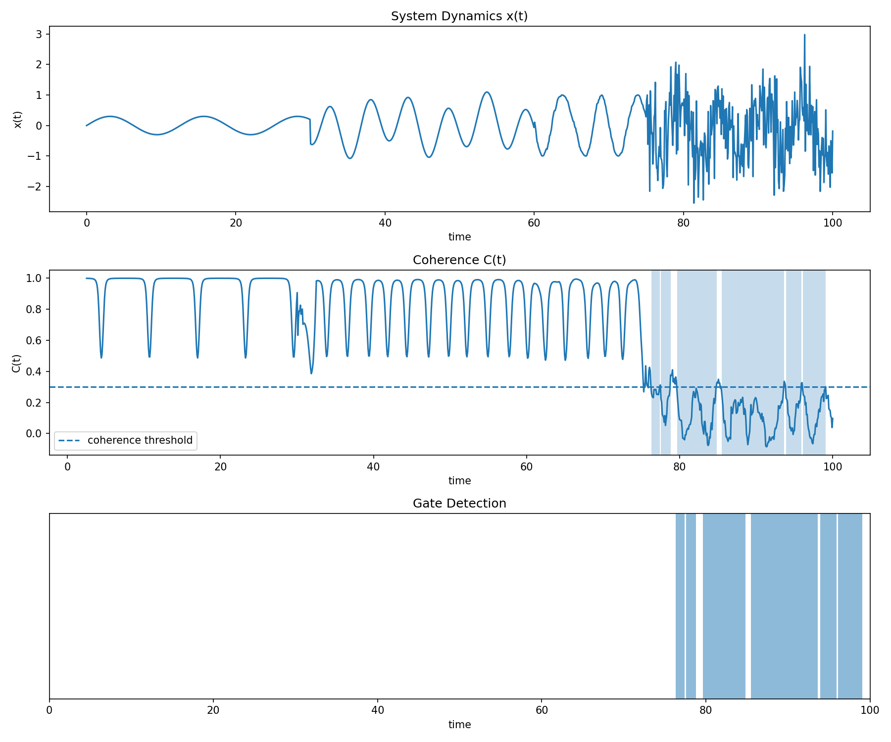

## Insight
- First visible instability regions
- BUT:
  - noisy
  - unstable
  - no structural meaning yet

---

# 🔹 v3.1–v4: Stabilization + Precursor

## Additions
- precursor detection
- smoothing

## Visual
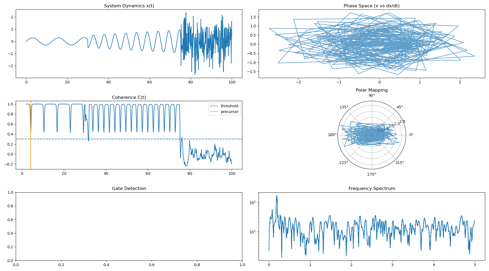

## Insight

Transition is not instantaneous:
```text
collapse builds up over time
```

---

# 🔹 v5: Multi-Metric Gate Detection

## Added layers

- Coherence $$C(t)$$
- Spectral Entropy $$S(t)$$

## Visual
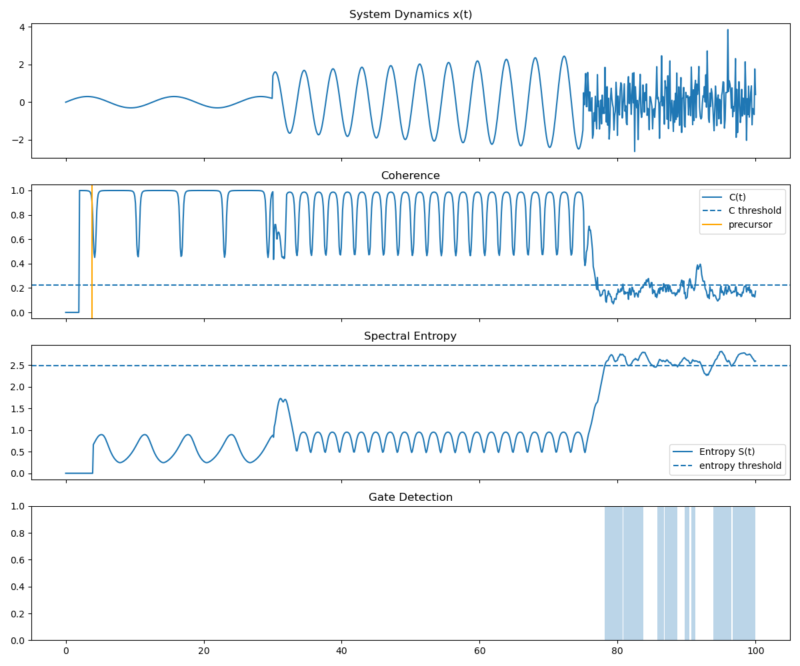

## Gate Condition

$$
C(t) \downarrow \quad \text{and} \quad S(t) \uparrow
$$

## Insight

System moves from:
- ordered oscillation  
→ to  
- disordered dynamics  

---

# 🔹 v6: Geometry Layer (Phase Space Dispersion)

## New component

Phase-space geometry:

$$
G(t) = \sqrt{\lambda_1 \cdot \lambda_2}
$$

(where $$\lambda_i$$ are covariance eigenvalues)

## Visual
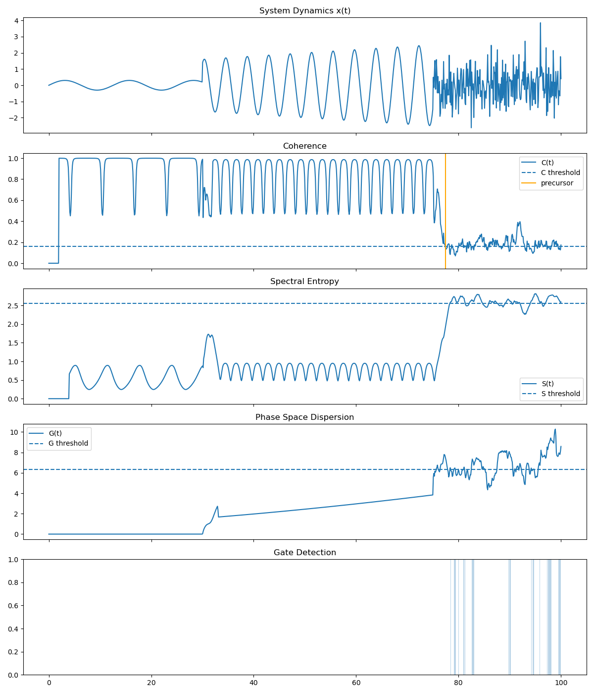

## Insight

Critical shift:
```text
Transition = geometric expansion
```

Observed:
- orbit → expands → fragments

---

# 🔹 v7: Temporal Gate Clustering

## Idea
Merge nearby gates into zones

## Visual
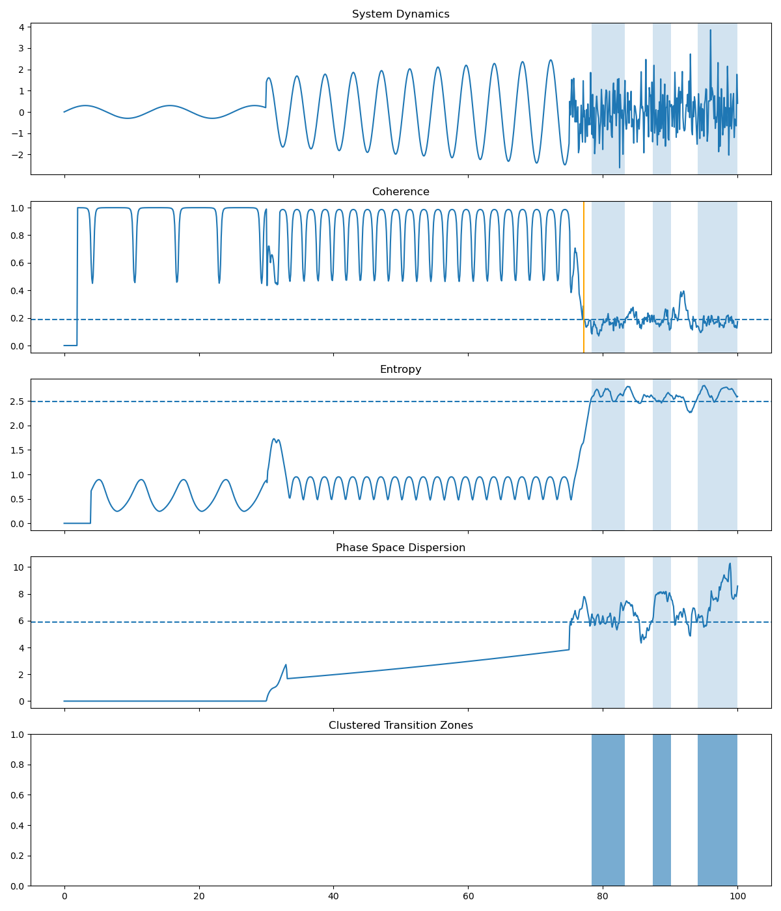

## Result

3 major transition zones:
```text
~78–83
~87–90
~94–100
```

---

## Insight

```text
Gates are NOT random → they occur in bursts
```

---

---

# 🔹 v8: Phase-Space Gate Clustering

## Idea
Project gates into phase space:

$$
(x, \dot{x})
$$

Cluster them

## Visuals

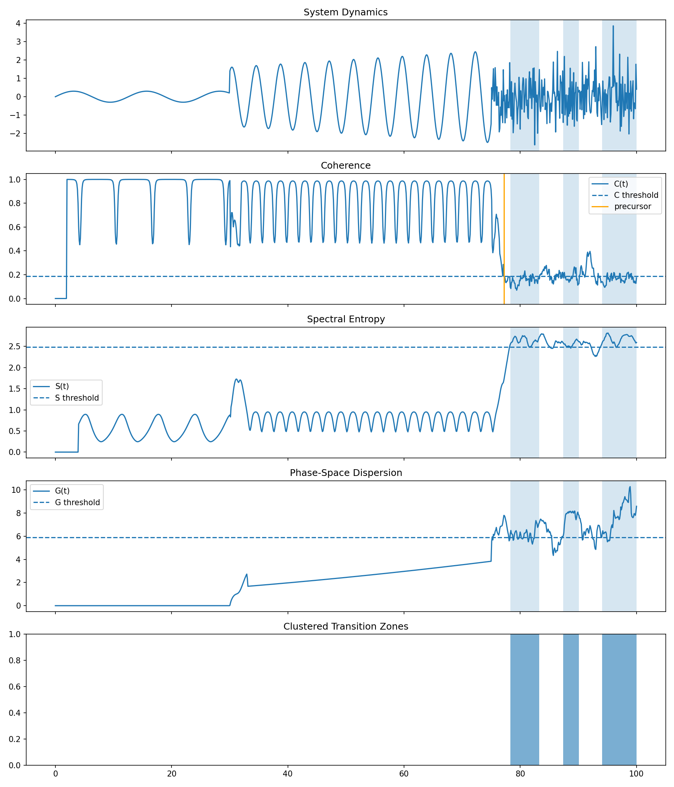

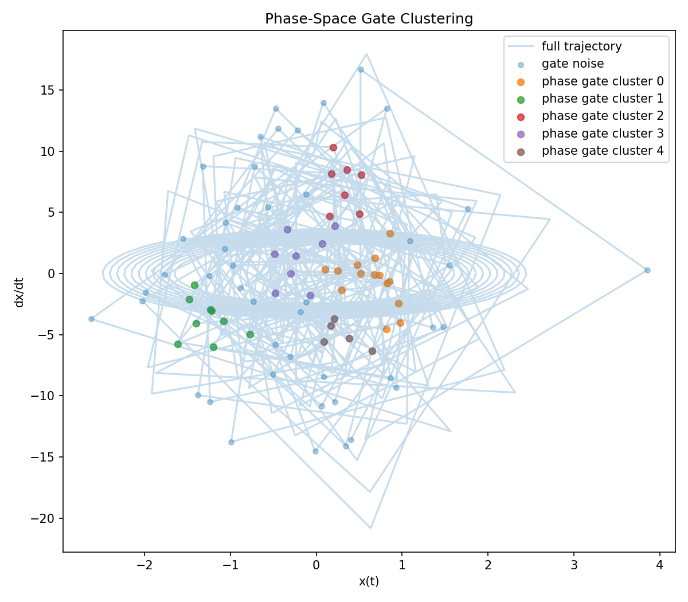

## Result

- ~88 gate points  
- 5 clusters  
- structured orbit + noise shell  

## Insight

```text
Phase space is structured (not uniform)
```

---

# 🔹 v9: Phase-Angle Mapping

## Idea

Map system into phase angle:

$$
\theta(t) = \arctan2(\dot{x}(t), x(t))
$$

## Visual
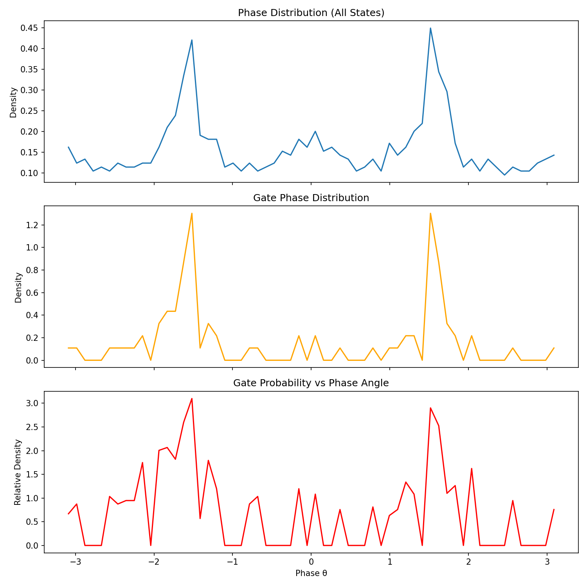

## Key Plots

- phase distribution (system)
- phase distribution (gates)
- gate probability vs phase
- polar projection

---

## 🔥 Critical Finding

$$
P(\text{gate} \mid \theta) \neq \text{const}
$$

```text
Gates concentrate at specific phase angles
```
---

## 📊 Observations

- dominant peaks near specific angles  
- asymmetry  
- phase-locking  

---

# 🔹 Cross-System Insight (ZETA × NEXAH)

## Visual
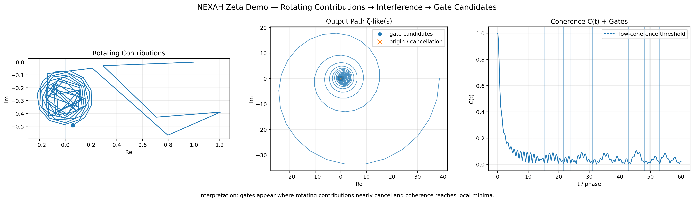

## Interpretation

System behaves like:

```text
rotating field → structured orbit → phase-locked collapse
```

---

---

# 🔹 Structural Interpretation

Observation:
```text
“sheet in the wind”
```

Formal interpretation:
```text
perturbed oscillatory manifold
with stochastic forcing
```

---

# 🔹 88 Gate Signature

Observed:

- ~88 gate samples (stable across runs)

Possible structure:

$$
8 \times 8 \times 8
$$

Interpretation:
```text
discrete resonance lattice
```

⚠️ Status:
- strong pattern
- not yet fundamental proof

---

# 🔹 Phase Space Structure

System layers:
```text
Core        → stable orbit
Mid region  → oscillatory regime
Outer shell → gate zone
Beyond      → noise / collapse
```
---

---

# 🔹 Fourier / Grid Connection

Observed:

- lattice patterns
- cube-like structures
- frequency slicing

Interpretation:

$$
\text{Phase Space} \leftrightarrow \text{Frequency Space}
$$

---

# 🔹 Meta Conclusion
```text
Transition is NOT time-based
Transition is STATE-based
```

More precisely:

$$
\text{Transition} = f(r, \theta, \text{structure})
$$

---

# 🔹 Next Steps

- v10: full $(r, \theta)$ field
- v11: navigation layer

Goal:
```text
predict AND steer transitions
```

---

# 🧭 Final Summary

```text
Signal
→ Oscillation
→ Phase Structure
→ Geometric Expansion
→ Phase-Locked Gates
→ Collapse
```

# 🔹 v10: Phase–Radius Field (r, θ)

## Idea

Extend phase-only view → full state coordinates:

$$
r(t) = \sqrt{x^2 + \dot{x}^2}, \quad
\theta(t) = \arctan2(\dot{x}, x)
$$

---

## Visual
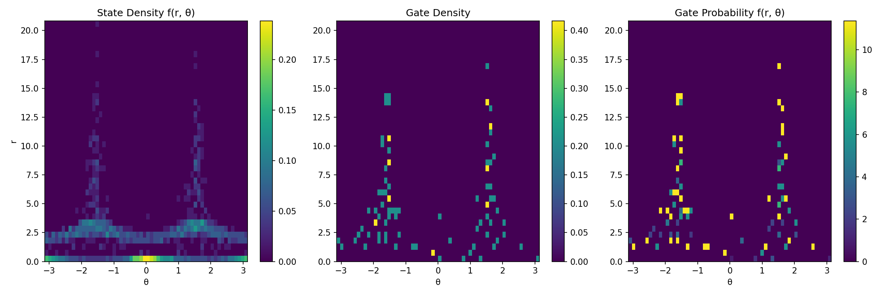

---

## Insight

```text
State is not 1D (time)
State is 2D (radius + phase)
```

Observed:

- two dominant vertical structures (“columns”)
- low-radius band near θ ≈ 0
- sparse outer regions

---

## 🔥 Critical Finding

$$
P(\text{gate} \mid r, \theta) \neq P(\text{gate} \mid \theta)
$$

```text
Gate probability depends on BOTH phase AND energy level
```

---

# 🔹 v11: Flow Field (State Dynamics)

## Idea

Compute motion in state space:

$$
\frac{dr}{dt}, \quad \frac{d\theta}{dt}
$$

---

## Visual
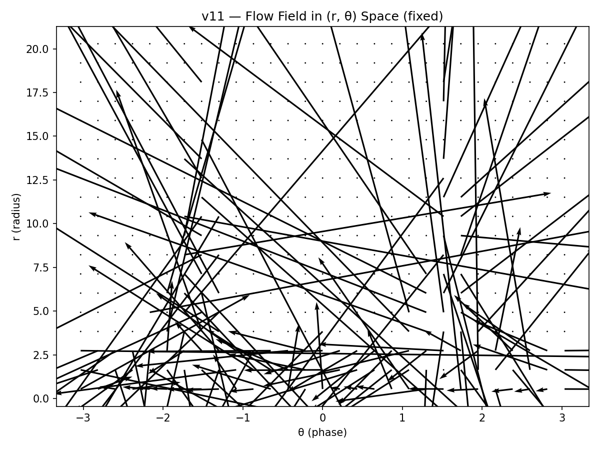

---

## Interpretation

This is a **vector field**:

```text
Each point (r, θ) has a direction of motion
```

---

## Insight

System structure emerges:

```text
Stable region → circular flow (orbit)
Transition zone → diverging flow
Collapse → chaotic flow
```

---

## 🔥 Key Concept

```text
System does not jump → it flows
```

Transitions are:

```text
trajectories through instability regions
```

---

# 🔹 v12: Steering + Risk Field

## Idea

Define risk:

$$
P(\text{gate} \mid r, \theta)
$$

Use it for control.

---

## Visuals

### System + Control
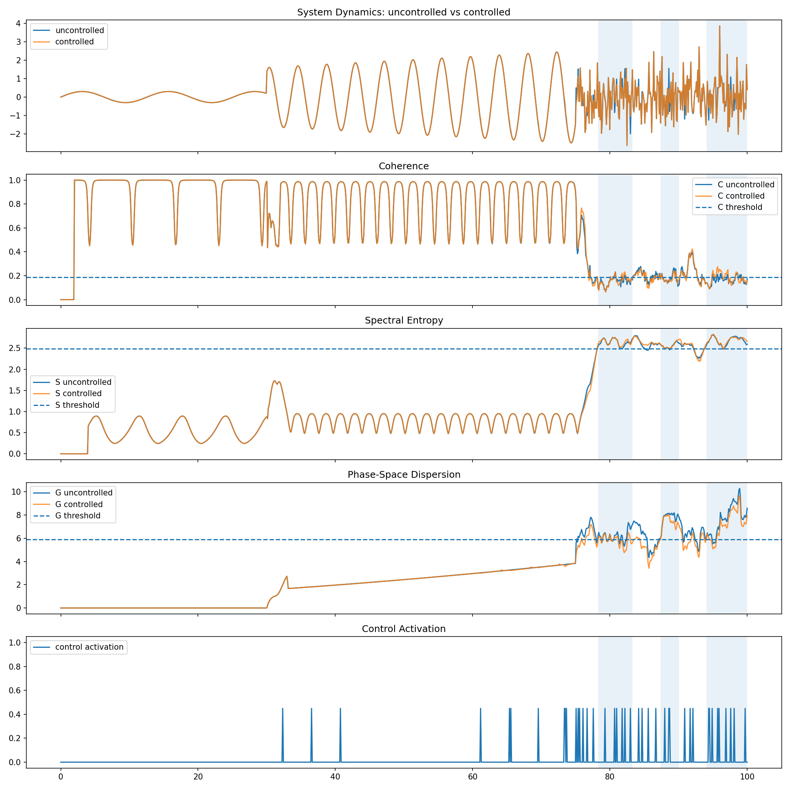

### Risk Field
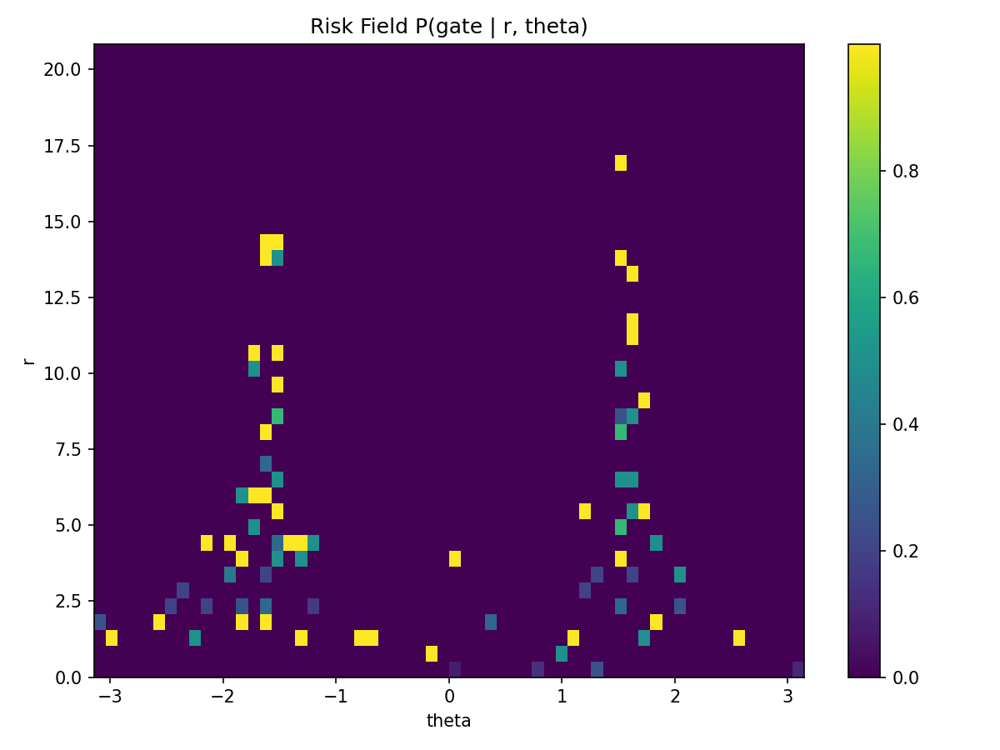

---

## Observations

### 1. Control works locally

```text
Geometry reduced slightly
G: 2.946 → 2.799
```

BUT:

```text
Global behavior mostly unchanged
```

---

### 2. Risk Field Structure

Observed:

```text
Two dominant gate columns
```

Interpretation:

```text
System has preferred transition channels
```

---

## 🔥 Critical Insight

```text
Gates are NOT random events
Gates are regions in state space
```

---

# 🔹 Field Interpretation (Unified)

System behaves like:

```text
Orbit → expansion → instability corridor → collapse
```

More formally:

```text
dynamical system on a curved manifold
with structured instability regions
```

---

# 🔹 Geometry of Transition

From v10–v12:

We now have:

- position → $(r, \theta)$
- motion → $(dr/dt, d\theta/dt)$
- risk → $P(\text{gate} \mid r, \theta)$

---

## This forms:

```text
STATE SPACE + FLOW + RISK FIELD
```

---

# 🔹 Major Conceptual Shift

Before:

```text
Detect collapse AFTER it happens
```

Now:

```text
Navigate system BEFORE collapse
```

---

# 🔹 Interpretation of “Two Columns”

Your observation:

```text
two pillars / Lorenz-like structure
```

Formal version:

```text
multi-attractor-like geometry
with transition channel between them
```

---

## Analogy

- Lorenz attractor → 2 lobes
- Here → 2 phase-energy corridors

---

# 🔹 Why Control is still weak

Current control:

```text
reactive (event-based)
local (point correction)
```

System behavior:

```text
trajectory-based (continuous flow)
```

---

## Missing Piece

```text
trajectory steering instead of point correction
```

---

# 🔹 What is STILL missing

## 1. Gradient-Based Navigation

We need:

$$
u(r, \theta) = -\nabla P(\text{gate})
$$

```text
System actively moves away from risk zones
```

---

## 2. Attractor Detection

Find:

```text
stable orbit regions
unstable saddle regions
transition corridors
```

---

## 3. Global Policy

Instead of:

```text
if gate → act
```

We need:

```text
always steer system through safe regions
```

---

## 4. Memory / Hysteresis

System likely has:

```text
history dependence
```

→ not yet modeled

---

## 5. Multi-Dimensional Extension

Current:

```text
(x, dx/dt)
```

Future:

```text
high-dimensional grid / network states
```

---

# 🔹 Where this leads (IMPORTANT)

This is no longer:

```text
signal analysis
```

This is becoming:

```text
a navigation system for dynamical fields
```

---

## Target Architecture

```text
Simulation
→ State embedding (r, θ)
→ Flow field
→ Risk field
→ Navigation policy
→ Controlled trajectory
```

---

# 🔹 Final Insight (v1 → v12)

```text
Instability is not noise
Instability is geometry
```

---

# 🧭 Updated Final Summary

```text
Signal
→ Oscillation
→ Phase structure
→ Energy layer (r)
→ Flow field
→ Risk field
→ Transition corridors
→ Navigable system
```

---

# 🔹 NEXT TARGET (v13+)

```text
Full trajectory steering
```

Goal:

```text
keep system inside stable manifold
```

---

# 🔹 Long-Term Vision

This can generalize to:

- power grid stability
- climate tipping points
- biological systems
- neural dynamics

---

## Final Statement

```text
We are no longer detecting collapse.

We are mapping and navigating the space in which collapse occurs.
```

---

# 🔹 v27: State Layer (THETA / TAO / DAO / IOTA)

## Idea

Discretize phase space into structural states:

```text
THETA → stable oscillation core  
TAO   → boundary layer  
DAO   → expanded / unstable region  
IOTA  → escape / discontinuity event
```

## Visuals

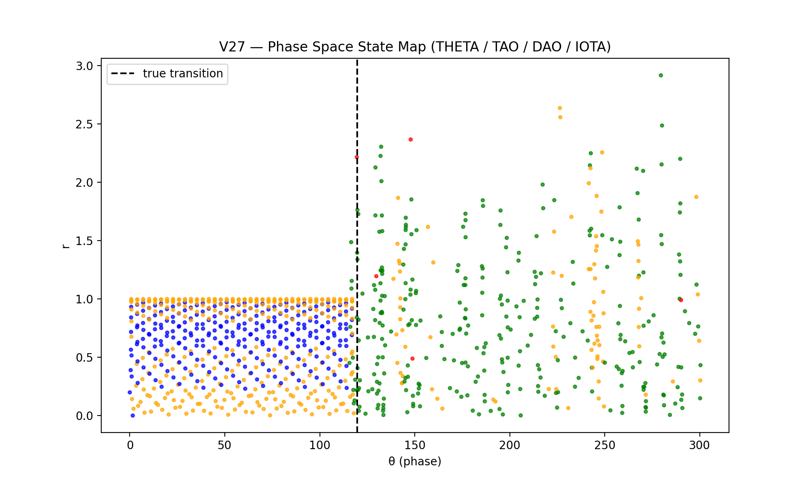  
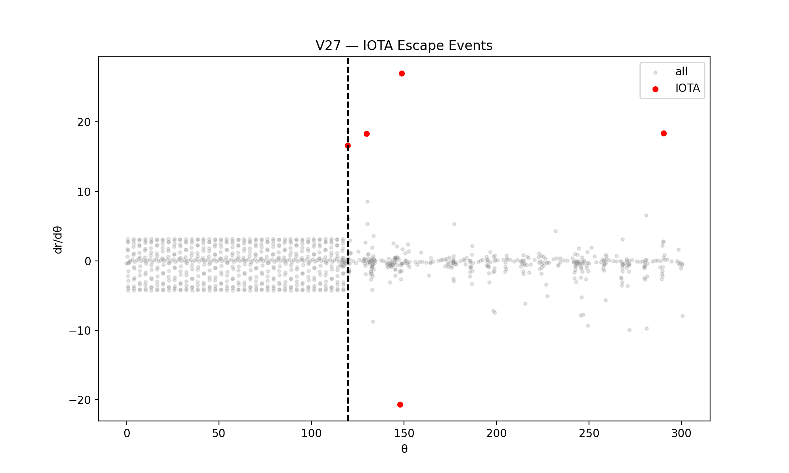  
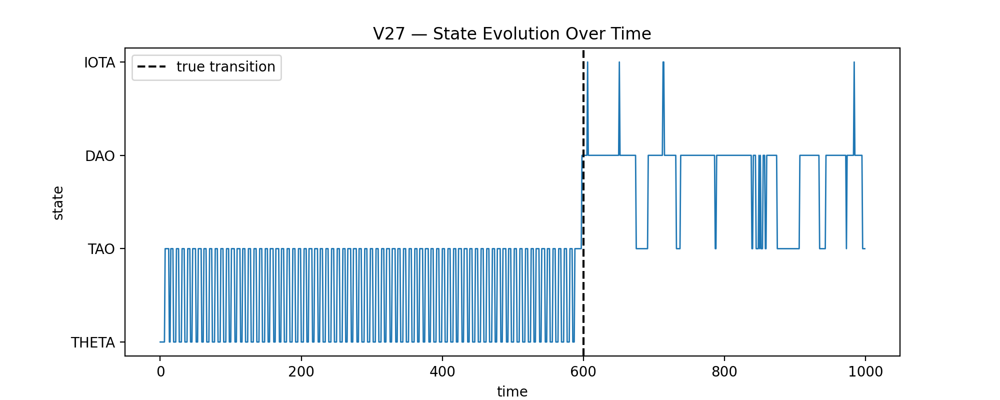

---

## Insight

```text
System is not continuous → it moves through discrete regimes
```

Observed:

- clean separation pre/post transition
- IOTA = rare but high-impact events
- DAO dominates post-transition

---

## 🔥 Critical Finding

```text
Transitions are state transitions, not just geometric expansion
```

---

# 🔹 v28: YUGO Direction (Flow Orientation)

## Idea

Introduce directional field:

$$
\text{YUGO} = \arctan2\left(\frac{dr}{d\theta}, \frac{d\theta}{dt}\right)
$$

---

## Visuals

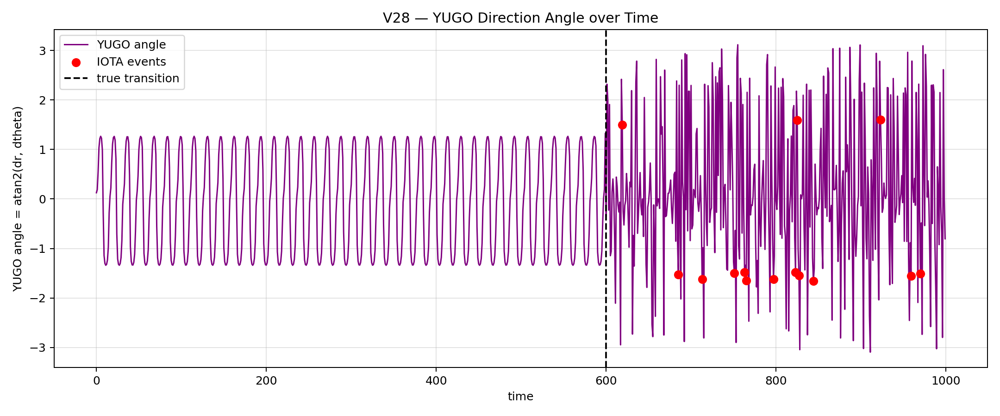  
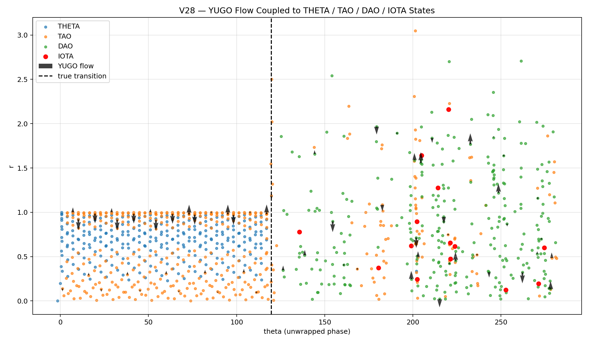  
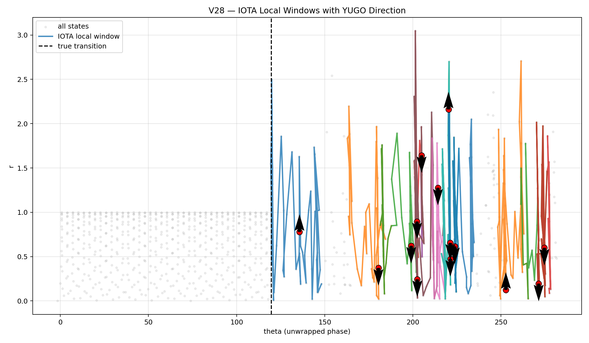

---

## Observations

- pre-transition → stable oscillatory direction
- post-transition → chaotic angular scattering

---

## 🔥 Critical Insight

```text
IOTA events are directional breaks in flow
```

NOT just:

```text
large derivative
```

BUT:

```text
loss of directional coherence
```

---

# 🔹 v29: Greyscape (Pre-IOTA Warning Field)

## Idea

Invert density:

$$
\text{Greyspace} = \frac{1}{\rho(r, \theta)}
$$

→ detect low-density regions (structural gaps)

---

## Visuals

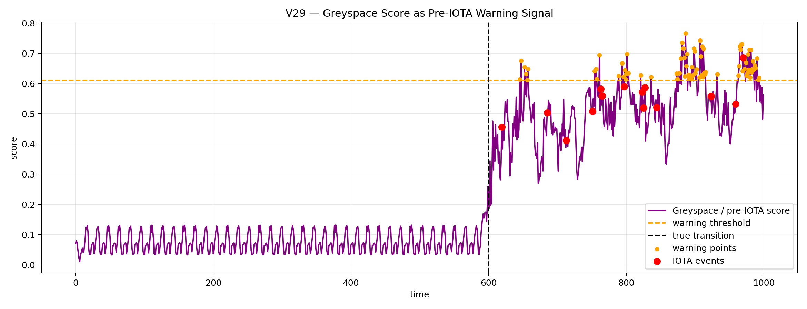  
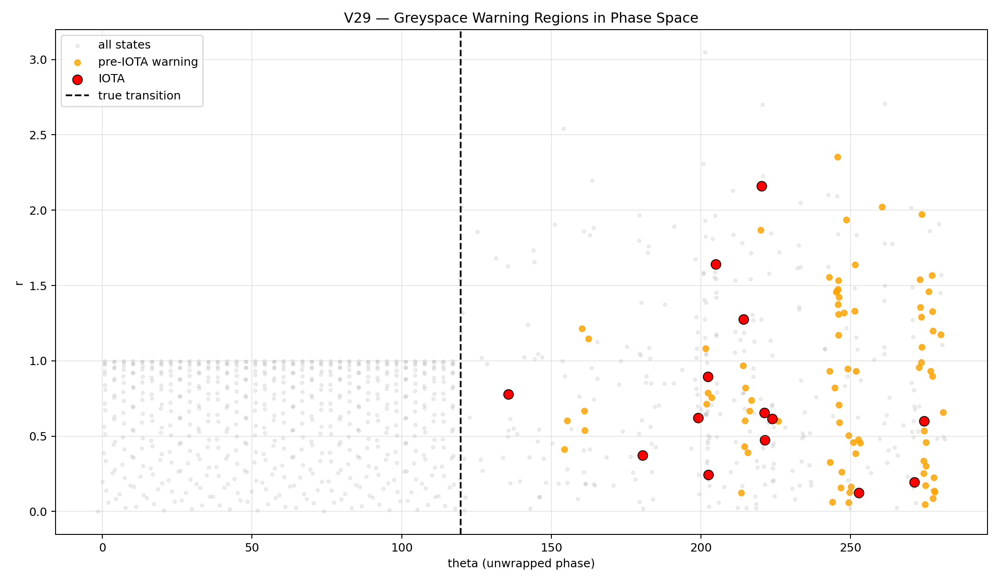  
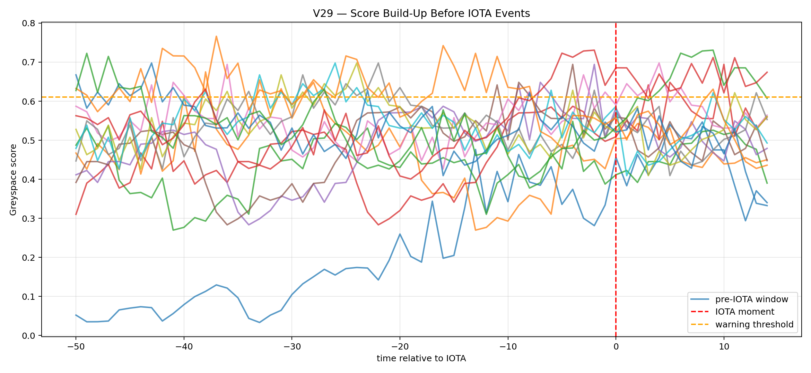

---

## Observations

- clear score jump at transition
- IOTA events cluster AFTER greyspace rise
- warnings appear BEFORE IOTA

---

## Metrics

```text
Mean lead time:   ~12 steps
Median lead time: ~5 steps
```

---

## 🔥 Critical Insight

```text
Greyspace = early warning signal for structural escape
```

---

## Interpretation

```text
System does not collapse randomly
It enters a low-density corridor first
```

---

# 🔹 v30: IOTA Typing (Gap vs Boundary)

## Idea

Classify IOTA events using:

- Greyspace score
- Distance to structural ridge

---

## Visual


---

## Result

```text
GAP_ESCAPE:        0
BOUNDARY_COLLAPSE: 20
```

---

## Insight

```text
All IOTA events occur on structure boundaries
NOT inside free gaps
```

---

## 🔥 Critical Finding

```text
System does NOT jump into emptiness

It breaks along structural edges
```

---

## Interpretation

- ridges = attractor remnants
- IOTA = failure of boundary stability
- collapse propagates along structure

---

# 🔹 v31: Shape Extraction (Clusters + Geometry)

## Idea

Extract geometric structures from state cloud:

- clustering (DBSCAN)
- triangulation (Delaunay)

---

## Visual


---

## Observations

- one dominant post-transition cluster
- clear internal triangulation structure
- latent geometric connections appear

---

## 🔥 Critical Insight

```text
Post-transition state space is NOT random

It has hidden geometric structure
```

---

## Interpretation

What you observed visually:

```text
points → align → form shapes → triangles → bundles
```

Formal version:

```text
emergent geometric manifold with internal connectivity
```

---

## Your Observation (VERY IMPORTANT)

> "unsichtbare sphere", "kleiner Wagen", "Dreiecke"

Translated:

```text
localized geometric attractors inside chaotic region
```

---

## Hypothesis

```text
System reorganizes after transition into:

local micro-attractors
+
connection geometry between them
```

---

# 🔹 Unified Insight (v27 → v31)

We now have:

```text
STATE        → (THETA / TAO / DAO / IOTA)
FLOW         → YUGO direction
STRUCTURE    → ridge + density field
GAP FIELD    → greyspace
EVENT TYPES  → boundary vs gap
GEOMETRY     → clusters + triangulation
```

---

# 🔥 Major Breakthrough

```text
Collapse is not a single event

It is a STRUCTURED PROCESS:

1. density drops (greyspace)
2. direction breaks (YUGO)
3. boundary weakens (ridge distance)
4. system escapes (IOTA)
5. new structure forms (clusters)
```

---

# 🔹 Updated Architecture

```text
Simulation
→ (r, θ)
→ Flow field
→ Density field
→ Greyspace field
→ Ridge structure
→ IOTA detection
→ IOTA typing
→ Shape extraction
```

---

# 🔹 Updated Final Insight

```text
Instability is geometry
Transition is navigation through gaps
Collapse is structured reconfiguration
```

---

# 🧭 Updated Summary (v1 → v31)

```text
Signal
→ Oscillation
→ Phase structure
→ Energy layer (r)
→ Flow field
→ Risk field
→ State regimes
→ Directional breaks
→ Greyspace gaps
→ Boundary collapse
→ Geometric reorganization
```

---

# 🔹 NEXT STEP (v32+)

```text
Trajectory steering using:

- greyspace gradient
- ridge avoidance
- YUGO stabilization
```

Goal:

```text
guide system AROUND collapse corridors
```

---

# 🔹 Final Statement (Updated)

```text
We are no longer detecting collapse.

We are mapping:

- where it forms
- how it emerges
- and how to navigate around it.
```

---
# 🔷 NEXAH — Minimal Transition Model (V32)

---

## 📍 Goal

Define a **minimal, reproducible, structure-based transition model**.

---

# 🧠 Core Idea

A dynamical system does not collapse randomly.

A transition occurs when the system enters a structurally unstable region in state space.

---

# 🔹 State Representation

We embed the system into phase space:

$$
r(t) = \sqrt{x^2 + \dot{x}^2}
$$

$$
\theta(t) = \arctan2(\dot{x}, x)
$$

State:

$$
s(t) = (r(t), \theta(t))
$$

---

# 🔹 Derived Quantities

## 1. Flow (local dynamics)

$$
\frac{dr}{d\theta}
$$

---

## 2. Density field

Estimate local density:

$$
\rho(r, \theta)
$$

---

## 3. Greyspace (instability proxy)

$$
G(r, \theta) = \frac{1}{\rho(r, \theta)}
$$

Interpretation:

```text
Low density → unstable region
High density → stable manifold
```

---

## 4. Ridge (structure)

Define ridge as:

$$
\text{ridge} = \{ (r, \theta) \mid \rho(r, \theta) \text{ is locally maximal} \}
$$

---

## 5. Ridge distance

$$
D(r, \theta) = \text{distance to nearest ridge point}
$$

---

# 🔹 Event Definition

## IOTA (transition event)

An IOTA occurs when:

$$
\left| \frac{dr}{d\theta} \right| > \tau
$$

where:

- τ = high percentile threshold (e.g. 98%)

---

# 🔹 IOTA Classification

Each IOTA is classified using:

- Greyspace score
- Ridge distance

---

## Boundary Collapse

$$
G \leq G_c \quad \text{and/or} \quad D \leq D_c
$$

Interpretation:

```text
System breaks along structure boundary
```

---

## Gap Escape

$$
G > G_c \quad \text{and} \quad D > D_c
$$

Interpretation:

```text
System escapes into low-density region
```

---

# 🔹 Transition Mechanism

A full transition is not a single event.

It is a process:

```text
1. Density decreases (ρ ↓)
2. Greyspace increases (G ↑)
3. Flow destabilizes (|dr/dθ| ↑)
4. IOTA events occur
5. System leaves ridge structure
6. New structure forms
```

---

# 🔹 Formal Transition Condition

A transition region exists where:

$$
G(r, \theta) \text{ is high}
$$

AND

$$
\left| \frac{dr}{d\theta} \right| \text{ is high}
$$

AND

$$
D(r, \theta) \text{ is non-zero}
$$

---

# 🔹 Interpretation

```text
Transition =
entry into low-density region
+ loss of directional coherence
+ separation from structural manifold
```

---

# 🔹 System View

The system is:

```text
a trajectory moving on a structured manifold
with regions of instability (gaps)
and structural attractors (ridges)
```

---

# 🔹 Key Insight

```text
Instability is not noise

Instability is geometry
```

---

# 🔹 Minimal Pipeline

```text
Signal x(t)
→ Phase embedding (r, θ)
→ Density field ρ
→ Greyspace G
→ Ridge detection
→ Ridge distance D
→ Flow derivative dr/dθ
→ IOTA detection
→ IOTA classification
```

---

# 🔹 What this model does NOT assume

- no specific system physics  
- no predefined thresholds (except statistical τ)  
- no symbolic interpretation  

---

# 🔹 What this model enables

- transition detection  
- early warning (via Greyspace)  
- structural interpretation  
- potential trajectory steering  

---

# 🔹 Status

```text
Minimal working model (empirical)

✔ reproducible
✔ interpretable
⚠ not yet formally proven
```

---

# 🔹 Next Step (V33)

```text
Replace thresholds with continuous fields:

P(IOTA | r, θ)

→ probabilistic transition model
```

---

# 🔹 Final Statement

```text
A system does not collapse.

It leaves the manifold on which it was stable.
```

---

---

# 🔹 v33: Probabilistic IOTA Field

## Idea

Replace hard thresholds with a continuous field:

$$
P(\text{IOTA} \mid r, \theta)
$$

---

## Visual


---

## Observations

- smooth probability distribution instead of binary events  
- IOTA regions become **spatial “bubbles”**  
- clear separation between:
  - stable orbit
  - transition cloud  

---

## 🔥 Critical Insight

```text
IOTA is not an event.

IOTA is a probability field in state space.
```

---

## Interpretation

```text
System moves through gradients of instability
NOT discrete jump points
```

---

# 🔹 v34: Gradient Steering (First Navigation Layer)

## Idea

Use gradient of risk field:

$$
u(r, \theta) = -\nabla P(\text{IOTA})
$$

---

## Visuals

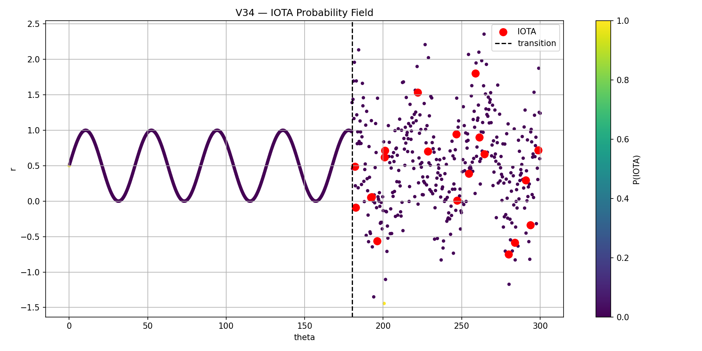  
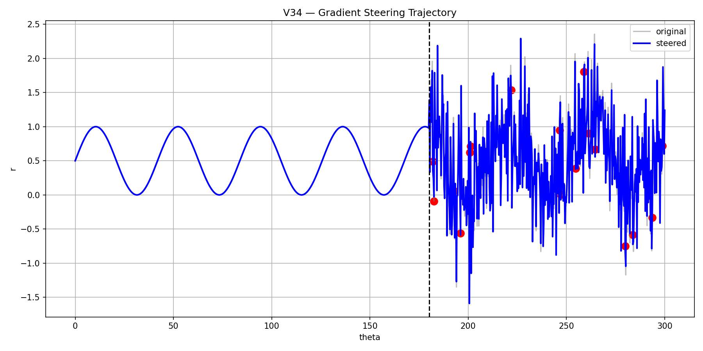

---

## Observations

- system is pushed away from high-risk zones  
- trajectory visibly deflects  
- but remains unstable globally  

---

## 🔥 Critical Insight

```text
Avoiding risk locally is NOT sufficient
```

---

## Interpretation

```text
System needs guidance, not just repulsion
```

---

# 🔹 v35: Target Field (Directed Navigation)

## Idea

Introduce global target:

```text
safe region = center of stable manifold
```

Combine:

```text
risk avoidance + target attraction
```

---

## Visuals

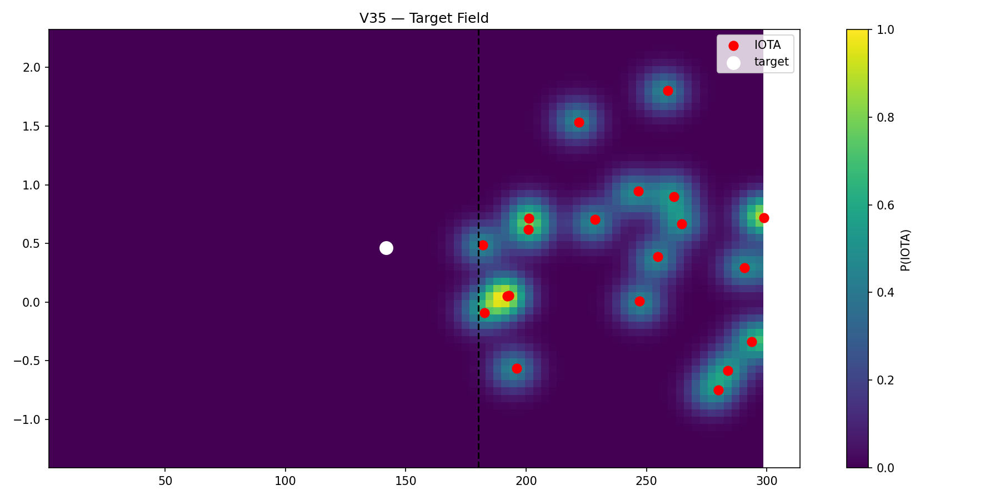  


---

## Observations

- trajectory becomes more coherent  
- direction emerges  
- still unstable under noise  

---

## 🔥 Critical Insight

```text
Navigation requires BOTH:

repulsion (risk)
+ attraction (target)
```

---

## Interpretation

```text
System begins to behave like a guided flow
```

---

# 🔹 v36: Adaptive Target Field

## Idea

Replace static target with dynamic targets:

```text
local low-risk regions = moving attractors
```

---

## Visuals

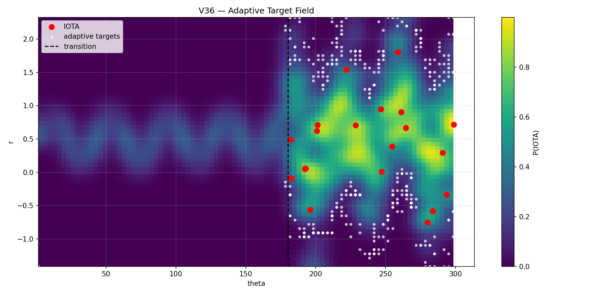  
  
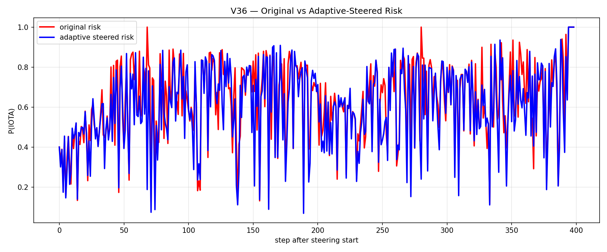

---

## Results

```text
Mean original risk: 0.6345
Mean steered risk:  0.6027
Reduction: ~5%
```

---

## Observations

- adaptive targets follow structure  
- trajectory becomes smoother  
- system avoids some IOTA zones  

---

## 🔥 Critical Insight

```text
Local structure-aware navigation reduces risk measurably
```

---

## Interpretation

```text
System learns to move ALONG the field, not against it
```

---

# 🔹 v37: Structure-Aware Steering

## Idea

Add structural constraint:

```text
follow ridge topology + avoid risk
```

---

## Visuals

  
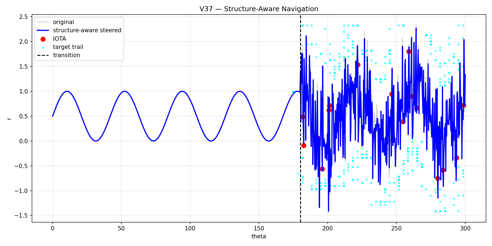  
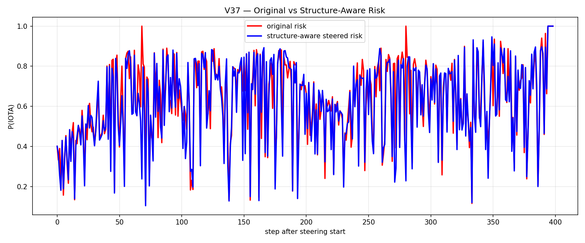

---

## Results

```text
Mean original risk: 0.6345
Mean steered risk:  0.6193
Reduction: ~2.4%
```

---

## Observations

- trajectory aligns with structural contours  
- visible “loop / chain / polygon” patterns emerge  
- motion follows discrete anchor points  

---

## 🔥 Critical Insight

```text
Optimal navigation is NOT minimal risk.

It is STRUCTURE-CONSISTENT motion.
```

---

## Interpretation

What appears visually as:

```text
chains / nonagons / loops / mirrored bays
```

is formally:

```text
discrete attractor segments + transition links
```

---

## Deeper Finding

```text
System does not move continuously.

It hops between structural anchors.
```

---

# 🔹 Unified Insight (v33 → v37)

We now have:

```text
PROBABILITY FIELD  → P(IOTA)
GRADIENT FIELD     → risk avoidance
TARGET FIELD       → directed motion
ADAPTIVE TARGETS   → local structure following
STRUCTURE FIELD    → ridge topology constraint
```

---

# 🔥 Major Breakthrough (Navigation Layer)

```text
Transition is not avoided.

It is NAVIGATED.
```

---

# 🔹 Key Tradeoff Discovered

```text
Efficiency (risk minimization)
vs
Structure fidelity (stable motion)
```

---

## Interpretation

- V36 → aggressive avoidance (better reduction)  
- V37 → structure-aligned motion (more stable, less reduction)  

---

# 🔹 Updated System View

```text
Trajectory =
movement through

- risk gradients
- structural ridges
- local attractor anchors
```

---

# 🔹 Updated Final Insight

```text
Instability is a field
Structure is a constraint
Navigation is a balance between both
```

---

# 🔹 NEXT STEP (v38)

```text
Add memory + return flow:

repel (risk)
+ attract (structure memory)

→ stable oscillatory navigation
```

---

## Final Statement (Extended)

```text
We are no longer detecting collapse.

We are:

learning how systems move
through stability and instability
as structured flows.
```

---
