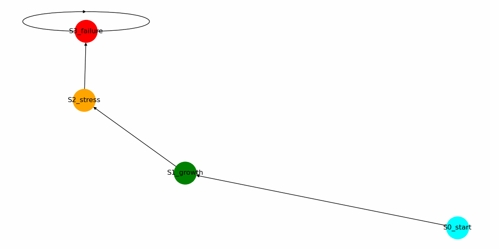

# Builder Lab Demos

Ready-to-run examples that show what NEXAH can do in practice.

This folder contains interactive demos — from simple regime exploration to complex multi-agent stabilization and cascade visualization.

### Quick Start

```bash
cd BUILDER_LAB/demos
python nexah_demo.py              # Basic demo
python nexah_explorer.py          # Interactive explorer
python nexah_graph_simulation.py  # Graph + multi-agent navigation
```

### Available Demos

| Demo                          | Description                                              | File |
|-------------------------------|----------------------------------------------------------|------|
| **Basic Demo**                | Simple regime landscape navigation                       | `nexah_demo.py` |
| **Explorer**                  | Interactive regime landscape explorer                    | `nexah_explorer.py` |
| **Graph Simulation**          | Dynamic state graph + multi-agent navigation             | `nexah_graph_simulation.py` |
| **Control Room**              | Dashboard-style overview of system stability             | `nexah_control_room.py` |
| **Cascade Visualizer**        | Real-time cascade failure simulation                     | `nexah_cascade_visualizer.py` |
| **Global System Map**         | Planetary-scale system visualization                     | `nexah_global_system_map.py` |

**Tipp:** Alle Demos can be launced from BUILDER_LAB-Folder.

---

## Want to create your own demo?

Just add a new Python file in this folder and register it in the demo runner. The adapter layer makes it easy to connect any system.
___

### Visual Gallery

Here are some highlights from the demos — see NEXAH in action:

**Cascade Simulation** – Real-time cascading failures in infrastructure networks  


**Explorer** – Interactive navigation through regime landscapes  


**System Navigation** – Agent moving through a dynamic system state space  


**Energy Grid** – Stabilizing a power grid under stress  


**General Simulation** – Overview of NEXAH dynamics and regime transitions  


**Climate Model** – Planetary-scale system evolution  


---

More visualizations can be found in the `../visuals/` folder.
---
```
More visualizations can be found in the `../visuals/` folder.

---

License
Apache 2.0

