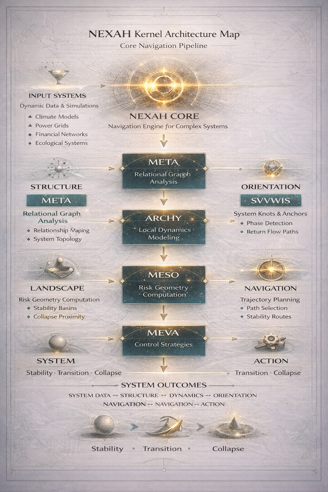

# DISCOVERY_ENGINE

Tools for architecture exploration, resilience analysis and **dynamic structure discovery**.

This folder contains the computational laboratory of NEXAH — a set of research tools that generate, evolve and analyze system architectures, simulate dynamic behavior, and extract **topological structure from flow**.

---

## What you can do here

- Generate and evolve system architectures  
- Map resilience landscapes  
- Detect phase transitions  
- Discover structural laws  
- Simulate dynamic systems  
- Extract loops, channels, and networks from flow (**NEW**)  
- Visualize complex dynamics  

---

## Quick Start

Most tools can be run directly, for example:

```bash
python resilience_architecture_evolver.py
python resilience_landscape.py
python visualize_system.py
```

Dynamic navigation examples:

```bash
python ENGINE/analysis/navigation_level60_persistent_flow.py
python ENGINE/analysis/navigation_level61_multi_loop_engine.py
```

→ **[Tool Capabilities & Pipeline](./TOOL_CAPABILITIES.md)**

---

## Tool Capabilities Highlights

### Core

- **Architecture Exploration** – generate and evolve thousands of system designs  
- **Resilience Analysis** – evaluate stability and failure propagation  
- **Landscape Mapping** – create 3D resilience landscapes and phase diagrams  
- **Law Discovery** – search for universal structural principles  

---

### Advanced (NEW)

- **Dynamic System Simulation** – multi-agent field evolution  
- **Resonance Detection** – φ-based transition behavior  
- **Flow Structuring** – emergence of persistent trajectories  
- **Topology Formation** – loops, knots, channels, networks  
- **Topology Extraction** – explicit detection of structure from dynamics  

---

## Core Idea (Updated)

Traditional systems analysis asks:

> Where are systems stable?

NEXAH now asks:

> **How do systems move, stabilize, and organize into connected structures?**

---

## System Evolution

The framework has evolved into a multi-layer discovery engine:

Dynamics  
→ Geometry  
→ Resonance  
→ Flow  
→ Topology  
→ Extraction  

---

## Key Discoveries

The system demonstrates:

- geometry emerging from dynamics  
- resonance-driven state selection  
- φ as an emergent transition ratio  
- flow organizing into persistent structures  
- topology emerging from motion  
- separation of density vs structural skeleton  
- formation of loop–channel networks  

---

## New Capability

The system can now **extract topological structure from purely dynamic processes**.

This includes:

- loop detection  
- channel extraction  
- transition node identification  
- network reconstruction  

---

## New Tool Layer (Topology Extraction)

New tool class:

- `loop_detector.py`  
- `channel_extractor.py`  
- `transition_node_finder.py`  

These tools transform:

> simulation output → explicit structural representation  

---

## Navigation Pipeline (Extended)

Architecture  
↓  
Evolution  
↓  
Analysis  
↓  
Landscape Mapping  
↓  
Phase Detection  
↓  
Law Discovery  
↓  
Validation  
↓  
Dynamics Simulation  
↓  
Resonance Formation  
↓  
Flow Structuring  
↓  
Topology Formation  
↓  
Topology Extraction  

---

## Interpretation

The system is no longer only analyzing structures.

It is:

> **generating, evolving, and extracting structure from dynamics**

---

## Want to go deeper?

→ **[Tool Capabilities & Pipeline](./TOOL_CAPABILITIES.md)**  
→ **[Extended Documentation](./README_extended.md)**  

---

## System Architecture



This visual shows the **core architecture of the NEXAH Discovery Engine**.

It illustrates how raw system simulations are transformed into structured, navigable stability landscapes and dynamic topologies through layered processing:

- **META** – relational system structure  
- **ARCHY** – local dynamics modeling  
- **MESO** – stability and risk landscape computation  
- **MEVA** – intervention and control strategies  

### Extended Layers

- **DYNAMICS** – multi-agent flow evolution  
- **TOPOLOGY** – emergent loop/channel networks  

Together, these layers form the navigation pipeline that allows systems to move from observation to structured understanding.

---

## License

Apache 2.0
