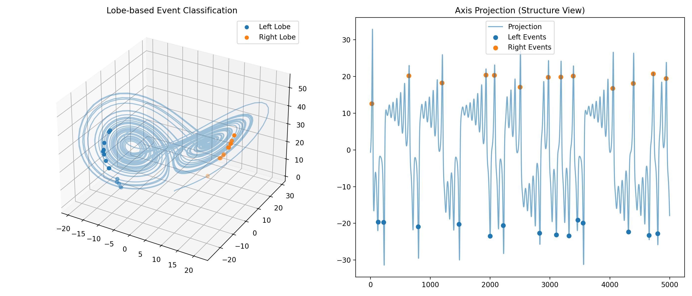
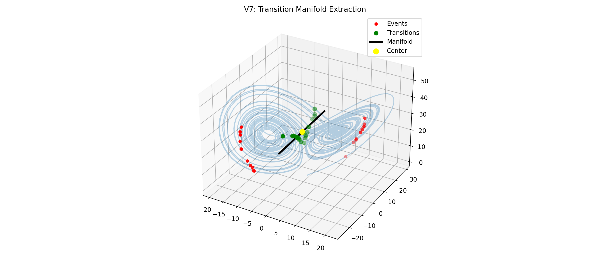
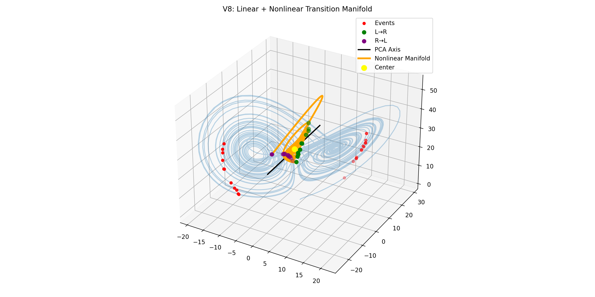
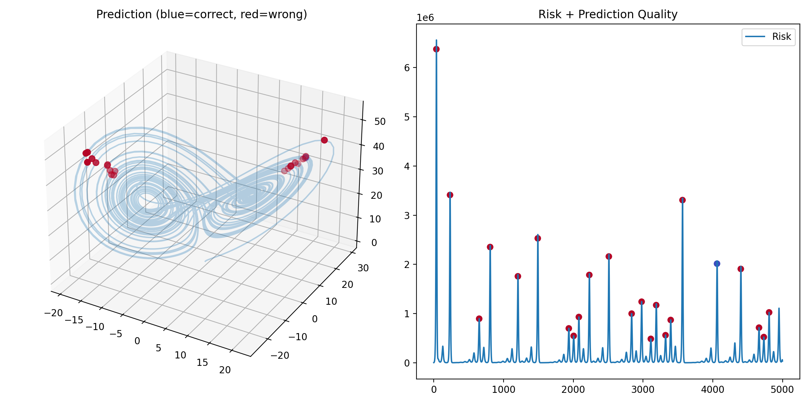
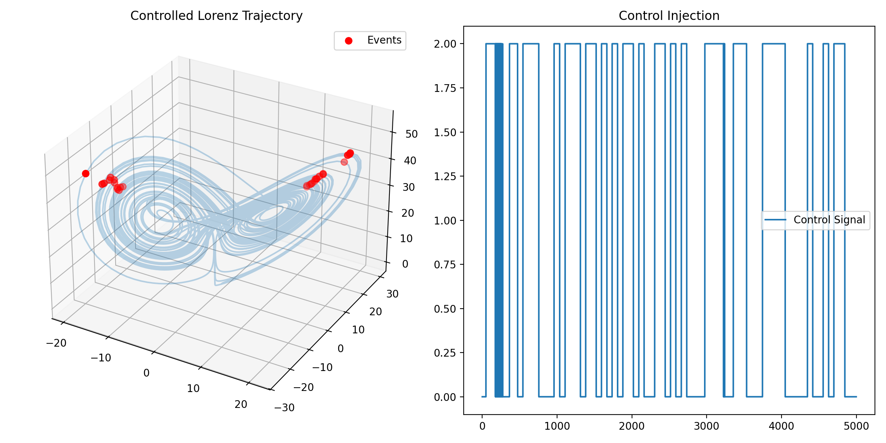
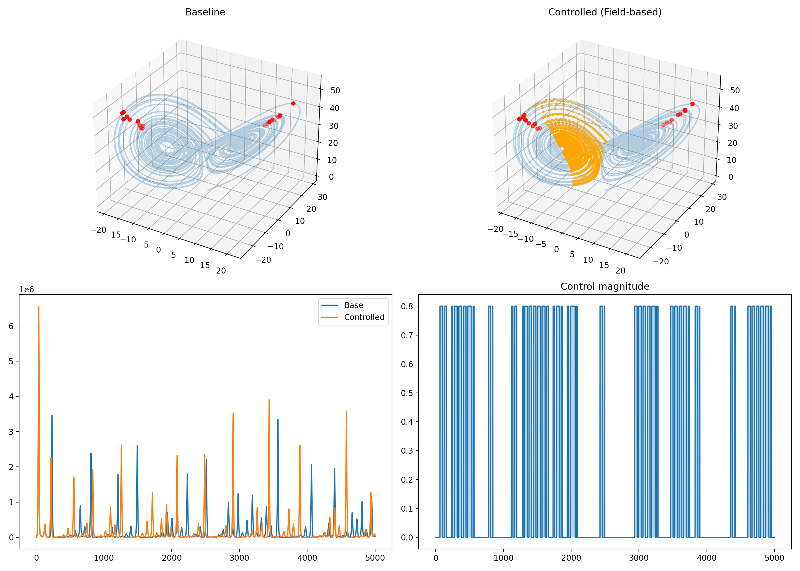

# NEXAH — Discovery Core Visual Gallery

This gallery documents the evolution of the Discovery Core.

---

## 🔹 V4 — Raw Risk

High noise, no structure.

---

## 🔹 V5 — Event Extraction

Events become visible.

---

## 🔹 V6 — Transitions

Directional switching appears.

---

## 🔹 V7 — Linear Manifold

Central axis detected.

---

## 🔹 V8 — Structured Manifold

Funnel / trumpet geometry emerges.

---

## 🔹 V9 — Prediction

Transitions become predictable.

---

## 🔹 V10 — Control

System reacts to control input.

---

## 🔹 V11 — Field-Based Control

Structured transition geometry.

---

# 🧠 Visual Insight

Across versions:

- Noise → Events → Structure → Geometry → Control

---

# 🔥 Key Observation

Transitions are not random.

They form:

- channels  
- clusters  
- directional flows  

---

# 🧭 Interpretation

The Lorenz system behaves like:

> a structured transition field, not pure chaos
