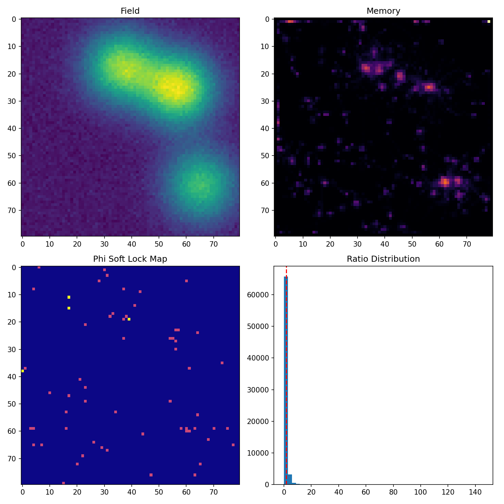
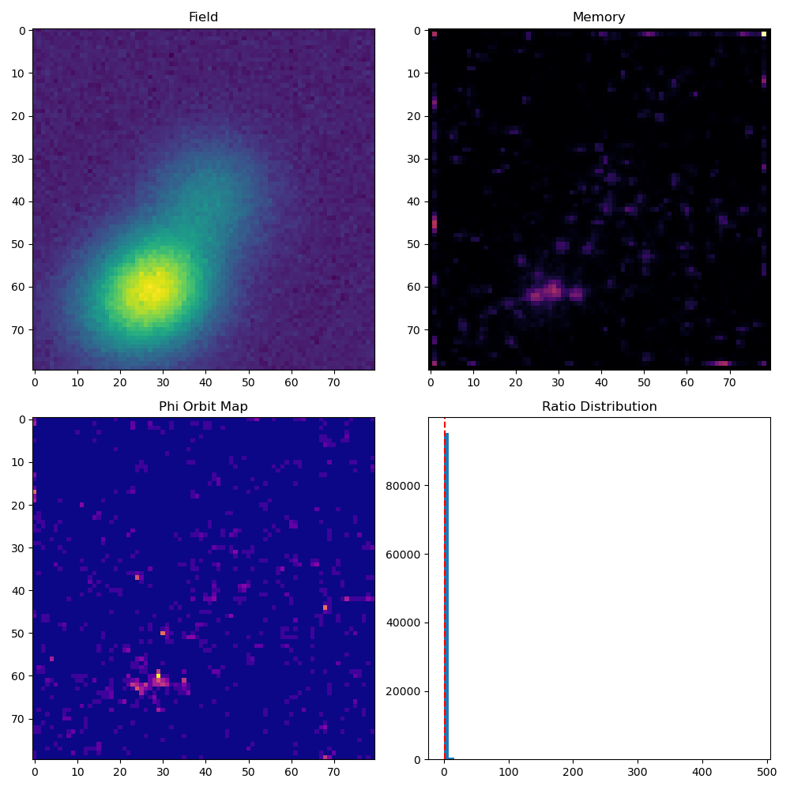
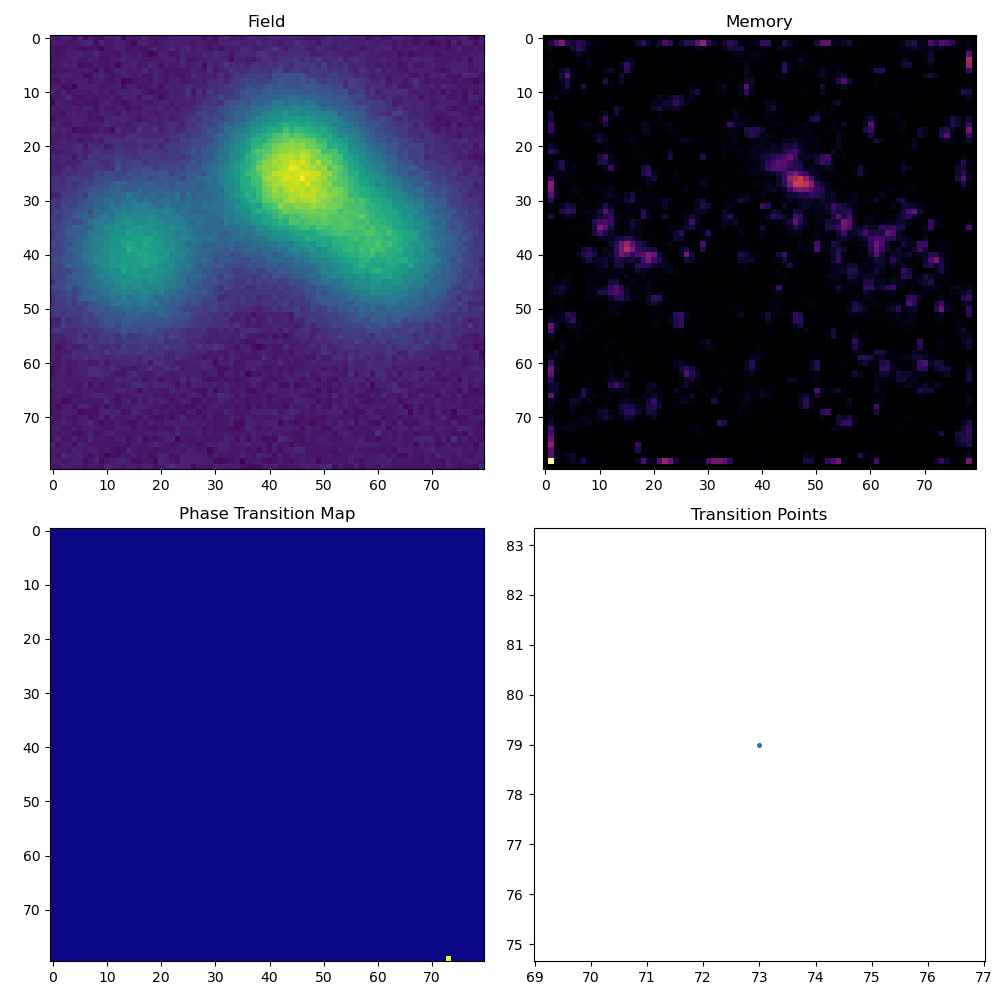

# NEXAH Dynamics Engine — Visual Gallery

Auto-generated from simulation outputs.

---

# LEVEL 20 — Phase Synchronization

*(no run found)*

---

# LEVEL 21 — Controlled Desync

*(no run found)*

---

# LEVEL 22 — Crown / Shell

*(no run found)*

---

# LEVEL 23 — Orbit Stabilization

*(no run found)*

---

# LEVEL 24 — Multi-Shell Resonance

*(no run found)*

---

# LEVEL 25 — Shell Coupling

*(no run found)*

---

# LEVEL 26 — Geometry Collapse

*(no run found)*

---

# LEVEL 27 — Autonomous Field

*(no run found)*

---

# LEVEL 35 — Resonance Alignment

*(no run found)*

• local alignment structures • directional coherence

---

# LEVEL 36 — Resonance Dynamics

*(no run found)*

• temporal resonance patterns • oscillatory motion

---

# LEVEL 37 — Phi Attractor Mapping

*(no run found)*

• phi attractor regions • clustered resonance zones

---

# LEVEL 38 — Phi Basin Locking

*(no run found)*

• hard basin locking • strong stability regions

---

# LEVEL 38.5 — Phi Soft Lock

• soft locking • sparse stable regions

---

# LEVEL 39 — Phi Orbit Spiral Lock

• orbit + spiral structures • dynamic locking

---

# LEVEL 40 — Phase Transition Detection

• rare transition points • regime switching events

---
