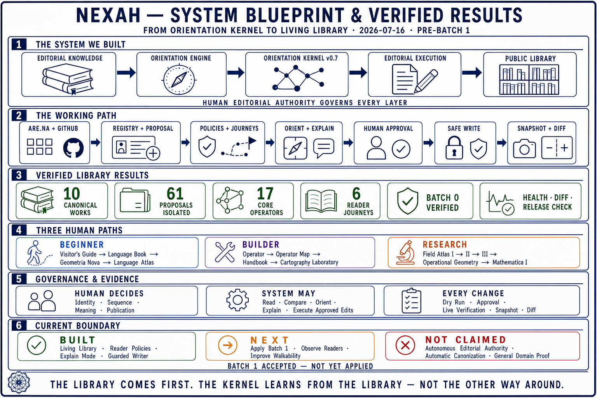

# NEXAH Editorial Operating System

**Infrastructure for explainable knowledge orientation.**

Traditional systems organize information. The NEXAH Editorial Operating
System organizes orientation: it connects editorial structure, reader context,
human governance, explainable reasoning, and controlled public execution.

The Editorial Operating System is the reusable architecture. The Orientation
Kernel is its reasoning core. The NEXAH Living Library is its first reference
implementation. Human editorial authority remains the governing layer.

> The system does not replace books, editors, or readers. It helps people find
> meaningful next steps through curated knowledge while preserving provenance,
> responsibility, and the ability to explain why a path was offered.



> **Status of this whiteboard:** editorial track Phase IX, before public Batch
> 1. It summarizes the built path, verified Library results, human governance,
> and the current evidence boundary. Quantities and implementation states shown
> in the image are a dated snapshot, not timeless architectural claims. See
> [System Boundary and Status](SYSTEM_BOUNDARY_AND_STATUS.md) for the maintained
> textual record.

## The system at a glance

```text
Knowledge sources
        ↓
Editorial knowledge
        ↓
Reader context + policies + sequences
        ↓
Orientation Kernel
        ↓
Paths · bridges · next steps · explanations
        ↓
Human approval
        ↓
Controlled execution and verification
```

Five responsibilities remain deliberately distinct:

1. **Editorial Knowledge Engine** — stable identities, curated structure,
   Reader Policies, journeys, sequences, Operators, evidence, and provenance.
2. **Orientation Engine** — interprets a reader question and context to form a
   useful path, bridge, next step, or explanation.
3. **Orientation Kernel** — applies the declared structures and policies. It
   does not create editorial authority.
4. **Editorial Execution Engine** — safely performs only explicitly approved
   public changes through Dry Run, plan approval, guarded apply, live
   verification, snapshots, diff, and release checks.
5. **Human Editorial Authority** — curates, decides, reviews, approves, and
   remains responsible for every canonical or public editorial decision.

## First reference implementation

The NEXAH Living Library is the first complete instance of this architecture.
It connects:

- the public visual Library on Are.na;
- the Canonical Registry and Proposal Overlay in GitHub;
- Reader Policies and editorial sequences;
- the Orientation Kernel;
- health, snapshot, diff, traversability, and release checks;
- the approval-gated Are.na Editorial Writer.

The Library is not merely a dataset for the system. It remains a human-readable
work in its own right. The Kernel learns from curated Library decisions—not the
other way around.

For its implementation and editorial records, see the
[NEXAH Library](../LIBRARY/README.md).

## From knowledge to orientation

The central design question is not only:

> What information matches this query?

It is also:

> Where is this reader now, what meaningful transition is possible, and why is
> this a responsible next step?

This changes the unit of design from an isolated result to a transition:

```text
current state → orientation → bridge → next step → explanation
```

Reader Mode can remain simple and direct. Explain Mode makes the editorial
reasoning, evidence, and provenance inspectable when requested.

## Governance before automation

The Operating System is human-governed by design:

- Canonical, Proposal, and inferred knowledge remain visibly distinct.
- Stable identity is allocated only through explicit editorial review.
- Reader Policies and sequences are curated rather than silently inferred.
- The Are.na source connector remains read-only.
- The separate Writer can execute only accepted actions and an approved plan.
- Every public mutation is verified and followed by a new source snapshot,
  Editorial Diff, health checks, and a release check.
- Recommendations and public edits remain explainable and auditable.

The execution path is therefore:

```text
Editorial Plan
      ↓
Dry Run
      ↓
Human Approval
      ↓
Guarded Apply
      ↓
Live Verification
      ↓
Snapshot · Diff · Health · Release Check
```

## Visual index

The nine visuals serve different purposes. They should not be interpreted as
nine independent specifications.

| Visual | Role | Status |
|---|---|---|
| [System Blueprint and Verified Results](visuals/snapshots/2026-07-16_pre_batch_1/system_blueprint_and_verified_results.png) | Compact whiteboard of the built path, evidence, governance, and current boundary | Dated reference snapshot |
| [Editorial Operating System](visuals/snapshots/2026-07-16_pre_batch_1/editorial_operating_system.png) | Complete architecture, implementation boundary, and Phase IX status | Dated reference snapshot |
| [Editorial Knowledge Engine](visuals/architecture/editorial_knowledge_engine.png) | Editorial structure, Reader Policies, journeys, governance, and Library experience | Architecture overview |
| [Editorial Execution Engine](visuals/architecture/editorial_execution_engine.png) | Controlled path from editorial decision to verified public navigation | Architecture overview |
| [Living Library](visuals/architecture/living_library.png) | First reference implementation and its reader questions | Reference implementation |
| [Editorial Orientation Engine](visuals/vision/editorial_orientation_engine.png) | General learning and orientation model across possible domains | Vision; not a complete implementation claim |
| [The Moment of Orientation](visuals/vision/moment_of_orientation.png) | Human experience from confusion to a meaningful next step | Conceptual vision |
| [Living Concept Graph](visuals/vision/living_concept_graph.png) | Proposed layer for navigating definitions, occurrences, relations, evolution, and open questions across Works | Vision; X0 review only, not implemented |
| [Library Kernel Innovation Path](visuals/history/library_kernel_innovation_path.png) | The conceptual transition from books to a Living Library operating system | Historical development snapshot |

The Phase X [Living Concepts review](living_concepts/README.md) investigates
whether recurring NEXAH ideas warrant a provenance-bound Concept layer. It does
not allocate Concept identities or implement the graph shown in the vision.

## Potential application patterns

The architecture may later support domain-specific adapters for encyclopedic
knowledge, museums, education, research, enterprise knowledge, or personal
learning. These are application patterns, not current implementation claims.

An application becomes real only when it has an explicit adapter, a defined
dataset or knowledge source, a working demonstration, and evidence appropriate
to its domain.

## Repository relationship

```text
NEXAH
├── EDITORIAL_OPERATING_SYSTEM/  reusable editorial-orientation architecture
├── nexah/                       Orientation Kernel and implementation
├── LIBRARY/                     first reference implementation
├── APPLICATIONS/                implemented domain applications and adapters
├── ARCHITECTURE/                technical specifications and system state
└── RESEARCH/                    research record and evidence
```

The Operating System does not supersede these layers. It explains how editorial
knowledge, orientation, governance, and controlled execution can coordinate
across them.

## Current boundary

The current repository demonstrates a governed Living Library, reader-oriented
navigation, an Orientation Kernel, and a guarded editorial execution path.

It does not currently claim autonomous path optimization, individual learner
profiles, automatic editorial authority, or completed Wikipedia, museum,
education, enterprise, research, or personal-AI integrations.

For the precise maintained boundary, read
[System Boundary and Status](SYSTEM_BOUNDARY_AND_STATUS.md).

---

**The right knowledge, in the right order, for the right person, with an
explainable reason.**
