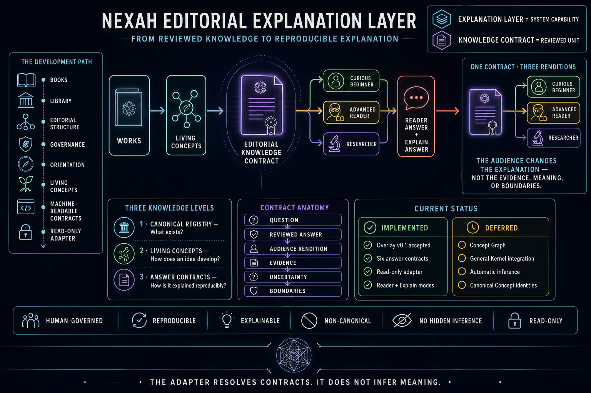
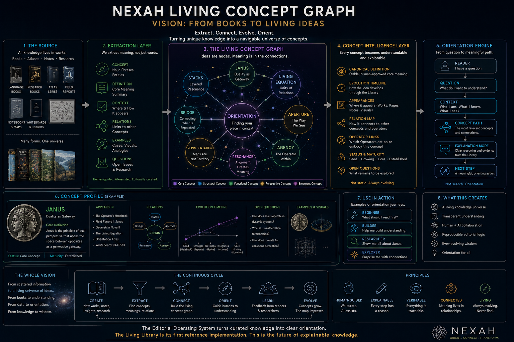

# NEXAH Living Concepts

**Status:** Phase X2 · Overlay v0.1 editorial baseline accepted
**Authority:** non-canonical proposal artifacts  
**Production Concept Graph:** not implemented
**General Kernel integration:** deferred

The NEXAH Living Library organizes Works. Living Concepts investigates the
intellectual layer that develops through Works, Research, Validation, and
historical experiments.

The current [Editorial Explanation Layer plateau](../EDITORIAL_EXPLANATION_LAYER_STATUS.md)
documents how the accepted Overlay and read-only Adapter turn six reviewed
Concept answers into reproducible Reader/Explain contracts.



> **CURRENT X2 ARCHITECTURE.** Contract resolution is implemented. The three
> audience renditions shown in the visual are a proposed next test, not a
> current Adapter capability.

> The system may identify that a term exists. It may not decide what that term
> means.



> **VISION · ILLUSTRATIVE MODEL · NOT YET IMPLEMENTED.** Labels, definitions,
> appearances, maturity states, and relations in this image are examples. They
> are not canonical Concept records or verified scientific claims.

## Why this layer exists

Works are authored documentary objects. Concepts are ideas whose meaning may
develop across many documentary sources. Operators are controlled active
principles used to interpret, transform, organize, or navigate relations.

```text
Work or Research source
        ↓ documents
Concept Occurrence
        ↓ provides provenance for
Concept candidate
        ↓ may reference
Controlled Operator
        ↓ may later support
Concept Profile · Concept Path · Explain Mode
```

A Work does not own a Concept. A verified occurrence proves that a source
contains an assertion; it does not prove that the assertion is scientifically
observed or validated.

## Pass X0 boundary

X0 creates a census and evidence review. It does not:

- allocate `NX-C-...` identities;
- change the Canonical Registry or its 17 Operator records;
- change Library Architecture v1.0;
- modify Reader Policies, Editorial Sequences, Kernel behavior, or the Writer;
- write to Are.na;
- merge aliases automatically;
- turn recurrence, frequency, or inference into canonical meaning;
- reactivate autonomous theory-discovery or universal-law claims.

All candidates use local proposal keys such as `concept:janus`. These keys are
review handles only and have no permanent identity authority.

## Evidence separation

X0 records three different questions:

1. **Discovery provenance** — where was the term found?
2. **Definition provenance** — where is its particular meaning explained?
3. **Claim support** — what evidence supports the substantive assertion?

Occurrence verification (`verified`, `partially_verified`, `unverified`) is
kept separate from assertion origin and claim support. This preserves the
repository's stricter observed-evidence and Outcome Firewall semantics.

## Review artifacts

| Artifact | Purpose |
|---|---|
| [Concept Census](review/CONCEPT_CENSUS.md) · [YAML](review/concept_census.yaml) | Candidate inventory and exclusions |
| [Alias Review](review/CONCEPT_ALIAS_REVIEW.md) · [YAML](review/concept_alias_review.yaml) | Proposed alias groups and merge warnings |
| [Occurrence Sample](review/CONCEPT_OCCURRENCE_SAMPLE.md) · [YAML](review/concept_occurrence_sample.yaml) | Five cases and 15 verified occurrences |
| [Discovery Engine Lineage](review/DISCOVERY_ENGINE_LINEAGE_REVIEW.md) | Historical observations, hypotheses, and corrected overclaims |
| [Concept Model Proposal](review/CONCEPT_MODEL_PROPOSAL.md) | Non-canonical model findings for later review |
| [Phase X0 Summary](review/PHASE_X0_SUMMARY.md) | Inventory, risks, five X1 recommendations, and readiness decision |
| [Cross-Repository Provenance Review](review/cross_repository/CROSS_REPOSITORY_PROVENANCE_REVIEW.md) · [YAML](review/cross_repository/cross_repository_occurrences.yaml) | Pinned historical evidence from NEXAH-CODEX and Scarabaeus v1.0 |
| [Concept Lineage Deltas](review/cross_repository/CONCEPT_LINEAGE_DELTAS.md) | Effects of historical evidence on the five X1 dossiers |
| [X1 Dossier Template](dossiers/DOSSIER_TEMPLATE.md) | Shared human-review boundary for the five reference dossiers |
| [JANUS Concept Dossier](dossiers/JANUS_DOSSIER.md) · [YAML](dossiers/janus.yaml) | First X1 reference dossier; human review required |
| [JANUS Visual Evidence Review](dossiers/visual_evidence/JANUS_VISUAL_EVIDENCE_REVIEW.md) · [YAML](dossiers/visual_evidence/janus_visual_occurrences.yaml) | Bounded review of book pages, atlas posters, IEEE artifacts, and the Penta/Hexagonal human lead |
| [Transition Geometry Family Review](review/transition_geometry/TRANSITION_GEOMETRY_FAMILY_REVIEW.md) · [YAML](review/transition_geometry/transition_geometry_family_review.yaml) | Family review across GEOMETRIA NOVA, Operator Works, Cartography Laboratory, Operational Geometry, Whiteboards, Research, and Architecture |
| [Transition Geometry Concept-Family Test](review/transition_geometry/TRANSITION_GEOMETRY_CONCEPT_FAMILY_TEST.md) · [YAML](review/transition_geometry/transition_geometry_concept_family_test.yaml) | Six Reader/Explain questions testing definitions, curated Concept Paths, provenance, and uncertainty without graph implementation |
| [Minimal Concept Overlay v0.1](overlay/README.md) · [YAML](overlay/concept_overlay_v0_1.yaml) · [Evaluation](review/transition_geometry/CONCEPT_OVERLAY_V0_1_EVALUATION.md) | Seven-handle, review-only machine-readable pilot reproducing the six Concept-family answers without Kernel integration |
| [Read-only Concept Answer Adapter v0.1](review/transition_geometry/CONCEPT_OVERLAY_ADAPTER_V0_1_EVALUATION.md) · [YAML](review/transition_geometry/concept_overlay_adapter_v0_1_evaluation.yaml) · [Expected Answers](overlay/concept_overlay_v0_1_expected_answers.yaml) | Explicit six-question Reader/Explain contract resolver; separate from the Kernel and incapable of inference or writes |
| [Geometry of Balance Evidence Review](review/geometry_of_balance/GEOMETRY_OF_BALANCE_EVIDENCE_REVIEW.md) · [YAML](review/geometry_of_balance/geometry_of_balance_evidence_review.yaml) | Bounded decision between one Concept, multiple Balance models, and visual motif; includes frozen historical lineage |

## Relationship to the Editorial Operating System

Living Concepts is a proposed knowledge layer within the
[Editorial Operating System](../README.md). The Living Library is a major
source, but not the owner of the Concept layer: Research, Validation,
historical experiments, and future Applications may also provide occurrences
and evidence.

No artifact in this directory overrides the Registry, a Work, a scientific
validation record, or a human editorial decision.

## Current implementation boundary

```text
Overlay v0.1                 Editorial baseline accepted
Read-only Answer Adapter     Pilot implemented for six accepted questions
Production Concept Graph     Not implemented
General Kernel integration   Deferred
```

Concept Overlay is not a Concept Graph. An accepted editorial baseline is not
canonical knowledge. Any future Answer Adapter remains distinct from a general
reasoning engine.

The Adapter is invoked explicitly with `python -m nexah.living_concepts`; it is
not part of the default Library Reader CLI or Kernel initialization.
