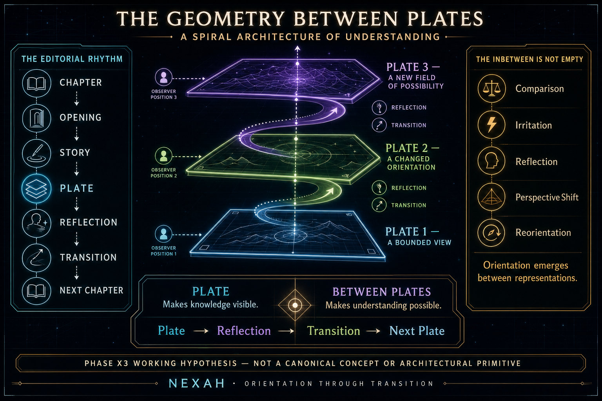

# Plate — Foundational Review

**Phase:** X3 · foundational concept review  
**Status:** completed for human review · non-canonical  
**Review date:** 2026-07-16  
**Result:** implicit editorial-representational pattern



> **X3 WORKING HYPOTHESIS · NON-CANONICAL.** The visual tests a possible
> spiral rhythm of understanding: a Plate temporarily stabilizes a bounded
> view, while reflection and transition reorient the reader toward the next
> Plate. It creates no Concept, Operator, graph relation, or architectural
> primitive.

## Research question

Does `Plate` emerge naturally from the existing NEXAH body of work, or is it
merely a new metaphor?

## Finding

**Plate emerges naturally, but more narrowly than the opening hypothesis.**

The term is already present in the frozen Library Architecture as a
documentary unit and recurs across public Works as a visual form that can:

- represent one layer in a transformation;
- compress a chapter into a navigable image;
- offer an alternative projection of a shared landscape;
- present a different perspective on a shared question;
- participate in an interconnected Atlas sequence.

The wider repository independently contains the same underlying constraints:
views are situated, projections are selective, representations are local,
scales and reference frames matter, and maps are not the territory. This makes
Plate more than a freshly imported literary metaphor.

However, the evidence does **not** establish Plate as:

- the form of every representation;
- the smallest stable unit of orientation;
- a canonical Concept;
- an Operator;
- a software or Kernel primitive;
- a universal ontology of pages, maps, views, and cross-sections.

The strongest current classification is **editorial pattern plus visual
grammar**, supported by an explanatory metaphor.

## Review-only formulation

For the purpose of this review—not as a canonical definition—the evidence can
be summarized as follows:

> A Plate is a bounded human-facing representation of a larger field,
> produced through a declared or implied selection, perspective, projection,
> and scale, and arranged to support comparison, reflection, explanation, or
> transition.

This sentence is an editorial synthesis. It allocates no identity and must not
be used as a Registry or Overlay definition.

## Why the hypothesis is supported

### 1. The word predates this review

Library Architecture v1.0 already places `Plate` alongside Part, Chapter, and
Page beneath a Work Edition. The Library README also anticipates that Concepts
may cite selected pages or plates. Plate therefore has an established place in
the Library's documentary language.

### 2. Several Works define a shared function

The clearest direct evidence is not the sheer number of uses but their
specificity:

- **THE OPERATOR MAP** describes Plates as compressed, navigable chapter
  representations and as alternative projections of one landscape;
- **The Architecture of Becoming** makes each Plate a layer in a
  transformation and explicitly preserves the map/territory distinction;
- **NEXAH LANDSCAPES** makes each Plate a different perspective on one
  orienting question;
- **Relational Cartography of Human Reality** organizes fifteen interconnected
  Plates rather than fifteen isolated images.

Together these sources support boundedness, projection, perspective,
sequence, and navigation.

### 3. The technical Architecture supplies compatible boundaries

The Orientation Layer does not assume a single global state space. It uses
declared representations, observers, reference frames, context, maps,
uncertainty, and provenance. The IEEE Geometry Testkit states that a
cross-section is a declared view or projection whose variables, units, scope,
normalization, and information loss must be explicit.

These structures are not Plates. They demonstrate that the underlying
principle—orientation through bounded and accountable views—is already part of
NEXAH's technical discipline.

### 4. Geometry and explanation meet without collapsing

Transition Geometry asks which relations, boundaries, apertures, paths, and
constraints become visible in a declared representation. Living Concepts asks
how an idea appears and evolves across Works. Answer Contracts govern how a
question receives a reviewed answer with evidence and limits.

Plate can describe the human-facing presentation at their intersection:

```text
declared representation
        +
reviewed editorial meaning
        +
bounded reader-facing presentation
```

That bridge is useful precisely because it does not replace Geometry,
Concepts, or Answer Contracts.

## Required questions

### Does the repository describe Plate-like structures without naming them?

**Yes.** Declared views, projections, slices, cross-sections, maps, layers,
observer-dependent representations, and bounded explanations recur across
Architecture, Research, Books, and Living Concepts. They should be treated as
functional analogues, not synonyms.

### Are different visual systems using the same underlying idea?

**Partly.** Atlases, Operator Maps, Landscapes, Whiteboards, scientific visual
manifests, and explanatory diagrams repeatedly isolate one view inside a
larger sequence. The common idea is strongest where a source explicitly names
perspective, projection, layer, compression, relation, or navigation. Visual
layout alone is insufficient.

### Does Plate connect Geometry, Living Concepts, and Editorial Explanation?

**Potentially, as an editorial bridge.** Geometry provides the declared view;
Living Concepts provides reviewed meaning and occurrences; an Answer Contract
provides governance; a Plate could provide one bounded human-facing rendition.
No architectural or executable connection currently exists or is needed.

### What kind of thing is Plate?

| Option | Decision |
|---|---|
| Concept | possible future research subject; not established |
| explanatory metaphor | supported |
| visual grammar | strongly supported |
| editorial pattern | strongest current reading |
| orientation primitive | not supported; existing primitives are sufficient |
| several of these | yes, but only metaphor + grammar + pattern at present |

### Does Plate clarify or rename?

It clarifies when it names a bounded, situated, human-facing unit that makes a
larger field inspectable without pretending to exhaust it. It merely renames
existing ideas when used as a substitute for page, image, map, projection,
cross-section, representation, or Answer Contract.

### Where does Plate conflict with the Operator vocabulary?

Its proposed mechanism overlaps directly with **Aperture**, **Observer**,
**Boundary**, **Projection**, and **Scale**. Those Operators already distinguish
selection, situated observation, delimitation, transformation between frames,
and representational level. Plate should therefore be understood, if retained,
as a possible editorial result of their combined effects—not a new Operator.

## Claims not supported

The review does not verify that:

- every NEXAH book follows `Wonder → Story → Plate → Reflection → Transition →
  Next Plate`;
- every visual panel is a Plate;
- every representation can be reduced to Plate;
- Plate is ontologically prior to Field, Map, Page, or Concept;
- Plate has one stable formal or computational definition;
- similar layouts prove one shared concept;
- the concept exists independently of editorial practice.

## Recommendation

Recommend a **bounded Phase X3 research proposal**, not Concept acceptance.

The proposal should test only three questions:

1. Can editors consistently distinguish a Plate from a page, image, map, and
   panel across a small reviewed sample?
2. Can one Plate record its larger field, viewpoint, boundary, projection or
   selection, scale, purpose, and next relation without duplicating existing
   metadata?
3. Does the distinction improve a reader's understanding of why a view is
   partial and where to go next?

If these tests fail, Plate should remain a literary and visual term. If they
succeed, a later review may consider a non-canonical editorial grammar before
any Concept discussion.

## Governance record

This review creates only research artifacts. It makes no changes to:

- Architecture v1.0;
- Canonical Registry;
- Proposal Overlay;
- Living Concepts accepted overlay;
- Operator vocabulary;
- Orientation Kernel;
- Are.na;
- Entity or Concept identities.

The phrase `Plate` remains non-canonical.
