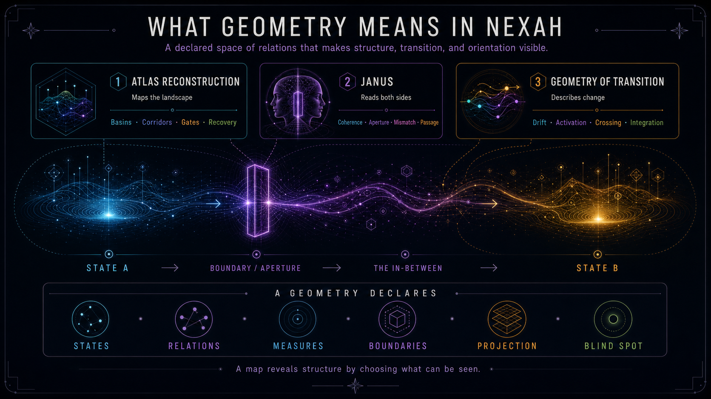

# Transition Geometry — Family Review

**Phase:** X1 · family review  
**Status:** human review required · non-canonical  
**Primary proposal:** `concept:transition-geometry`  
**Are.na observation:** public read-only review · 2026-07-16



> **EDITORIAL SYNTHESIS · NOT A SCIENTIFIC MODEL.** The visual summarizes the
> working distinction developed in this review. It creates no Concept identity,
> graph relation, or validated geometric formalism.

## Editorial finding

Transition Geometry is not merely one phrase among many geometric titles. It
is a strong NEXAH Concept-family candidate that describes how a declared
representation makes states, boundaries, possible passages, and the
in-between inspectable.

The reviewed Works repeatedly support one central distinction:

> **Geometry declares the relational space in which a transition can be seen,
> compared, and discussed. It is a map of a situation—not the situation
> itself.**

Within that family, three roles should remain distinct:

1. **Transition Geometry** describes the structured in-between;
2. **Atlas Reconstruction** assembles a layered map of basins, corridors,
   gates, bottlenecks, recovery regions, and anchors;
3. **JANUS** examines a boundary or passage from complementary sides without
   collapsing them into one view.

This triad is the clearest result of the review. It connects the books,
Whiteboards, Architecture, and Research without claiming a single universal
mathematical space.

## Proposed reader definition

> **Transition Geometry is NEXAH's way of describing the structured
> in-between: the relations, boundaries, apertures, paths, and constraints
> through which one state may become another.**

This is a proposal definition for human review. It is intentionally broader
than a particular graph, field, state space, or numerical method and narrower
than the Work-level claim that all change follows one universal geometry.

## Why this is a family

The sources do not present one geometry. They present a related set of lenses
that answer different questions about the same transition:

| Family role | Question | Typical forms | Current assessment |
|---|---|---|---|
| State geometry | What states or regimes are represented? | basins, attractors, frames, regions | coherent family member |
| Relation geometry | What is connected to what? | edges, tubes, bridges, networks, couplings | coherent family member |
| Flow geometry | How does movement develop? | fields, gradients, drift, corridors, vortices | coherent in scoped representations |
| Boundary geometry | What distinguishes or limits a region? | membranes, cuts, horizons, constraints | coherent; boundary types must remain distinct |
| Aperture geometry | Where can passage occur? | gates, openings, thresholds, bottlenecks | strong Research and Work evidence |
| Observer geometry | What becomes visible from a declared view? | projection, slice, scale, reference, blind spot | coherent conceptual family member |
| Recovery geometry | How can a system return or restabilize? | anchors, return paths, resilient regions | authored Atlas layer; scientific support varies |
| Resonance geometry | How do oscillations or relations align? | waves, phase, loops, coherence | strong Work vocabulary; broad physical claims unverified |
| Balance geometry | How are complementary directions held in relation? | figure-eight, counterflow, hinge, dynamic balance | recurring motif and research lead; not yet a stable Concept |

These are not automatically separate Concepts, Operators, or graph nodes.
They are a provisional editorial classification of recurring geometric
questions.

## Source review

### GEOMETRIA NOVA

Are.na channel `5442781` supplies the broad language of the family.

- The Index moves from **Language** through **Dynamic Geometry** and
  **Architecture** to **Ecosystem** and **The Journey**.
- Dynamic Geometry frames geometry as movement: force, wave, layer, observer,
  transition, and cycle.
- Resonance Geometry adds phase, alignment, loop, memory, and coherence.
- Orientation relates position, context, purpose, reference, alignment,
  intention, and path.
- The construction sequence treats measurement as projection and the observer
  as part of the represented system.

The Work therefore provides the **grammar** of Transition Geometry. Its
scientific-looking equations, cross-scale analogies, prime structures, and
universal formulations remain authored conceptual synthesis unless separately
supported by Research or Validation.

### THE OPERATOR

Are.na channel `5442721` supplies the **perspective and transformation layer**.

- Five views—metric, angular, growth, orientation, and dual orientation—show
  that a situation can have multiple declared geometries.
- The Field Architecture Stack moves from field and sampling through grids,
  orientation, fold, membrane, torus, package, and observer.
- “From Aperture to Orientation” shows the opening, thread, passage, and
  emergence of orientation.
- The Work repeatedly places meaning in relations, projections, cuts, holes,
  and the spaces between represented elements.

This is strong conceptual evidence for **geometry as a declared lens**. It is
not evidence that all illustrated forms are mathematical invariants or that
the symbolic equations are validated laws.

### THE OPERATOR LIBRARY

Are.na channel `5442697` supplies the **operator-form taxonomy**.

- “The Geometry of Transition” calls operators a geometry of becoming.
- “The Geometry Operator Library” presents point, axis, edge, plane,
  aperture, connector, cylinder, capsule, sphere, pyramid, cube, torus, stack,
  and spiral.
- “The Geometry of Operators” presents bridge, fold, spiral, loop, threshold,
  lens, anchor, mirror, portal, observer, drift, and return as recurring forms.
- “The Evolution of an Operator” gives a staged path from difference and
  boundary through opening, threshold, transition, path, bridge, network, and
  field.

This Work should be read as a **library of geometric forms and process
archetypes**. It must not replace or silently expand the existing Registry of
17 controlled Operators.

### THE CARTOGRAPHY LABORATORY

Are.na channel `5386766` provides the clearest three-part synthesis:

| Laboratory | Role in the family | Main elements |
|---|---|---|
| The Janus Operator | evaluates a passage from both sides | directional coherence, aperture, mismatch, viability |
| Atlas Reconstruction | maps the landscape of possibility | basins, corridors, gates, bottlenecks, recovery, anchors |
| Geometry of Transition | describes the dynamics of change | drift, phase, mismatch, activation, navigation |

The architecture is editorially powerful. The numerical formulas, metrics,
claims of cross-domain validation, and statements such as “transitions are not
random” require independent provenance before scientific reuse.

### OPERATIONAL GEOMETRY OF TRANSITION

Are.na channel `5217666` develops the family as a visual Atlas:

- a navigation core of structure, flow, alignment, observation, and
  experience;
- an Aperture Series and transition mechanics;
- field topologies and navigation systems;
- a strong “map is not the territory” statement.

It is a major conceptual source, but it also contains cosmological,
numerological, and ontological formulations. Those remain Work-level vision,
not validation evidence.

### Whiteboard sequence

The Whiteboards make the internal logic unusually legible:

```text
THE INBETWEEN
    ↓ makes the relational space visible
THE THRESHOLD
    ↓ distinguishes selection and passage
THE JANUS GATE
    ↓ preserves both sides during transformation
NEW CONFIGURATION
```

Additional Whiteboards contribute:

- **The Space Between** and **Orientation Emerges Between Levels** —
  orientation is placed in movement and relation between declared levels;
- **Relations of A & B** — structure, relation, and dynamics are separated as
  interacting roles;
- **Aperture = Transformationsraum** — aperture is treated as a space of
  filtering, compression, path formation, and stabilization;
- **The Relation Tube** — structure, energy, and relation are combined into a
  navigable present;
- **Why Does the Same Core Geometry Reappear Across All Systems?** — proposes
  `Region → Boundary → Transition → Closure` as a recurring architecture.

The last item is especially important because the Whiteboard itself labels it
as a **hypothesis** and names a next experiment. The review preserves that
status. Recurrence across domains has not been established as an invariant.

## Geometry of Balance

No exact public Are.na block titled “Geometry of Balance” was found in the
reviewed public channel inventory. The idea nevertheless recurs in several
forms:

- GEOMETRIA NOVA calls the figure-eight a “balance of opposites”;
- THE OPERATOR uses complementary directions and dynamic counter-directions;
- THE OPERATOR LIBRARY assigns balance/regulation to the Olgo triad;
- The Relation Tube describes stability through dynamic balance and drift;
- LIBRARYBOOK states “one geometry · many equations · one balance.”

This makes **Balance Geometry** a valuable human lead, but not yet a stable
Concept candidate. Before promotion it needs a direct definition that answers:

1. Is balance equilibrium, compensation, counterflow, coherence, or adaptive
   regulation?
2. Is it a property of a state, a relation, a path, or an observer's frame?
3. What distinguishes dynamic balance from closure, stability, and resonance?

## Research and Architecture cross-check

The repository provides a stricter evidential boundary than several Works.

### Supported within scoped representations

- Aperture Geometry distinguishes **where transitions can occur** from JANUS
  questions about directional organization and transition activation.
- Transition Geometry and Basin Graph methods work with basins, transition
  probabilities, gates, and graph structure in declared experimental models.
- The Orientation Layer supports representation-specific states, transition
  relations, ordered paths, trajectory families, explicit boundaries, and
  evidence-bound reports.
- Graphs, continuation sequences, sampled campaigns, and episodes can each
  encode transition structure without being the same mathematical object.

### Not established

- one representation-independent `TransitionSpace`;
- one common topology for solver, sampling, structural, evidential, and
  domain-of-validity boundaries;
- a universal geometry shared by every physical, biological, cognitive,
  social, mathematical, and navigational system;
- equivalence between symbolic Work equations and implemented algorithms;
- cross-domain causal control, calibrated prediction, or operational validity;
- scientific validity from recurrence of similar visual forms alone.

The governing Architecture statement remains:

> Current evidence does not support a universal transition geometry. It
> supports a family of declared representations with explicit boundaries.

## Provisional family model

```text
Declared situation
        ↓ represented as
STATE / REGION
        ↓ distinguished by
BOUNDARY
        ↓ may contain
APERTURE / THRESHOLD
        ↓ opens into
THE IN-BETWEEN
        ↓ structured by
RELATIONS · CONSTRAINTS · FLOW · CORRIDORS
        ↓ interpreted through
OBSERVER / PROJECTION / SCALE
        ↓ evaluated or navigated by
OPERATORS
        ↓ may yield
TRANSITION · BLOCK · RETURN · NEW STATE
```

This is a documentary synthesis, not an implemented ontology or algorithm.

## Proposed relations

These are review proposals, not graph edges.

| Subject | Relation proposal | Object | Qualification |
|---|---|---|---|
| Transition Geometry | broader family for | Aperture Geometry | access geometry is one scoped member |
| Transition Geometry | interpreted by | JANUS principle | JANUS preserves complementary views at an interface |
| Transition Geometry | mapped through | Atlas Reconstruction | layered cartographic method, not identity |
| Transition Geometry | related Operator | Transition `NX-OP-0005` | Concept family is broader than the controlled operation |
| Transition Geometry | related Operator | Boundary `NX-OP-0006` | boundary types remain heterogeneous |
| Transition Geometry | related Operator | Observer `NX-OP-0003` | every map declares a view and blind spot |
| Transition Geometry | related Operator | Relation `NX-OP-0011` | relations form the representational structure |
| Transition Geometry | related Operator | Projection `NX-OP-0012` | representation may preserve and lose information |
| Transition Geometry | related Operator | Scale `NX-OP-0017` | available structure changes with declared scale |
| Transition Geometry | possible family member | Balance Geometry | human lead only; definition absent |
| Transition Geometry | possible hypothesis | Region–Boundary–Transition–Closure | explicit Whiteboard hypothesis; not invariant |

## Risks

1. **Geometry inflation** — every evocative visual pattern becomes a named
   geometry.
2. **Category collapse** — Concept, Operator, method, representation, motif,
   and Work title are treated as interchangeable.
3. **Universalization** — recurrence across illustrations becomes a law across
   domains.
4. **Equation laundering** — equations printed in Works are mistaken for
   implemented or validated methods.
5. **Registry collision** — THE OPERATOR LIBRARY taxonomy silently expands the
   controlled Operator Registry.
6. **Observer erasure** — a map is presented without its selection,
   projection, scale, or blind spot.
7. **Boundary conflation** — solver failure, sampling limit, structural cut,
   passage threshold, and validity limit are treated as one thing.

## Human decisions required

| Decision | Recommendation | Effect |
|---|---|---|
| X1-TG-01 · Family candidate | accept Transition Geometry as a proposal family | permits dossier work; creates no identity |
| X1-TG-02 · Reader definition | accept with review | establishes the working human explanation |
| X1-TG-03 · Triad | accept Transition Geometry / Atlas Reconstruction / JANUS as distinct roles | prevents role collapse |
| X1-TG-04 · Universal space | reject for current architecture | preserves representation-specific evidence |
| X1-TG-05 · Geometry members | retain as provisional editorial families | prevents premature Concept proliferation |
| X1-TG-06 · Balance Geometry | retain as human lead | requests a definition before promotion |
| X1-TG-07 · Core recurrence | retain as explicit research hypothesis | no invariant or graph fact |
| X1-TG-08 · Operator taxonomy | keep separate from controlled Registry | no new Operators or IDs |
| X1-TG-09 · Public Work claims | preserve as authored Work statements with provenance | avoids treating visual assertions as validation |
| X1-TG-10 · Kernel overlay | defer | no Concept Graph behavior before model approval |

## Recommendation

**Proceed with Transition Geometry as a non-canonical X1 Concept family.** Use
the proposed reader definition and the three-role distinction as the working
model. Do not allocate an ID, add graph edges, change Operators, or infer a
universal space.

The next bounded research task should be a **Geometry of Balance evidence
review**, not its promotion: locate its direct definitions, distinguish it from
stability and resonance, and test whether it is one coherent idea or several
visual metaphors sharing a name.

## Reviewed public visual occurrences

| Work / channel | Are.na evidence | Review role |
|---|---|---|
| GEOMETRIA NOVA | channel `5442781`; blocks `47930751`, `47930879`, `47930789`, `47931465`, `47931491`, `47931526`, `47931330` | language, dynamic geometry, resonance, orientation, observer |
| THE OPERATOR | channel `5442721`; blocks `47930464`, `47930459`, `47930455`, `47930453`, `47930445` | views, stack, aperture, projection, relation |
| THE OPERATOR LIBRARY | channel `5442697`; blocks `47930298`, `47930297`, `47930294`, `47930293`, `47930279` | operator geometry and process taxonomy |
| THE CARTOGRAPHY LABORATORY | channel `5386766`; blocks `47505996`, `47505991`, `47505990` | JANUS / Atlas Reconstruction / Geometry of Transition triad |
| OPERATIONAL GEOMETRY OF TRANSITION | channel `5217666`; blocks `46462002`, `46461990`, `46462139`, `46461976` | visual Atlas and aperture family |
| NEXAH WHITEBOARD SERIES | channel `5345285`; blocks `47227437`, `47227435`, `47227434` | Inbetween / Threshold / Janus Gate sequence |
| DESIGNING ORIENTATION | channel `5345336`; blocks `47227648`, `47227661` | transitions between declared levels |
| THE DUAL SPINE | channel `5345385`; blocks `47227898`, `47227912`, `47227916` | relation tube, A/B relations, aperture space |
| THE LANDINGS | channel `5345838`; block `47230035` | core-geometry hypothesis |
| THE CATHEDRAL OF RESONANCE | channel `5345856`; block `47230248` | earlier core-geometry hypothesis version |
| LIBRARYBOOK | channel `5413103`; block `47683506` | dynamic-engine balance lead |

Occurrence proves that an authored page exists. It does not by itself verify
the page's substantive scientific claim.
