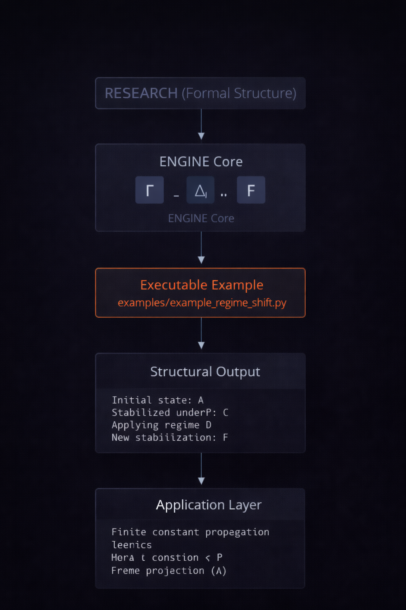

# NEXAH Engine

**Version 1.1 --- Structural Stability & Abstract Interpretation
Engine**

The **NEXAH Engine** is the executable structural analysis layer of the
NEXAH framework.

It combines:

• finite abstract interpretation\
• order-theoretic computation\
• stability landscape analysis\
• dynamical systems exploration\
• structural policy navigation

The engine provides a **structurally verified computational framework**
for modeling stability landscapes, fixpoint structures, and regime
transitions in finite systems.

Full architectural documentation:

`ENGINE_REPORT_v1.md`

------------------------------------------------------------------------

# 1. Architectural Position

The NEXAH architecture consists of three conceptual layers:

RESEARCH (formal structure) ↓ ENGINE (structural execution) ↓ STRUCTURAL
OUTPUT / ANALYSIS

The Engine translates formal structural theory into executable algebraic
models, stability landscapes, and finite abstract interpretation
systems.

------------------------------------------------------------------------

# 2. Core Algebraic Kernel

The conceptual operator stack implemented by the engine:

FinitePoset ↓ LatticeOps ↓ Closure Operator Γ ↓ Interior Operator Ι ↓
Monotone Operators ↓ Regime Operator Δ ↓ Frame Projection F ↓ Fixpoint
Structures ↓ Worklist Fixpoint Solver

### Implementation Status

✔ FinitePoset\
✔ LatticeOps (join/meet, distributivity, top/bottom)\
✔ Closure Operator (Γ)\
✔ Interior Operator (Ι)\
✔ Monotone Operators\
✔ Fixpoint-induced structures\
✔ Rank / height analysis\
✔ Hasse cover extraction\
✔ Regime Operator (Δ)\
✔ Frame Projection (F)\
✔ IN/OUT Worklist Fixpoint Solver\
✔ Application Layer (Mini IR + constant propagation)

The finite algebra core acts as a **verified abstract interpretation
kernel**.

------------------------------------------------------------------------

# 3. Stability Landscape Engine

Beyond the algebraic kernel, the engine includes a full **stability
landscape analysis framework**.

This subsystem models systems as **energy or stability landscapes** and
extracts their dynamical structure.

Implemented components include:

### Landscape Construction

• Stability landscape generator\
• Gradient field computation\
• Hessian field analysis\
• Critical point detection

### Basin Structure

• Basin segmentation\
• Basin transition graph\
• Metastability mapping

### Dynamical Systems Analysis

• Phase portraits\
• Lyapunov spectrum estimation\
• Koopman operator approximation\
• Diffusion maps

### Topological Structure

• Morse complex construction\
• Persistent homology (TDA)\
• Topological skeleton extraction

### Spectral Analysis

• Eigenmode decomposition\
• Diffusion geometry\
• Wasserstein landscape geometry

The result is a **complete structural analysis pipeline for dynamical
stability systems**.

------------------------------------------------------------------------

# 4. Simulation Layer

The engine also supports explicit **landscape dynamics simulations**.

Modules include:

• Gradient flow dynamics\
• Attractor network extraction\
• Landscape evolution models

These modules allow exploration of:

• trajectory convergence\
• attractor basins\
• transition paths\
• metastable regimes

------------------------------------------------------------------------

# 5. Policy and Control Layer

The framework contains experimental modules for **decision and policy
analysis on stability landscapes**.

Implemented systems include:

• policy evaluation surfaces\
• risk-aware navigation\
• stability-maximizing policies\
• reinforcement learning environments

This layer enables **structural decision-making on dynamic landscapes**.

------------------------------------------------------------------------

# 6. Repository Structure

ENGINE │ ├ core \# algebraic kernel (posets, lattices, fixpoints) ├
analysis \# stability and topology analysis ├ simulation \# dynamic
system simulation ├ visualization \# rendering and visual analysis ├ rl
\# reinforcement learning agents ├ navigation \# stability navigation
strategies ├ applications \# example engines and policy models ├
examples \# demonstration scripts ├ visuals \# generated analysis
outputs │ ├ run_stability_engine.py └ ENGINE_REPORT_v1.md

------------------------------------------------------------------------

# 7. Running the Stability Engine

From the repository root:

python ENGINE/run_stability_engine.py

The engine will generate a complete stability analysis pipeline,
producing visual outputs in:

ENGINE/visuals/

Example outputs include:

• stability landscapes\
• basin segmentation maps\
• metastability diagrams\
• persistence diagrams\
• eigenmode decompositions\
• Koopman spectra\
• Lyapunov spectra\
• diffusion embeddings

------------------------------------------------------------------------

# 8. Example Abstract Interpretation Programs

### Linear Mini IR

python -m ENGINE.applications.mini_ir_demo

### Branching Mini IR

python -m ENGINE.applications.mini_ir_branch_demo

### Stabilization Example

python -m ENGINE.examples.example_stabilization

------------------------------------------------------------------------

# 9. Quality Status

• 205 files\
• modular architecture\
• deterministic computation\
• strict algebraic operators\
• type-safe operator definitions

The system is designed for **research-grade structural analysis**.

------------------------------------------------------------------------

# 10. Design Philosophy

The NEXAH Engine is designed to be:

• finite and structurally validated\
• algebraically explicit\
• deterministic in computation\
• modular and extensible\
• mathematically interpretable

The framework bridges:

order theory\
abstract interpretation\
dynamical systems\
topology\
control theory

------------------------------------------------------------------------

# 11. Development Roadmap

### Phase A --- Algebraic Core ✔

Finite abstract interpretation kernel.

### Phase B --- Stability Engine ✔

Landscape analysis and dynamical systems.

### Phase C --- Structural Control

Planned additions:

• bifurcation analysis\
• stochastic dynamics\
• rare-event transition sampling\
• hierarchical landscape analysis

------------------------------------------------------------------------

# NEXAH Engine

**Structural computation for stability, dynamics, and abstract
systems.**
