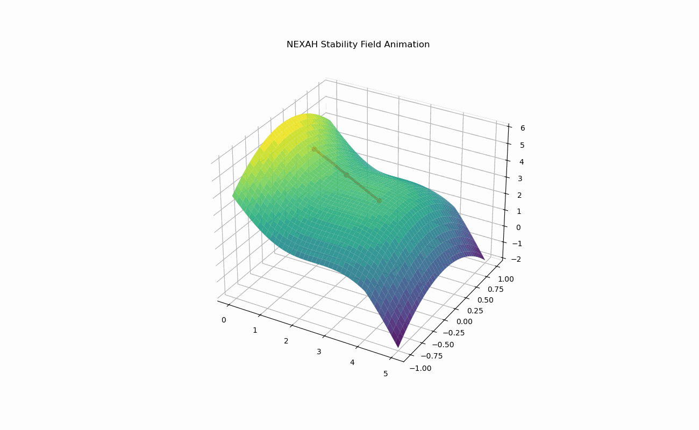
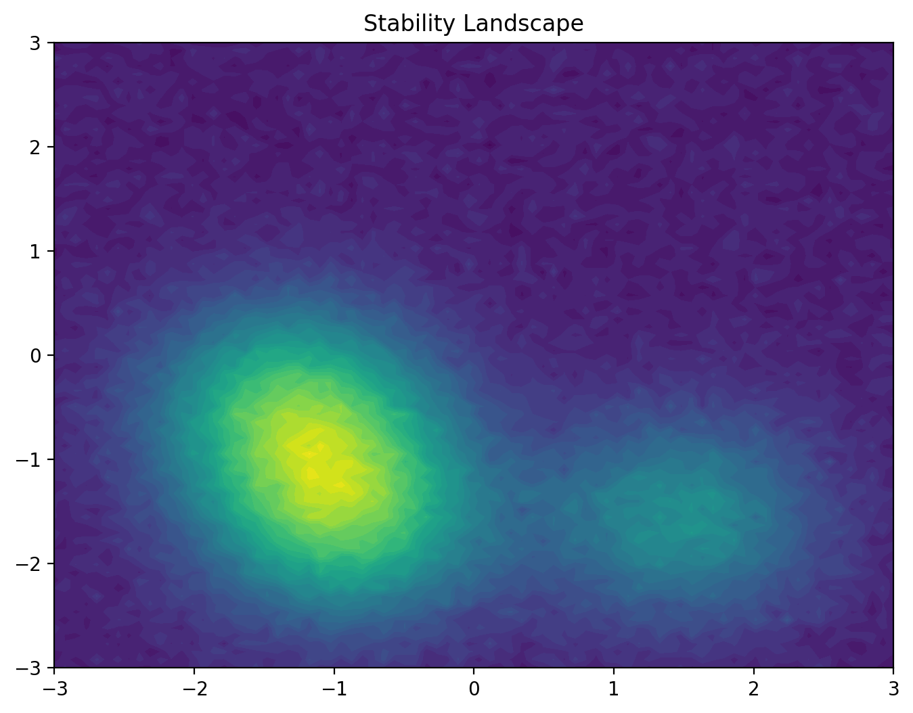

# NEXAH Engine

**Computational framework for stability landscapes, regime analysis, and
resilient architectures.**

------------------------------------------------------------------------

## Navigation

  ----------------------------------------------------------------------------------------------------
  Section                             Link
  ----------------------------------- ----------------------------------------------------------------
  NEXAH Kernel                        [ENGINE/nexah_kernel](ENGINE/nexah_kernel)

  Kernel Documentation                [ENGINE/nexah_kernel/README.md](ENGINE/nexah_kernel/README.md)

  Algebraic Core                      [ENGINE/core](ENGINE/core)

  Stability Analysis                  [ENGINE/analysis](ENGINE/analysis)

  Simulation                          [ENGINE/simulation](ENGINE/simulation)

  Visualization                       [ENGINE/visualization](ENGINE/visualization)

  Reinforcement Learning              [ENGINE/rl](ENGINE/rl)

  Applications                        [ENGINE/applications](ENGINE/applications)

  Documentation                       [ENGINE/docs](ENGINE/docs)

  Generated Visuals                   [ENGINE/visuals](ENGINE/visuals)
  ----------------------------------------------------------------------------------------------------

------------------------------------------------------------------------

# Core Architecture

The NEXAH framework is organized into three conceptual layers.

RESEARCH LAYER\
(formal theory & structural models)

↓

ENGINE\
(computational execution of structural models)

↓

STRUCTURAL OUTPUT\
(stability landscapes, regime maps, architecture discovery)

The **Engine** translates formal structural theory into executable
models, allowing exploration of stability regimes and architecture
spaces.

------------------------------------------------------------------------

# NEXAH Kernel

At the core of the engine lies a minimal **system navigation kernel**.

Location:\
[ENGINE/nexah_kernel](ENGINE/nexah_kernel)

The kernel provides the **core navigation logic for analyzing regime
landscapes in complex systems**.

It implements:

• regime landscape construction\
• navigation trajectory analysis\
• structural intervention simulation

The kernel is intentionally compact, consisting of only a few hundred
lines of code.

Additional functionality in the Engine builds **around this kernel**
rather than expanding it.

Kernel documentation:\
[ENGINE/nexah_kernel/README.md](ENGINE/nexah_kernel/README.md)

------------------------------------------------------------------------

# Example Engine Output

Example animation generated by the stability landscape engine:

Example landscape visualization:

These visualizations illustrate how the engine extracts:

• stability basins\
• regime transitions\
• attractor structures\
• metastable regions

from structural system representations.

------------------------------------------------------------------------

# Key Discovery

Recent experiments with the architecture exploration modules revealed a
recurring structural attractor in architecture space.

Typical stable architecture:

nodes ≈ 5\
edges ≈ 19\
degree ≈ 3.7 -- 4.0\
clustering ≈ 1\
resilience ≈ 0.85 -- 0.91

These structures form a **stability attractor** in the explored network
architecture space.

The discovery suggests that **dense balanced connectivity structures
maximize resilience**.

------------------------------------------------------------------------

# Spectral Stability Law

Experiments with the spectral analysis modules indicate a strong
relationship between resilience and spectral connectivity.

Resilience ≈ a + b · (λ₂ / λmax)

Where

λ₂ = algebraic connectivity\
λmax = largest Laplacian eigenvalue

Empirical result:

Resilience ≈ 0.355 + 0.401 · (λ₂ / λmax)

This suggests that **stable architectures maximize spectral
connectivity**.

------------------------------------------------------------------------

# Documentation

Detailed documentation for the engine architecture and research context:

• [docs/ARCHITECTURE.md](docs/ARCHITECTURE.md)\
• [docs/ENGINE_MAP.md](docs/ENGINE_MAP.md)\
• [docs/STABILITY_ENGINE.md](docs/STABILITY_ENGINE.md)\
• [docs/VISUALS_INDEX.md](docs/VISUALS_INDEX.md)\
• [docs/RESEARCH_CONTEXT.md](docs/RESEARCH_CONTEXT.md)

------------------------------------------------------------------------

# Core Algebraic Kernel

The conceptual operator stack implemented by the engine:

FinitePoset\
↓\
LatticeOps\
↓\
Closure Operator Γ\
↓\
Interior Operator Ι\
↓\
Monotone Operators\
↓\
Regime Operator Δ\
↓\
Frame Projection F\
↓\
Fixpoint Structures\
↓\
Worklist Fixpoint Solver

Location:\
[ENGINE/core](ENGINE/core)

The finite algebra core acts as a **verified abstract interpretation
kernel**.

------------------------------------------------------------------------

# Stability Landscape Engine

Beyond the algebraic kernel, the engine includes a full **stability
landscape analysis framework**.

Location:\
[ENGINE/analysis](ENGINE/analysis)

Capabilities include:

• landscape generation\
• gradient and Hessian analysis\
• basin segmentation\
• metastability mapping\
• Lyapunov spectrum estimation\
• Koopman operator approximation\
• diffusion maps\
• Morse complex construction\
• persistent homology\
• eigenmode decomposition

------------------------------------------------------------------------

# Simulation Layer

The engine supports explicit **landscape dynamics simulations**.

Location:\
[ENGINE/simulation](ENGINE/simulation)

Modules include:

• gradient flow dynamics\
• attractor network extraction\
• landscape evolution models

------------------------------------------------------------------------

# Policy and Control Layer

Experimental modules for **decision and policy analysis on stability
landscapes**.

Location:\
[ENGINE/rl](ENGINE/rl)

Includes:

• policy evaluation surfaces\
• risk‑aware navigation\
• stability‑maximizing policies\
• reinforcement learning environments

------------------------------------------------------------------------

# Repository Structure

ENGINE\
│\
├ nexah_kernel -- minimal navigation kernel\
├ core -- algebraic kernel\
├ analysis -- stability & topology analysis\
├ simulation -- dynamical system simulation\
├ visualization -- visual rendering\
├ rl -- reinforcement learning agents\
├ navigation -- navigation strategies\
├ applications -- example models\
├ examples -- demonstration scripts\
├ runtime -- simulation execution layer\
├ docs -- architecture documentation\
├ visuals -- generated outputs

------------------------------------------------------------------------

# Running the Stability Engine

From the repository root:

python ENGINE/run_stability_engine.py

Outputs will be generated in:

ENGINE/visuals/

------------------------------------------------------------------------

# Design Philosophy

The NEXAH Engine is designed to be:

• finite and structurally validated\
• algebraically explicit\
• deterministic in computation\
• modular and extensible\
• mathematically interpretable

------------------------------------------------------------------------

# NEXAH Engine

**Structural computation for stability, dynamics, and abstract
systems.**
