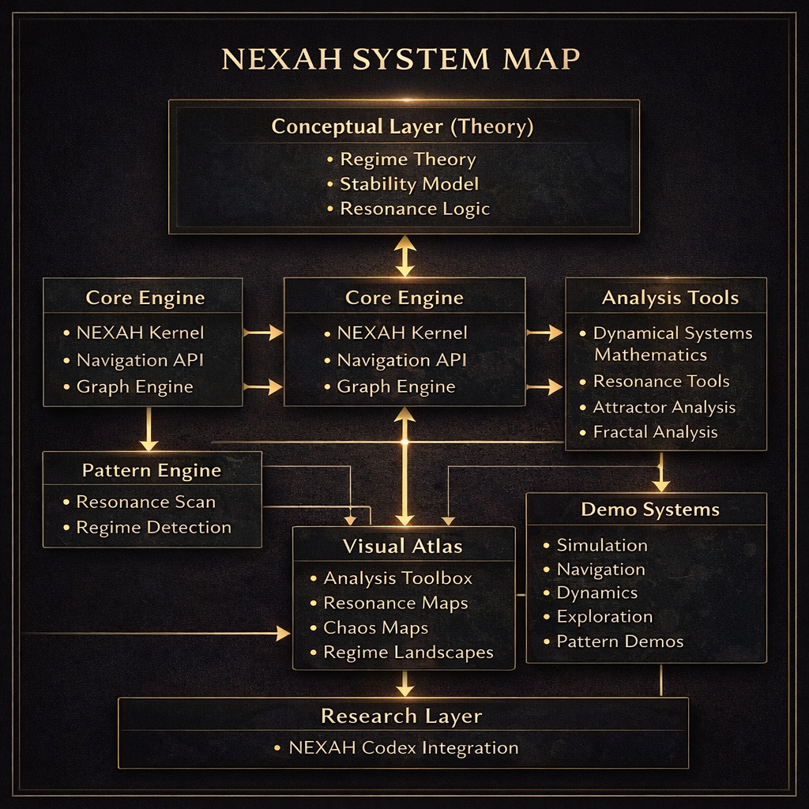

# NEXAH Engine

**Computational framework for stability landscapes, regime analysis, and resilient architectures.**

The **NEXAH Engine** is the executable computational layer of the NEXAH framework.

It provides algorithms for exploring **stability landscapes, structural regimes, and resilient architectures in complex systems**.

The engine combines methods from

• order theory  
• abstract interpretation  
• dynamical systems  
• topology  
• spectral graph theory  
• stability landscape analysis  

to produce **structurally interpretable models of complex systems**.

---



The engine connects formal structural theory with executable system analysis.

At its core, NEXAH reconstructs **stability landscapes and regime structures**
from structural models of complex systems.

---

# Core Architecture

The NEXAH framework is organized into three conceptual layers.

```
RESEARCH LAYER
(formal theory & structural models)

        ↓

ENGINE
(computational execution of structural models)

        ↓

STRUCTURAL OUTPUT
(stability landscapes, regime maps, architecture discovery)
```

The **Engine** translates formal structural theory into executable models,
allowing exploration of stability regimes and architecture spaces.

---

# Engine Components

The NEXAH Engine is composed of several modular subsystems which together
form a computational environment for structural system analysis.

---

## NEXAH Kernel

The core navigation logic of the framework is implemented in the **NEXAH Kernel**.

Location:

[ENGINE/nexah_kernel](ENGINE/nexah_kernel)

The kernel provides the fundamental navigation mechanisms for regime landscapes.

It implements:

• regime landscape construction  
• navigation trajectory analysis  
• structural intervention simulation  

The kernel is intentionally compact, consisting of only a few hundred lines of code.

Additional functionality in the engine builds **around this kernel**
rather than expanding it.

Detailed kernel documentation:

[ENGINE/nexah_kernel/README.md](ENGINE/nexah_kernel/README.md)

---

## Algebraic Core

The algebraic backbone of the system is implemented in

[ENGINE/core](ENGINE/core)

This module provides the **finite algebraic structures** used by the engine,
including posets, lattices, closure operators and fixpoint computations.

The conceptual operator stack implemented by the engine is:

```
FinitePoset
    ↓
LatticeOps
    ↓
Closure Operator Γ
    ↓
Interior Operator Ι
    ↓
Monotone Operators
    ↓
Regime Operator Δ
    ↓
Frame Projection F
    ↓
Fixpoint Structures
    ↓
Worklist Fixpoint Solver
```

The algebraic core acts as a **verified abstract interpretation kernel**
for structural system analysis.

---

## Stability Analysis Layer

Advanced stability analysis modules are located in

[ENGINE/analysis](ENGINE/analysis)

These components reconstruct stability landscapes and structural regime
geometry from system dynamics.

Implemented capabilities include:

• stability landscape generation  
• gradient and Hessian field computation  
• basin segmentation  
• metastability mapping  
• Lyapunov spectrum estimation  
• Koopman operator approximation  
• diffusion maps  
• Morse complex construction  
• persistent homology  
• eigenmode decomposition  

---

## Simulation Layer

Explicit dynamical system simulations are implemented in

[ENGINE/simulation](ENGINE/simulation)

These modules simulate the evolution of stability landscapes and system
trajectories.

Implemented components include:

• gradient flow dynamics  
• attractor network extraction  
• landscape evolution models  

These simulations allow exploration of

• trajectory convergence  
• attractor basins  
• transition paths  
• metastable regimes  

---

## Policy and Control Layer

Experimental modules for decision and policy analysis are implemented in

[ENGINE/rl](ENGINE/rl)

These modules explore how agents can navigate stability landscapes.

Implemented systems include:

• policy evaluation surfaces  
• risk-aware navigation  
• stability-maximizing policies  
• reinforcement learning environments  

---

# Example Engine Output

The engine reconstructs stability landscapes and regime structures from
structural system models.

Example animation generated by the stability landscape engine:


Example landscape visualization:


These visualizations illustrate how the engine extracts

• stability basins  
• regime transitions  
• attractor structures  
• metastable regions  

from structural system representations.

---

# Key Discovery

Recent experiments with the architecture exploration modules revealed a
recurring structural attractor in architecture space.

Typical stable architecture:

```
nodes ≈ 5
edges ≈ 19
degree ≈ 3.7 – 4.0
clustering ≈ 1
resilience ≈ 0.85 – 0.91
```

These structures form a **stability attractor** in the explored network
architecture space.

The discovery suggests that **dense balanced connectivity structures**
maximize resilience.

---

# Spectral Stability Law

Experiments with the spectral analysis modules indicate a strong
relationship between resilience and spectral connectivity.

```
Resilience ≈ a + b · (λ₂ / λmax)
```

Where

```
λ₂     = algebraic connectivity
λmax   = largest Laplacian eigenvalue
```

Empirical result:

```
Resilience ≈ 0.355 + 0.401 · (λ₂ / λmax)
```

This suggests that **stable architectures maximize spectral connectivity**.

---

# Documentation

Additional documentation is available in

[ENGINE/docs](ENGINE/docs)

Key documents include:

• [docs/ARCHITECTURE.md](docs/ARCHITECTURE.md)  
• [docs/ENGINE_MAP.md](docs/ENGINE_MAP.md)  
• [docs/STABILITY_ENGINE.md](docs/STABILITY_ENGINE.md)  
• [docs/VISUALS_INDEX.md](docs/VISUALS_INDEX.md)  
• [docs/RESEARCH_CONTEXT.md](docs/RESEARCH_CONTEXT.md)

---

# Repository Structure

```
ENGINE
│
├ nexah_kernel    minimal navigation kernel
├ core            algebraic kernel
├ analysis        stability & topology analysis
├ simulation      dynamical system simulation
├ visualization   visual rendering
├ rl              reinforcement learning agents
├ navigation      navigation strategies
├ applications    example models
├ examples        demonstration scripts
├ runtime         simulation execution layer
├ docs            architecture documentation
├ visuals         generated outputs
```

---

# Running the Stability Engine

From the repository root:

```
python ENGINE/run_stability_engine.py
```

Outputs will be generated in

```
ENGINE/visuals/
```

Example outputs include

• stability landscapes  
• basin segmentation maps  
• persistence diagrams  
• eigenmode decompositions  
• Koopman spectra  
• Lyapunov spectra  

---

# Design Philosophy

The NEXAH Engine is designed to be

• finite and structurally validated  
• algebraically explicit  
• deterministic in computation  
• modular and extensible  
• mathematically interpretable  

The framework bridges

• order theory  
• abstract interpretation  
• dynamical systems  
• topology  
• control theory  

---

# NEXAH Engine

**Structural computation for stability, dynamics, and abstract systems.**
------------------------------------------------------------------------

## Navigation

  ----------------------------------------------------------------------------------------------------
  Section                             Link
  ----------------------------------- ----------------------------------------------------------------
  NEXAH Kernel                        [ENGINE/nexah_kernel](ENGINE/nexah_kernel)

  Kernel Documentation                [ENGINE/nexah_kernel/README.md](ENGINE/nexah_kernel/README.md)

  Algebraic Core                      [ENGINE/core](ENGINE/core)

  Stability Analysis                  [ENGINE/analysis](ENGINE/analysis)

  Simulation                          [ENGINE/simulation](ENGINE/simulation)

  Visualization                       [ENGINE/visualization](ENGINE/visualization)

  Reinforcement Learning              [ENGINE/rl](ENGINE/rl)

  Applications                        [ENGINE/applications](ENGINE/applications)

  Documentation                       [ENGINE/docs](ENGINE/docs)

  Generated Visuals                   [ENGINE/visuals](ENGINE/visuals)
  ----------------------------------------------------------------------------------------------------

