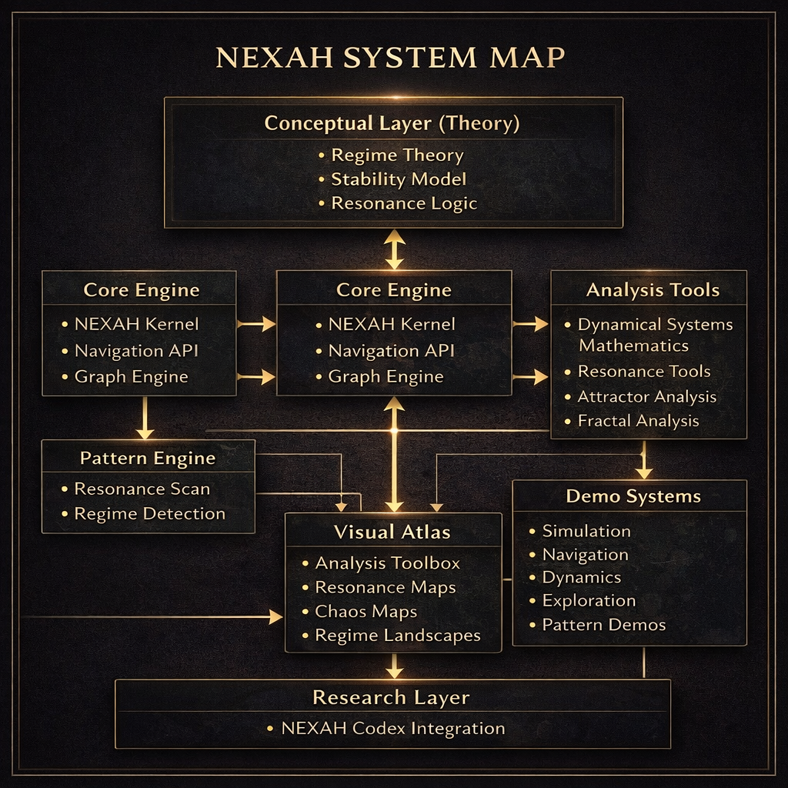
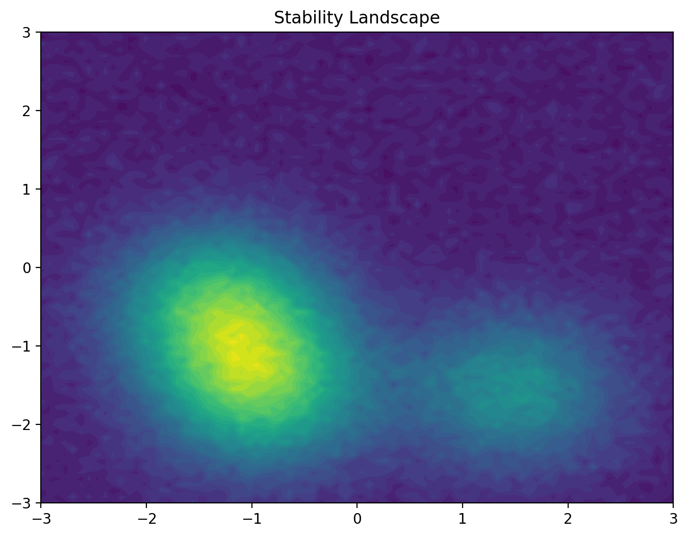

# NEXAH Engine

**Computational framework for stability landscapes, regime analysis, and resilient architectures.**

---

## Overview

The **NEXAH Engine** is the executable layer of the NEXAH framework.

It transforms formal structural models into computational analysis of:

- stability landscapes  
- regime structures  
- resilient architectures  

The engine combines methods from:

- order theory  
- abstract interpretation  
- dynamical systems  
- topology  
- spectral graph theory  

to produce **structurally interpretable models of complex systems**.

---



---

## Architecture

The NEXAH framework is organized into three conceptual layers:

```
RESEARCH
(formal theory & experiments)

        ↓

ENGINE
(computational execution)

        ↓

OUTPUT
(stability landscapes, regime maps, architecture discovery)
```

The **Engine** translates structural theory into executable system models.

---

## Repository Structure

```
ENGINE/

├ agent/           orchestration & control (NEXAH Agent)
├ kernel/          minimal navigation kernel
├ core/            algebraic structures (posets, lattices, operators)
├ analysis/        stability & topology analysis
├ simulation/      dynamical system models
├ visualization/   rendering & plots
├ research/        theory & experiments
├ applications/    example systems
├ services/        internal utilities & discovery modules
├ scripts/         executable pipelines
├ docs/            extended documentation
├ visuals/         generated outputs

├ nexah_engine.py  core engine entry
├ run_agent.py     main execution entry point
```

---

## Core Components

### NEXAH Agent

The **Agent** orchestrates the system:

- executes workflows  
- connects kernel and analysis  
- runs simulations and experiments  
- processes results  

Run:

```
python ENGINE/run_agent.py
```

---

### NEXAH Kernel

The **Kernel** implements the minimal structural navigation logic.

Location:

```
ENGINE/kernel/
```

Capabilities:

- regime landscape construction  
- navigation trajectories  
- structural transitions  

---

### Algebraic Core

Location:

```
ENGINE/core/
```

Implements:

- finite posets  
- lattices  
- closure operators Γ  
- interior operators Ι  
- monotone operators  
- fixpoint computation  

---

### Analysis Layer

Location:

```
ENGINE/analysis/
```

Capabilities:

- stability landscape generation  
- basin detection  
- Lyapunov spectrum  
- diffusion maps  
- Morse complexes  
- persistent homology  

---

### Simulation Layer

Location:

```
ENGINE/simulation/
```

Provides:

- dynamical system simulation  
- attractor detection  
- trajectory evolution  

---

### Research Layer

Location:

```
ENGINE/research/
```

Contains:

- formal theory (finite order systems)  
- experimental modules  
- oscillator networks  
- symmetry graph experiments  

---

### Services Layer

Location:

```
ENGINE/services/
```

Includes:

- discovery engines  
- law detection modules  
- result storage  
- internal computation utilities  

---

### Scripts

Location:

```
ENGINE/scripts/
```

Examples:

```
python ENGINE/scripts/run_stability_engine.py
python ENGINE/scripts/run_massive_architecture_search.py
```

---

## Example Output

The engine reconstructs stability landscapes and regime structures.



Generated outputs include:

- stability basins  
- regime transitions  
- attractor structures  
- metastable regions  

---

## Key Discovery (Example)

Experiments reveal stable architecture patterns:

```
nodes ≈ 5
edges ≈ 19
degree ≈ 3.7 – 4.0
clustering ≈ 1
resilience ≈ 0.85 – 0.91
```

These form **attractors in architecture space**.

---

## Spectral Stability Law

Empirical result:

```
Resilience ≈ 0.355 + 0.401 · (λ₂ / λmax)
```

Where:

- λ₂ = algebraic connectivity  
- λmax = largest Laplacian eigenvalue  

→ Stable systems maximize **spectral connectivity**

---

## Documentation

See:

- `docs/ARCHITECTURE.md`  
- `docs/ENGINE_MAP.md`  
- `docs/ENGINE_REPORT_v1.md`  
- `docs/RESULTS_SUMMARY.md`  

---

## Design Philosophy

The NEXAH Engine is designed to be:

- finite and structurally validated  
- modular and extensible  
- mathematically interpretable  
- deterministic in computation  

---

## Status

The system represents a **modular computational framework for structural system analysis and discovery**.

---

## NEXAH

The engine forms the **computational layer of the NEXAH framework**,  
bridging formal structural theory and executable system modeling.
