# 🖼️ NEXAH — Visual Gallery (Field Decomposition)

This gallery documents the emergence of structure, navigation, and stability
within the NEXAH field system.

It is organized chronologically by discovery phase.

---

# 🔷 V2–V5 — Field Emergence

## Field Separation (V2)

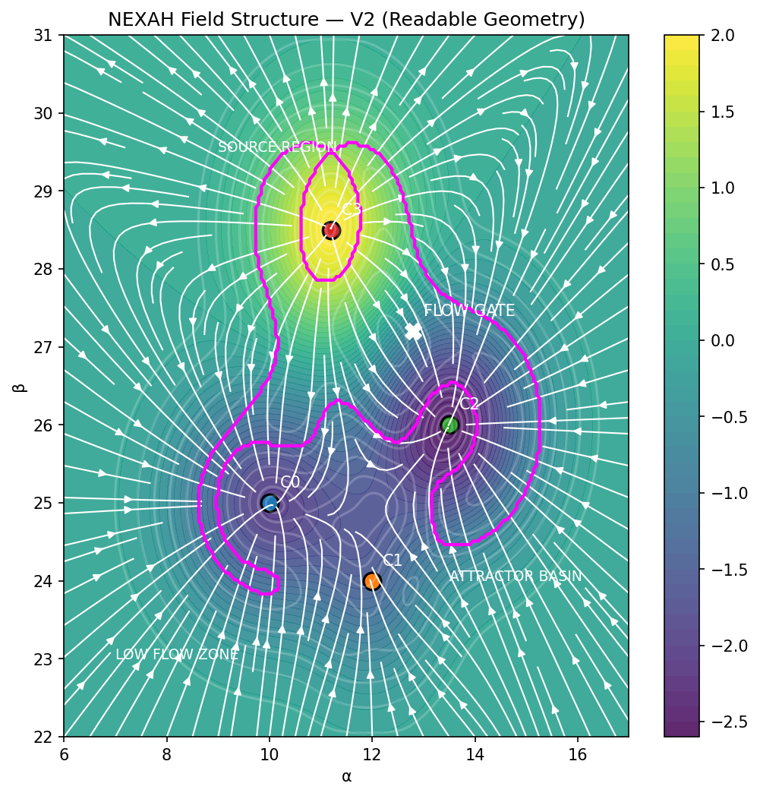

→ First indication of non-uniform field structure

---

## Unified Field View (V4)

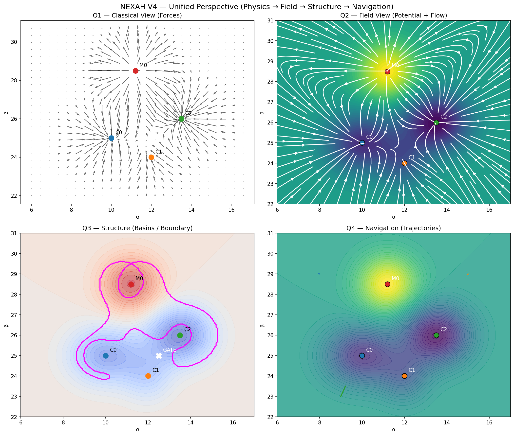

→ Field interpreted as continuous object

---

## Gradient vs Rotation (V5)

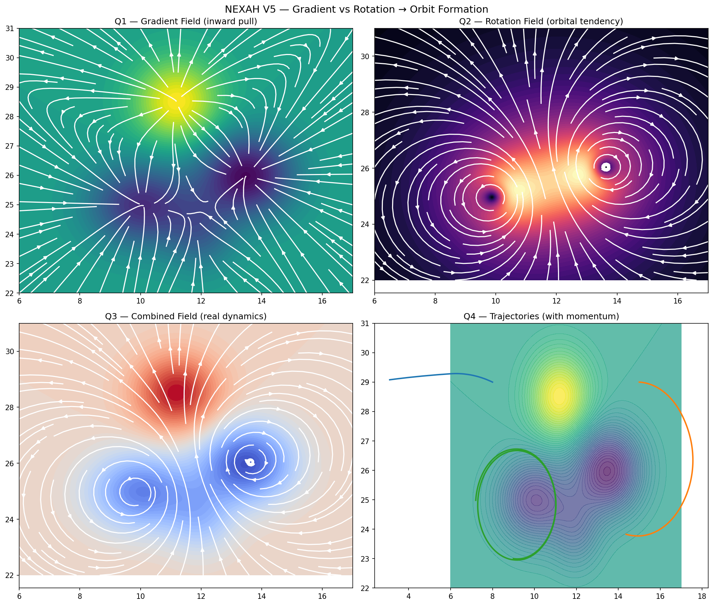

→ Curvature emerges from interaction of components

---

# 🔷 V6 — Structure Extraction

## Multi-View System

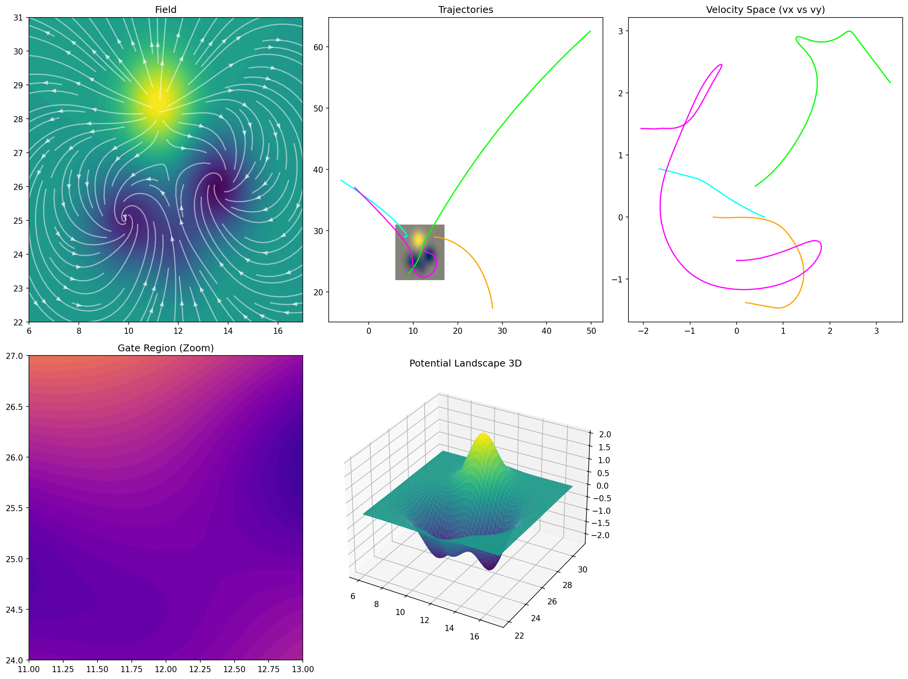

→ Consistency across representations

---

## Orbit Landscape

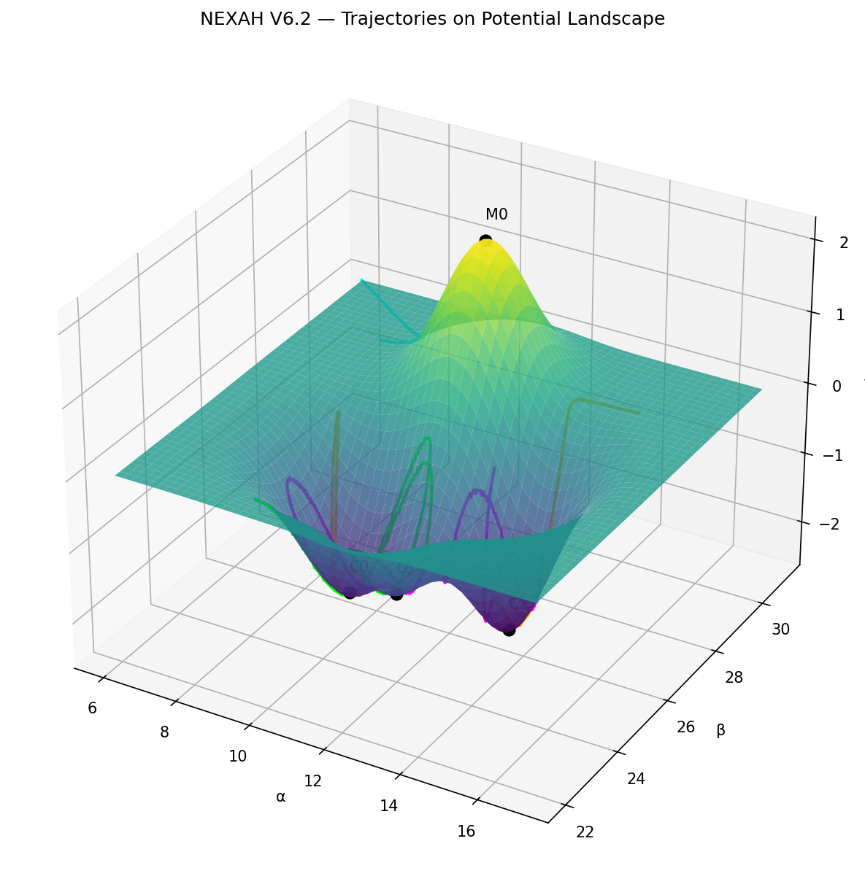

→ Emergence of orbit families

---

## Orbit Class Map

→ Distinct dynamic regimes

---

## Boundary Extraction

→ First appearance of "Riss" structure

---

## Connected Boundaries

→ Transition from noise to geometry

---

## Class Detection Map

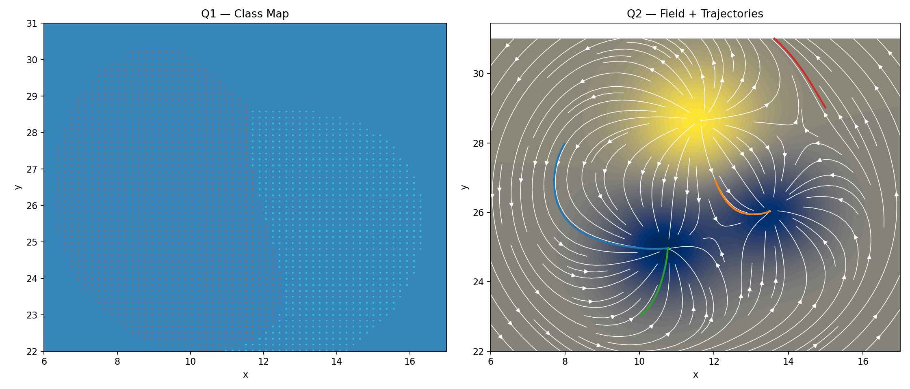

→ Structured interpretation of field regions

---

# 🔷 V7 — Navigation & Control

## Cost Field

→ Transition wedge ("Splinter") emerges

---

## Navigation Field

→ Flow aligns into structured paths

---

## Failure Map

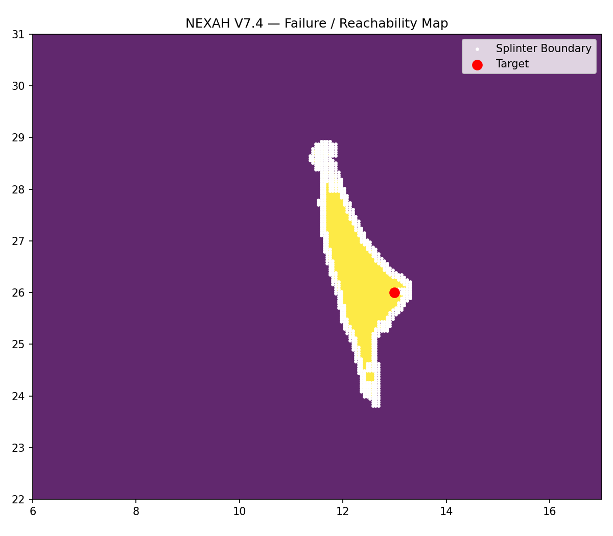

→ Reachability is spatially constrained

---

## Alignment Check

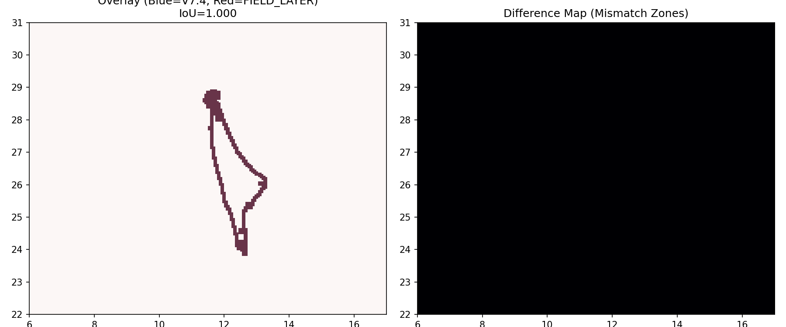

→ Navigation matches field structure

---

## Boundary Crossing

→ Directional gate behavior

---

## Energy Map

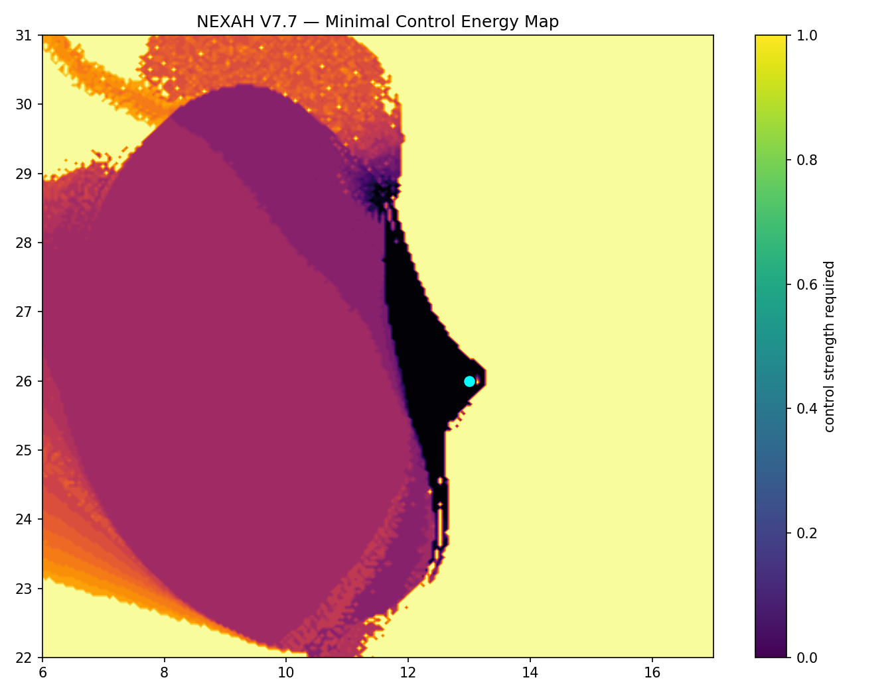

→ Energy landscape interpretation

---

# 🔶 V8 — Stability Geometry

## Lyapunov Map

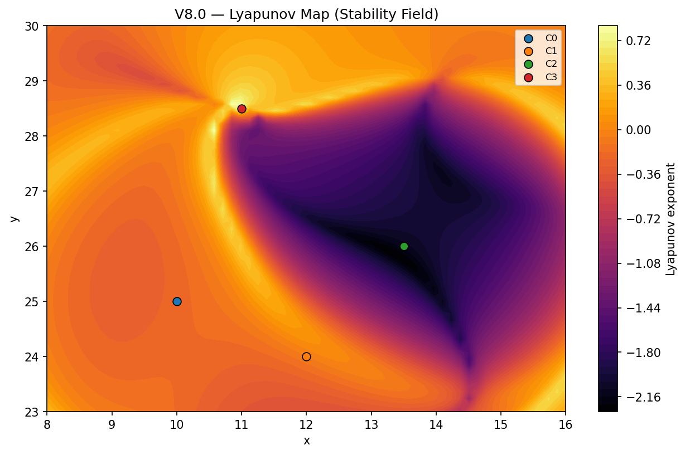

→ Stability forms geometric structures

---

## Boundary vs Stability

→ Boundary ≠ instability

---

## Distance vs Lyapunov

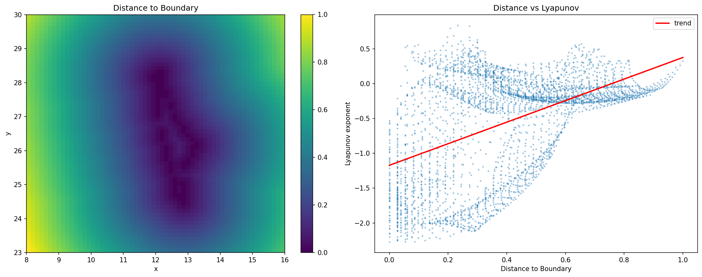

→ Stability gradient around boundary

---

## Lyapunov Along Boundary

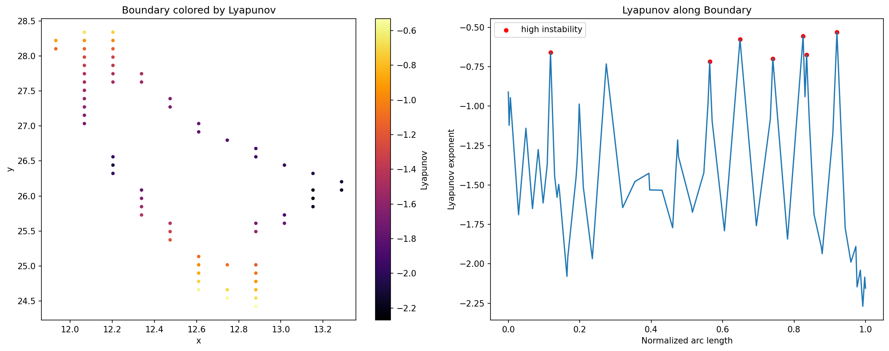

→ Boundary is globally stable, locally weak

---

## Gate Points

→ Identification of weak regions

---

## Injection Tests

→ No branching despite perturbation

---

## Decision Gate Test

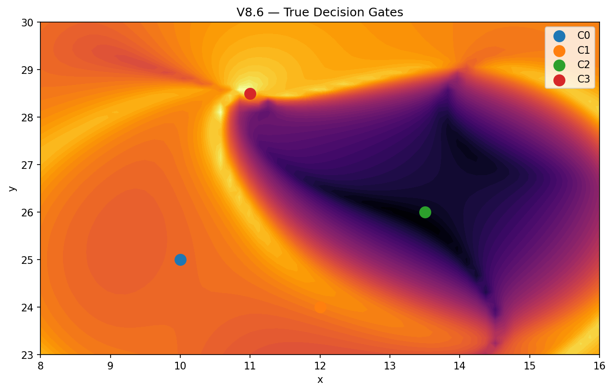

→ No true decision points

---

# 🔥 Final Insight

The system evolves as:

Field → Structure → Navigation → Stability

But:

→ It does not branch.  
→ It constrains.
