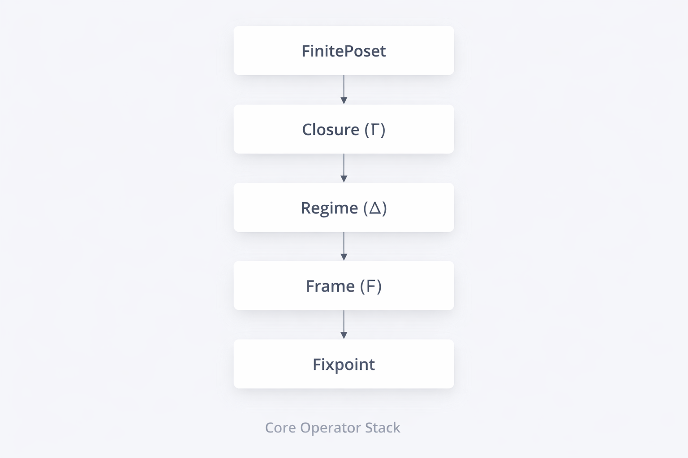

# NEXAH Engine – Core Layer
Version 0.5 – Algebraic Execution Layer

The Core Layer implements the formal algebraic backbone of the NEXAH Engine.

It provides validated finite order structures, closure operators,
and lattice utilities required for structural stabilization analysis.

---

# 1. Scope

The core layer currently implements:

- Finite partially ordered sets
- Closure operators (Γ)
- Lattice construction utilities
- Fixpoint detection

All structures are finite and explicitly validated.

No metric assumptions.  
No topology.  
No continuous dynamics.

The engine operates strictly on discrete order-theoretic foundations.

---

# 2. Implemented Modules

## poset.py

Defines `FinitePoset`.

Features:

- Reflexivity validation
- Antisymmetry validation
- Transitivity validation
- Minimal / maximal element detection
- Generic fixpoint iteration support

---

## closure_operator.py

Defines `ClosureOperator`.

Validates automatically:

- Monotonicity
- Extensivity
- Idempotence

Provides:

- Operator application
- Fixpoint extraction

---

## lattice.py

Defines `LatticeOps`.

Provides:

- Upper bounds
- Lower bounds
- Join (least upper bound)
- Meet (greatest lower bound)
- Lattice detection
- Top / Bottom detection
- Distributivity check

---

# 3. Conceptual Stack

The visual diagram represents the conceptual operator stack:

FinitePoset  
→ Closure (Γ)  
→ Regime (Δ)  
→ Frame (F)  
→ Fixpoint  

Currently implemented layers:

✔ FinitePoset  
✔ Closure  
✔ Fixpoint (via closure)  

Planned layers:

□ Regime operator (Δ)  
□ Frame projection operator (F)  

The diagram reflects the intended structural direction,
not the fully implemented state.

---

# 4. Algebraic Status

The engine supports:

- Finite lattices
- Finite distributive lattices
- Closure-induced stabilization

Not yet implemented:

- Modular lattice detection
- Boolean lattice recognition
- Complemented lattices
- Explicit Fixpoint-Lattice construction
- Regime / Frame operators

---

# 5. Design Philosophy

- Finite, computable structures
- Strict validation of algebraic properties
- Clear separation between structure and interpretation
- Deterministic stabilization
- Extension-oriented architecture

The core layer is a structural execution engine,
not a simulation environment.

---

# 6. Future Extensions

Planned:

- Regime operator (Δ)
- Frame projection operator (F)
- Fixpoint-lattice construction
- Hasse diagram generator
- Operator composition algebra
- Test suite expansion

---

End of Core Layer Documentation
