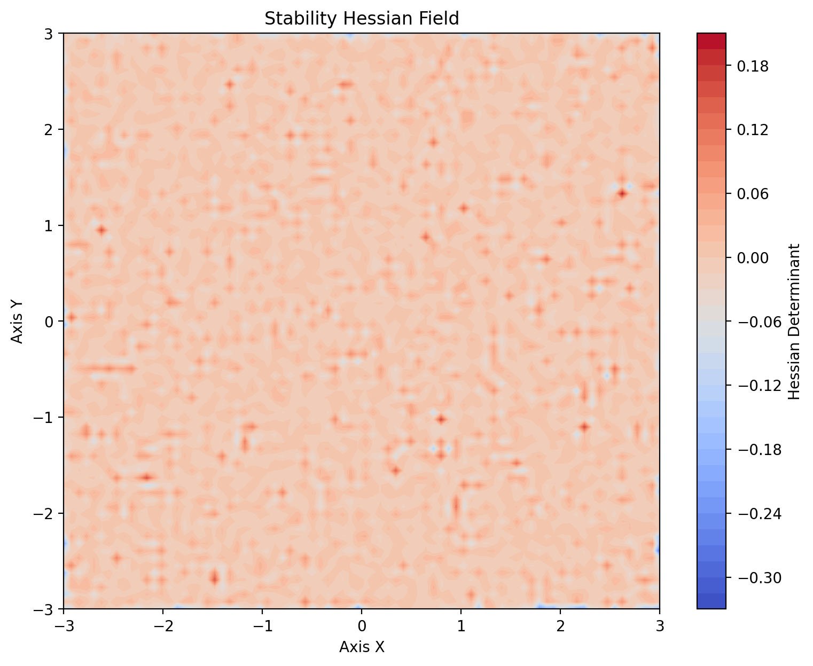
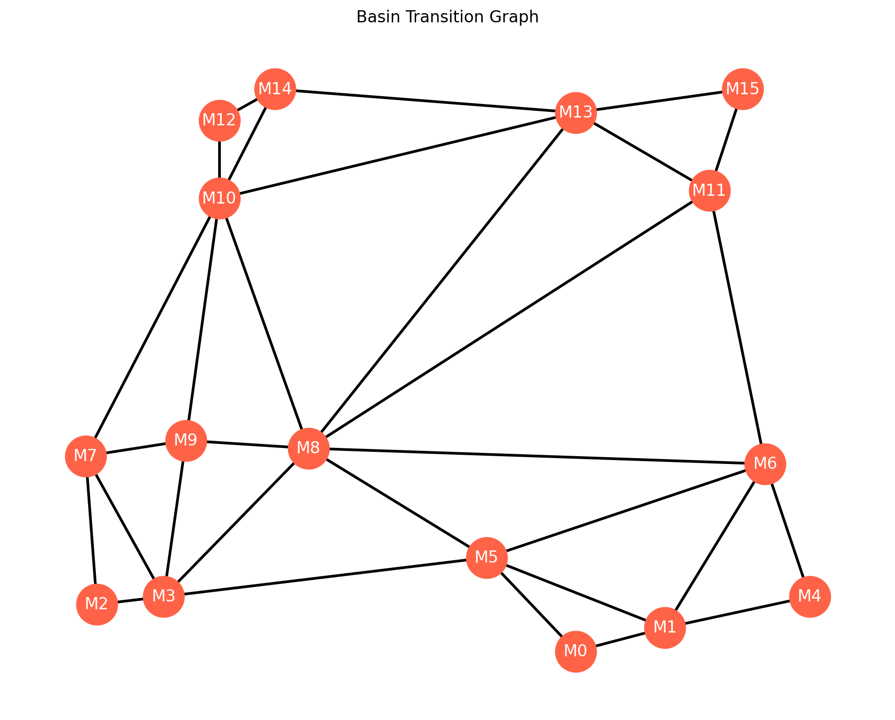
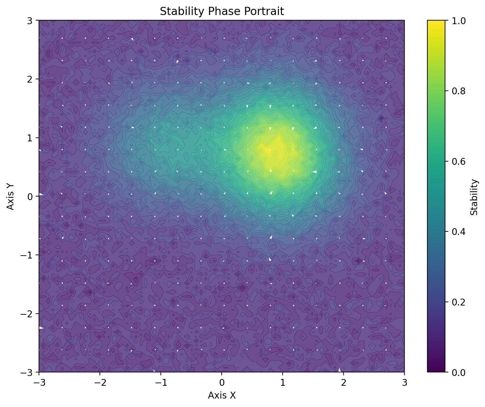
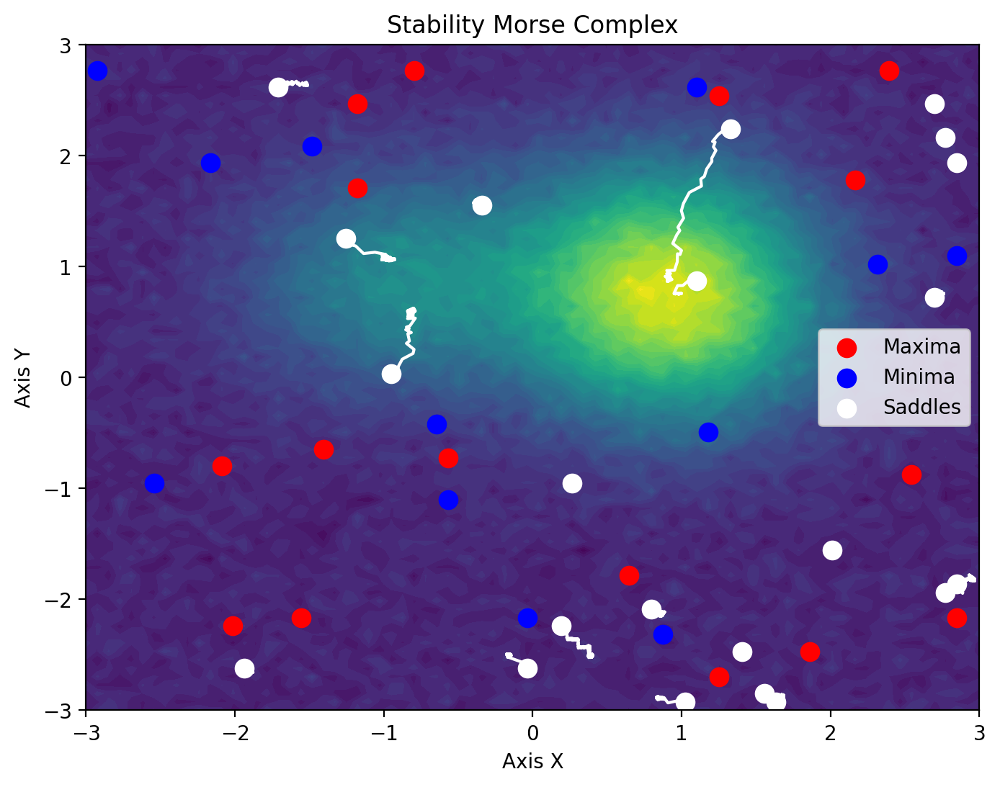
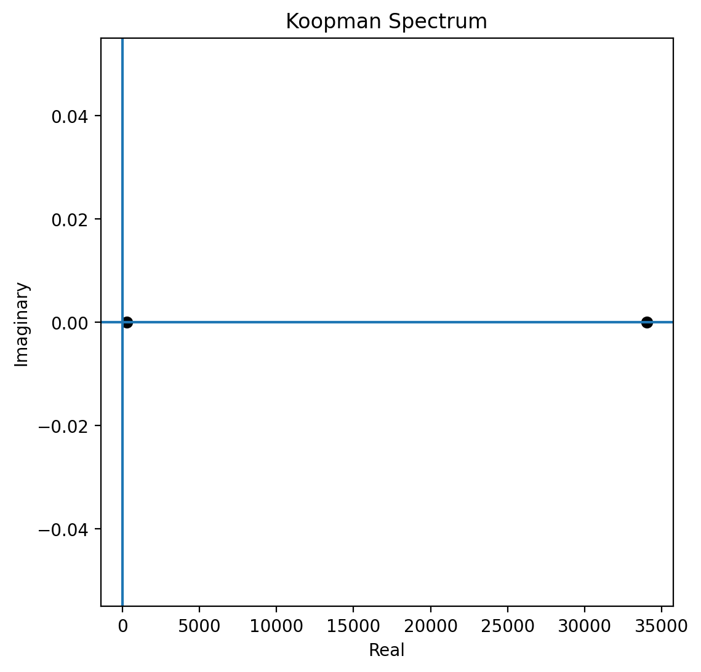
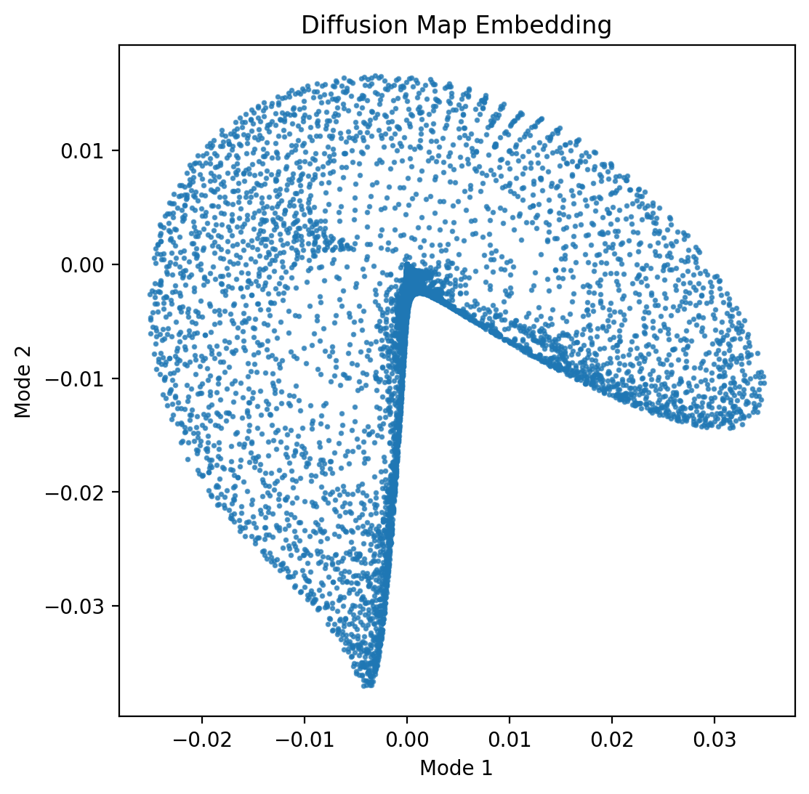
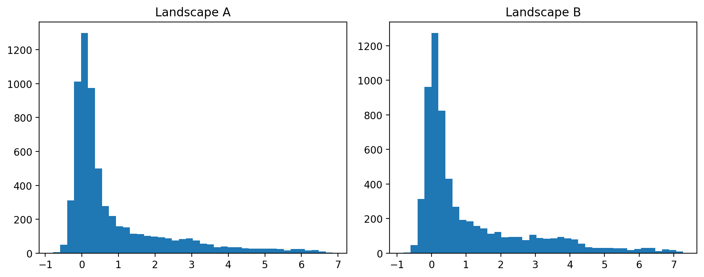

# NEXAH Stability Engine — Visual Gallery

This document presents the visual outputs produced by the **NEXAH Stability Engine**.

All figures are automatically generated by:

ENGINE/run_stability_engine.py

Generated images are stored in:

ENGINE/visuals/

The visualization pipeline reveals the geometric, dynamical, spectral, and topological structure of stability landscapes.

The full pipeline combines methods from:

- dynamical systems theory
- topology (Morse theory & persistent homology)
- spectral analysis
- optimal transport geometry
- information geometry

Together these tools extract the structural architecture of complex stability systems.

---

# Stability Landscape

The base stability landscape defined by:

Z = f(x, y)

This scalar field defines the global stability structure of the system.

All subsequent analyses operate on this landscape representation.

Module  
ENGINE/analysis/stability_landscape_generator.py

---

# Gradient Field

The gradient field ∇f(x, y) describes the direction of steepest ascent or descent.

It determines how trajectories evolve across the stability landscape and defines the local flow structure of the system.

Module  
ENGINE/analysis/stability_gradient_field.py

---

# Hessian Field

Second-order curvature information derived from the Hessian matrix:

H(f) = ∂²f / ∂xᵢ∂xⱼ

The Hessian reveals whether regions of the landscape are:

- locally convex
- locally concave
- saddle-like

This information determines the local stability type of critical points.

Module  
ENGINE/analysis/stability_hessian_field.py

---

# Critical Points

Points where the gradient vanishes:

∇f(x, y) = 0

Three classes appear:

Red — maxima  
Blue — minima  
White — saddle points

These points form the structural anchors of the stability landscape.

Module  
ENGINE/analysis/stability_critical_points.py

---

# Basin Segmentation

Partition of the landscape into attractor basins.

Every point inside a basin converges toward the same attractor under gradient flow dynamics.

This segmentation defines the global stability partition of the system.

Module  
ENGINE/analysis/stability_basin_segmentation.py

---

# Basin Transition Graph

Graph representation of attractor connectivity.

Nodes represent attractors.  
Edges represent potential transitions between basins.

This structure defines the transition network of the stability landscape.

Module  
ENGINE/analysis/basin_transition_graph.py

---

# Metastability Map

Regions where trajectories may temporarily reside before escaping to a stable attractor.

These regions correspond to metastable states and often indicate tipping points or transition zones.

Module  
ENGINE/analysis/metastability_map.py

---

# Global Stability Structure

Combined representation of:

- attraction basins
- critical points
- transition structure

This visualization summarizes the global topology of the stability system.

Module  
ENGINE/analysis/global_stability_structure.py

---

# Phase Portrait

Vector field representation of the dynamical flow.

This representation shows how trajectories evolve over time across the stability landscape.

Module  
ENGINE/analysis/stability_phase_portrait.py

---

# Information Geometry

A geometric representation derived from information-theoretic structure.

This view highlights regions of high structural complexity within the stability field.

Module  
ENGINE/analysis/stability_information_geometry.py

---

# Morse Complex

Topological decomposition based on Morse theory.

Critical points and gradient flows partition the landscape into Morse cells, revealing the structural skeleton of the system.

Module  
ENGINE/analysis/stability_morse_complex.py

---

# Persistence Diagram

Persistent homology diagram.

Each point represents a topological feature appearing and disappearing across filtration levels.

Persistent features represent stable topological structures in the landscape.

Module  
ENGINE/analysis/stability_persistence_homology.py

---

# Persistence Barcodes

Barcode representation of persistent homology.

Each bar corresponds to a topological feature persisting across multiple scales.

Module  
ENGINE/analysis/stability_persistence_homology.py

---

# Persistent Features

Visualization of the most stable topological structures detected in the landscape.

These represent the dominant geometric patterns in the system.

Module  
ENGINE/analysis/stability_persistence_homology.py

---

# Eigenmodes

Eigenmode decomposition of the stability operator.

This reveals dominant spatial patterns governing system dynamics.

Module  
ENGINE/analysis/stability_eigenmodes.py

---

# Koopman Spectrum

Approximation of the Koopman operator spectrum.

This provides a linear representation of nonlinear dynamical systems.

Module  
ENGINE/analysis/stability_koopman_operator.py

---

# Lyapunov Spectrum

Estimated Lyapunov exponents measuring trajectory divergence.

Positive values indicate chaotic behavior.  
Negative values indicate convergence toward attractors.

Module  
ENGINE/analysis/stability_lyapunov_spectrum.py

---

# Diffusion Map

Low-dimensional embedding derived from diffusion geometry.

This representation reveals the intrinsic manifold structure of the landscape.

Module  
ENGINE/analysis/stability_diffusion_map.py

---

# Wasserstein Geometry

Comparison between two landscapes using optimal transport distance.

The Wasserstein metric quantifies structural differences between stability fields.

Module  
ENGINE/analysis/stability_wasserstein_geometry.py

---

# Topological Skeleton

Graph connecting critical points via gradient flow trajectories.

This structure forms the global wiring diagram of the stability landscape.

Module  
ENGINE/analysis/stability_topological_skeleton.py

---

# Structural Summary

The NEXAH Stability Engine extracts multiple structural layers from a dynamical system:

• geometric landscape structure  
• gradient dynamics  
• basin topology  
• spectral decomposition  
• topological invariants  
• optimal transport geometry  

Together these analyses reveal the hidden architecture of complex stability landscapes.

---

# NEXAH Stability Engine

Structural computation for stability, dynamics, and complex systems.
