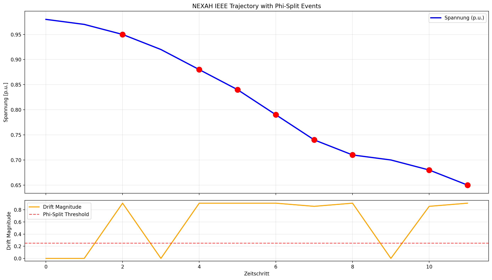

# NEXAH Hierarchical Grid – Results & Observations

**Stand: 15. April 2026**

## 1. Phi-Split Trajectory Analysis

**Beobachtungen:**
- Die Phi-Split-Events (rote Punkte) treten regelmäßig auf, sobald die Spannung unter ~0.92 fällt.
- Die Drift-Magnitude (untere Kurve) überschreitet die Schwelle 0.25 mehrmals – genau an den Stellen, wo die Spannung signifikant abfällt.
- Der Anfangszustand (t=0, Drift = 0) verhält sich wie ein stabiler Observer-Node (Q° / Axiom-0).
- Die Phi-Splits scheinen mit den Minima der Spannungskurve zu korrespondieren.

## 2. Resonanz-Paare & Prime Leap

Aus den feinen Zuständen:
- 7.83 + 8.17 = 16 (= 2⁴)
- 4.83 + 8.17 = 13 (6. Prime)
- 13 + 16 = **29** (nächster Prime)

Dies deutet auf eine rekursive Struktur hin, bei der Drift-Paare Prime-Zahlen erzeugen.

## 3. Phi-Split Mathematik

\[
\text{Drift-Magnitude} = \max\left( \left| \frac{\Delta r_7}{7} \right|, \left| \frac{\Delta r_{11}}{11} \right| \right)
\]

Phi-Split wird ausgelöst, wenn Drift-Magnitude > 0.25.

Dieser Mechanismus ermöglicht eine **geometrisch informierte** Navigation statt rein reaktiver Regelung.

## Nächste Schritte

- Automatische Speicherung von Plots in `results/plots/`
- Vergleich mit realen IEEE-Testfällen (IEEE9, IEEE118, IEEE300)
- Integration der Prime-Leap-Chain in die Visualisierung
- Erweiterung auf Root Shrinking und Meta-Layer

**Autor:** Thomas K. R. Hofmann
